> *作者：UNCHAINED*
> 
> *来源：<https://bitcoinmagazine.com/technical/how-did-satoshi-think-of-bitcoin>*

> *本文的核心观点是，比特币可以认为是 Dai 的 b-money 项目的一个修改版，消除了创建货币自由的版本。在本文初次出版的几周之后，人们发掘出新的中本聪邮件，在其中，中本聪自称并不了解 b-money 项目，但承认比特币是 “从完全相同的点” 开始的。有了这个新证据，我们更加坚信本文的核心观点；虽然它从历史事实上来说不是绝对精确，但依然是理解比特币起源的一个有意义、有好处的视角。*
>
> —— 二次出版卷首语

人们常常拿比特币与 1990 年代的互联网比较，但我认为，更合适的类比对象是 1840 年代的电报。<a href="#note1" id="jump-1">[1]</a>

电报是第一种能以接近光速的速度长距离传播经过编码的数据的技术。电报的发明标志着通信行业的诞生。互联网虽然在规模上比电报更大、在内容上更加丰富、可以做到多对多（而不是只能一对一），但从根本上来说，依然是一种通信技术。

电报和互联网都依赖于一种商业模式：公司投入资本来建设一个物理网络，然后向使用这个网络发送消息的用户收费。AT&T（通信公司） 的网络曾被用来传输电报、电话、TCP/IP 包、文字消息，以及最新的 TickTok 视频。

社会的电信化带来了极大的自由，但也产生了极大的中心化。互联网矿大了几百万内容创作者和小企业的触达范围，但也加强了一些公司、政府和其它占据优势地位的机构监控和操纵线上活动的权力。

但比特币不是任何社会变革的尽头 —— 它是一场变更的开始。就像电信，比特币会改变人类社会和每个人的日常生活。在今天，要预测这场变更的范围，无异于在电报时代想象互联网。

本文想做的是通过弄清过去来想象未来。最开始，我们会追踪比特币以前的电子货币的历史。只有理解这些项目失败的原因，我们才能理解让比特币成功的原因 —— 以及它如何给未来的去中心化系统开发确立了方法论。

## 中本聪如何推理比特币？

中本聪是天才，但比特币不是无源之水。

比特币融合了密码学、分布式系统、经济学和政治哲学领域已有的工作。“工作量证明（PoW）” 的概念早在用于电子货币之前就已经存在；先于中本聪的密码朋克，比如 Nick Szabo、Wei Dai 和 Hal Finney 都分别通过 bit gold、b-money 和 PROW 项目参与并影响了比特币的设计。想一想，在 2008 年中本聪写出比特币白皮书 <a href="#note2" id="jump-2">[2]</a> 的时候，许多对比特币重要的观念都已经被提出 以及/或者 实现了：

- 电子货币应该使用点对点网络
- 工作量证明是货币创造的基础
- 货币要通过拍卖来创造
- 公钥密码学可用来定义所有权以及钱币的转移
- 交易可以打包成区块
- 区块可通过工作量证明来前后链接
- 每一个参与者都保存所有区块

比特币利用了这些概念，而中本聪不是以上任何一个想法的原创作者。为了更好地理解中本聪的贡献，我们应该确定，比特币的哪些原理是不在上述列表中的。

一些明显的候选答案包括：比特币的有限供给量、中本聪共识，还有难度调整算法。但在一开始，到底是什么，引导中本聪走向了这些想法？

本文研究了电子货币的历史，并认为，中本聪对健全货币政策的关注，让比特币克服了先前的项目（比如 bit gold 和 b-money）铩羽而归的障碍。

## I. 去中心化的系统就是市场

比特币常常被说成是一个去中心化的系统，或者分布式的系统。但是，不论 “去中心化（decentralized）” 还是 “分布式（distributed）”，都常常让人感到困惑。在电子系统领域，这两个词说的都是将单体式应用程序拆解为通讯部件所组成的网络的办法。

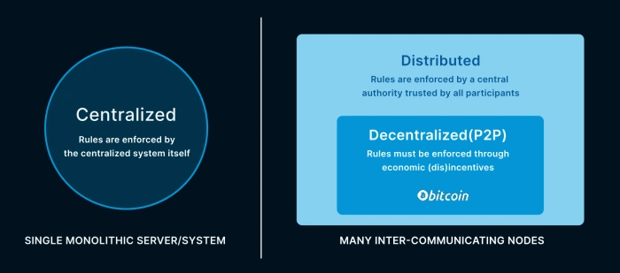

从我们的角度看，去中心化系统与分布式系统的主要区别并不在于[网络的拓扑](https://medium.com/@VitalikButerin/the-meaning-of-decentralization-a0c92b76a274)，而在于它们强制执行规则的方式。在下文中，我们会花点时间来比较分布式系统和去中心化系统，然后引出 “健壮的去中心化系统就是市场” 的想法。

### 分布式系统依然依赖于中心权威

在本文中，我们的 “分布式” 可以指称任何已经被打散成许多部分（通常叫做 “节点”）的系统，这些部分必须相互通信（才能让整个系统正常执行功能），一般来说是通过一个网络来通信。

软件工程师在开发全球化的分布式系统上已经越来越熟练。互联网本身就由分布式系统组成，总共包含了数十亿个节点。我们每个人口袋里都有一个节点（译者注：智能手机），它本身既参与又依赖于这些分布式系统。

但几乎所有我们日常使用的分布式系统都受一些中心权威管控，包括系统管理员、公司和政府，它们是系统中所有节点都信任的。

中心权威保证所有节点都遵守规则，并且踢出、修复和惩罚不能遵守规则的节点。人们信任权威以获得协调服务、解决冲突、分配共享的资源。在时间的流逝中，中心权威会管理系统的变更，升级系统或添加特性，并保证所有参与者都遵从这些变更。

分布式系统从依赖中心权威中获得了好处，但也不是没有付出代价。虽然整个系统可以应对一些节点的故障，但中心权威的故障就有可能导致整体系统停止工作。中心权威单方决策的能力也意味着只需颠覆或消灭这个中心权威就足以控制或摧毁整个系统。

尽管有这种取舍，但如果某一个参与者或者某一个联盟必须保持中心权威地位，或者如果一个系统内的参与者就是要依赖于一个中心权威，那么传统的分布式系统就是最佳的解决方案。不需要[区块链](https://bitcoinmagazine.com/guides/what-is-blockchain)、token  和去中心化的包装。

尤其是在风险资本（VC）主导开发或由政府背书的密码货币中，由于需要一方可以监控和限制支付、冻结账户，是传统去中心化系统的完美应用场景。

### 去中心化系统没有中心权威

而 “去中心化”，在我们看来，其范围比 “分布式” 更狭窄：去中心化系统是分布式系统的子集，是没有任何中心权威的分布式系统。“去中心化” 的意思更接近的同义词是 “点对点”。

取消中心权威会带来几个好处。去中心化系统：

- 生长迅速，因为没有准入门槛 —— 任何人都可以运行一个新的节点，这就壮大了系统；不需要注册，也不需要来自中心权威的许可。
- 稳固，因为不存在一出故障就可以瘫痪整个系统的中心权威。所有的节点都是一样的，所以故障都是局部的，网络会绕过遭到损坏的区域。
- 难以抓捕、规制、征税和监视，因为没有可供颠覆的中心控制点。

这些优点，正是中本聪为比特币选择去中心化、点对点设计的原因：

> *“政府很擅长砍掉 …… 有控制中心的网络的头，比如 Napster；但纯粹的 P2P 网络，不如 Gnutella 和 Tor，似乎可以维持。”* 
>
> —— 中本聪，2008

但这些强项也伴随着相应的弱点。去中心化系统可能会更加低效，因为每一个节点，都必须额外承担原本假设要由中心权威来承担的协调责任。

去中心化系统也更容易受到来自欺诈和敌意行为的困扰。虽然中本聪肯定了 Gnutella，但任何使用点对点文件分享程序来下载文件，结果下载到粗俗内容、恶意程序的人，都知道为什么点对点文件分享从来无法成为线上数据传输的主流模式。

中本聪没有点名，但电子邮件是另一个逃脱了政府控制的去中心化系统。而电子邮件也类似，是垃圾信息轰炸的重灾区。

## 去中心化的系统要通过经济激励来管理

在所有这些案例中，最根本的问题都在于，敌意行为（提供错误的文件、发送垃圾电邮）不会受到惩罚，而合作行为（发送对的文件、仅发送有用的邮件）也不会得到奖励。如果去中心化的系统依赖与其成员都是好人，那就无法扩大规模，因为没有办法阻止坏人参与进来。

在没有中央权威的情况下，解决这个问题的唯一办法就是使用经济激励。从字面上来说，好人，是出于内在的道德感而遵守规则的人。而从字面上来说，坏人，是指自私而且有敌意的人，但合理的经济激励可以让他们转变行为，为公共福祉贡献力量。去中心化的系统，要保证合作行为能够获得好处、敌意行为则代价高昂，才能扩大规模。

实现可靠去中心化服务的最佳方法就是创建一个市场，让所有参与者，无论好坏，都能在提供服务后获得好处。在去中心化的市场中，不为买方和卖方设置门槛，带来的是规模的扩大和效率的提升。只要市场的协议能保护参与者免受欺诈、盗窃和虐待，坏人也会发现，能够给自己带来最大好处的事情要么是遵守规则，要么是离开这个地方、去攻击另一个系统。

## II. 去中心化的市场需要去中心化的商品

但市场也是复杂的。市场必须给卖家和买家提供标价和讨价的能力，还有发现、匹配和结算订单的能力。市场必须公平，提供强大的一致性，在波动的周期中保持可用。

今天全球市场是非常大也非常复杂的，但在一个去中心化系统中，使用传统的商品和支付网络来实现经济激励，是行不通的。去中心化系统跟法币、传统资产、实物商品的任何关联，都会走回去、依赖控制支付处理商、银行、交易所的中心权威。

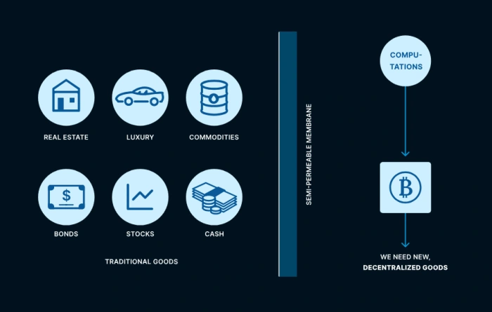

- 去中心化系统没法交付现金、检查经纪账户的余额以及确定不动产的所有权。传统的商品在一个去中心化系统中是完全无法辨认的。但反之不成立 —— 传统的系统可以跟比特币互动，就跟新的去中心化系统一样（只要他们真的想要）。传统系统与去中心化系统之间的障碍不是密不透风的高墙，而是半透膜。 -

这意味着，去中心化系统没法执行以任何传统商品标价的支付。它甚至没法确定一个法币账户的余额和房地产的所有权。整个传统经济，在去中心化系统中是完全模糊的。

创建去中心化的市场要求交易新型的去中心化商品，这样的商品在去中心化系统中必须是可以辨认、可以转移的。

### 计算是第一种去中心化商品

“去中心化商品”的第一个案例是一种特殊类型的计算，最早由 Cynthia Dwork 和 Moni Naor 在 1993 年提出 <a href="#note3" id="jump-3">[3]</a> 。

因为数学、物理学和计算机科学之间的深刻关联，这种计算必须消耗真实世界的能量以及已经资源 —— 也即不能造假。因为真实世界的资源是稀缺的，这种计算自然也是稀缺的。

这种计算的输入可以是任何数据。而最终的输出是一个电子化的 “证据”，证明在给定的输入数据上运行了这种计算。证据都包含一个特定的 “难度”，是发生了的计算工作的数量的（统计学）证据。最重要的是，输入数据、证据、最初花费的计算量，三者之间的关系，可以独立地验证，无需依附任何中心权威。

这种想法（将一些输入数据与其电子证据一起传递，作为在这个输入上执行了真实计算工作的证据）现在被称为 “工作量证明”<a href="#note4" id="jump-4">[4]</a> 。用 Nick Szabo 的话来说，工作量证明是 “不可伪造的奢侈浪费”。因为工作量证明是任何人都可以验证的，它变成了去中心化系统种所有人都可以辨识的经济资源。工作量证明将对数据的计算成为去中心化的商品。Dwrok 和 Naor 提议强迫参与者获取资源之前提供特定难度的工作量证明，以利用这种计算来限制对资源的滥用：

> *“在这篇论文中，我们提出了一种基于计算的、对抗电子邮件轰炸的方法。更广义地说，我们设计除了一种访问控制机制，可以用在任何需要限制但不需要禁止访问资源的地方。”*
>
> —— Dwoak & Naor，1993

在 Dwoak 和 Naor 的提议种，一个电子邮件的系统管理员会为邮件的发送设定一个工作量证明的难度门槛。想要发送电子邮件的用户需要将电子邮件作为输入数据，执行相应次数的计算。算出的工作量证明将会跟电子邮件请求一起提交给电子邮件服务器。

Dwork 和 Naor 将难度称为工作量证明的 “定价函数”，因为，只需调整难度，“定价权威” 就可以确保共享的资源对诚实的普通用户来说依然便宜，但对尝试滥用它的用户来说变得很贵。在电邮交付市场上，服务器管理员就是这样的定价权威；他们必须为邮件的交付决定一个 “价格”，使得发送电子邮件对在常规用途中足够便宜，但对邮件轰炸来说所费不菲。

虽然 Daork 和 Naor 将工作量证明作为一种打击资源滥用的反激励措施，“定价函数” 和 “定价权威” 这样的术语暗示着另一种基于市场的解读：用户可以付出由资源控制者设好价格的计算，来购买资源。

在这种视角下，电子邮件的交付网络真正成为了一种去中心化的市场，用计算来购买电子邮件的交付。而工作量证明的难度门槛就是电子邮件服务器标出的价格，以计算这种货币作为单位。

### 货币是第二种去中心化商品

但计算本身并不是一种很好的货币。

一个证据仅对一个输入有效。这种不可打破的关联意味着一个输入的工作量证明不能复用在另一个输入中。

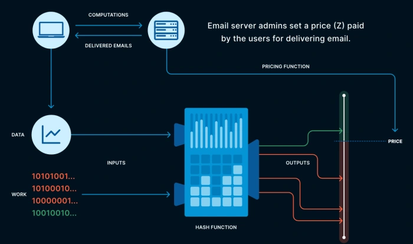

- 工作量证明最初是作为一种限制邮件轰炸的访问控制机制而提出的。用户需要为发出的电子邮件提供附带的工作量证明。这种机制也可以认为是一种市场，用户使用计算来购买邮件的交付服务，而价格由电子邮件服务商决定。 -

这种现实是有用的 —— 可以用来防止一个买家付出的工作量被另一个买家重复花费。举个例子，电子邮件交付市场的第一个真正的实现 HashCash，就在工作量证明计算的输入数据中包含了元数据，比如当前的时间戳和发送者的邮件地址。一个用户为一封电子邮件制作的证明，不能用来发送另一封电子邮件。

但这也意味着工作量证明的计算是定制化的商品。不是同质的，也不能再次花出去 <a href="#note5" id="jump-5">[5]</a> ，而且它自身也不解决 “双方需求巧合” 问题。它所缺失的这些货币特性，阻止了它成为一种货币。别看名字这么好，电子邮件服务商其实并没有累积 HashCash 的意愿，但他们肯定愿意储蓄现金。

HashCash 的发明者 Adam Back 完全理解这些问题：

> *“hashcash 无法直接转移，因为，为了让 hashcash 变成分布式的，每一个服务供应商都只接受专门为之创建的 cash 支付。也许你可以建立一种 digicash 式的铸币厂（发行 David Chaum 式的 ecash），并让铸币厂仅在收到专门给他的 hashcash 时才铸造 ecash。不过，这又意味着，你要信任铸币厂不会超量铸造货币。”*
>
> —— Adam Back，1997

我们不希望为去中心化经济体中的每一个商品和服务交换定制化的计算。我们想要一种通用的电子货币，可以直接用来协调任何市场中的价值交换。

开发一种能用的电子货币，同时还能保持去中心化，是一个重大难题。货币需要可互换的价值单位，还要能够在用户之间直接转移。它需要设计货币发行的模式、用密码学定义的所有权和价值转移、交易的发现和结算机制，以及一个能够记录历史的账本。在仅仅把工作量证明理解成一种 “访问控制机制” 的时候，不需要上述任何一种基础设施。

而且，去中心化的系统是市场，因此，货币的所有基础功能，在由服务供应商提供的时候都必须在一定意义上得到支付 …… 以这样创建出来的货币标价！

就像编译第一个编译器、电网的黑启动乃至生命自身的烟花一样，电子货币的创建者们也面临一个冷启动问题：如何定义出支撑一种有用货币的经济激励，而无需用另一种已经存在的货币来给这些激励标识价格和支付（how to define the economic incentives that underlie a functioning currency without having a functioning currency in which to denominate or pay those incentives）。

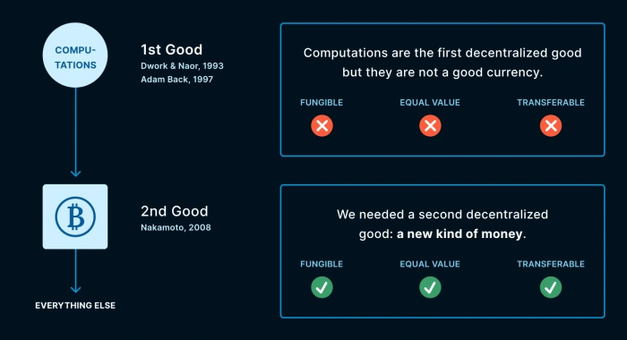

- 计算和货币是去中心化市场中的第一种和第二种商品。工作量证明自身允许用计算来交换，但可用的货币需要更多的基础设施。密码朋克社区花了 15 年才开发出这样的基础设施。 -

### 第一种去中心化市场必须用计算来交换货币

这个冷启动问题的进展来自于对问题边界的正确节点。

去中心化系统必须成为市场。市场由交换商品的买家和卖家组成。而在一种电子货币的去中心化市场中，能辨识出来的商品只有两种：

1. 具备工作量证明的计算
2. 这个去中心化系统要构建的货币的基本单位

因此，唯一可能的市场交易必然发生在两者之间。计算必须能够用货币单位来购买，或者说（完全等价的），货币单位必须能够用计算来购买。指出这一点是容易的 —— 难的地方在于构造出这样的市场，从而只需允许货币与计算相互交易，就能启动货币自身的所有功能！

整个电子货币的历史，以中本聪在 2008 年出版白皮书为顶点，就是一系列构造这样的的市场的越来越精巧的尝试。在下一章，我们会回顾一些项目，比如 Nick Szabo 的 big gold 和 Wei Dai 的 b-money。理解这些项目构造其市场的尝试，以及它们为何失败，可以帮助我们理解为什么中本聪和比特币取得了成功。

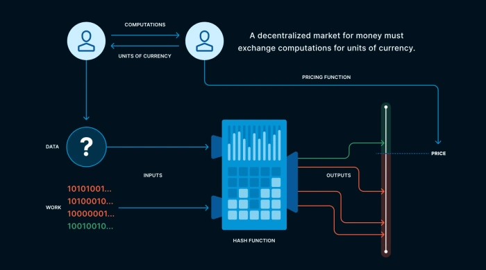

### III. 去中心化的系统如何给计算定价？

市场的主要功能之一是价格发现。因此，交易计算与货币的市场必须找出计算自身的价格，并以货币单位标示。

通常我们不会直接给计算赋予货币价值。我们一般只给执行计算的资本股估价，因为我们看重的是计算的结果，而不是计算本身。如果相同的输出可以更高效（使用更少的计算）地计算出来，通常这就叫做 “进步（progress）”。

工作量证明代表着一种特殊的计算，其唯一输出是一个证据，证明这些计算已经执行过。能够用更少的计算（和更少的能量）来产生相同的证据，就不能叫进步了 —— 应该叫 bug（缺陷）。因此与工作量证明相关计算是一种奇怪的商品，难以估价。

当工作量证明被理解成一种应对资源滥用的反激励措施时，准确且一致地评估它们的价值是不必要的。唯一重要的事情是电子邮件服务商要把难度设置得当，既低到不至于让普通用户察觉，又高到足以阻止滥发邮件的人。因此，可以接受的 “价格” 的范围很广，而且每一个参与者都可以成为自己的定价权威，应用一种局部的定价函数。

但货币单位就得是可以互换的，也就是每一单位都拥有相同的价值。而且，随着技术的进步，两个由相同工作量证明的难度 —— 由相应计算的数量度量 —— 创建的货币单位可能会由相差极大的生产成本 —— 以时间、能量 以及/或者 执行这些计算的资本量来度量。如果用计算来交换货币，而且底层的生产成本是可变的，市场如何保证一个一致的价格？

Nick Szabo 在提出 bit gold 的时候，清楚地定位了这个定价问题：

> *“主要问题……在于，工作量证明方案依赖于计算机架构，而不仅仅是一种基于抽象的 ‘计算循环’ 的抽象数学。…… 因此，可能会出现一个成本非常低的生产者（比其他人低几个数量级），然后让 bit gold 在市场中泛滥。”*
>
> —— Nick Szabo，2005

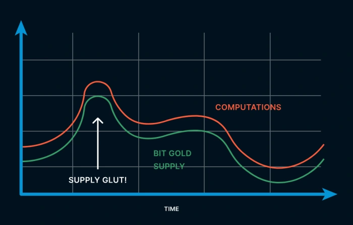

- 通过工作量证明创建的去中心化货币会在计算的供给量随时间增长的过程中出现过剩和崩溃。为了缓解这种波动，网络必须学会动态地给计算定价。 -

早期的电子货币尝试通过整体上度量 “计算的成本” 来给计算定价。举个例子，Wei Dai 就在 b-money 中提议了下面这种手动解决方案：

> *“创造出来的货币单位的数量等于计算的成本，以一篮子标准商品的价值来衡量。举个例子，如果一个问题在最经济的计算机商需要 100 个小时来求解，而在公开的市场上，需要 3 份标准商品组合来购买这台计算机上的 100 小时计算时间，那么，在这个问题的解决方案被广播之后，每个人都给这个广播者的账簿增加 3 个单位的货币”。*
>
> —— Wei Dai，1998

遗憾的是，Dai 并没有解释，在一个假设是去中心化的系统中，用户如何对 “标准商品篮子” 的定义达成一致意见、如何知晓哪一台计算机能 “最经济” 地解决一个给定问题、又如何知道 “公开市场” 商计算的成本。在所有用户之间，对一个会随时间变化的共享数据集达成共识，正是去中心化系统的本质问题！

公允地说，Wei Dai 自己也意识到了这一点：

> *“b-money 协议中最成问题的一部分就是货币的创造。协议要求所有【用户】确定特定计算的成本并达成一致。然而，因为计算技术会快速进步，而且这种进步并不总是公开的，相关的信息可能无法取得，或得到的信息是不准确的或过期的，所有这些情形都会在这套协议中造成严重的问题。”*
>
> —— Wei Dai，1998

Wei Dai 后来提出了一种更精巧的基于拍卖的定价机制，也被中本聪说是他的想法的起点。我们后面会回到这种拍卖方案，但现在，我们先转向 big gold，看看 Nick Szabo 在这个问题上的洞见。

### 使用外部市场

Szabo 认为，工作量证明应该 “安全地打上时间戳”：

> *“这种工作量证明被安全地打上了时间戳。这是可以用分布式方式做到的，有多家时间戳服务，因此不需要实质上依赖于任何一家。”*
>
> —— Nick Szabo，2005

Szabo 列出了一页关于安全时间戳协议的资源，但并没指定具体的一种算法。这里的用词 “安全地” 和 “分布式方式” 很强横，抛开了依赖于一个（或多个）“系统之外” 的时间戳服务的复杂性问题 <a href="#note6" id="jump-6">[6]</a> 。

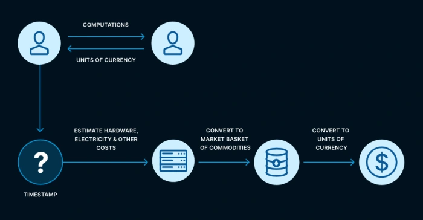

- 具体一单位的电子货币的创建时间是重要的，因为他关联着被执行的计算的真实世界成本。 -

撇开实现细节上的语焉不详，Szabo 是对的 —— 一个工作量证明被创造出来的时间点，是它的价格的重要因素，因为关联着其计算成本：

> *“……然而，因为 bit gold 带有时间戳，创建它的时间以及工作量的数学难度可以自动证明。使用这些因素，通常可以推断出在那段时间，其生产成本几何……”*
>
> —— Nick Szabo，2005

“推断” 生产成本很重要，因为 big gold 没有限制货币创造的机制。任何人都可以通过运行合适的计算来创造 bit gold。没有规制发行的能力， bit gold 就更像一种收藏品：

> *“……不像同质化的金原子，而像收藏家们喜欢的东西，一段时间内出现大量的供给会使这种东西的价值降低。从这个角度上来说，bit gold 更像收藏品，而不是黄金……”*
>
> —— Nick Szabo，2005

Bit gold 需要一个额外的、外部的程序来创建同质化的货币单位：

> *“……Bit gold 没办法依靠一种简单的函数（比如说）字符串的长度变得同质化。相反，为了创建同质化的单位，经销商需要将不同价值的几个 bit gold 打包在一起，才能形成一个更大的、几乎等价值的单元。这就像现在的经销商让商品市场得以成型一样。信任依然是分布式的，因为评估这些套装的价值可以由许多不同参与者以大部分甚至完全自动化的方式运行。”*
>
> —— Nick Szabo，2005

用 Szabo 的话来说，“为评估…… bit gold 的价值，经销商会检查和验证难度、输入和时间戳”。定义 “更大的几乎等价的单元” 的经销商，跟 Wei Dai 所谓的 “标准的一篮子商品” 提供的是相似的定价功能。在 bit gold 中，同质化的单元不是在工作量证明制作出来的时候诞生的，而是在稍后，这些证明被网络之外的市场经销商组合成一个更大的 “几乎等价值的单元” 的时候。

值得赞扬的是，Szabo 知道这个缺陷：

> *“……因为机器架构的隐蔽创新而出现一开始隐藏的供给过剩的可能性，是 bit gold 协议的一个潜在漏洞，至少是 bit gold 的初始拍卖和后续交易必须解决的一个不完美之处。”*
>
> —— Nick Szabo，2005

再说一次，虽然没有抵达（我们今天所知的）解决方案，Szabo 已经正确地指出：因为在时间的推移中计算的成本会改变，网络必须调整货币的价格，来应对计算供给量的变化。

### 使用内部市场

Szabo 意义上的经销商是一种外部市场，定义（一套）bit gold 的价格（在这些 bit gold 被创造出来之后）。有没有可能在系统内部（而不是在外部）实现出这样的市场？

让我们再次回到 Wei Dai 和 b-money。如前面提到的，Dai 提出另一种基于拍卖的 b-money 创造模式。中本聪对比特币的设计就是在此基础上改良的 <a href="#note7" id="jump-7">[7]</a> ：

> *“所以，我提议使用另一种货币创造子协议，由【用户】…… 来决定一段时间要创造多少 b-money 出来，而创造这些货币的代价则由拍卖派发现，每一个创造货币的周期都可以分成以下四个阶段：*
>
> *计划阶段。【用户们】计算并协商下一个周期的最优货币增量。无论【网络】是否能达成共识，每一个人都广播自己的货币创造额度，以及所有用于支持自己方案的宏观经济考量。*
>
> *投标阶段。任何想要创造 b-money 的人都广播一个投标价，形式是：自己想要创造 x 单位的 b-money，愿意解决一类预先定义的问题中的未解问题 y 。这类问题中的每一个问题都应有一个公开达成一致意见的名义成本（假设以 MIPS（每秒百万条指令）-年 为单位）。*
>
> *计算阶段。在看到投标之后，每个投标者都要解决自己标书中的问题，然后广播答案。货币就这样创造来。*
>
> *货币创造阶段。每个【用户】都接受（在所有真正广播出来的答案中）最高的标价，以名义成本除以创造出来的 b-money 数量来衡量，然后给投标者的账户增加相应的 b-money 数额。”*
>
> —— Wei Dai，1998

B-money 向电子货币的正确市场结构迈出了重大一步。它尝试消除 Szabo 的外部经销商，允许用户通过直接与其他人竞标参与到价格发现中来。

但要一五一十地实现 Dai 的提议，也不容易：

- 在 “计划阶段”，用户承担着协商 “下一个周期的最优货币增量” 的责任。怎么定义这个 “最优”呢？用户应该如何跟其他人协商？协商的结果应该如何分享？都没有明说。
- 无论计划是什么样的，“投标” 阶段允许任何人提交创造 b-money 的投标。这种投标既包含了要创建的 b-money 的数量，又包含了承诺要提供的工作量证明，所以每一份投标都是一个价格，是投标者为购买一定数量的 b-money 而愿意付出的计算数量。
- 投标提交之后，就进入 “计算”  阶段，投标者要运行工作量证明，然后广播答案。没有机制来匹配投标者和答案。更大的问题是，不清楚用户要怎么知道所有投标都已经提交了 —— 什么时候意味着 “投标” 阶段的结束和 “计算” 阶段的开始呢？
- 这问题在 “货币创造” 阶段又出现了。因为工作量证明的本性，用户可以验证自己收到的答案是真的。但用户怎么集体同意 “最高的标价”？如果不同的用户选择了不同的组合（不管是因为机器性能还是网络延迟），那会怎么样？

去中心化系统很难跟踪数据并作出一致的选择，而 b-money 正要求跟踪来自许多用户的投标，并对选择达成共识。这种复杂性甚至让 b-money 从未被实现过。

这种复杂性的根源在于 Wei Dai 对 “最优” 增长率的信念：b-money 的创造应该基于其用户的 “宏观经济考量” 而波动。跟 bit gold 一样，b-money 没有机制能够限制货币的创造。任何人都可以通过广播投标、运行相应的计算来创造 b-money。

## IV. 中本聪的货币政策目引出了比特币的设计

与他们相反的是，健全的货币政策，是中本聪在比特币中的首要目标之一。在最早的宣布比特币的邮件中，中本聪写道：

> *“传统货币的根本问题在于它需要信任才能工作。人们必须信任中央银行不会贬值货币，但法币的历史充斥着这种信任遭到背叛的事件。”*
>
> —— 中本聪，2009

然后，中本聪介绍了法币的其它问题，比如高风险的部分准备金银行系统、隐私缺位、猖獗的盗窃和诈骗，还有无法进行小额支付。但是中本聪是从中央银行贬值货币的问题开始的 —— 他关心的是货币政策。

中本聪希望比特币最终的流通供给量是有限的，不会随着时间推移而不断稀释。对中本聪来说，比特币的 “最优” 的货币增长率，最终应该是零。

这种货币政策目标，而不是中本聪表现出来的任何其它个人（或集体！）特质，才是中本聪 “发现” 比特币、区块链、中本聪共识，等等，的原因 —— 才是其他人没有发明比特币的原因。这就是本文标题中的问题的简短回答：中本聪能够推理出比特币，是因为他（们）专注于创造一种供给量有限的电子货币。

对比特币来说，有限的供给量不仅仅是一种货币政策，也不单纯是比特币人喜欢说的俏皮话。这是一种根本上的技术简化，让中本聪可以开发出一种能用的电子货币，而 Dai 的 b-money 只能停留在奇思妙想的阶段。

比特币是额外要求了一种预先定义的货币政策的 b-money。就像许多技术简化措施一样，受约束的货币政策通过缩减规模来推进。我们来看看，创造 b-money 的四个阶段是如何用这种约束来简化的。

### 2100 万 BTC 全部都已问世

在 b-money 中，每一个 “货币创造周期” 都包含一个 “计划” 阶段，在其中，用户需要分享自己的 “宏观经济考量”，为自己的货币创造提议辩护。中本聪的货币政策目标是实现有限供给量，零长尾增发，这就跟 b-money 为个人用户赋予的货币创造自由不兼容。因此，从 b-money 走向比特币的第一步就是取消这种自由。比特币用户无法创造比特币。只有比特币网络能创造比特币，而且只创造一次，就在 2009 年中本聪推出比特币项目的时候。

中本聪可以将 b-money 中反复出现的 “计划” 阶段替换成一套预先确定的日程表，让在 2009 年创造的 2100 万 BTC 在未来进入流通。用户自愿通过下载和运行硬编码了这种货币政策的比特币软件来表示对中本聪货币政策的同意。

这就改变了比特币计算市场的语义。支付给矿工的比特币并不是新发行的；只是从已有供给量中解锁进入流通的。

这种思维框架与 “比特币矿工创造比特币” 的天真说辞完全不同。比特币矿工没有创造比特币，只是买到了比特币。比特币有价值不是因为 “它是用能量制造的” —— 人们愿意用能量购买比特币只是体现了比特币有价值。

让我们重复一遍：比特币不是通过工作量证明创造出来的，是通过共识创造出来的。

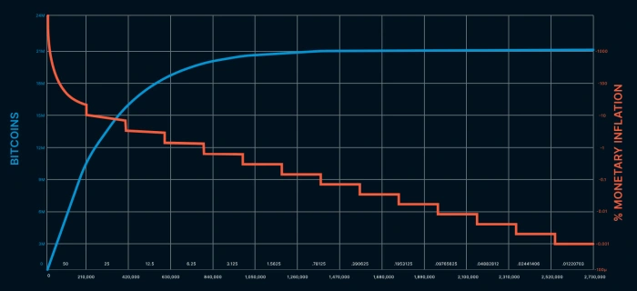

- 中本聪的设计取消了 b-money 对重复运行的 “计划” 阶段的需要，因为提前做好了所有的计划。这让中本聪可以硬编码一种健全的货币政策，同时简化比特币的实现。 -

### 比特币通过共识来定价

在 b-money 网络中，用户获得了创造货币的自由的同时，也要承担相应的负担。在 “投标” 阶段，b-money 网络必须收集和分享来自许多用户的货币创造 “标书”。

取消了创造货币的自由，也使比特币网络免于这种负担。因为所有的比特币（2100 万 BTC）都已经存在，网络也不需要收集来自用户的创造货币的标书，只需要卖出中本聪预先决定的日程表中的比特币。

因此，比特币网络为每个区块卖出的比特币提供了一个得到共识的要价。这个价格是每个节点使用区块链的副本独立计算出来的。只要节点能对同一条区块链达成共识（我们后面再说这一点），那他们就能在每个区块给出同样的要价 <a href="#note8" id="jump-8">[8]</a> 。

共识价格计算的前一半是决定要卖多少比特币。这是用中本聪的预先确定的解锁日程表固定的。比特币网络中的所有比特币节点都可以按区块号得出相同的数额：

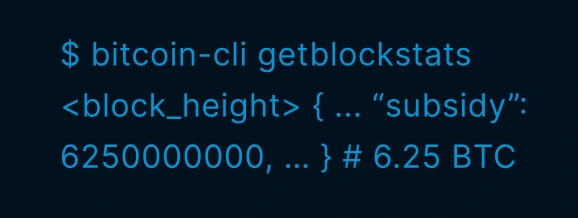

而共识价格计算的后一半是决定需要多少的计算量。再一次，网络中的所有节点都可以计算出相同的数值（我们回在下一章细说这种难度调整）：

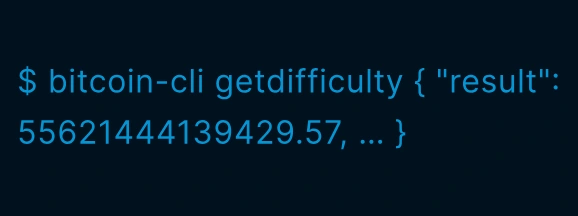

两者结合，区块补贴和难度就定义了比特币当前的要价，以计算量为标价单位。因为区块链得到了共识，所以这个价格是经过共识的价格。

b-money 也假定用户拥有一个经过共识的 “区块链”，包含了所有交易的历史。但 Wei Dai 从未得出这样简单的解决方案：完全根据区块链中的数据，为 b-money 的创造定出一个共识要价。

相反，Wei Dai 假设货币创造必须一直持续下去。因此，用户个人需要拥有影响货币政策的权力 —— 就像在法币中一样。这种感觉让 Wei Dai 设计了一种复杂到让 b-money 无法实现的投标系统。

而在中本聪这里，预先定义的货币政策消除了额外的复杂性。

### 时间消灭所有偏离（Time closes all spreads）

在 b-money 的 “计算” 阶段，用户执行自己在先前的标书中承诺的计算。在比特币中，整个网络作为卖方 —— 那么买方在哪？

在电邮交付市场上，买方是想发送电邮的用户。作为定价权威，邮件服务商会设定他们觉得对普通用户足够便宜但对诈骗犯足够贵的价格。但如果普通用户的数量增加，这个价格可以保持不变，因为普通用户的计算力可能没有变化。

而在 b-money 中，每个提出了货币创建标书的用户都被预期自行执行相应数量的计算。每个用户都根据对自己计算力的知识，担当自己的定价权威。

比特币网络为最新的区块补贴提供了一个以计算标记的要价。但没有哪一个找出区块的矿工需要执行这么多次数的计算 <a href="#note9" id="jump-9">[9]</a> 。胜出的区块表明的是所有矿工集体执行了所要求的计算次数。因此，区块补贴的买家是全球的比特币挖矿产业。

得出一个共识要价之后，比特币网络不会改变价格，直到更多区块被生产出来。这些区块必须包含当前要价所要求的工作量证明。因此，挖矿产业没有选择，只要他们想 “成交生意”，就必须付出这么多计算量。

挖矿产业唯一能控制的变量就是自己要多长时间才能生产出下一个区块。就像比特币网络可以给出一个要价，挖矿产业也能给出一个投标 —— 生产符合网络当前要价的下一个区块所需花费的时间。

> *“为了对冲不断增加的硬件速度和运行节点的兴趣变化，工作量证明的难度会用一个瞄准每小时出块数量的移动平均值来决定。如果产生区块的速度太快了，难度就提高。”*
>
> —— 中本聪，2009

中本聪只是平实地介绍了难度调整算法；但这个算法常常被认为是比特币实现中最具原创性的观念之一。确实如此，但与其关注这个解决方案的创新性，我们不如先看看为什么解决这个问题对中本聪来说如此重要。

Bit gold 和 b-money 这样的项目不需要限制货币增发率，因为它们没有固定的供给量或者说预先决定的货币政策。货币增发的周期变得更快或更慢可以通过其它手段来抵消，例如，外部经销商，将 bit gold 合并成更大的的套装（或拆分成更小的）；或者，b-money 的用户可以改变自己的标书。

但中本聪的货币政策目标要求比特币有一个预先定义的 “增发”（解锁新比特币进入流通）率。约束区块制造的（统计学）速度对比特币来说是自然而然的，因为区块生成的速度就是卖出比特币初始供应量的速度。用 140 年时间卖出 2100 万 BTC，跟 3 个月卖光，是完全不同的。

而且，比特币能真正实现这种约束，是因为区块链是 Nick Szabo 所说的 “安全时间戳协议”。中本聪说比特币是一种 “点对点基础上的分布式时间戳服务端”，而且早期的比特币源代码使用 “时间链（timechain）” 而非 “区块链（blockchain）” 来指称这种实现比特币 PoW 市场的共享数据结构 <a href="#note10" id="jump-10">[10]</a> 。

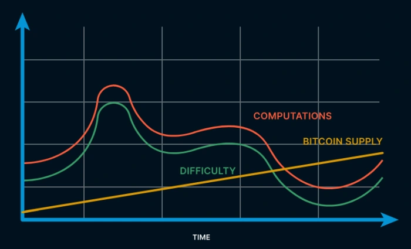

- 不像 bit gold 和 b-money，比特币中的钱币不会出现供给过剩。比特币网络使用难度调整算法来改变货币的价格，以应对计算的供给变化 -

比特币的难度调整算法利用了区块链的能力。经过共识的区块链被参与者用来枚举挖矿产业的历史投标以及重新调整难度，以趋向目标出块时间。

### 长期秩序创造共识

对健全货币政策的渴求所产生的简化链条延伸到 b-money 的 “货币创造” 阶段。

在 b-money 中，用户提交的投标会有 “无利害关系（nothing at stake）” 问题。没有机制能阻止用户提交用非常少的工作量竞标大量的 b-money。这需要网络跟踪已经完成的投标并只接受 “最高的投标……以名义成本除以创造出来的 b-money 数量来衡量”，以避免这样的骚扰式竞标。B-money 的每一个参与者都必须跟踪完整的投标订单簿，但标书与他们后续的计算关联起来，并仅仅以结算以最高价格完成的订单。

这个问题是一个更广义的问题 —— 去中心化系统中的共识问题 —— 的一个例子。去中心化系统中的共识问题也叫做 “拜占庭将军” 问题，有时候，在电子货币语境下也被称作 “重复花费” 问题。在所有参与者之间分发相同的有序数据，在一个敌对的、去中心化的网络中是困难的。当时对这个问题又一个解决方案，叫做 “拜占庭容错（BFT）共识算法”，需要在参与者之间有一些预先协调，而且大多数参与者（> 67%）不会采取恶意行动。

比特币并不需要管理投标的订单簿，因为为比特币网络给出了一个单一的要价。这意味着比特币节点可以接受自己看到的第一个（有效的）满足网络当前要价的区块 —— 骚扰性的投标可以直接忽略掉，而且制作这样的骚扰性投标也会浪费某个矿工的资源。

共识的计算价格让比特币中买卖订单的匹配可以优雅地完成：先到先得。这样优雅的订单匹配，也意味着比特币的市场不像 b-money 那样需要划分阶段 —— 它可以不间断地运行，每当一个订单得到匹配（找到一个新区块），就可以计算出一个新的共识价格。为了避免因网络延迟和敌意行为导致的网络分叉，节点也必须遵循 “最重链规则”。这种贪婪的订单结算规则保证了只有最高的标价可以被网络接受。

这种结合了优雅和贪婪的算法 —— 节点接受看到的第一个有效的区块，然后总是跟随最重的区块链 —— 是一种新的拜占庭容错算法，可以让对区块序列的共识迅速收敛。中本聪在白皮书中用了 25% 的篇幅来证明这个论点 <a href="#note11" id="jump-11">[11]</a> 。

我们在上一章确立的理解是，比特币的共识要价依赖于得到共识的区块链。但事实证明，存在一个单一的共识要价，是这个计算市场能够优雅地匹配订单的原因；而计算市场能够优雅地匹配订单，又是能够达成共识的原因！

而且，这种新的 “中本聪共识” 只需要 50% 的参与者不采取恶意行动，是对原有技术的重大提升。是中本聪这样的密码朋克作出了这个计算机科学理论的突破，而不是传统的学术研究者或产业研究者，因为中本聪仅仅专注于实现健全货币，而不是分布式计算的通用共识算法。

## IV. 结论

B-money 是开发电子货币的一个强大的框架，但并非完整的解决方案，因为它没有一种货币政策。用预先确定的解锁日程表约束货币发行，通过消除跟踪用户提交的货币创造标书并在其中选择的需要，减少了协议的范围并简化了实现。保护中本聪发行日程表的韵律引出了难度调整算法，并使中本聪共识成为可能；后者被广泛认为是比特币实现中最创新的一面。

比特币的完整设计比我们目前讨论的东西要多得多。我们这篇文章仅仅关注比特币中的 “首要” 市场，解锁比特币供给量进入流通的市场。

本系列的下一篇文章会探究比特币交易结算的市场，以及它跟分发比特币供给量的市场的关联。这种关联将为在比特币基础上建立去中心化服务的期货市场给出方法论。

## 致谢

多年来，我一直在谈论比特币和市场。我必须感谢许多人，他们倾听我的观点并帮助我理清思路。尤其是 [Ryan Gentry](https://twitter.com/RyanTheGentry)、[Will Cole](https://twitter.com/willcole) 和 [Stephen Hall](https://twitter.com/stephenjhall)，他们每周都与我见面，讨论这些想法。如果没有他们的帮助和支持，我没法跨越不计其数的错误起点。Ryan 也帮助我在我们的 [Bitcoin 2021 谈话](https://www.youtube.com/watch?v=qlV5_udJkC0)中公开讲述这些想法。[Afsheen Bigdeli](https://twitter.com/arbedout)、[Allen Farrington](https://twitter.com/allenf32)、[Joe Kelly](https://twitter.com/josephkelly)、[Gigi](https://twitter.com/dergigi)、[Tuur Demeester](https://twitter.com/TuurDemeester) 和 [Marty Bent](https://twitter.com/MartyBent)，都一直在鼓励我并给我有价值的反馈。我必须向 Allen 道歉，我是如此糟糕的一个合作者。最后，[Michael Goldstein](https://twitter.com/bitstein) 可能因写作和表情包而出名，但我想感谢他在 [Nakamoto Institute](https://nakamotoinstitute.org/) 的档案工作，让电子货币的历史得以保留。

## 脚注

1.本系列的标题取自历史上的第一条电报消息，由 Samuel Morse 在 1844 年发出：“上帝造了什么？” <a href="#jump-1">↩</a>

2.*Bitcoin: A Peer-to-Peer Electronic Cash System* ，可见：https://bitcoin.org/bitcoin.pdf <a href="#jump-2">↩</a>

3.*Pricing via Processing or Combatting Junk Mail*，来自 Dwork & Naor，可见：https://www.wisdom.weizmann.ac.il/~naor/PAPERS/pvp.pdf <a href="#jump-3">↩</a>

4.虽然发明了这种观念，但 Dwork 和 Naor 并没有发明 “工作量证明” 这个词 —— 这个绰号是 Markus Jakobsson 和 Ari Juels 在 1999 年提出的。 <a href="#jump-4">↩</a>

5.Hal Finney 的 RPOW 项目是一种创建可转移的工作量证明的尝试，但比特币并没有使用这个概念，因为比特币并不把计算当成货币。在下文讨论 bit gold 和 b-money 时，我们会看出，计算无法成为货币，因为不同时代的计算有不同的价值，但两个货币单位的价值必须是相等的。比特币不是计算，比特币是一种可以用计算买到的货币。 <a href="#jump-5">↩</a>

6.在这个当口，一些读者可能会认为我因为 Wei Dai 或 Nick Szabo 在一些问题上语焉不详或闭口不谈而轻视他们的贡献。我的感受正好相反：Wei Dai 和 Nick Szabo 在根本上都是对的，他们没有像中本聪日后做的那样勾勒所有细节，并不能抹杀他们的贡献。相反，这应该引起我们的敬佩，因为这表明了电子货币是多么困难的一件事，即使对这个领域最好的实践者来说也是如此。 <a href="#jump-6">↩</a>

7.Wei Dai 的 b-money 文章位列中本聪白皮书参考文献的第一位，可见：http://www.weidai.com/bmoney.txt <a href="#jump-7">↩</a>

8.这里作了两部分简化：（a）每个区块卖出的比特币的数量也受到交易费市场的影响，但这超出了本文的范围，留待我们后续的工作；（b）比特币所报告的难度并不确切等于预期计算的次数；你还必须乘以一个比例因子。 <a href="#jump-8">↩</a>

9.至少从中本聪是网络上唯一矿工的黑暗时代结束之后，就不再如此了。 <a href="#jump-9">↩</a>

10.Gigi 的经典作品 *比特币就是时钟* 是对比特币与时间的深刻关系的绝佳介绍，可见：https://dergigi.com/2021/01/14/bitcoin-is-time/ （[中文译本](https://dergigi.com/2021/01/14/bitcoin-is-time/)） <a href="#jump-10">↩</a>

11.中本聪在白皮书的分析和后续的比特币初步实现中都犯了错误，使用了 “最长链” 规则而不是 “最重链” 规则。 <a href="#jump-11">↩</a>