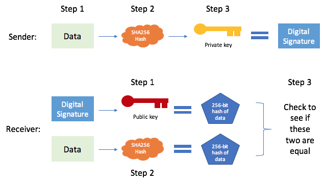
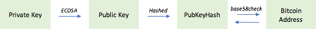
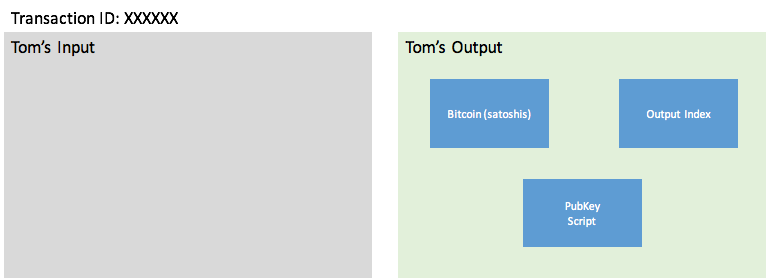
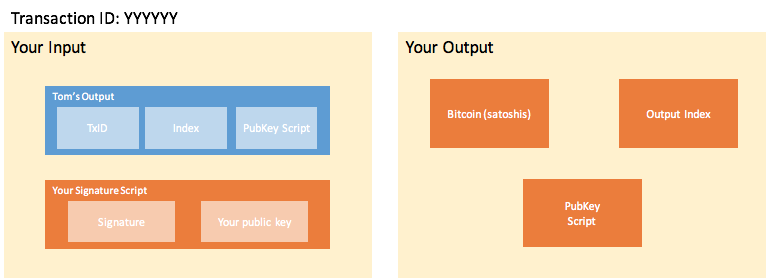
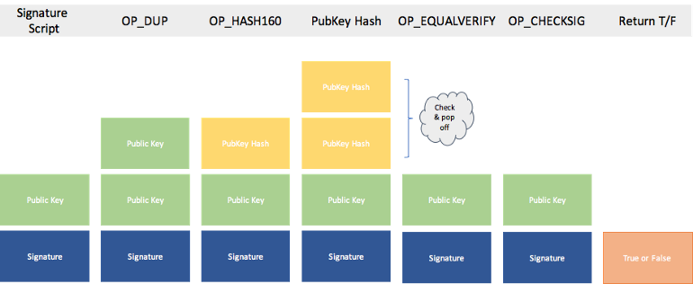

> *作者：Blair Marshall*
> 
> *来源：<https://medium.com/@blairlmarshall/how-does-a-bitcoin-transaction-actually-work-1c44818c3996>*


> 如果你不能用简洁的语言解释一个事物，就说明你并不理解它。
>
> —— 费曼

## 公钥/私钥 对

为了使用比特币网络，你先要生成一个 公钥/私钥 对。[任何 256 比特的数字都可以充当私钥](https://en.bitcoin.it/wiki/Private_key)，所以你可以自己想一个（译者注：非常不推荐），也可以下载一个可以生成随机私钥的软件，或者你可以买一个硬件钱包，比如 Trezor 或者 Ledger，它会基于一套种子词帮你生成私钥。一套种子词可以生成无限个私钥，但你只需要记得这个种子词，就可以找回这些私钥。

你的私钥使用 “[椭圆曲线数字签名算法](https://en.wikipedia.org/wiki/Elliptic_Curve_Digital_Signature_Algorithm)（ECDSA）” 来生成对应的公钥。这个算法会使用一种数学上的操作，将 256 比特的数字（你的私钥）转化成一个对应的数字，这个数字就叫公钥。有了私钥你就可以生成对应的公钥，但知道公钥并不能获知其背后的私钥。公私钥可以用于加密和解密。比如，你可以[使用某一把公钥加密一段数据，那么，只有这个公钥背后的私钥才能解密密文](https://en.wikipedia.org/wiki/RSA_(cryptosystem))、获得明文。

## 数字签名

比特币使用一类被称为 “数字签名” 的技术来校验一笔交易的发送者的身份。使用公私钥对一段数据生成数字签名，就可以证明这段被签名的数据没有被篡改过，而且确实是由某一个公钥背后的私钥的主人发送的。



步骤 1：发送者想给接收者发送一些数据。接收者希望保证自己收到的数据没有被篡改过，而且确实是由发送者发送的。

步骤 2：发送者收集要发送的数据。确定数据后，发送者对数据使用 SHA256 哈希函数，生成一个哈希值（译者注：哈希函数是一种单向的随机函数，可以把哈希值理解为数据的 “数字指纹”）。

步骤 3：发送者使用自己的私钥签名哈希值，得到一个数字签名。现在，发送者将原数据、数字签名、自己的公钥，都发给发送者（提醒一句，使用公钥是无法推导出其背后的私钥的，所以分享公钥没有什么关系）（译者注：但是私钥绝不能公开！）。

接收者必须按照下面的流程验证自己得到的数据没有被掉包，而且确实是由自己所知的某一把公钥背后的私钥的主人发送的。

步骤 1：接收者对收到的数据运行 SHA256 哈希函数，得到一个哈希值。

步骤 2：接收者拿步骤 1 所得的哈希值、收到的数字签名和公钥运行签名验证算法。如果结果为真，即说明所得到的数字签名是这个公钥的有效数字签名，即知道这条哈希值是由这个公钥背后的私钥签过名的，即知道原数据是由这个私钥的主人发送过来的。

（译者注：原文的作者看起来并不理解加解密算法与数字签名算法的区别，原文对验证过程的描述是错的，在此改为正确的步骤）。

## 比特币交易

现在，你已经创建好公私钥对了，已经准备好接收比特币了。你的好朋友 Tom 表示他愿意给你 10 BTC。为了收到资金，你需要创建一个地址，[你要对自己的公钥运行哈希函数，得到公钥的哈希值，然后转化成一个 base58check 格式](https://bitcoin.stackexchange.com/questions/1389/how-are-public-private-keys-in-an-address-created)；整个过程最终会产生以 “1” 或 “3” 开头的比特币地址。再次提醒，有了私钥就可以推导出公钥，有了公钥就可以推导出公钥哈希值，但反过来都是不行的。这就是一条单行道。不过，公钥哈希值和地址是可以相互转换的。（译者注：作者在这里介绍的是 P2PKH 地址）。



现在，你可以把地址给 Tom，然后等待接收 10 BTC。Tom 为了给你发送比特币，需要创建一笔交易，并将你的地址写到其中一个输出中。交易的输出有以下几个字段：**索引号**，帮助网络在这笔资金被花费时（例如：你要花费这 10 BTC 时）找出这笔交易；**价值**，以 “聪” 为单位的比特币数量，也即是被发送的数额；**锁定脚本（也叫公钥脚本）**。公钥脚本的作用就是把 Tom 发送给你的比特币锁在你给 Tom 提供的地址（公钥哈希值）上。现在，你就是唯一掌控着某一把私钥（希望如此！），因此唯一能够满足这个公钥脚本、解锁这个地址中的资金的人了！



当交易被验证、由矿工挖出后。你的钱包（软件）（记录着你的地址）会向你展示你拥有了 10 BTC。实际上，你的钱包（软件）只是在跟踪属于你的地址的输出（在公钥脚本中记录了你的公钥哈希值的输出）。这些输出被称为 “未花费的交易输出（UTXO）”，它们会一直静静地呆在那里，直到有人使用交易来提供解锁某个输出所需的数据，并将这个输出中的比特币转移到另一个地址（这会创建另一个 UTXO）。比特币网络实际上只是 UTXO 的一张网，所有的 UTXO 都等待着被解锁、然后发送到某个地方形成一个新的 UTXO。比特币不是一个基于账户的系统，意思是用户其实并没有像银行账户那样的东西，比特币也不是像账户余额那样的东西。实际上，用户只是持有可以解锁网络中的某一些 UTXO 的私钥。这也意味着你在花费一个 UTXO 时不能只花一部分，每次你创建一笔交易、花费某一个 UTXO 时，都是把其中的价值全部解锁、花出去。如果你不想把一个 UTXO 的所有价值都发送给某个人，你就必须在交易中包含一个输出（地址）来接收你想保留下来的比特币。你也可以使用相同的地址来接收剩余的比特币，[但这不是理想的做法](https://en.bitcoin.it/wiki/Address_reuse)。最好的做法是，你创建一个新的地址来接收剩余的比特币，以提高隐私性。

现在，你已经可以使用 Tom 所创建的、带有 10 BTC 的 UTXO 了，你的朋友 Sarah 也想加入比特币网络、使用比特币。为了发送你的 10 BTC，你也要创建一条新的交易，用一系列的输入和输出来表达你的意图。



### 交易的输入

首先，你使用 Tom 给你支付的交易的 ID 和输出的索引号，找出正确的 UTXO 以及对应的公钥脚本。必须满足公钥脚本所指定的条件，才能花费该 UTXO 中锁定的比特币。

然后，你创建一个 “签名脚本（signature script）”，也就是用来满足公钥脚本要求的数据。在我们这个案例中，签名脚本由一个数字签名和你的公钥组成；被签名的数据，对应的就是你为 Sarah 创建的交易整体。具体来说，交易整体包含前序交易（Tom 给你支付的交易）的 ID、被花费的输出的索引号、输出的公钥脚本、你为 Sarah 设置的新的公钥脚本，以及你发送给 Sarah 的数额（锁在这个新的公钥脚本中的数额），等等。所有这些数据使用 SHA256 哈希函数哈希两次。然后，你使用自己的私钥签名这个 256 比特的哈希值，得到的就是所需的签名。把签名和你的公钥组合起来，就是签名脚本。

（译者注：签名脚本中的公钥，正是所花费的 UTXO 的锁定脚本中的公钥哈希值所对应的公钥；而用于签名的私钥，也正是这个公钥背后的私钥。）

### 交易的输出

就像 Tom 交易的输出，你的交易的输出也带有下列信息：一个新的索引号，用于定位这笔交易；比特币的数量（以聪计量）；一个新的公钥脚本，使用 Sarah 提供给你的地址，因此会把这些比特币锁进 Sarah 的地址。现在，只有拥有这个地址背后的私钥的人（最好是 Sarah），才能花费这些比特币。

### 公钥脚本

创建好上述交易后，你需要把交易广播给比特币网络的矿工。矿工会取出你的签名脚本，并跟公钥脚本一起运行。如果运行的结果为真，那么你的交易就是有效的，可以被添加到区块中。

这个案例中的脚本（签名脚本 + 公钥脚本）长这样：

```bash
<Sig> <PubKey> OP_DUP OP_HASH160 <PubkeyHash> OP_EQUALVERIFY OP_CHECKSIG
```

比特币的 Script 是一种基于堆栈的编程语言。它处理的流程如下图所示：



步骤 1：向堆栈推入签名脚本。首先是签名，然后是你的公钥。

步骤 2：执行公钥脚本的 OP_DUP 操作码，复制栈顶的元素。在我们这里就是复制公钥。

步骤 3：执行  OP_HASH160 操作码，对栈顶的元素执行哈希计算，在这里就是哈希复制出来的公钥。现在，我们已经有签名、公钥和公钥哈希值了。

步骤 4：将公钥哈希值推入栈中（也就是你交给 Tom，被 Tom 放在第一笔交易中的公钥哈希值）。

步骤 5：执行 OP_EQUALVERIFY，检查栈顶的两个元素是否相等。在这里，就是你交给 Tom 的公钥哈希值，和你在签名脚本中提供的公钥的哈希值。这两个元素应该相等，如果不相等，交易就会失败；如果相等，则这两个元素会被弹出堆栈，最终只剩下公钥 + 签名。

步骤 6：就像在上文的 “数字签名” 一节讲的，OP_CHECKSIG 会使用公钥来校验签名。如果校验不通过，则交易会失败。如果通过，则公钥和签名都会被弹出，堆栈中只剩下 “True（真）”。

如果运行通过，说明这是一笔有效的交易，矿工可以把它添加到区块中，等待整个网络的公认了。

### 参考文献

1. [Bitcoin.org — Transactions](https://bitcoin.org/en/developer-guide#transactions)
2. [Bitcoin Wiki](https://en.bitcoin.it/wiki/Main_Page)
3. [Videos from Matt Thomas](https://www.youtube.com/channel/UCbXiy1W_1HSMawmBDfo_TOA/featured)