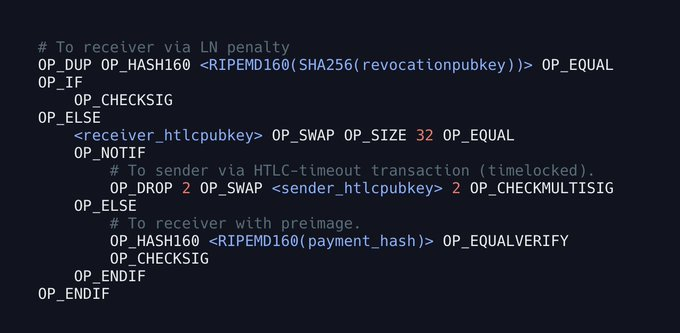
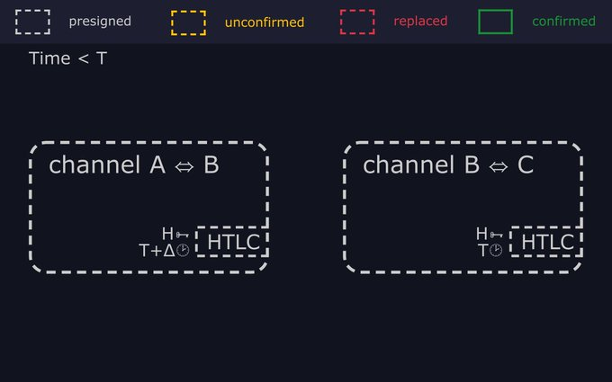
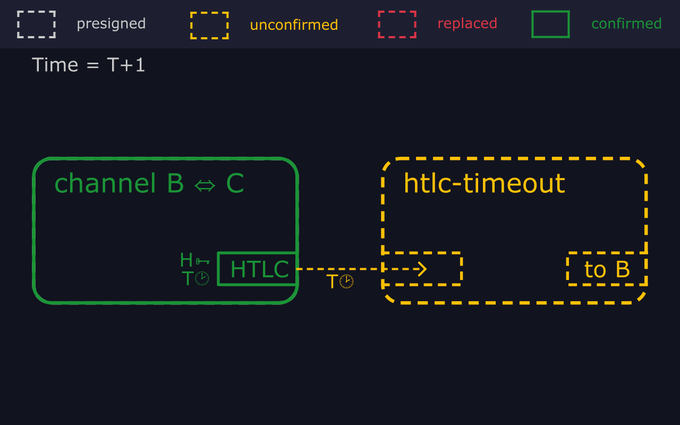
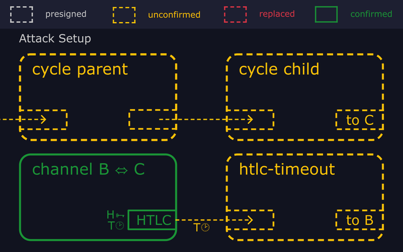
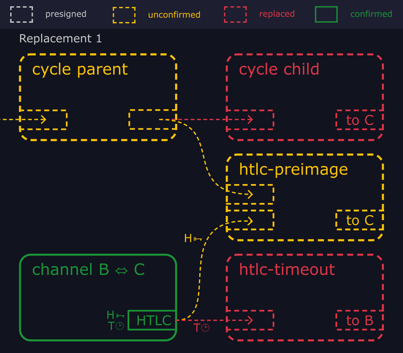
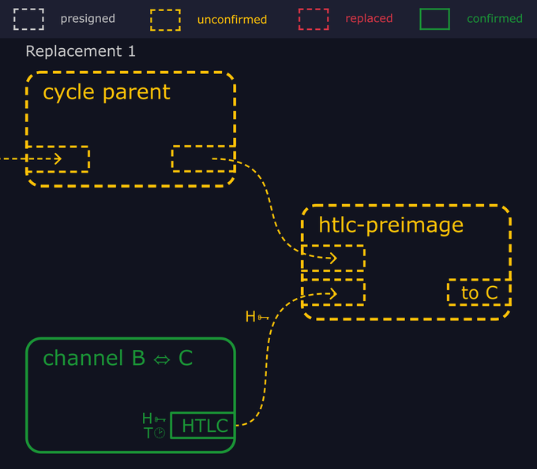
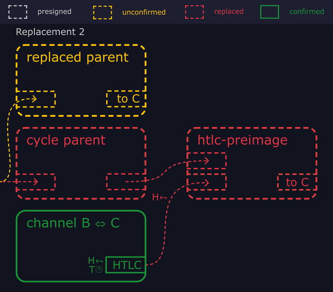
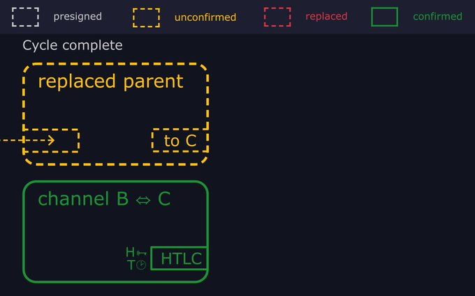

> *作者：mononaut*
> 
> *来源：<https://twitter.com/mononautical/status/1715736832950825224>*

针对闪电通道的替代交易循环攻击（replacement cycling attack）是怎么一回事？

关于这种最近在邮件组中公开的漏洞，人们有很多讨论，但内部的机制却有点难以理解。

我尝试用图片来解释一下。

- - -

设想 Bob 正在路由一笔闪电支付，为 Alice 将支付转发给 Carol。

当这笔支付还在运行中（尚未完成的时候），它是靠 Bob 跟自己的两个对等节点的通道承诺交易中的 HTLC（哈希时间锁合约）输出来保护的。

一个 HTLC 就是一个由发送者提供给接收者的有条件支付。

接收者可以通过揭晓一个哈希值 H 的原像而立即花费它，也可以在一段时间后由发送者收回。

你可以看看这个真实的 HTLC 花费：[mempool.space](https://mempool.space/tx/4ec0f703e08e2babfbff9da597c6f3710332f29a4bc7175d0e89e8f681f4634a) 。（下图为闪电通道中的 HTLC 的脚本。）

通过在每一跳中使用相同的哈希锁，支付可以原子化地转发。

Carol 没法不揭晓原像就获得 Bob 提供的 HTLC 中的资金；而一旦她揭晓原像，Bob 就可以用这个原像来取出来自 Alice 的 HTLC 中的资金。（对 Bob 来说，交给 Carol 的 HTLC 是 “出站 HTLC”；而 Alice 给他的是 “入站 HTLC”。）

至少在理论上是如此。

为了保证 Bob 有时间对一些意外的事情作出相应，出站 HTLC 中的时间锁会先过期，在区块高度 T 的时候。而入站 HTLC 中的时间锁会在（T + Δ）区块高度过期，然后 Alice 才能回收自己的资金。

好了，接下来要进入攻击场景了：

记住，Bob 在两个通道中分别有一个待结算的 HTLC：一个出站 HTLC 是交给 Carol 的，过期时间是区块高度 T（过了这个时间才能收回资金）；而一个入站 HTLC 来自 Alice，超时时间是 T + Δ。

在区块高度 T 的时候，Carol 仍旧不揭开原像，所以 Bob 不得不将承诺交易提交到链上，并发送超时赎回交易来取出 HTLC 中的资金。

他广播了承诺交易来关闭跟 Carol 的通道；一旦这笔交易得到确认，他就发送一笔 “HTLC 超时” 交易，花费这个 HTLC、将资金转移到自己能够控制的地方。

Bob 不知道的是，Alice 和 Carol 是串谋的，她们想要欺诈 Bob。

他们提前准备了一个由两笔交易组成的交易链条，是低手续费的，而且显然跟闪电通道无关，我们管这两笔交易分别叫 “cycle parent” 和 “cycle child”。

然后，当攻击者观察到 Bob 发出的 HTLC 超时交易（交易会在网络中广播）时，他们就广播一笔 “HTLC 原像” 交易，花费 Bob-Carol 的 HTLC 的同时也花费一个来自 cycle parent 的输出。

因为这笔 HTLC 原像交易提供了更高的手续费率，所以，cycle child 交易和 HTLC timeout 两笔交易（花费了跟 HTLC 原像交易相同的输入）都会被替换掉（从节点的交易池中踢出）。

如果 Bob 可以看到这一切，那么他就可以从 HTLC 原像交易中抽取出原像，并立即使用这个原像以获得入站 HTLC 中的资金。

所以，攻击者又广播一笔新的交易，来替代 cycle parent 交易。

因为 HTLC 原像交易依赖于 cycle parent 的一个输出，所以 HTLC 原像交易也从交易池中驱逐出去了。

在一次攻击结束的时候，来自 Bob-Carol 通道的 HTLC 保持了没有被花费的样子，而且交易池中不会留下 HTLC 超时交易和 HTLC 原像交易存在过的踪迹。

攻击者可以重复这种把戏，从而在每一次 Bob 重新广播自己的 HTLC 超时交易时驱逐掉它。

只要他们能够在 Δ 区块内阻止 HTLC 超时交易被挖出，Alice 就可以关闭 Alice-Bob 通道并发起相应的 HTLC 超时交易。当 Alice 成功取出入站 HTLC 中的资金，Carol 又可以用原像取出出站 HTLC 中的资金，Bob 就损失了这次转发支付的全部金额。

- - -

这种攻击并不容易。下列因素都要齐备：

- 跟受害者打开两条通道
- 运用这两条通道来路由一次支付
- 成功用替代交易循环阻止受害者的 HTLC 超时交易被挖出，长达 Δ 区块
- 不让受害者发现 HTLC 原像交易

但它也是很难彻底根除的。

提高时间锁的差值（Δ），或者更激进低广播 HTLC 超时交易，都会让攻击难度加大并且变得更加昂贵，但依然不是完全没有可能的。

Bob 可以主动监控自己本地的交易池，从而在 HTLC 原像交易被替代掉之前发现它。

但一个聪明的攻击者可以选择性地广播替代交易，从而只让矿工收到它们（而 Bob 无法收到它们）。

也许 Bob 可以通过雇佣连接到网络其它部分的瞭望塔来检查替代攻击循环，并给他转发所有相关的原像。

正确的修复可能需要更为根本的变更。

我们可以重新设计 HTLC 协议，以阻止为 HTLC 原像交易添加额外的输入（从而让它们不可以被替代）。

又或者，改变转发策略，广播被替代掉的交易（从而原像总是能传播给 Bob）。

又或者，让矿工保存一个最近被替换的（但可能会重新进入交易池的）交易的缓存，这样 Bob 就不需要重新广播自己的 HTLC 超时交易了。这可以内置在 Bitcoin Core，或者作为一种额外的服务。

或者，动用软分叉，引入一个新的操作码，跟 check-locktime-verify（CSV，绝对时间锁操作码）做相反的事情，从而让 HTLC 原像分支在时间锁过期后失效。

（完）