> *作者：Greg Walker*
> 
> *来源：<https://learnmeabitcoin.com/>*

比特币是一个**创始于 2009 年的电子支付系统**。使用它，你可以跟任何人互相支付，而且不需要任何权威机构给你们登记账户，也不需要权威机构来处理你们的支付。

创造它的初衷是解决现代金融体系种的问题：少数几个大银行控制着账户登记和支付处理。这种模式 *将货币的控制集权化*，并强迫用户信任银行来安排自己的生活。

> 我们必须信任银行会好好保管我们的钱并协助转账，但事实是他们只好了一部分准备金就大肆房贷、掀起信贷泡沫。
>
> —— [中本聪](https://satoshi.nakamotoinstitute.org/posts/p2pfoundation/1/)

这种滥用信任的行径及其引发的 2007 年的金融危机，刺激了比特币的开发：它准备做一个 *没有* 控制中心的支付系统。使用化名 “中本聪（Satoshi Nakamoto）” 的人匿名设计了比特币，[并在 2009 年 1 月首次发布](https://www.metzdowd.com/pipermail/cryptography/2009-January/014994.html)。

下文就是对比特币运行过程的简要讲解。

## 到底什么是比特币？

比特币只是一种**电脑软件**。你可以自己下载和运行。

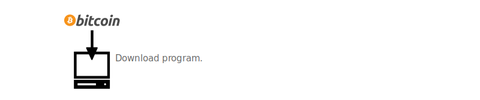

- 愣着干啥，<a href="https://bitcoin.org/en/download">下载试试</a> -

你在电脑上运行这种程序的时候，它会连接其它同样运行这种程序的电脑（每台电脑都这样做就会形成一个网络），然后它们会给你 *分享文件*。这个文件就叫 “[区块链](https://learnmeabitcoin.com/technical/blockchain)”，基本上就是一个很大的清单，记录着[*比特币交易*](https://learnmeabitcoin.com/technical/transaction-data)。

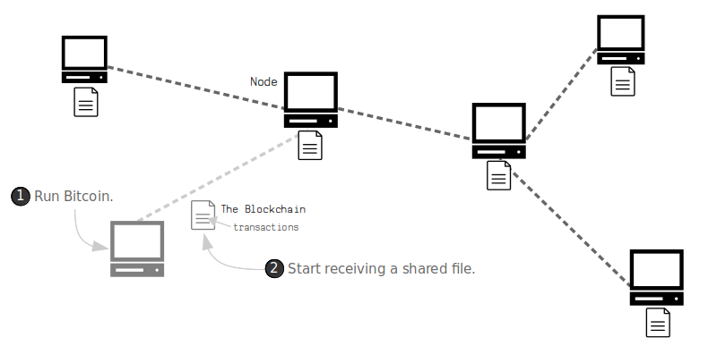

- 1）运行比特币；2）开始接收共享文件 -

当某一笔新的交易出现在网络中时，它会在电脑间不断 *转发*，直到每一台电脑都有这笔交易的备份。每过大约 10 分钟，就有随机的某一台电脑（也叫 “[节点](https://learnmeabitcoin.com/beginners/nodes)”）把它收到的最新一批交易加进区块链，并将这次更新分享给网络中的所有人。

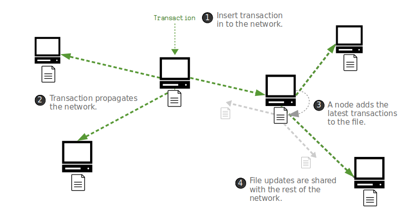

- 1）某个节点开始转发一笔新交易；2）交易在网络中不断传播；3）节点把最新一批交易加到区块链文件中；4） 文件更新在整个网络中分享 -

结果是，比特币程序创造了一个很大的 *[计算机网络](https://learnmeabitcoin.com/beginners/network)*，这些计算机会相互通信、*共享一个文件并使用新交易来更新这个文件*。

## 那它有什么用呢？（它解决了什么问题？）

在比特币发明以前，大家就已经可以在计算机网络中分享数据、转发 “交易” 了。但是，问题在于，**你可以在计算机网络中添加相互冲突的交易**。举个例子，你可以把 *同一个* 电子货币支付给两个不同的人，并且把两笔交易同时发送到网络中。

这就是所谓的 “多重支付（double-spend）”。

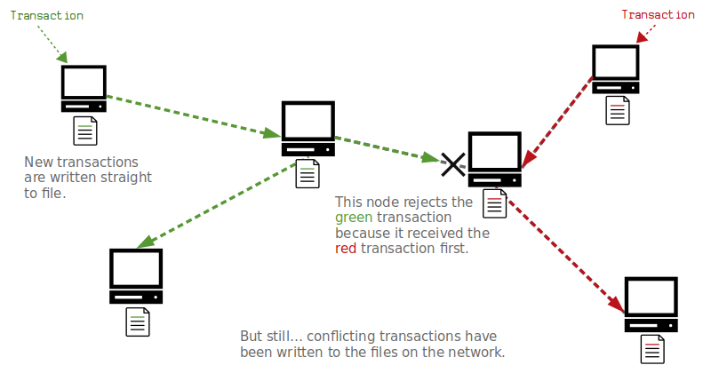

- 两笔交易以绿色和红色标记。某个节点先收到了红色交易，就拒绝了有所冲突的绿色交易，但其它节点并没有拒绝 —— 网络中的不同节点发生了分歧 -

所以，如果你要创造一个不设控制中心的电子支付系统，你就要解决这个问题（如何分辨到底哪一笔 “在先发生”），而这个问题在一个所有计算机都各自独立运行的网络中是很难解决的。如上图所示，一些节点会先收到绿色的交易，另一些节点会先收到红色的。

谁来 *决定* 哪笔交易 “在先发生” 并且只有它应该写入文件呢？

比特币解决这个问题靠的是强迫所有节点把自己收到的所有交易都保存在 *[内存](https://learnmeabitcoin.com/technical/memory-pool)* 中，而不是立即写入文件。10 分钟的间隔过后，网络中 *一个随机的节点* 会把内存中的交易加入文件

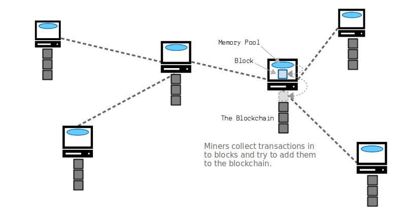

然后，这个更新后的文件就会在网络中分享，所有节点都会把这个更新中的交易当成 “有效的”，在本地的内存中一处任何与之冲突的交易。因此，相互冲突（多重支付）的交易出不可能写入文件中，而所有节点也在更新文件上与其它节点达成了一致。

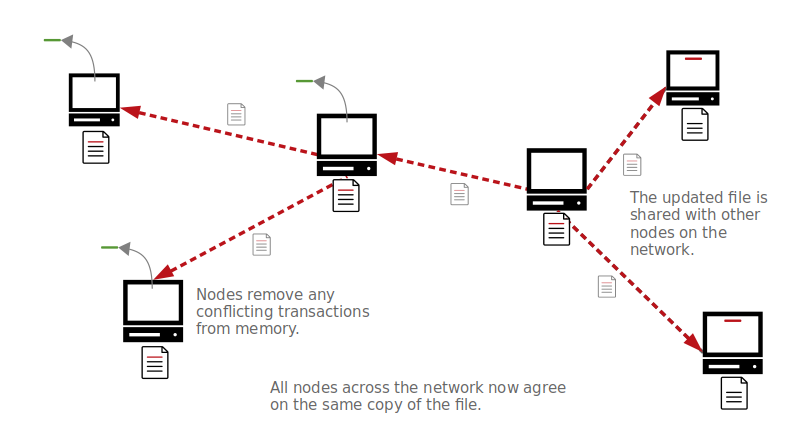

这个（由某个节点）给共享文件添加交易的过程叫做 “[挖矿](https://learnmeabitcoin.com/mining)”，它是在整个网络范围内进行的 *竞争*，所以也无法被单个节点控制。

## 挖矿是怎么 “挖” 的？

一开始的时候，每个节点都在 “[**交易池**](https://learnmeabitcoin.com/technical/memory-pool)”（即上文所述的内存）里存储着最新收到的[交易](https://learnmeabitcoin.com/technical/transaction-data)（这些交易只是暂时存储在电脑中）。然后每个节点都可以尝试从内存池中 *挖出* 交易并写入文件（即[**区块链**](https://learnmeabitcoin.com/technical/blockchain)）中。

简单来说，节点会从交易池中手机交易，放到一个叫做 “[**区块**](https://learnmeabitcoin.com/beginners/blocks)” 的 “容器”（数据结构）中，然后使用电脑的运算能力、尝试把这个包含交易的区块添加到区块链上。

那使用运算能力来干什么呢？要想把这个区块添加到区块链上，你要把这个包含交易的区块作为输入来执行一类叫做 “[**哈希函数**](https://learnmeabitcoin.com/technical/hash-function)” 的程序。哈希函数基本上就是一种微型计算机程序，它可以接收任何数据并将收到的数据打乱、混淆成一个完全随机（但独一无二）的数字（译者注：这里的 “独一无二” 是指，在理想状态下，一个输出值只对应着一个输入值，即只有某一个输出才能产生某一个输出，或者说找出两个输入能产生同一个输出的概率是极低的）。

要使你的区块能成功添加在区块链上，你产生的这个数字（也叫 “[**区块哈希值**](https://learnmeabitcoin.com/technical/block-hash)”）必须小于[**目标值**](https://learnmeabitcoin.com/technical/target)。这个目标值是网络上的每个人都一致认可的一个阈值。

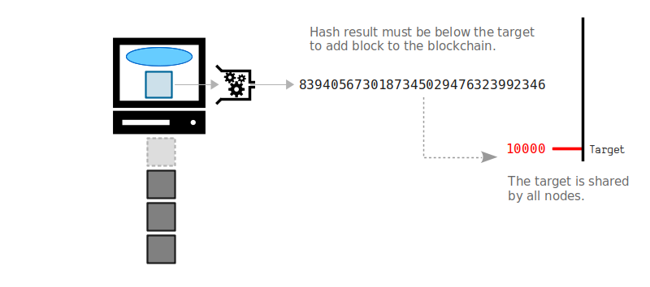

如果你算出的**区块哈希值** *不低于* 目标值，你可以对区块内的数据作一些微调并再次输入哈希函数。这样做会产生 *完全不同* 的哈希值，也许会低于目标值。如果仍然不行，你可以不断调整、不断尝试。

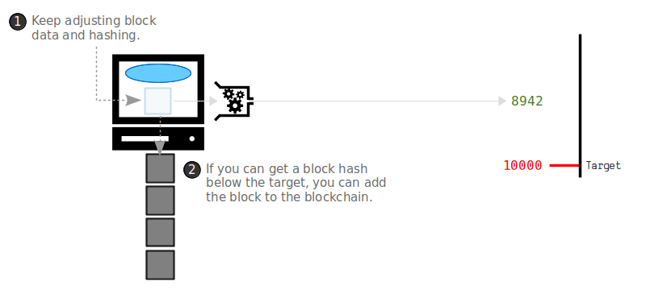

所以总的来说，挖矿就是使用计算机的运算能力来尽可能快地执行哈希计算，以成为网络中第一个找到一个低于目标值的区块哈希值的人。如果你成功了，你就可以将自己选定的包含交易的区块添加到区块链上，并与网络中的其他人分享。

**注意**：虽然理论上来说每个人都能尝试挖矿，但现在，使用家用计算机来挖矿已经毫无竞争力了。现在有专门设计出来尽可能快（尽可能高效）执行哈希计算的专业硬件，现在的挖矿产业也主要是由这些能获得专业硬件和便宜电力的人来做的。

## 那比特币是从哪儿来的呢？

为了激励人们使用计算力来为区块链添加新的区块，每个新区块都会产生一定数量的新比特币（没错，就是无中生有）。因此，如果你成功挖出了一个区块，你就可以给自己 “发送” 一些新的比特币作为奖励。

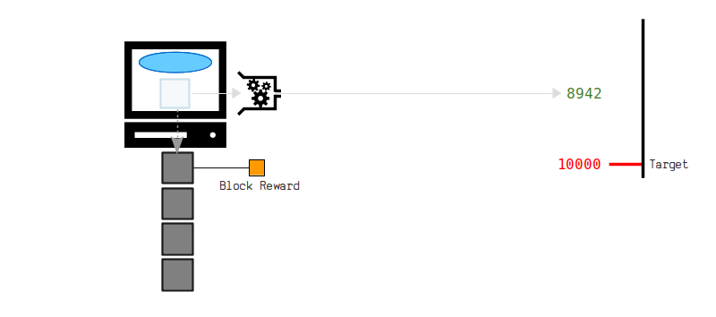

这些增发的比特币叫做 “**区块奖励**”，这也是为什么这个过程叫做 “挖矿”。

## 为什么这个文件要叫 “区块链”？

如上所述，交易不是一个一个添加到文件中的 —— 它们是汇集起来放到一个区块中。每一个新区块都是 *跟在已有的一个区块后面*，所以整个文件就是由**区块**组成的一个链条，因此，它叫 “[**区块链**](https://learnmeabitcoin.com/technical/blockchain)”。

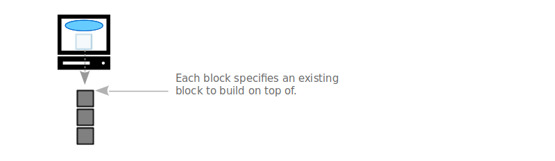

具体来说，这是因为网络中的每个节点都**永远只接受自己收到的[最长的链条](https://learnmeabitcoin.com/technical/longest-chain)**作为区块链的 “正式版本”。这就意味着，矿工永远会尝试在已知最长链的 “末端” 添加区块，因为不在最长链上的区块不会被其它节点认为是有效的区块。

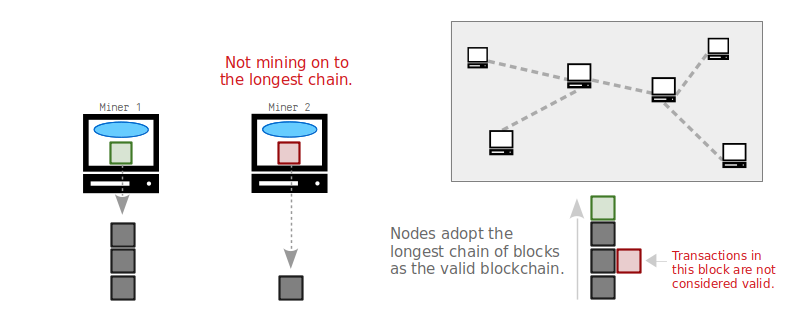

因此，如果有人想重写交易的历史，他们就需要重新建构出一条比当前大家所知的最长链更长的链条，这样其它节点才会接收。但是，要想做到这一点，这个 “雄心壮志” 的矿工必须掌握比其它所有人加起来都要多的运算能力（译者注：如果这个矿工在自己的链上挖矿，而其他人都在已知的最长链上挖，那么除非 TA 挖的速度更快，也即是比另一条链上的所有挖矿算力都要大，否则是永远赶不上已知的最长链的）。

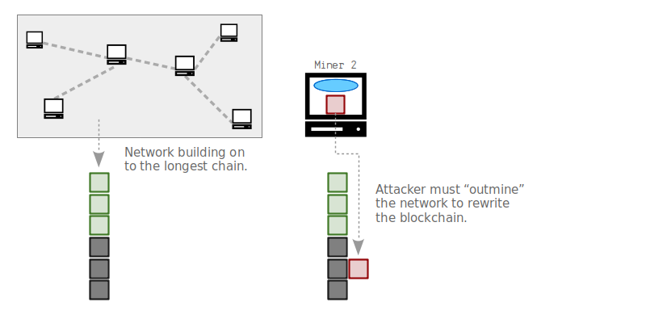

因此，网络的集体合力，让任何人都难以 “超越” 网络并重写区块链。

## 那交易又是怎么回事呢？

你可以认为区块链是一个 *保险柜* 的仓库。这种保险柜我们叫做 “[**（交易）输出**](https://learnmeabitcoin.com/technical/output)”，它就是容纳不同数量比特币的容器（保险柜）。

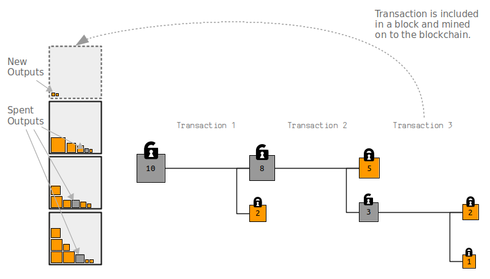

当你发起比特币[**交易**](https://learnmeabitcoin.com/technical/transaction-data)时，你要选择某些输出、*解锁* 它们，然后创建一些新的输出并为它们[上锁](https://learnmeabitcoin.com/beginners/output_locks)。

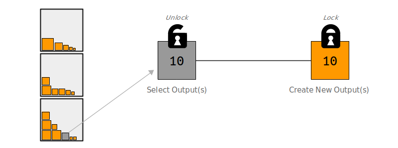

所以，所谓的 “发送” 比特币给某人，就是把一些比特币放到了一个新的保险箱里，并加上一把只有你的支付对象可以打开的锁。

举个例子，我想给你发一些比特币，我会从区块链里挑出一些我可以解锁的输出（保险箱）、使用它们创建一个 *只有你* 可以解锁的输出。同样地，如果我不想把解锁的所有比特币都发给你，我可以创建一个额外的输出作为 “找零”、加上我自己的锁。

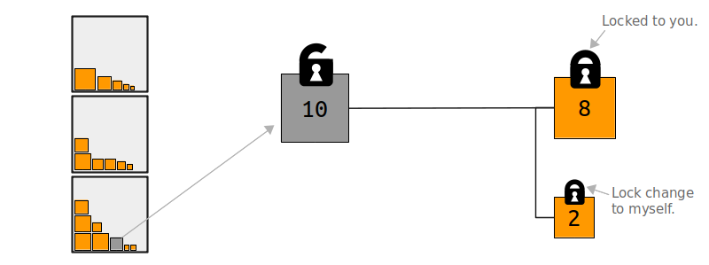

日后，如果你想把比特币发给其他人，你就重复上面这个过程：选出（你可以解锁）的输出、以此创建新的输出。因此，比特币的交易会形成一张图（如下图），各交易的前身后世联系起来就是比特币的流转情形。

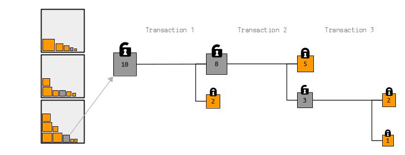

最后，当一笔交易在区块链上挖出，该交易所使用（花费）的输出就不能再用在别的交易中，而新创建的输出可以用在未来的交易中（译者注：即无法多重支付）。

## 我怎么持有比特币？

要想 “接收” 比特币，你需要拥有自己的[**密钥对**](https://learnmeabitcoin.com/beginners/keys_addresses)。密钥对就像 *你的账户号码和口令*，只不过再比特币的世界里，它们分别叫 “[**公钥**](https://learnmeabitcoin.com/technical/public-key)” 和 “[**私钥**](https://learnmeabitcoin.com/technical/private-key)”。

举个例子，如果我想给你发送一些比特币，你需要先给我你的**公钥**。我创建交易时，我会把你的公钥放到输出（保险箱）的锁上。当你想使用这些比特币时，你就使用自己的**私钥**来解锁这个输出。

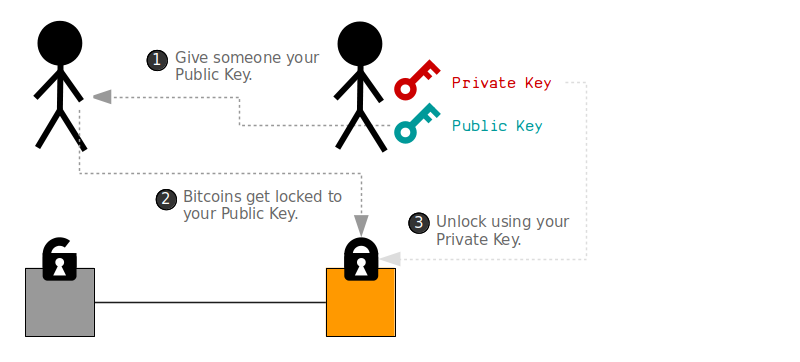

那我怎么获得一个公钥和私钥呢？嗯，你可以借助**密码学**，自己生成一个，不必假手他人。

简而言之，你的私钥就是一个很大的 *随机数*，而你的公钥是使用这个私钥 *计算出来* 的一个数。但有趣之处在于：你可以向他人公开你的公钥，其他人无法从中破解出你的私钥。

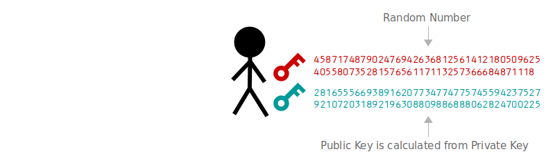

当你想解锁你的公钥名下的某些比特币时，你就用你的私钥来创建一个叫做 “[**数字签名**](https://learnmeabitcoin.com/beginners/digital_signatures)” 的数据。数字签名会证明你就是这个公钥的主人（因此你有权解锁这些比特币），*无需你公开自己的私钥*。这个数字签名也只对你（签名的）这笔交易有效，所以没法用来解锁你的公钥名下的其它比特币。

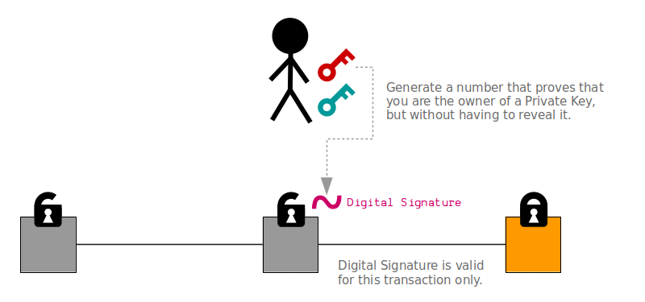

整套系统叫做 “公钥密码学”，自 1978 年起就有了 1 。比特币使用这套方案来让任何人都能自己创建密钥、安全地发送和接收比特币，无需权威中心来安排账户和口令。

（译者注：在现实中，交易的构造和发送都是通过叫做 “钱包” 的软件来实现的。手机端、电脑端都有可以使用的钱包软件，甚至还有专门的硬件钱包。读者要记住的只是，公钥可以公开，但私钥一定不能，因为任何获得了你的私钥的人，都可以转走对应公钥名下的比特币。公私钥无需注册、无需向谁报备，使用钱包就可以生成，而且你可以生成无数个。）

## 汇总一下

[要上手比特币](https://learnmeabitcoin.com/beginners/getting-started)，你需要先生成自己的[**私钥**](https://learnmeabitcoin.com/technical/private-key)和[**公钥**](https://learnmeabitcoin.com/technical/public-key)。你的私钥就是一个很大的随机数，而你的公钥是使用你的私钥计算出来的（换言之，每个公钥都有对应的私钥）。密钥可以很容易在你的电脑上生成出来，甚至你可以在计算器上按出来。大家一般都使用某种[比特币钱包](https://electrum.org/)来帮助生成和管理密钥。

在接收比特币时，你先要把自己的 *公钥* 告诉想给你支付的人。这个人会创建一笔[**交易**](https://learnmeabitcoin.com/technical/transaction-data)来解锁自己持有的比特币，并创建一个新的 “保险箱”、用你的公钥上锁。

接下来，这笔交易可以发给比特币网络中的任何一个[**节点**](https://learnmeabitcoin.com/beginners/nodes)，从这个节点开始，这笔交易会在节点间不断转发，直到[网络](https://learnmeabitcoin.com/beginners/network)的每一个节点都获得了这笔交易的备份。这时候，每个节点都有机会把这笔最新的交易 *挖出* 到区块链上。

“[**挖矿**](https://learnmeabitcoin.com/mining)” 的一开始，节点要从自己的[交易池](https://learnmeabitcoin.com/technical/memory-pool)中收集交易，打包成一个[区块](https://learnmeabitcoin.com/beginners/blocks)，并不断微调区块中的数据、输入[哈希函数](https://learnmeabitcoin.com/technical/hash-function)，尝试获得一个低于[目标值](https://learnmeabitcoin.com/technical/target)的[区块哈希值](https://learnmeabitcoin.com/technical/block-hash)。

最先找出一个低于目标值的区块哈希值的矿工可以把 TA 的相应区块添加到本地的[**区块链**](https://learnmeabitcoin.com/beginners/blockchain)文件中，并向网络中的其他节点广播这个区块。每个收到这个区块的节点也都会将该区块添加到自己的区块链文件中（并从交易池中移除与该区块内交易相冲突的交易），然后在链的最新区块后开始新一轮的挖矿尝试。

最后，挖矿区块的矿工可以在区块中安排一笔[特殊的交易](https://learnmeabitcoin.com/technical/coinbase-transaction)，增发一定数量的比特币给自己作为奖励。这种**区块奖励**正是节点持续构建区块链的激励机制，同时也是向比特币网络分发新币的机制。

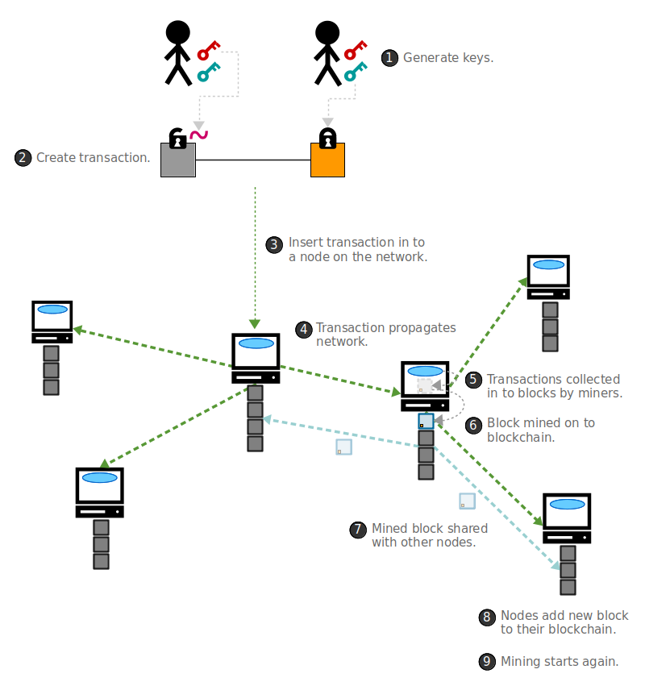

## 结论

比特币是一种计算机程序，会跟全世界其它同样运行比特币程序的计算机分享一个安全文件。这个安全文件的内容是交易，而这些交易使用密码学来让用户收发保险箱。结果，它创造了一种任何人都可以使用、没有控制中心的电子支付系统。

自 2009 年 1 月启动一来，比特币（几乎）不间断地在运行。在 2019 年，比特币网络处理了超过 **1.12 亿笔交易**，转移了总计 **15,577,763,114,629.34**（15.58 万亿）美元的价值 2。

比特币程序也一直在活跃开发，自其第一版发布一来，超过 **600** 个人为之贡献过代码。这是因为这种软件是 “开源” 的，也就是任何人都能审核其代码并为止贡献。

https://bitcoin.org/bitcoin.pdf（比特币白皮书）

https://github.com/bitcoin/bitcoin/（Bitcoin Core 源代码）

## 想了解更多？

孺子可教。

本网站全都是对 *比特币如何运作* 的**简单讲解**。

1. [Beginners Guide（入门指南）](https://learnmeabitcoin.com/beginners) —— 有时候你只需要一个完整的大概。这是我能写出的最短、最简洁的指南了。我是在 2015 年写的，那是我最初学习比特币原理的时候。
2. [Technical Guide（技术指南）](https://learnmeabitcoin.com/technical) —— 更完整、更深入的介绍。适合程序员。
3. [Blockchain Explorer（区块浏览器）](https://learnmeabitcoin.com/explorer) —— 你可以浏览比特币区块链上的数据，从而直观地看到比特币是如何工作的、所有原理是如何相互结合的。这就像打开车子的引擎盖，看看里面的东西。
4. [视频 (YouTube)](https://www.youtube.com/channel/UCj9MFr-7a02d_qe4xVnZ1sA/videos)  —— 这里是从一个程序员的视角，*深入地讲解* 比特币的原理。如果你想写一些关于比特币的程序，这些视频课能帮到你。
5. [代码 (GitHub)](https://github.com/in3rsha/learnmeabitcoin-code) —— 常见比特币模块的代码示例

## 我为什么要相信你呢？

我在比特币的世界里没有正式身份。我只是读很多代码、[写很多代码](https://github.com/in3rsha)、[问很多问题](https://bitcoin.stackexchange.com/users/24926/inersha)。我对比特币的所有知识都来自实践。

而且，[我长得很帅](https://learnmeabitcoin.com/about)。

## 为什么这些信息都是免费的？

因为：

- 比特币本身就是一种[开源的程序](https://github.com/bitcoin/bitcoin)，你可以免费运行。
- 我对[比特币](https://bitcoin.stackexchange.com/)、编程和[写作](https://www.pokerseo.org/about/)的一切知识，都是免费得来的。
- 这个网站也是使用免费的[开源工具](https://learnmeabitcoin.com/thanks#development)搭建出来的。

所以，为什么我不免费教点什么呢？

不过，如有打赏，感激不尽。我的比特币地址：[`3Beer3irc1vgs76ENA4coqsEQpGZeM5CTd`](bitcoin:3Beer3irc1vgs76ENA4coqsEQpGZeM5CTd)

## 为什么你要做这个网站？

因为我希望更多人也像我一样理解比特币是怎么运行的。

比特币让你可以向任何人转移价值，我认为它由重要意义。如果你知道了比特币的原理，你可以创建自己的软件，让世界有所不同。

### 脚注

1. https://en.wikipedia.org/wiki/RSA_(cryptosystem)
2. 在 2020 年，536,916,338 有所转移。2020 年 12 月 31 日，比特币的美元价格为 29013.39。
3. https://github.com/bitcoin/bitcoin/graphs/contributors

（完）