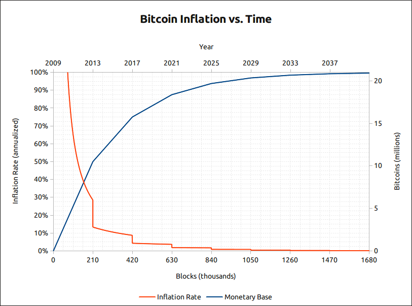

> *作者：Jameson Lopp*
> 
> *来源：<https://blog.lopp.net/how-is-the-21-million-bitcoin-cap-defined-and-enforced/>*




稍微了解比特币的人都听过，比特币的货币供给量是可以预测的，而且永远不会超过 2100 万 BTC。严格来说，因为在协议层面，所有的统计都是以最小的货币单位（聪）来进行的，所以这个上限是 2099 9999 9769 0000 聪。

但是，这个上限是怎么定义出来的呢？怎么保证它不会被打破？

不太懂行的人可能第一反应是到[比特币白皮书](https://www.lopp.net/pdf/bitcoin.pdf)里找答案 …… 但那里并没有（也没有关于协议的许多其他方面的信息！）。


<p style="text-align:center">- “比特币的白皮书原教旨主义者应该知道，下述内容在白皮书里面都没有：多签名、矿池、2100 万 BTC 上限、GPU/ASIC 挖矿、10 分钟的出块间隔、层级确定式地址推导、最好的链是积累最多 PoW 的而非最长的，等等” -</p>


你想在 Bitcoin Core 实现重寻找这个定义吗？如果你在 [github 库](https://github.com/bitcoin/bitcoin)里面搜索 “21000000”，你会发现一个常量 [MAX_MONEY constant](https://github.com/bitcoin/bitcoin/blob/master/src/consensus/amount.h)，但它跟货币供给量无关！


<p style="text-align:center">- 译者注：代码的注释部分：“注意，这个常量 * 并不是 * 货币总供给量；在当前的比特币协议中，因为许多理由，货币总供给量恰好小于 2100 万 BTC；但是，这个常量更多是一种健全性检查。因为这个检查会被共识攸关的验证代码所用，MAX_MONEY 常量的具体数值也将与共识紧密相关；在一些不常见的场景中，比如一个允许凭空增发货币的溢出错误，因为这个常数的存在，可能导致分叉。” -</p>


所以，这个上限到底是怎么施行的呢？可能它没有你想的那么直接。

## 隐形的而非显性的限制


<p style="text-align:center">- “一个常见的误解是，比特币必定会定期检查货币供给量低于 2100 万。实际上，Bitcoin Core 里面根本没有这样显式的检查。为什么呢？因为要不断对 7500 万个 UTXO 求和是一个艰难的工作。2100 万的上限是隐式的，不是显式的。” -</p>


你不应该把比特币的供给量想成是一个 “根据时间点来执行的” 检查，而应该看成是一个设置了移动上限的几何级数。毕竟，我们不需要关心 *具体* 有多少比特币存在，**我们只关心它是不是小于预计的数量**。这个描述了我们所希望的上限的序列，可以用下面这个等式来描述：


<p style="text-align:center">- 来源：https://twitter.com/anilsaidso -</p>


就好像在说：

```
  50 * 210000
+ 25  * 210000
+ 12.5  * 210000
…
+ 0.00000002 * 210000
+ 0.00000001  * 210000
= 20999999.9769
```

比特币实现通过检查每个新区块没有创建[超过限度的区块奖励](https://github.com/bitcoin/bitcoin/blob/master/src/validation.cpp#L2113)来控制增发数量。这行代码是专门加总区块的 coinbase 交易的输出面额总和的 —— coinbase 交易是区块内的第一笔交易，也是唯一一笔可以铸造新币的交易。


你可能会注意到，它也把区块内的交易费考虑进去了。为什么呢？因为这些交易费并不是新增发的比特币 —— 它们已经存在了，是由发起交易的人支付给矿工的。类似地，检查 coinbase 交易的输出面额总和减去该区块的交易费是否等于或小于允许的区块奖励，也是正确的。

那么比特币的增发曲线在协议中是如何定义的？[它就是 5 行代码](https://github.com/bitcoin/bitcoin/blob/06ba77973e7f8938c8461bffeee3718a8f7712f5/src/validation.cpp#L1153)。其中 2 行是为了覆盖一种在区块高度 1344 0000 —— 大概会是公元 2265 年 ——之前不会出现的极端情况。你可以在 [BIP-042](https://github.com/bitcoin/bips/blob/master/bip-0042.mediawiki) 中了解第 1157 行代码背后的逻辑。


对任意一个区块高度，我们都可以容易计算出它在 发行曲线/几何级数 的具体哪个位置。我们需要知道的仅仅是已经发生过多少次区块奖励减半（第 1155 行），然后将最初的区块奖励（50 BTC）乘以 1/2 的这个次数幂，这就是第 1162 行的花哨位移操作的实质。

除了检查区块奖励，我们 *还需要* 防止意料之外的增发，没发生在 coinbase 里的那种。

第一种办法是确保每笔交易的输入都存在，而且是可以花费的。你可以在 Bictoin Core 的 [CheckTxInputs function](https://github.com/bitcoin/bitcoin/blob/623745ca74cf3f54b474dac106f5802b7929503f/src/consensus/tx_verify.cpp#L170) 里面发现这个检查。


当然，这个也是比特币协议中最基础的检查 —— 为了防止多重花费问题。如果可以把一笔钱可以花两次，那就可以用来使货币供给量任意膨胀了。

我们也[对输入的值执行健全性检查](https://github.com/bitcoin/bitcoin/blob/623745ca74cf3f54b474dac106f5802b7929503f/src/consensus/tx_verify.cpp#L187)，以保证它们不是负数以及不会溢出。这些情形都会导致新货币的创造，而比特币早期历史上还真有这样[因为溢出而导致的事故](https://en.bitcoin.it/wiki/Value_overflow_incident)！


另一个重要的验证是每一笔非 coinbase 的交易，其输出的面额总和都必须小于或等于输入的面额总和，因为一个更高的输出就以为新的货币凭空产生了。同一个验证函数[执行了这个检查](https://github.com/bitcoin/bitcoin/blob/623745ca74cf3f54b474dac106f5802b7929503f/src/consensus/tx_verify.cpp#L195)。


这些都是防止比特币的货币供给量任意膨胀的关键检查。此外，还有机制（难度调整）来控制以人类社会的时间尺度上的通胀。如果你有兴趣学习这些，请看我的文章：[比特币的时间戳安全性](https://blog.lopp.net/bitcoin-timestamp-security/)、[比特币的时间戳波动性](https://blog.lopp.net/bitcoin-block-time-variance/)。

## 显式验证

如前面提醒的，在我们每次要保证供给量相关的规则得到了遵守的时候都实际加总所有比特币款项的总和，是非常耗费资源的。但一个更加显式的验证依然是**有可能的** —— 你要做的仅仅是加总所有 UTXO 的面额。

Bitcoin Core 提供了一个便利的函数来执行这样的总供给量审计。这个函数叫做 [gettxoutsetinfo](https://developer.bitcoin.org/reference/rpc/gettxoutsetinfo.html)。

在撰文之时，比特币网络有大约 8 千万个 UTXO，所以运行这个函数可能要花一到两分钟，视你的硬件性能而定。

我的节点支撑着 [statoshi.info](https://statoshi.info/) 页面，它会在每次收到新区块后自动调用这个函数。它所返回的货币数量会存储在一个数据库中，用来生成[这张图表](https://statoshi.info/d/000000009/unspent-transaction-output-set?viewPanel=7&orgId=1&refresh=10m)。


这就是全部了！比特币的货币供给量既是可大体预测的，又是可验证的。前面的几千行文字，只是对几十行代码的解释。

## 有关 “2100 万” 的常见问题

人们常常针对比特币的货币供给量提出一些其它方面的问题。

### 这个上限可以改变吗？

技术上来说当然可以。但是，这也使一个治理和激励的问题。任何人都可以在自己节点上改变自己要执行的上限 —— 难的部分在于说服其他所有人使用同样的规则。想了解更多，请看：

- [谁控制着 Bitcoin Core？](https://blog.lopp.net/who-controls-bitcoin-core-/)
- [比特币的 2100 万 BTC 上限可以改变吗？](https://river.com/learn/can-bitcoins-hard-cap-of-21-million-be-changed/)

### 为什么是 2100 万而不是别的数？


<p style="text-align:center">- “问：为什么中本聪选择了 2100 万作为上限？答：限制性因素在于一个 64 比特的整数可以表达的最大数值（18,446,744,073,709,551,615），而 21,000,000 BTC 会被表示为 2,100,000,000,000,000 聪” -</p>


### 2100 万 BTC 都被挖完之后，会出现什么情形呢？

矿工只是不能挖出新币了而已 —— 他们可以继续收取交易手续费。这就是为什么新货币叫 “block subsidy（直译为 “区块补贴”，意译为 “区块奖励”）”—— 这些新增发的货币只是为了帮助在交易量较低的时候冷启动这个系统。随着比特币的接受度提高，对（有限的）区块空间的需求也会提高，手续费也会。

- [比特币的 2100 万 BTC 挖完之后会怎么样？](https://decrypt.co/33124/what-will-happen-to-bitcoin-after-all-21-million-are-mined)

### 现在有多少比特币 实际上存在/已经丢了 ？

统计现在有多少 UTXO 存在是很容易的，但是更深入的探究会证明，一些币永远不会被使用了，而一些可以证明是不可花费的了，还有一些是可能不可花费的了（但不确定）。[Coinmetrics 撰写了一篇很棒的文章](https://coinmetrics.substack.com/p/coin-metrics-state-of-the-network-d2e)，分析了可能还在流通中的供给量。


<p style="text-align:center">- 来源：https://coinmetrics.substack.com/p/coin-metrics-state-of-the-network-d2e -</p>


（结论是：有 182 BTC 可能丢了，有 150 万 BTC 可以肯定丢了。截至区块高度 60 0000）

（完）