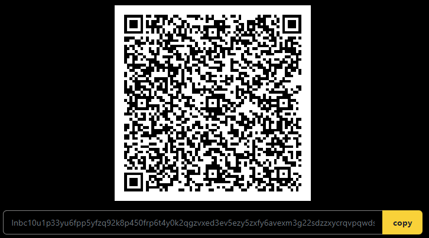
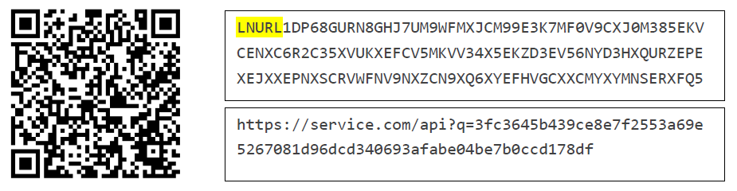

> *作者：heisenberg*
> 
> *来源：<https://stacker.news/items/65872>*

富有经验的用户知道，现在你可以给  `名字@域名` 这种格式的闪电网络地址直接支付了。但是，它到底是怎么一回事呢？

在这篇短文中 ，我会向还不了解这个功能的朋友解释它的原理。同时，我会介绍闪电网络发票（invoices）和 LNURL-pay 协议的基础知识。

## 闪电网络发票基础知识

闪电网络发票是当前在闪电网络上发送和接收资金的标准。如果你想接受一些比特币，你必须在你的 节点/钱包 处生成一个发票。发票只是一串文字（以 “lnbt” 开头），包含了接收者的 ID 和资金的数额（以及其它东西）。实际上还有更多信息，但我们这边就不深究了。发票最常见的分享形式是 QR 二维码，其实就是上述字符串的图像表示。

例子：

然后，支付者的闪电钱包会在网络中寻找触达接收者的路径、按照优势对这些路径排序并逐一尝试，直到支付成功（有时候可能也会失败）。

但是，闪电网络发票有很大的局限性。设想你是一个 Youtube 视频作者，你想在自己的视频中生成一个静态的二维码，这样你的粉丝就可以给你捐赠了。但是每个发票都由超时限制（通常是 1 小时），而且无法多次支付。这是因为，在路由支付的过程中，中间节点会知道叫做 “支付原像” 的随机数，所以使用同一个发票多次支付是不安全的（每个发票只包含了一个支付原像，知道了支付原像就可以获得支付者支付的资金）。那该怎么办呢？这就轮到 LNURL-pay 了。

## LNRUL-pay 基础知识

LNRUL-pay 是一种标准，允许用户创建一个静态的 QR 码，这个码可以接收多次支付。这是怎么做到的呢？

LNURL-pay 核心就是一条 URL，连接到一个使用 HTTPS 网络协议（或者 Tor 协议）的服务端，这个 URL 是用 bech32 编码格式编码过的。从用户体验上看，它有很大的优势，因为从人的角度看，不同的 QR 码没有什么分别，因此普通的用户不需要知道他们是在支付一个发票，还是在使用 LNURL-pay。

例子：

支付流程：

1. **用户**使用闪电网络**钱包**扫描 QR 码（LNURL-pay）。
2. **钱包**解码 QR 码，然后解码这个 bech32 字符串，获得 URL 并使用 HTPPS 协议访问它。
3. **服务端**响应钱包以一条消息，询问支付数额（也可以是固定数额）。
4. 用户填入数额，并将信息发回给**服务端**。
5. **服务端**返回**用户**选定数额的传统闪电网络发票。
6. **钱包支付发票**。

就是这样！所以，LNURL-pay 只是一种协议，用来（通过互联网服务端）协商要生成多大价值的发票。

## 最后，闪电网络地址

现在，我们已经知道发票和 LNRUL-pay 的原理了，那么理解闪电网络地址就变得轻而易举。回想一下，为什么我们需要通过 LNURL-pay 扫描 QR 码来获得原始的 HTTPS 链接？

有了闪电网络地址，你就不需要扫描 QR 码了。举个例子，如果你的地址是 [heisenberg@stacker.news](mailto:heisenberg@stacker.news)，那么你的钱包会将它翻译成 https://stacker.news/.well-known/lnurlp/heisenberg。换句话来说，这个链接不是从 QR 码中获得的，而是从闪电网络地址中 “编译” 出来的。你的钱包会访问这个 URL，然后得到的响应就是 LNULR-pay 请求，你要支付多少钱（见上述支付流程第三步）。后面的程序就是一样的了。就是这样！

## 怎么使用？

许多托管式 钱包/解决方案 现在会自动为你生成一个闪电网络地址，举例来说，每个用户都有一个形如 “[username@stacker.news](mailto:username@stacker.news)” 这样的地址。如果你想给这个地址支付一些钱，你只需要在闪电网络钱包的 “发票字段” 填入这个地址。现在大部分钱包都支持这样做了。另一个解决方案是使用你自己的闪电节点运行的工具（比如 LNBits、LnMe 和其它），这样就可以无需托管地通过 LNURL 收账。

**希望你有所收获，并且能告诉我你对类似的文章有没有兴趣**。

（完）