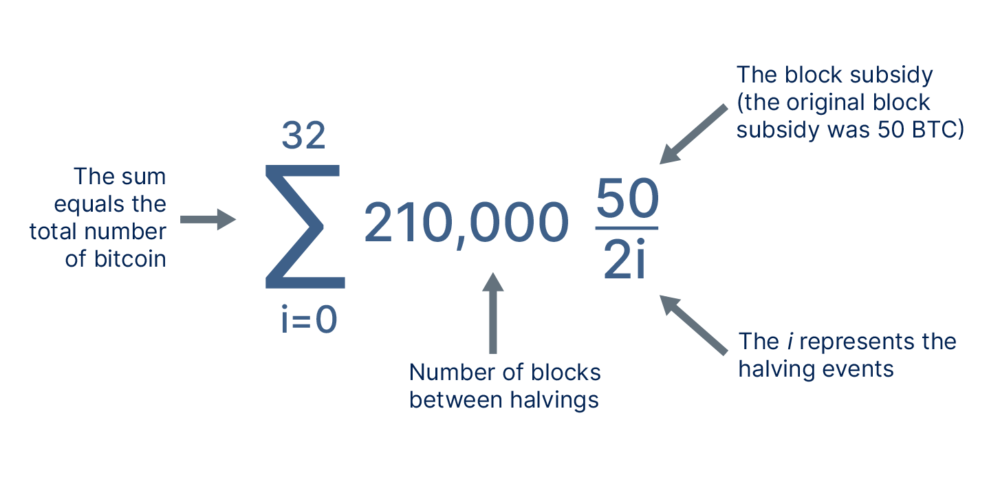
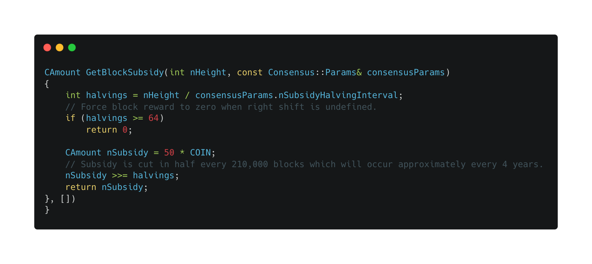
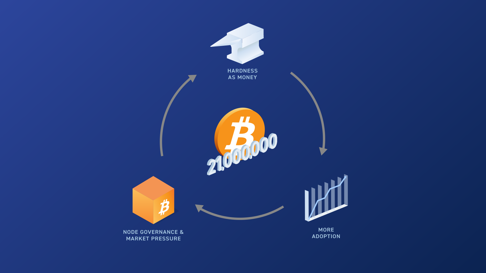

> *作者：Ted Stevenot*
> 
> *来源：<https://unchained.com/blog/how-many-bitcoin-are-there/>*

早在创造比特币时，中本聪就在代码中注明了比特币的发行量上限。自比特币协议上线以来，比特币就一直在按计划发行，其总流通量至今仍在增长。但它终将到达预定的上限，然后停止增发。

我们将在下文详细介绍比特币的固定发行量是如何实现的，但是在撰写本文之际：

- 比特币的发行量刚刚超过 1900 万。

- 正如下文所述，按照预定的增发计划，比特币的供应量每隔 10 分钟就会增加。

- 新的比特币会继续增发下去，直至总供应量[约等于](https://bitcoin.stackexchange.com/questions/38994/will-there-be-21-million-bitcoins-eventually/38998#38998) 2100 万（上限）为止。

如果你想要实时了解比特币的当前供应量，可以查看 [Clark Moody 的比特币仪表盘](https://bitcoin.clarkmoody.com/dashboard/)。

## 新的比特币是如何创造出来的？

比特币的增发是比特币交易处理（进入[比特币区块链](https://en.bitcoin.it/wiki/Block_chain)）过程的一部分。要理解背后的原理，我们先要知道比特币网络是如何验证交易、矿工又是如何将交易上链的。

- 每当有新的比特币交易出现，交易就会在由比特币矿工和节点构成的网络内传播

- 比特币软件会检查待处理交易，确保它们没有花费超出自己余额的钱，而且符合比特币的既定规则

- 矿工会将通过验证的新交易打包成“区块”

- 矿工需要参加 PoW 竞赛，争取用自己的区块续写区块链

- 平均每 10 分钟就会有一名矿工在 PoW 竞赛中胜出。因为每挖出 2016 个区块，比特币的挖矿机制就会自动调整

在 PoW 竞赛中胜出的矿工会将一个新的交易块添加到区块链上，并获得该区块的 “区块奖励” 作为报酬。区块奖励由两部分组成：

- **交易费**：为了在比特币地址之间转移资金而支付给矿工的费用，会基于网络活动情况变化。

- **区块补贴**：作为奖励，支付给矿工的新铸造的比特币

## 区块补贴是什么？

通过[ coinbase 交易](https://en.bitcoin.it/wiki/Coinbase)支付的区块补贴是比特币增发的唯一渠道。比特币诞生的头 4 年，区块补贴是每区块 50 BTC。

正如下方公式所言，每挖出 21 万区块（大约需要 4 年时间），区块补贴就会减半。最后，区块补贴会变成 0（详见下文），矿工挖出新区块时将不再获得区块补贴，只能获得区块内交易的交易费。

在 2010 年的 BitcoinTalk 论坛上，中本聪本人[曾提到区块补贴会结束发放](https://satoshi.nakamotoinstitute.org/posts/bitcointalk/57/#selection-33.0-33.351)，以及比特币的 2100 万发行上限 ：

> *没错。否则我们就无法做到限量 2100 万，而系统总需要奖励创建区块的矿工，哪怕奖励再少。再过几十年，奖励会变得非常少，交易费就成了节点补贴的主要来源。我相信，在 20 年内，交易量要么变得很大，要么为零。*

在这段话里，中本聪提到的 “节点”就是执行 PoW 计算的矿工。这段话之所以街知巷闻，原因有二：一来，这是少有的，中本聪直截了当表述了 “限量 2100 万” 的时候；再者，它触及了自比特币诞生以来就阴魂不散的问题：[等到区块补贴结束后，比特币还会像现在这么安全吗？](https://unchained.com/blog/21-million-is-non-negotiable/)

## 比特币节点是如何定义供应量上限的？

下图是决定比特币供应量上限的代码。该代码定义了支付给赢得 PoW 竞赛的矿工的 *区块奖励* 中的 *区块补贴* 部分。这对于确定比特币的固定供应量来说至关重要，因为正如上文所述，所有新增比特币都来自支付给矿工的区块补贴。

我们曾撰文逐行解释了 [2100 万发行上限是如何隐含在比特币代码中的](https://unchained.com/blog/bitcoin-source-code-21-million/)。

## “减半” 是什么？

要想弄懂比特币代码是如何定义 2100 万发行上限的，你还需要学习另一个术语 —— “减半”。比特币代码中的减半机制旨在让比特币以持久、有序、可预测的方式发行。比特币在诞生之初是以固定速度发行的，之后逐渐减慢，直至达到发行量上限为止。

你无需读懂上图中的每行代码，也可以理解减半的大意：上图代码定义了减半发生的时间和区块补贴的计算方式。2100 万发行上限是比特币发行计划造成的结果，而非代码中明确规定的变量：

- 两次减半之间挖出的区块数量固定为 21 万

- 最初的区块补贴是 50 BTC

- 每次减半发生后，区块补贴都会减半：50 BTC、25 BTC、12.5 BTC，以此类推

- 比特币的其它代码规定了，区块补贴平均每 10 分钟支付一次（即平均每 10 分钟挖出一个区块），补贴额大约每 4 年（21 万个区块）减半，直到降至 1 satoshi（比特币的最小单位）为止

- 比特币的发行量最终为 2100 万（[严格来说略低于 2100 万](https://bitcoin.stackexchange.com/questions/38994/will-there-be-21-million-bitcoins-eventually/38998#38998)，实际是 20,999,999.9769）。

## 还有什么帮助比特币实现了固定发行量？

理解比特币代码如何计算发行上限固然很有帮助，但这并不全是比特币代码的功劳。代码必须在计算机上运行，计算机则由人操作。那么，比特币是如何防止有人篡改系统、牺牲他人以自肥的？

### 全节点验证

正如上文所述，待上链的比特币交易由节点验证。节点在比特币网络中起到至关重要的作用。交易验证以比特币共识规则（包括 2100 万发行上限）为基础。这些规则就植根于比特币代码，得到了所有节点运行者的一致认可，而且只有符合规则集的比特币转账才被视为有效。如果有恶意参与者（甚至有钱有势的实体或国家）试图改变规则或作弊，他们创建的不符合规则的交易会立即被网络中的其他参与者拒绝。

### 市场力量 

除了上述代码和节点治理之外，另一种有助于比特币用户实施 2100 万硬上限的方法是活跃的市场。

虽然可能性极低，但是从理论上来说，或许有一天部分比特币用户会为了增加比特币的供应量而引入有争议的变化。

如果出现这种情况，这些人会遭到大部分支持硬性上限的比特币用户的抵制。每位用户都可以通过自己的节点或钱包软件选择采用新规则还是坚守旧规则。这会导致[链分裂](https://en.bitcoin.it/wiki/Hardfork) —— 一条区块链分裂成两条。

用户可以用一条链上的代币交换另一条链上的代币。在其它条件相同的情况下，稀有版本的比特币会更受比特币用户的青睐。由于[稀缺性是长期保值的基础](https://unchained.com/blog/bitcoin-is-not-backed-by-nothing/)，任何将财富存入比特币的理性人会受到激励，尽可能获取更多供应量有限的比特币，甚至用不限供应量的“比特币”去交换。

这一连串事件不可能发生，因为它们有足够强的威慑力。比特币用户不必真的参与这类交易，其威胁本身就足以阻止那些想要改变比特币供应表的人。

### 利己主义捍卫下的稀缺性

由于其稀缺性，比特币作为货币的吸引力与日俱增，使之更为普及。这背后意味着更多节点和钱包，意味着规则集更加去中心化。种种因素叠加起来，形成了一个由参与者自身利益驱动的良性循环，捍卫着比特币最吸引他们的重要特性，尤其是 2100 万发行上限。

Parker Lewis 在[《比特币终将淘汰其它货币》](https://unchained.com/blog/bitcoin-obsoletes-all-other-money/)中解释称，在比特币网络中，日益庞大的参与者群体致力于增强网络的安全性，更加可靠地施行 2100 万发行上限：

> 要知道，区块链本身并不能确保供应量是固定的，比特币供应表并非因为软件如此规定而可信。2100 万之所以可信，是因为它由日益增多的网络参与者在去中心化基础上实施。随着越来越多个体达成共识，2100 万固定值变得更加可信。久而久之，每个参与者对网络的控制力减弱，2100 万最终将变成一个更可靠的常数。随着采用率提高，比特币将兼具安全性和实用性。

如果你想更深入了解稀缺性对比特币的重要性以及比特币采用率提高如何巩固 2100 万发行上限，请阅读 Parker Lewis 关于比特币的[ 《参悟，而后顿悟》](https://unchained.com/gradually-then-suddenly/)系列文章。

（完）