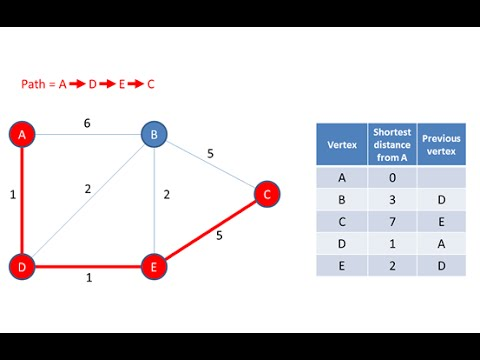

> *作者：LN Capital*
> 
> *来源：<https://twitter.com/LN_Capital/status/1604540519392153602>*

闪电网络支持以下两种付款方式：

1. 直接（节点到节点）
2. 间接（节点经由节点）

当你发送一笔间接付款时，由于你与接收方之间没有开启通道，你的付款需经由一个或多个中间节点发送。但是，面对 7.5 万个通道和 1.5 万个节点，我们如何从中选择最佳的付款路径？

[@lightning](https://twitter.com/lightning) 的 LND 实现目前使用 Dijkstra 的算法进行寻路（不是同一个算法，但是非常相近）。

Dijkstra 的算法发表于 1959 年，目的是找到节点图中任意两个节点之间的最短路径。

下图展示了寻路算法是如何从起始点（左下角的红点）开始搜索到目的点（右上角的绿点）的。

每当你在闪电网络上发送交易时，你的节点都会在节点图中搜索最短的可行路径。

如果说我们能够优化该寻路算法，使之更快速、更便宜、更可靠呢？

Pickhardt Payment 正是以此为目标。

[@renepickhardt](https://twitter.com/renepickhardt) 是一位独立研究者，以改进闪电网络为己任。虽然他硕果颇丰，但最出名的还是他的寻路优化算法。

Pickhardt Payment 使用概率来判定付款成功的可能性。通过使用概率模型，Pickhardt 算法可以估测出节点图中任意给定通道的流动性储量。付款会经由流动性最大的通道发送，提高可靠性而非速度。

使用概率优化付款可靠性可以大幅提高闪电网络的付款上限，让之前不可能的大额付款成为现实。

想象一下在闪电网络上支付 1 万美元只花了一美分不到的手续费。有了 Pickhardt Payment 便可美梦成真。

[@renepickhart](https://twitter.com/renepickhart) 和 [@stefanwouldgo](https://twitter.com/stefanwouldgo) 在他们的研究报告中指出：“早期实验表明，我们的方法能够可靠地将当前技术水平下的付款额提高几个数量级。”

实现 Pickhardt 算法后，[@Core_LN](https://twitter.com/Core_LN) 发现其付款完成时间和付款失败率减半，速度提高了一倍。这一切的背后只用到了一个 API 调用而已。

Pickhardt Payment 会为闪电网络打开双赢的局面。一方面，节点运营者能够收获更多利润；另一方面，用户能够享有更高的可靠性，还能发送更高金额的付款。

网络优化是非线性的，因为它们遵循梅特卡夫定律（网络的价值与其用户人数的平方成正比）。

因此，一旦我们提高了付款可靠性，我们的网络就会吸引更多流动性，进一步提高可靠性。

那么，我们如何才能使用 [#PickhardtPayments](https://twitter.com/hashtag/PickhardtPayments?src=hashtag_click) 呢？

[@c_otto83](https://twitter.com/c_otto83) 的 LND-manageJ 现已支持 Pickhardt Payment。

这里有一个使用 Rust 语言编写的 [@lightningdevkit](https://twitter.com/lightningdevkit) 补丁：https://t.co/h75gZv1Uns

这里有一个 python 库可供用户测试和构建自己的版本：https://t.co/OwtWg5JCOq

（完）