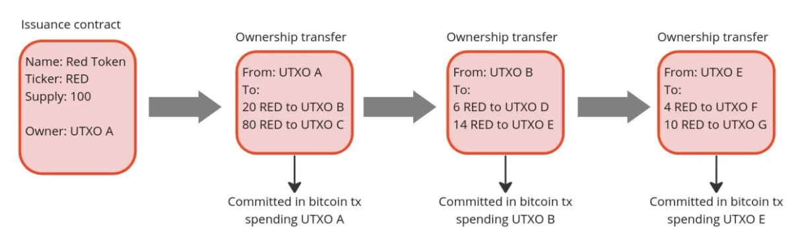
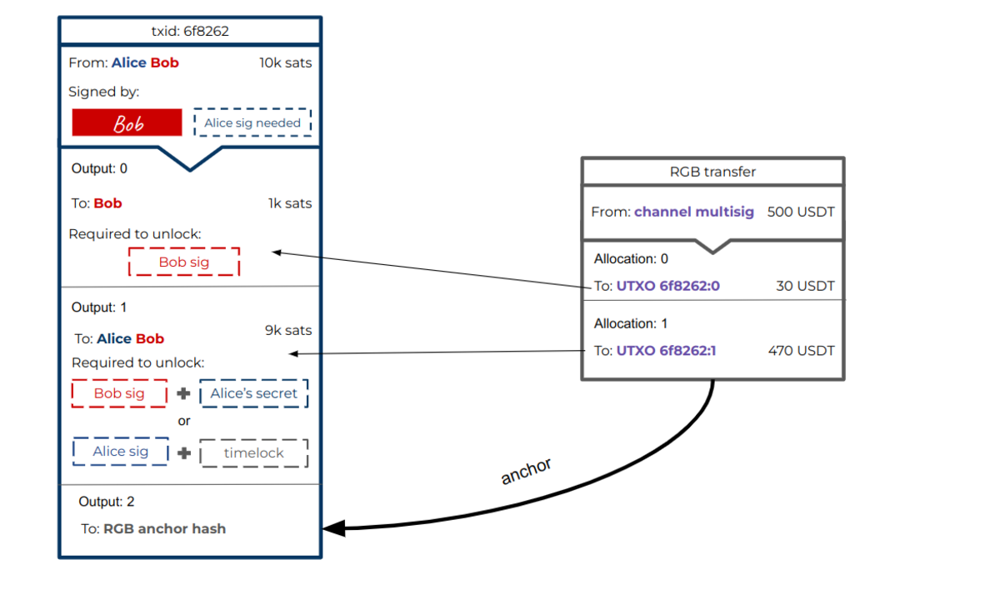
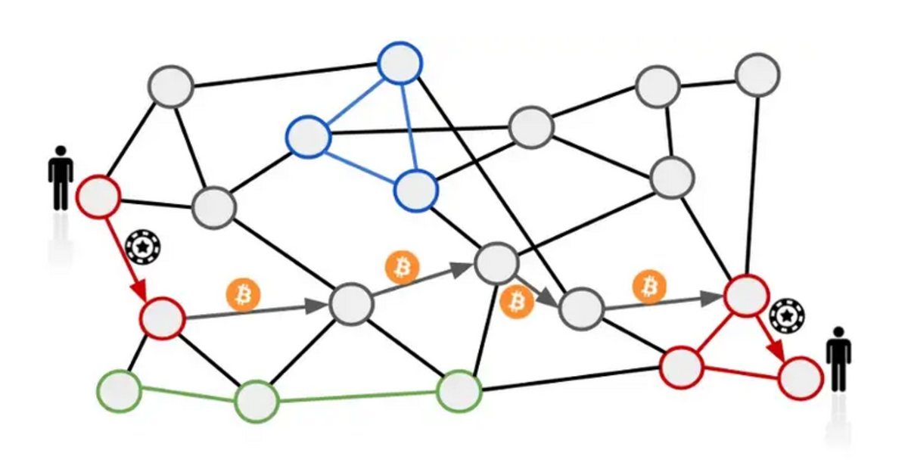

> *作者：Federico Tenga*
> 
> *来源：<https://bitcoinmagazine.com/technical/how-rgb-enables-altcoins-on-bitcoin>*

闪电网络可以说是比特币有史以来最具影响力的重量级创新技术。它能够以高效且低成本的方式进行交易，无需占用任何链上空间，同时又能完全保留比特币的抗审查和免信任特性。虽然闪电网络在技术稳定性和采用率上仍有发展和提升的空间，但它已经被证明是无可替代的低成本免信任付款解决方案，吸纳了[超过 1 亿美元的资金](https://bitcoinvisuals.com/ln-capacity)，获得越来越多企业采用。

像闪电网络这样的创新技术不仅能提高比特币的采用率，也有利于其它类型的数字资产。目前，大多数基于区块链的数字资产都作为山寨币发行，放弃像比特币那样提供安全性和抗审查性保证，以牺牲去中心化为代价提供低成本、低延迟的交易。换言之，它们实际上以半中心化系统的方式运行。但是，有了在闪电网络上转移数字资产的能力，很多需要低成本快捷交易的应用场景最终也能受益于比特币的免信任性。

一个已经颇受欢迎的应用场景必然会从中受益，就是稳定币。USDT 之类的稳定币已经被[广泛应用于](https://cointelegraph.com/news/tether-s-market-cap-hits-50b-as-stablecoin-adoption-grows)数字付款和汇款，尤其是在那些传统金融基础设施无法确保稳定运行、本地货币波动性较高的发展中国家和地区。

在闪电网络的帮助下，会有越来越多人采用稳定币作为支付方式。对于那些原本只能使用（甚至）比美元还不稳定的本地货币的用户来说，稳定币有助于提高他们的财务稳定性，还可以让他们更熟悉对比特币技术，从而更可能采用比特币，即使他们依然无法接受比特币的高波动性。此外，闪电网络上的其它数字资产不仅能从稳定币和其它代币化应用场景的普及中受益，同时也能进一步推广比特币，因为未来会有更多在技术上兼容比特币的基础设施出现（例如，对于接受闪电网络上的稳定币的付款终端来说，支持比特币也很容易）。

再者，一旦闪电网络上有了稳定币和其它资产，就有可能直接在闪电网络上实现去中心化交易所功能，即，两个节点能够点对点完成比特币与其它资产的互换，不仅在交易速度和成本上比肩闪电网络付款，而且无需担心对手方风险。这在很大程度上改善了去中心化交易所的现状，意味着更多人能够从中心化交易所抽身，无需再将自己的资产交给第三方保管。

## 让更多数字资产进入闪电网络

那么，我们该如何让这一切成真？

首先，我们需要一种能够在比特币区块链上发行和转移资产的方式。RGB 协议为我们提供了这种可能性，它可以让用户创建链下合约来发行新资产并将它们分配给比特币的 UTXO。这类资产的转移可由经过客户端侧验证的转账完成（如果你想了解 RGB 的工作原理，欢迎阅读[这篇旧文](https://bitcoinmagazine.com/technical/rgb-magic-client-contracts-on-bitcoin)）。

- 示例：RGB 资产是如何发行且在不同的 UTXO 控制者之间转移的。文中使用的所有示意图均由作者本人绘制。 -

产生 RGB 资产之后，我们就可以将它们发送至用来开通支付通道的多签 UTXO 种，从而将它们添加到支付通道中。一旦被添加至支付通道，RGB 资产就可以在通道参与方之间转移和路由，就像普通的比特币闪电网络付款那样。

为了确保 RGB 通道的安全性，每次通道更新时，资产都会从通道多签名输出发送至由闪电网络承诺交易创建的输出。这意味着如果支付通道的过时状态被广播，就有可能触发 RGB 惩罚交易（以及比特币惩罚交易），拿走攻击者的全部 RGB 资产。

- 闪电承诺交易示例：RGB 转账如何将资产从通道多签名输出转移至由承诺交易创建的输出。通过这种方式，如果 Alice 广播过时状态，Bob 就能使用 Alice 的秘密值触发惩罚交易，将比特币连同所有其它资产分配至该输出。 -

需要强调的是，成功敲定一笔付款需要所有路由通道拥有充足的流动性，能够实现目标资产的转移。这意味着每种 RGB 资产都需要有专门的闪电网络图。实际上，只有热门资产才能实现（例如，稳定币）。

## 不只服务于热门稳定币

RGB 对闪电网络的兼容性也能够用来为非热门资产创造新的可能。举个比较简单的例子：我们能够创建一个中心化程度较高的网络，让所有参与者都连接到少数几个主要节点，依靠一个大体呈辐射状的模型来运作。虽然这种模式在抗审查性上无法与去中心化网络媲美，但它依然可以满足很多应用场景的需求（例如，游戏内部代币）。

还有一个可能是，付款方可以通过交易所节点将低流动资产换成高流动资产，更轻松地将付款路由至目标节点附近，然后再换回低流动资产发送给收款方。但是，此解决方案并非没有缺陷，因为交易所节点在提供互换服务时会从中收取价差，对于低流动资产来说可能会很高，而且总共要收取两次。

- 以上是一个带有 RGB 通道的闪电网络示意图。灰色的圆圈代表普通的闪电网络节点，其它颜色的圆圈代表支持特定 RGB 资产的节点。通过一条闪电网络路径转移资产时，用户可以借助于同时拥有RGB 通道和普通比特币通道的交易所节点，利用比特币的流动性将付款路由至目标节点。 -

尽管低流动资产免不了会产生摩擦，但是触手可及的跨资产流动性桥可以帮助我们创建一个互联性更好的生态，让各色项目为同一个技术基础设施做贡献。

## 蓄势待发

那么，RGB 协议的开发目前处于什么阶段？最近，Bitfinex 的 RGB 团队（笔者也是其中一员）上线了具备完整功能的支持 RGB 资产的闪电网络节点 [rgb-lighting](https://github.com/RGB-Tools/rgb-lightning-sample)。该节点本身就是一大重要技术成果。与此同时，还有其它闪电网络实现也在计划支持 RGB，例如，Maxim Orolvsky 的 [LNP 节点](https://github.com/LNP-WG/lnp-core/)。虽然在撰写本文时 RGB 还不够成熟，无法承载巨额资金，但是在 RGB 和闪电网络上构建应用程序和应用场景所需的一切技术栈和组件都已就绪。

如果你想深入了解 RGB 是如何工作以及资产是如何在闪电网络通道中转移的，欢迎访问 [rgb.info](https://rgb.info/) 查阅更多资源。

（完）