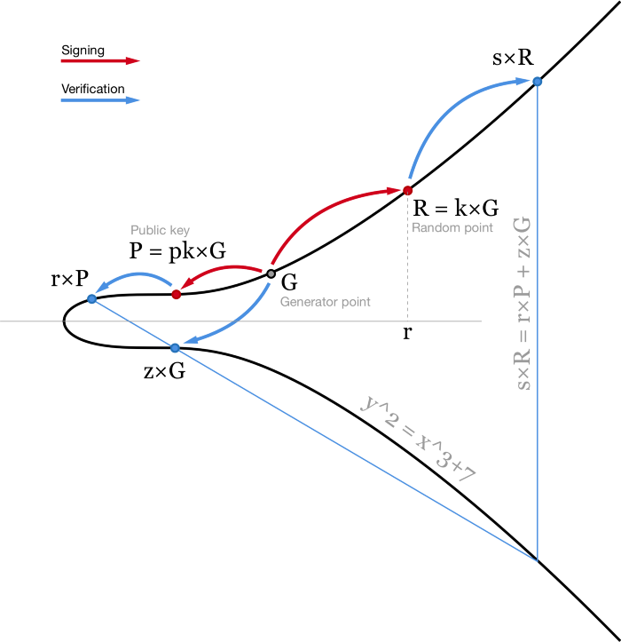
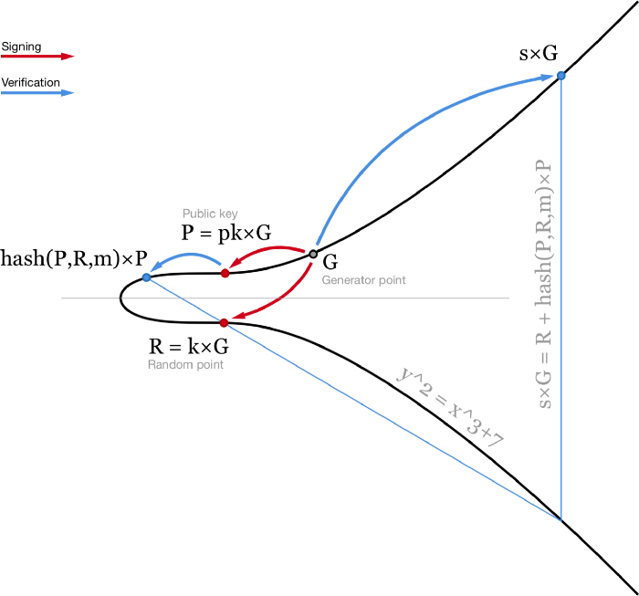
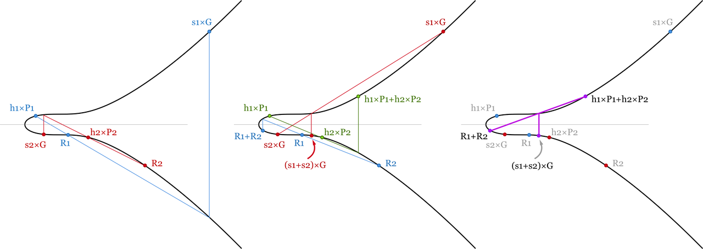
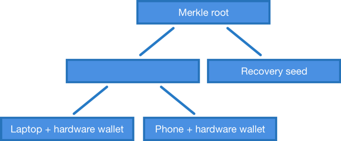

> *作者：Stepan*
>
> *来源：<https://medium.com/cryptoadvance/how-schnorr-signatures-may-improve-bitcoin-91655bcb4744>*

在阅读 Blockstream 撰写的 [MuSig](https://eprint.iacr.org/2018/068.pdf) 论文时，我一直在想象，这对于我一个比特币用户来说，到底意味着什么。我发现 Schnorr 签名的一些特性实在是非常棒而且便利，但某一些特性则非常烦人。在这篇文章里，我希望能跟各位分享我的想法。不过，我们先快速回顾一下。

## 椭圆曲线签名算法

当前比特币的所有权体系用的是 [ECDSA](https://en.wikipedia.org/wiki/Elliptic_Curve_Digital_Signature_Algorithm)（椭圆曲线签名算法）。在签名一条消息 $m$ 时，我们先哈希这条消息，得出一个哈希值，即 $z = hash(m)$ 。我们也需要一个随机数（或者至少看似随机的数）$k$ 。在这里，我们不希望信任随机数生成器（有太多的错误和漏洞都与不合格的随机数生成器有关），所以我们通常使用 [RFC6979](https://tools.ietf.org/html/rfc6979)，基于我们所知的一个秘密值和我们要签名的消息，计算出一个**确定性的 k**。

使用私钥 $pk$ ，我们可以为消息 $m$ 生成一个签名，签名由两个数组成：$r$（随机点 $R = k * G$ 的 x 坐标）和 $s = (z + r*pk)/k$。

然后，使用我们的公钥 $P = pk * G$ ，任何人都可以验证我们的签名，也就是检查 $(z/s)×G+(r/s)×P$ 的 x 坐标确为 $r$。

- ECDSA 算法图解。为便于说明，椭圆曲线作在实数域上 -

这种算法是很常见的，也非常好用。但还有提升空间。首先，签名的验证包含除法（$1/s$）和两次点乘法，而这些操作的计算量都非常大。在比特币网络中，每个节点都要验证每一笔交易，所以当你在网络中发出一笔交易时，全网几千个节点都要验证你的签名。因此，即使签名的过程开销变得更大，让验证签名变得更简单也还是非常有好处的。

其次，节点在验证签名时，每个签名都要单独验证。在一个 m-n 的多签交易中，节点必须多次验证同一个签名。比如一笔 7-11 的多签名交易，里面包含了 7 个签名，网络中的每个节点都要分别验证 7 个签名。另外，这种交易的体积也非常大，用户必须为此付出多得多的手续费。

## Schnorr 签名

Schnorr 签名的生成方式有些许不同。它不是两个标量 $(r, s)$，而是一个点 $R$ 和一个标量 $s$ 。类似于 ECDSA 签名，R 是一个椭圆曲线上的随机点 $R = k * G$。而签名的第二部分 s 的计算过程也有一些不同： $s = k + hash(P,R,m) ⋅ pk$ 。这里 pk 就是你的私钥，而 $P = pk * G$ 是你的公钥，m 就是那条消息。验证过程是检查 $s * G = R  + hash(P,R,m) * P$。

- 图解 Schnorr 签名和验证 -

这个等式是线性的，所以多个等式可以相加相减而等号仍然成立。这给我们带来了 Schnorr 签名的多种良好特性。

### **1. 批量验证**

在验证区块链上的一个区块时，我们需要验证区块中所有交易的签名都是有效的。如果其中一个是无效的，无论是哪一个 —— 我们都必须拒绝掉整个区块。

ECDSA 的每一个签名都必须专门验证，意味着如果一个区块中包含 1000 条签名，那我们就需要计算 1000 次除法和 2000 次点乘法，总计约 3000 次繁重的运算。

但有了 Schnorr 签名，我们可以把所有的签名验证等式加起来并节省一些计算量。在一个包含 1000 笔交易的区块中，我们可以验证：

$(s1+s2+…+s1000) × G=(R1+…+R1000)+(hash(P1,R1,m1)×P1+ hash(P2,R2,m2)×P2+…+hash(P1000,R1000,m1000)×P1000)$

这里就是一连串的点加法（从计算机运算的角度看，简直是免费的）和 1001 次点乘法。已经是几乎 3 倍的性能提升了 —— 验证时只需为每个签名付出一次重运算。

- 两个签名的批量验证。因为验证等式是线性可加的，所以只要所有的签名都是有效的，这几个等式的和等式也必成立。我们节约了一些运算量，因为标量和点加法比点乘法容易计算得多。 -

### **2. 密钥生成**

我们想要安全地保管自己的比特币，所以我们可能会希望使用至少两把不同的私钥来控制比特币。一个在笔记本电脑或者手机（在线钱包，热钱包）上使用，而另一个放在 硬件钱包/冷钱包 里面。即使其中一个泄露了，我们还是掌控着自己的比特币。

当前，实现这种钱包的所发是通过 2-of-2 的多签名脚本。也就是一笔交易需要包含两个独立的签名。

（译者注：2-of-2 的多签名只能对抗单个私钥泄露的风险，不能对抗某一个私钥丢失的风险。）

有了 Schnorr 签名，我们可以使用一对密钥 (pk1,pk2)，并使用一个共享公钥 $P = P1 + P2 = pk1 * G + pk2 * G $ 生成一个共同签名。在生成签名时，我们需要在两个设备上分别生成一个随机数 （k1, k2），并以此生成两个随机点 $Ri = ki * G$，再分别加上 $hash(P, R1 + R2, m)$，就可以获得 s1 和 s2 了（因为 $si = ki + hash(P, R, m)* pki $ ）。最后，把它们都加起来即可获得签名 $ (R, s) = (R1+R2, s1+s2) $，这就是我们的共享签名，可用共享公钥来验证。其他人根本无法看出这是不是一个聚合签名，它跟一个普通的 Schnorr 签名看起来没有两样。

不过，这种做法有三个问题。

第一个问题是 UI 上的。要发起一笔交易，我们需要在两个设备上发起多轮交互 —— 为了计算共同的 R，为了签名。在两把私钥的情况下，只需访问一次冷钱包：我们可以在热钱包里准备好待签名的交易，选好 k1 并生成 $R1 = k1 * G$，然后把待签名的交易和这些数据一同传入冷钱包并签名。因为已经有了 R1，签名交易在冷钱包中只需一轮就可以完成。从冷钱包中我们得到 R2 和 s2，传回给热钱包。热钱包使用前述的 （k1，R1） 签名交易，把两个签名加总起来即可向外广播交易了。

这在体验上跟我们现在能做到的没有什么区别，而且每当你加多一把私钥，问题就会变得更加复杂。假设你有一笔财富是用 10 把私钥共同控制的，而 10 把私钥分别存放在世界各地，这时候你要发送交易，该有多麻烦！在当前的 ECDSA 算法中，每个设备你都只需要访问一次，但如果你用上 Schnorr 的密钥聚合，则需要两次，以获得所有的 Ri 并签名。在这种情况下，可能不使用聚合，而使用各私钥单独签名的方式会好一些 —— 这样就只需要一轮交互。

*文章完成后，我得到了 Manu Drijvers 的反馈：在一个可证明安全性的多签名方案中，你需要 3 轮交互：*

- *选择一个随机数 ki 以及相应的随机点 Ri = ki · G，然后告诉每一个设备 Ri 的哈希值  ti=hash(Ri)，然后每个设备都能确保你没有在知道其他人的随机数之后改变主意*
- *收集所有的数字 Ri 并计算公共的 R*
- 签名

第二个问题是已知的 Rogue 密钥攻击。[这篇论文](https://bitcointechtalk.com/scaling-bitcoin-schnorr-signatures-abe3b5c275d1)讲解得非常好，所以我就不赘述了。大概意思是如果你的其中一个设备被黑（比如你的热钱包被劫持），并假装自己的公钥是 $（P1 - P2）$，那就可以仅凭私钥 pk1 便控制两个私钥共享的资金。一个简单的解决方案是，在设置设备时，要求使用私钥对相应的公钥签名。

还有第三个重大问题。*你没法使用确定性的 k 来签名*。如果你使用了确定性的 k，则只需一种简单的攻击，黑客即可获得你的私钥。攻击如下：某个黑客黑入你的笔记本电脑，完全控制了其中一把私钥（比如 pk1）。我们感觉资金仍是安全的，因为使用我们的比特币需要 pk1 和 pk2 的聚合签名。所以我们像往常一样发起交易，准备好一笔待签名的交易和 R1，发送给我们的硬件钱包，硬件钱包签名后将 （R2, s2）发回给热钱包 …… 然后，热钱包出错了，没法完成签名和广播。于是我们再试一次，但这一次被黑的电脑用了另一个随机数 —— R1' 。我们在硬件钱包里签名了同一笔交易，又将 （R2, s2'）发回给了被黑的电脑。这一次，没有下文了 —— 我们所有的比特币都不翼而飞了。

在这次攻击中，黑客获得了同一笔交易的两个有效的签名：（R1, s1, R2, s2） 和 （R1', s1'，R2，s2'）。这个 R2 是一样的，但是 $ R = R1 + R2 $  和 $ R' = R1' + R2 $ 是不同的。这就意味着黑客可以计算出我们的第二个私钥：$s2-s2'=(hash(P,R1+R2,m)-hash(P,R1'+R2,m))⋅pk2$ 或者说 $pk2=(s2-s2')/(hash(P,R1+R2,m)-hash(P,R1'+R2,m))$。我发现这就是密钥聚合最不方便的地方 —— 我们每次都要使用一个好的随机数生成器，这样才能安全地聚合。

### **3. Musig**

[MuSig](https://blockstream.com/2018/01/23/musig-key-aggregation-schnorr-signatures.html) 解决了其中一个问题 —— rogue key 攻击将不能再奏效。这里的目标是把 多方/多个设置的签名和公钥聚合在一起，但又无需你证明自己具有与这些公钥相对应的私钥。

聚合签名对应着聚合公钥。但在 MuSig 中，我们不是把所有联合签名者的公钥直接相加，而是都乘以一些参数，使得聚合公钥 $ P = hash(L,P1)×P1 + … + hash(L,Pn)×Pn$ 。在这里，$ L = hash(P1,…,Pn) $ —— 这个公共数基于所有的公钥。L 的非线性特性阻止了攻击者构造特殊的公钥来发动攻击。即使攻击者知道他的 $ hash(L,P_{atk})×P_{atk} $ 应该是什么，他也无法从中推导出 Patk 来 —— 这就跟你想从公钥中推导出私钥是一样的。

签名构造的其它过程跟上面介绍的很像。在生成签名时，每个联合签名者都选择一个随机数 ki 并与他人分享 $Ri = ki * G$。然后他们把所有的随机点加起来获得 $ R=R1+…+Rn$ ，然后生成签名 $si = ki + hash(P,R,m) ⋅ hash(L,Pi) ⋅ pki$ 。因此，聚合签名是 $(R, s)=(R1+…+Rn, s1+…+sn)$ ，而验证签名的方法与以前一样：$ s×G = R + hash(P,R,m)×P$ 。

### **4. 默克尔树多签名**

你可能也注意到了，MuSig 和密钥聚合需要 *所有签名者签名一个交易*。但如果你想做的是 2-3 的多签名脚本呢？这时候我们能够使用签名聚合吗，还是不得不使用通常的 OP_CHECKMULTISIG 和分别签名？（译者注：OP_CHECKMULTISIG 是比特币验证椭圆曲线多签名脚本的操作码，将分别验证所提供的每一个公钥的签名）

先说答案，是可以的，但是协议上将有些许的不同。我们可以开发一个类似于 OP_CHECKMULTISIG 的操作码，只不过是检查聚合签名是否对应于公钥默克尔树上的一个元素。

举个例子，如果我们想用公钥 P1、P2 和 P3 组成一个 2-3 的多签名脚本，我们需要用这几把公钥的所有两两组合  （P1, P2）、（P2, P3）、（P1, P3） 来构建一棵默克尔树，并把默克尔树根公布在锁定脚本中。

在花费比特币时，我们需要提交一个签名和一个证据，证明这个签名所对应的公钥位于由这个树根标记的默克尔树上。对于 2-3 多签名合约来说，树上只有 3 个元素，证据只需 2 条哈希值 —— 那个我们想用的公钥组合的哈希值，还有一个邻居的。对于 7-11 多签名脚本来说，公钥组合有 11!/7!/4!=330 种，证据需要 8 条哈希值。通常来说，证据所包含的元素数量与多签名的密钥数量大体成正比 ，为 $log2(n!/m!/(n-m))$ 。

但有了默克尔公钥树，我们就不必局限于 m-n 多签名脚本了。我们可以做一棵使用任意公钥组合的树。举个例子，如果我们有一个笔记本电脑，一个手机，一个硬件钱包和一个助记词，我们可以构建一棵默克尔树，允许我们使用 笔记本电脑 + 硬件钱包、手机 + 硬件钱包 或者单独的助记词来使用比特币。这是当前的 OP_CHECKMULTISIG 做不到的 —— 除非你使用 “IF - Else” 式的流程控制来构造更复杂的脚本。

- 聚合公钥的默克尔树。不仅仅是多签名 -

## 结论

Schnorr 签名很棒，它解决了区块验证中的一些计算开销问题，也给了我们密钥聚合的能力。后者在使用时有些不便利，但我们不是在强迫大家使用它 —— 无论如何，我们都可以仍旧使用普通的多签名方案，使用单独的、不聚合的签名。

我迫不及待想使用 Schnorr 签名，希望比特币协议能尽快纳入这种签名方案。

另外，我也真心喜欢 [MuSig](https://eprint.iacr.org/2018/068.pdf)，它是个优雅的方案，论文也浅显易懂。我强烈建议各位有闲之时通读全文。

（完）
