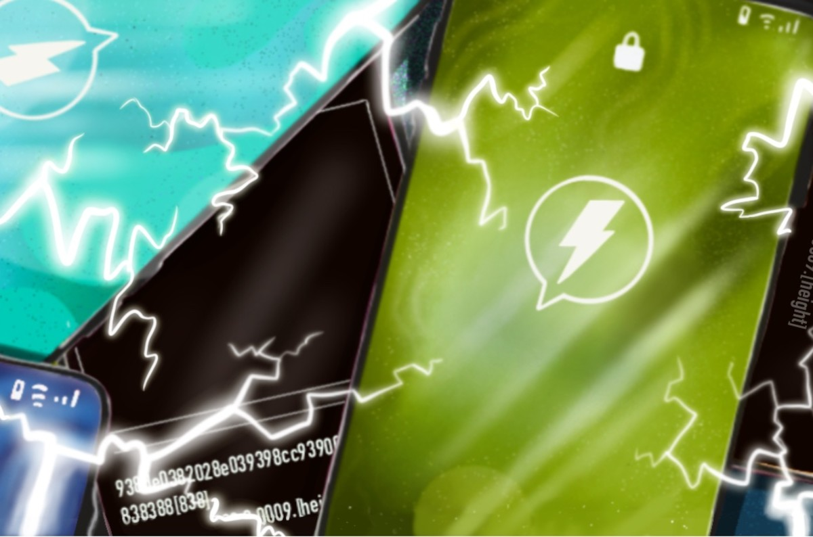

> *作者：COLIN HARPER*
> 
> *来源：<https://bitcoinmagazine.com/culture/how-the-lighting-network-could-improve-encrypted-messaging>*

*“……使用一个……由微支付通道构成的网络，比特币可以扩容到每日处理数十亿笔交易，而且单个节点的计算只需一台现代的笔记本电脑就可以负担。在一条微支付通道中可以发送许多次支付，所以人么可以去中心化地发送大量资金给他人。”*

上文引自 Thaddeus Dryja 和 Joseph Poon 撰写的 “比特币闪电网络” [白皮书](https://lightning.network/lightning-network-paper.pdf)，是闪电网络这种比特币的二层支付网络的原创文献。这篇 2016 年的论文重塑了关于扩容的争论，使得扩大区块和提高链上吞吐量的思路让位于使用由支付通道构成的新网络并延迟链上结算的方法。

但是，谁能想到呢，大概 4 年以后，开发者不仅将闪电网络看作是一种支付方案，也是一种新型的分发加密消息的方法。

当然，这说的是少数有远见的比特币开发者：Joost Jager 和 Paul Itoi。

Jager 和 Itoi 都提出了有趣的基于闪电网络的消息传输方法，但从技术上来说，他们用的是不同的传输机制。他们也在用不同的方法来传播自己的解决方案：Itoi 和他的团队推出了 [Sphinx Chat](https://sphinx.chat/) 应用，而 Jager 直接公开了自己的 [Whatsat](https://github.com/joostjager/whatsat) 源代码。

我们在 2019 年末介绍了[这些消息传输应用是如何工作的](https://bitcoinmagazine.com/articles/on-lightning-messaging-apps-emerge-as-growing-use-case)。简而言之：闪电网络近期的一次更新使得闪电网络交易中可以加入额外的任意数据。对于聊天这种应用来说，这些数据就是消息，在直接相连的对等节点之间可以免费发送，如需在网络中路由，也只需支付很小的一部分手续费，就像普通的闪电交易一样。

但，为什么你会默认选择这些协议而不是其它的加密通信软件呢？

答案就在于闪电网络消息传输可以提供传统的加密通信无法提供的东西。

## 去中心化的信鸽

历史趣闻：信鸽是第一次世界大战中的许多通信方法之一。信鸽尤其受坦克士兵的欢迎（他们缺乏可靠的通信手段，而雷达在这时候还很粗糙），而信鸽是一种保险的选择，在其它选项比如电话、信号弹通信失败或者不可用的时候，可以应急。

但信鸽这种办法很脆弱。知道这些信鸽携带着重要的消息，敌军士兵必定会跟这些不幸的高空信使共度难忘时光。当然，这种困境也有一种解决办法：加密。

实际上，加密通信在第一次世界大战和许多其它战争中扮演了关键角色。因为加密或多或少解决了信息被截获的问题（如果你无法破译这些密文，那截获也是无用的）。

到了 21 世界，加密已经成为了国家信息安全讨论的前沿问题。举个例子，一些政府官员曾经[呼吁](https://www.technologyreview.com/2019/07/24/134062/trumps-justice-department-calls-for-encryption-backdoor-law/)为了 “国家安全” 而在主流的民用加密科技中开设后门。

这就是问题所在。在第一次世界大战中，信鸽只是传递消息的容器；也就是说，这些鸟儿既不能生成加密消息，也不携带解密消息的密钥 —— 这都是情报部门的工作。

但是，到了电子通信时代，这些聊天应用自己提供了加密你所发送消息的方法。所以，在许多情况下，除非你或者某些人有这样的技术能力可以审核和验证应用代码，这些你用来加密聊天的应用，仅在开发者能信守承诺的时候才能保持私密。这就是为什么大部分比特币人只相信开源的应用比如 Signal 是安全的，而其它的一些比如 WhatsApp 和 Telegram 则不那么值得信任。

所以，在传统的加密通信中，你通常都有单点故障的问题。你是在信任一个中心化的实体（他们的代码你没有审核过）会信守承诺，保证你所发送的消息只能被你和接收者解密 —— 不存在后门。而且，你也是在打赌[政府不会给这些公司施压](https://www.theguardian.com/technology/2019/oct/03/facebook-surveillance-us-uk-australia-backdoor-encryption)，让他们给出权限（并且他们从而交出过）。

相反的是，闪电网络的消息传播依赖于比特币的去中心化二层网络的基础设施。闪电网络有大约 11000 个（已知的）公开节点，闪电网络的信息就通过这个类似于 Tor 的网络来路由，没有任何中心化的仲裁者。通过跟你的接收方开设直接的通道，你可以将消息直接发送给他们，无需经过任何中间节点。

就像 Jager 在 2019 年 11 月告诉 Bitcoin Magazine 的，闪电网络没有中心支柱，所以也不可能靠打破这样的支柱来攻陷闪电网络的加密聊天。

“区别就在于，没有中心化的服务器”，他说，“没有一个总闸可以用来杀死所有的通信，或是更有针对性地拒绝某些用户的通信。”

## 私人信鸽

作为一个插件，闪电网络通信也有隐私方面的好处。

这跟人们认为闪电网络的交易更加私密的论述是一致的。因为闪电网络基本上是洋葱路由网络，每条消息的传播路径，都会在它传播的过程中丢失（译者注：每个节点都只知道谁把消息发给了自己，自己要转发给谁，别的传播信息都不知道）。消息传播路径被获知的唯一可能性在于，单个节点在一条消息的路由中负责了 50% 乃至更多 —— 这也是有可能的，比如发送者和接收者之间的路径只包含了少量相互连接的对等节点。

所以，在某些情况下，为你的消息传输建立直接的支付通道会更隐私。

“通过闪电网络来聊天也让观察者更难发现谁在跟谁聊天”，Jager 说，“用户之间不需要直接的（可观察到的）TCP/IP 连接，而且，也没有中心化的服务器可以重构通信路径。”

当然，如我们前面提到的，路由消息在理论上还是有可能被去匿名化。但是，如 Jager 所说，“隐私和安全是程度概念”。

闪电网络通信仍有可能比传统的选择更为隐私，即使一个节点知道了谁是发送者，也无法截断其传播、破译其消息。

## 笨重的信鸽

最终，闪电网络消息传播，在抗审查性和隐私性上比起传统的加密聊天有更大的优势。

但这并不代表它就是完美的，或者人们会视之为最有吸引力的选择。就像我们在比特币和 FOSS（开源/自由 软件）中看到的，去中心化的选择通常是最难以大规模实现的，也可能是对普通用户来说最难以掌握的。

不过，Jager 认为，设计一款可以同时首发消息和支付的方案，可能变成一种杀手级应用。更重要的是构建一种免许可的、抗审查的通信方式；实际上，去中心化的货币可能必然需要这样一种工具，就像它可能需要[去中心化身份](https://bitcoinmagazine.com/articles/microsofts-ion-is-an-open-source-bet-on-bitcoin)一样。

“关键好处是我们可以将将支付和通信能力整合在一个身份”，Jager 说。“我们的核心信念是：闪电网络为支付提供的隐私和抗审查性，也应该用在言论上。使用闪电网络来聊天，将提高比特币作为一种交易媒介的接受度。”

所以，比特币人和大众会涌向闪电网络通信吗？Sphinx Chat 当前正在[封闭测试](https://sphinx.chat/)，我们将很快发现这种替代方案是否符合我们的预期，以及/或者 作为一种替代方案是否能无缝换用。Jager 相信人们将默认采用基于闪电网络的替代方案，因为像 Equifax 背叛用户这样的混乱事件（以及加密聊天服务的代码要在设计中内置后门这样的令人费解的现实）将导致对中心化服务的不信任。

所以，因为网上私密通信的命运悬而未决，闪电网络的新用例也许能被证明是在一个政府监控日益严苛的时代建立网上个人主权的关键一环。

（完）

