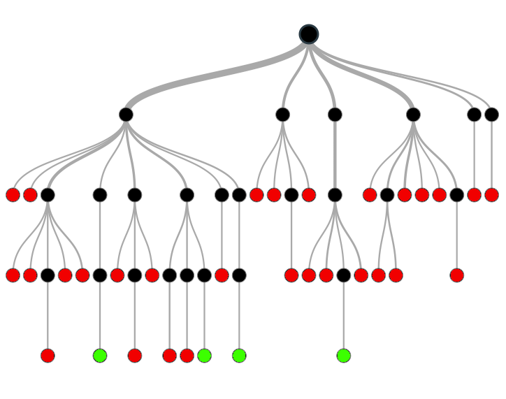

> *作者：Jameson Lopp*
> 
> *来源：<https://blog.lopp.net/how-to-back-up-a-seed-phrase/>*

随着密码学资产领域的进步，整个生态变得高度复杂，在功能上不断推陈出新，使人应接不暇。然而，整个生态的基本原则是要能保护你的资产，并通过**唯你控制**的私钥创建和签署交易来授权转账。

现在，一个 32 字节的熵有可能价值数十亿美元：

*011111100111100000000010001110000011110000010110110111111011011001010111100101001000011011010010010001010110001111010110100001100001001101100001001100001000001100010011111000111000000101001010111011000111010011011111010110000110110010011110110110010001000001111101*

可以被编码成以下 24 个单词：

*lazy scale mix join hospital swamp furnace move spoil climb volcano around current obscure arrange ladder life first brush salt man exhaust gold autumn*

为了帮助人们安全地保管自己的 32 字节的熵，整整一个行业发展起来。过去 7 年来，我一直在研究这个问题，目睹人们的惨痛经历，吸取来之不易的教训，将其融入到最佳习惯和 [Casa](https://keys.casa/) 的产品中。

既然已经有这么多关于备份助记词的指南，我为什么还要写这篇文章？

我看过的大多数指南，都只是一味告知你要完成哪些步骤，就结束了。我的目标是更详细地说明你在规划助记词备份架构时应该遵循哪种思路。如果你没有思考过自己的威胁模型，你可能会误信一种对自己的不利的说明性指南，最终带给你虚假的安全感。

## 选择悖论

在讨论备份助记词时，我们主要聚焦于复制关键数据以免其丢失的挑战。遗憾的是，备份数据的方法数不胜数，只有你想不到，没有你办不到。诸多解决方案可能性意味着，**大多数解决方案都是有缺陷的**。

- 在保存助记词这件事情上，不要相信所谓的 “集思广益”。我浏览这样的帖子时，至少 95% 的答案都有单点故障 -

这里，我再重申一遍：

> 为了帮助人们安全地保管自己的 32 字节的熵，整整一个行业发展起来。

为何会变成这样？我们现如今已同密码学资产的私钥管理打了十多年的交道，为何还未找到一种没有弱点的简单自托管解决方案，从而转向更有趣、更前沿的挑战？我相信这一切都归结于选择悖论（paradox of choice）。这是一种普遍存在于消费者决策中的心理现象，重点在于拥有更多选择不会让消费者更快乐，反而会让他们在决策过程中倍感压力。我相信选择自托管的人也会面临同样的难题，因为**构建密钥管理系统的设计空间很大**。

这个问题最形象的表达方式就是决策树：每个黑点都代表你必须做出的关于如何保存助记词的决策。实际上，用来备份敏感密钥材料的决策树远比下图所示的复杂。你要做的是一步一步完成所有可能的决策，直到获得一个“安全（绿色）的”最终架构为止。如果你在中途做了**错误**决策，或在某个重要因素上没有做出决策，你最终会得到一个有缺陷的架构。这个架构在特定场景中会出现问题。

请注意，足够安全的解决方案不止一种。但如果只有一种解决方案，我就能轻而易举地规划出一条明确路线。

## 助记词备份的威胁模型

我们已经知道为何要创建助记词备份 —— 防止我们丢失存储着日常所需密钥的设备。但是，在保护备份时我们需要注意避免哪些情况？

- 因备份被毁而导致密钥丢失

- 因 过度复杂/无法通过备份找回 而导致密钥丢失

- 因遭到攻击而导致密钥丢失

在考虑任何具体的备份方法之前，你要问自己的第一个问题是：**你实际上需要保存多少个备份**？一个可能不够！

了解你用来存储日常所需密钥的设备（如果有的话）。这个设备是否能让你随时导出助记词？如果不能，你需要保存不只一个备份。假设你只有一个备份（这个备份可能会因某种原因丢失/遭窃/被毁/无法获得），你就只有一个助记词副本。如果你的密钥管理设备不能导出助记词，你可能找不到任何办法创建额外的副本。在这种情况下，你需要创建一个新的钱包，备份助记词，并将所有密码学资产转移至新的钱包，同时祈祷仅剩的那组密钥不出任何问题（例如，设备没有遭到破坏或被擦除数据）。

虽然构建密钥备份方案应该以消除单点故障为目标，但我认为你应该有更高的追求，确保即使丢失一个备份也不会产生单点故障问题，进而导致你的密钥备份架构降级。

另一方面，你应该认识到，如果你的备份很容易被攻击者夺取（然后利用这个备份窃取你的所有密码学资产），使用多个备份来提高冗余性的同时会**降低健壮性**，让企图窃取备份的攻击者有机可趁。在考虑潜在备份方案时，我们要牢记这一点，以免引入陷入两害相权的境地。

## 墨菲定律

请牢记你自己的安全设想 —— 在现实世界里它们可能会被打破。在保护私钥方面，你需要确保自己的资产不会因为某个事件而丢失或遭窃。因此，你应该在存储备份数据之处有可能遭到入侵的假设下安排备份。

例如，即使你使用了防火的金属存储设备，也无法假设自己一定能在火灾发生后将其取回。还有其它威胁会导致你无法获取该设备，例如：

- 被消防带喷出的高速水流冲得飞到房子外面，或顺着水流与成吨其它东西一起流进下水道或沟渠。

- 被正在废墟中搜查的消防员/承包商捡起来放进口袋。你要是知道火灾后有多少人能[合法进入你的](https://www.legalmatch.com/law-library/article/rights-of-others-to-enter-property-on-fire.html)房子，可能会惊掉你的大牙。

- 消防检测人员认定由于现场存在化学物质，你的房子遭到污染，只有从事危险品处理的工作人员才能进入。

- - -

## 下等备份方案

我们先来看一些容易失败的常见助记词备份形式。

将你的（未加密）助记词存储到任何网络服务中，包括：

- 将你的助记词拍摄下来

- 会将数据同步到云端的笔记应用

- 将你的手机/笔记本电脑中的文件同步到云端的服务

基本上，几乎所有在线账户都可能被攻击者入侵，并被读取其内容。这里面包括为该公司/服务工作的员工！这种备份方法的失败案例有很多，其中之一是：

https://gizmodo.com/2-million-allegedly-stolen-from-cryptocurrency-vlogger-1825290362

使用“脑钱包（Brain Wallet）”，也就是自己主动选出一组助记词来生成私钥。人类是非常贫乏的熵来源。一些高明的攻击者会运行后台程序，持续监控成百万甚至数十亿可能被选择的脑钱包，一俟有资金存入便立即把其中的资金扫走。

见这个视频：https://youtu.be/foil0hzl4Pg

为了保护备份免受物理攻击，一些用户天真地将助记词切分成几部分。正如 Andreas 在下方视频中深入解释的那样，这么做会严重削弱你的助记词抗暴力破解的能力。

视频：https://youtu.be/p5nSibpfHYE

不要试图自创助记词方案，十之八九都是有缺陷的。即使你的方案在安全性上毫无漏洞，你通常也会过犹不及，将自己的助记词方案设计得过于复杂，以至于将来出问题时无法找回助记词。前不久，有人发邮件将自己设计的助记词方案告诉我，问我是否合理：

https://blog.lopp.net/bitcoin-seed-security-analysis/

同样，不用费心将你备份的助记词随机排序。鉴于助记词有内置校验和，根据助记词的长度暴力破解助记词并非难事。例如，随机 12 个助记词共有 4.79 亿种组合，其中只有 3000 万种组合是有效助记词。懂技术的攻击者只需花费几个小时即可验证完所有组合。

见此视频：https://youtu.be/ruSF8OKwBRk

将备份记在脑子里这个办法怎么样？好吧，只有在一种情况下我才会考虑这个办法，即，我需要在没有很多时间筹备的情况下逃难，又担心会在途中或过境时遭人追捕。也就是说，我认为**默记只是一种较好的应急策略**，作为长期策略会引入单点故障问题：

- 你可能会忘记助记词。

- 你可能会因受伤而想不起助记词。

- 你可能会死亡，导致你的继承人无法获得助记词。

- 你可能会被迫泄露助记词。

## 中等备份方案

**Shamir 密钥分割方案（SSS）**有很多弱点和不足，我已经在几年前展开写过了。实现 SSS 会极大地扩展整体设计空间，从而将更多可能的缺陷引入你的备份架构。

见：https://blog.keys.casa/shamirs-secret-sharing-security-shortcomings/

**助记词密语（passphrases）**： 关于如何保护助记词免遭物理攻击者贼手，我在论坛上经常看到的一条建议是，使用“第 25 个助记词”对你的单签名钱包进行初始化，每当你想要使用该钱包时，都必须输入第 25 个助记词。这本质上是跟 2/2 多签设置相同的安全模型。那么，你知道 2/2 多签为什么这么冷门吗？因为它引入了 2 个单点故障 —— 一旦任一部分丢失，你就完了。多年来，我已经看到有不少人因忘记或丢失附加在助记词上的密语而永远失去了自己的密码学资产。

## 优等备份方案

Trezor 的[ **Shamir 备份**](https://trezor.io/shamir)是一个经过严格审查的 SSS 标准。该解决方案的缺点之一是没有得到广泛支持。截至发稿之际，你只能通过 [**Trezor**](https://trezor.io/) Model T、[**Keystone**](https://keyst.one/) 或 [**Electrum**](https://electrum.org/) 找回这类备份。

Blockchain Commons 的[**分片密钥重构（Sharded Secret Key Reconstruction）**](https://github.com/BlockchainCommons/crypto-commons/blob/master/Docs/sskr-users.md)经过了妥善考虑，但是不同于 Trezor 的 Shamir Backup，你无法购买专用的、具有物理网络隔绝的设备来使用该密码学库。你可以通过以下几个选择来实现该备份方案：

- 使用 [**Gordian SeedTool iOS 应用**](https://github.com/BlockchainCommons/GordianSeedTool-iOS)（用户体验很好，但是没有物理网络隔绝）

- 构建 [**LetheKit**](https://github.com/BlockchainCommons/lethekit)

- 在离网的个人电脑上使用 [**seedtool-cli**](https://github.com/BlockchainCommons/seedtool-cli)

我认为助记词异或运算（[Seed XOR](https://seedxor.com/)）是一种绝佳方案，既能实现人们试图利用“第 25 个助记词”或助记词分割获得的特性，又能减低复杂性并提高合理推诿能力。请注意，该方案本质上是 N/N（例如，2/2、3/3 等等）切分备份，因此**你需要多组经过异或运算的备份**来确保丢失一块助记词板不会导致资产丢失。

多重签名。使用包含多个密钥的钱包的优点是，你不需要担心任一助记词备份成为单点故障。即使攻击者得到其中一个密钥的助记词，也没有足够多密钥来窃取你的资产。如果你丢失了其中一个密钥的助记词，你也可以使用其它密钥来花费你的资产。当然了，前提是你的 M/N 多签阈值不是脆弱的 N/N 阈值。

多签设置可以通过多元化来提高安全性。Casa 会采用不同的方式自动帮你备份 2 个密钥的助记词，无需你执行任何操作。你的移动端密钥会被[自动加密和备份](https://blog.keys.casa/casa-keymaster-security-mobile-key-overview)，Casa 密钥则由你自己的冷钱包存储和备份。若有需要，你还可以额外[下载和存储移动端密钥的加密副本](https://blog.keys.casa/product-update-transaction-memos-encrypted-backups)。因此，在 2/3 多签设置中，用户只需存储 1 个硬件设备的助记词；在 3/5 多签设置中，用户有 3 个硬件设备，能够选择是否备份设备 1、2 或 3 的助记词，因为该备份架构内置更高的冗余性。如果某个密钥的助记词丢失或泄露，在 Casa 应用中执行[密钥轮换](https://support.keys.casa/hc/en-us/articles/360045043572-Key-Rotation)非常简单。

## 测试你的备份

无论你选择何种备份方案，**如果你没有测试过通过备份找回钱包，你就无法确信备份会在你真正需要时发挥作用**。

你应该如何测试你的备份？

1. 创建一个新的钱包
2. 创建你的助记词备份
3. 往钱包中存入少量密码学货币，例如，价值 10 或 20 美元
4. 如果有可能，创建一个不同名称的新钱包，否则删除当前钱包
5. 使用你的助记词备份对新的钱包进行初始化，确保钱包里有钱，而且是可以花费的

通过将助记词加载到硬件钱包，然后[执行健康检查](https://support.keys.casa/hc/en-us/articles/360045442511-Health-Checks)，Casa 客户可以测试其备份。我们的[自主找回指南](https://support.keys.casa/hc/en-us/articles/360044989152-Sovereign-Recovery-Overview)中写明了更全面的测试。

## 防篡改

无论你决定将备份存储在何种形式的媒体（例如，纸、金属等）上，你都应该采取一个额外的措施来确保没人能在你不知情的情况下访问和读取该数据。为此，你可以将备份数据封存在一个[不透明的防拆袋](https://www.amazon.com/s?k=tamper+evident+bag+opaque)中。我建议你在防拆袋上签名，并将防拆袋的序列号保存在自选的加密密码管理器中。这样一来，你就能有效防止有人打开防拆袋，然后将里面的内容调包。

## 地理多元性

如果某处存放了足以让物理攻击者窃取资金的密钥信息，会引入单点故障问题。你需要将备份分散在各种物理上安全且难以找到的地方，以防某个灾难或攻击者导致存放在多处的备份同时丢失。

但是，你肯定也不想为此所累！在防止你的助记词因某个攻击者或事件而泄露的同时，你还需要时不时地检查它们，确保它们没有被泄露。

如果你从不检查备份，有耐心的攻击者可能会花费数年时间慢慢获取足够多的助记词，以重新构建密钥、窃取你的资金，等你察觉时为时已晚。

## 备份设备选择和行动安全（OPSEC）

可惜的是，硬件密钥管理设备往往附带一张纸，让你将助记词写在上面。我认为这是另一个指令式建议的例子：普通人会在没有深入思考的情况下遵从该建议，采取有缺陷的备份方案。

如果你的私钥保管的钱值得让你投资价值约 100 美元的硬件密钥管理设备，你应该再花 50 美元左右购买一个坚不可摧的助记词备份设备。然而，当你思考购买哪种金属备份设备时，你会再一次深陷选择的悖论。撰写本文之际，市面上已有超过 50 款商用助记词备份产品，还有一些 DIY 方法。我已经竭尽全力对我能找到的每一个产品和 DIY 方法进行了压力测试。如果你选择一个整体等级为“A”的产品或方法，就不会出错。

见：https://jlopp.github.io/metal-bitcoin-storage-reviews/

如果你选择购买商用金属备份板，**不要直接寄送到家里或最终 用来存放助记词的地方**！你应该想到你的寄送地址有可能泄露，以至于引狼入室。如果你没有私人邮箱或使用再邮寄服务，你应该考虑 DIY 方法，只需去趟你附近的五金店即可。

## 培养前瞻思维

如果你已经阅读到此处，你可能会想“好吧，这似乎有点多虑了，我手上只有价值几百美元的密码学资产，根本不值得大费周章。”

但是，你必须将目光放长远一些。本文为构建助记词备份方案提供了框架，可以拿来即用，而且未来数年乃至数十年都不会过时。十年后，你的助记词背后的密码学资产要么归零，要么比当前价值高出几个数量级。你绝不会想等你的密码学资产升值到 10000 美元那天，你的安全等级还停留在只能保护 1000 美元的资产上。

## 最后一点

**需要备份的不只是助记词**。

关于你的资产如何锁定在钱包内，你还需要了解以下几个属性：

- 助记词由哪个钱包软件生成。尽管大多数钱包都生成符合 BIP39 标准的助记词，部分钱包（如 Electrum）却不然。

- 脚本类型（P2PKH、P2WKH、P2SH、P2WSH 等）

- 派生路径

- 如果采用多签设置，还需了解支出所需满足的 M/N 条件和**所有扩展公钥**

一个潜在解决方案是[**钱包输出描述符**](https://github.com/bitcoin/bitcoin/blob/master/doc/descriptors.md)，能够在一个数据块中描述上述所有属性。然而，撰写本文之际，只有少数钱包支持导入和导出输出描述符。

如果你不知道上述属性，最后你将只能使用已知的常见钱包属性在 [**walletsrecovery.org**](https://walletsrecovery.org/) 上进行“寻宝”。如果有任一属性不符合标准，即使你持有对应私钥也别想找回你的资产！

请注意，上述属性不像你的私钥那样敏感。如果这些属性遭到泄露，只要攻击者没有从你这里获得足够多的私钥，就无法花费你的资产。我建议你在备份助记词的同时保留一份上述属性的副本 —— 当然了，一同保存在你的防拆袋中。

## 助记词保存方式因人而异

之所以说因人而异，并不只是因为事关你的资产，还因为你所做的很多选择都基于自身情况。你可能会因所在辖区、家庭情况、流动性、资源等因素而做出独一无二的选择。

这就是为什么我认为指令式指南会帮倒忙。它们往往会掩盖掉种种因人而异的复杂因素。

你是否在构建密钥管理方案上遇到了难题？[欢迎联系 Casa 了解更多](https://keys.casa/)。 

（完）