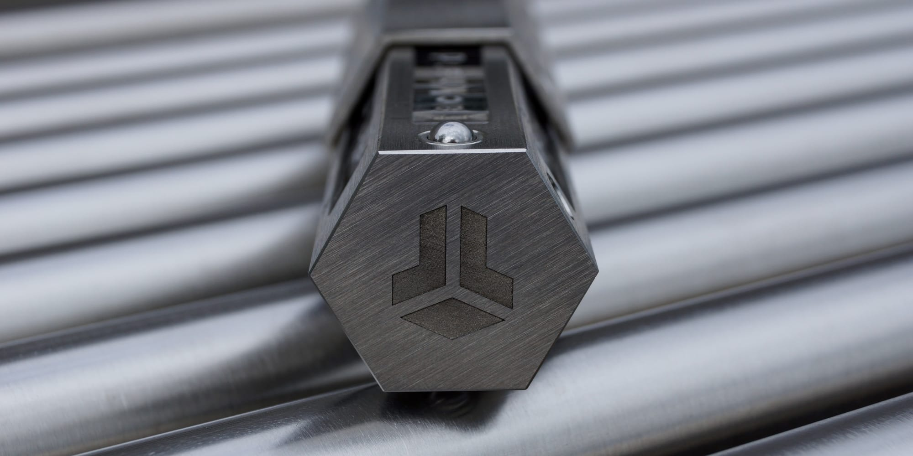
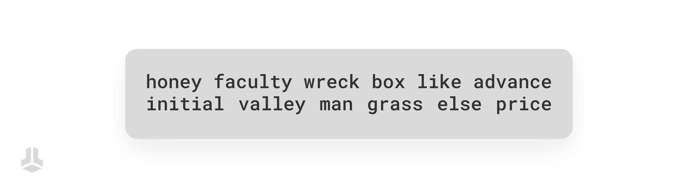
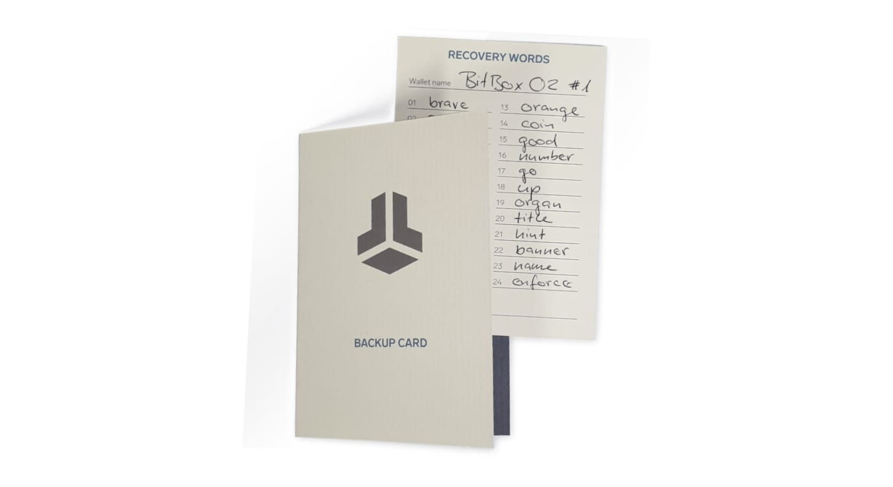
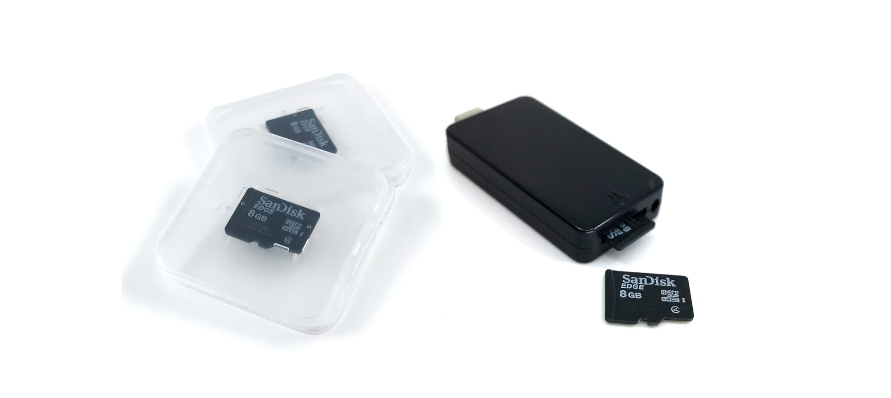
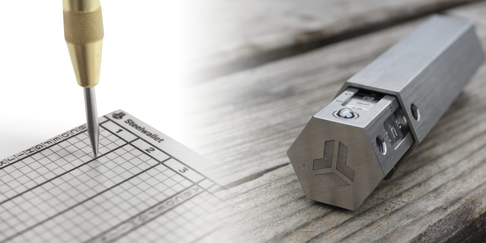

> *作者：Sebastian*
> 
> *来源：<https://blog.bitbox.swiss/en/how-to-create-and-secure-your-wallet-backup/>*

像 BitBox02 这样的硬件签名器是安全管理比特币的绝佳工具，它让你（也只有你）能完全掌控你的比特币。虽然硬件签名器本身是让钱包交互变得简单而安全的工具，但钱包备份才是真正定义和保障所有权的关键。自我托管伴随着重大的责任，所以接下来我们将重新审视关于钱包备份的几个重要方面、选项和最佳习惯！

## 比特币就是信息
“拥有比特币” 到底意味着什么？当然，并没有什么东西像实实在在的硬币一样、在比特币网络中传输，你的硬件签名器里也没有这样的东西。比特币通过私钥和公钥来花费和接收资金，它们本质上只是一些通过数学运算组合在一起的**超大数字**。

你的 BitBox02 钱包的 12 或 24 个复原词，正是这些 “超大数字” 的体现。这些数字被巧妙地编码成英文单词，方便你书写、记忆，并在硬件签名器上输入。只要掌握了这串随机的单词序列，就足以[推导出属于你钱包的每个密钥](https://blog.bitbox.swiss/en/how-is-a-bitcoin-address-created/)、账户和地址。因此，拥有比特币，本质上就是**拥有这串信息**。

- 理论上，截至本文撰写时，这 12 个单词的价值可能超过 2 万亿美元！ -

你的钱包备份始终保持不变，无需更新。因为它就像一栋大楼的总钥匙，你所有的独立密钥都源自于这个 “主备份”。

## 不同的备份类型
由于你的钱包备份只是一小段信息，也就是 12 或 24 个复原词（recovery words，即 “种子词”），因此有几种方式可以长期存储这些信息。接下来，我们将重新审视使用 BitBox02 时最常见的三种备份方式。

### 纸张
最直接、最便宜且 “没技术含量” 的选择是在纸上写下你的 12 或 24 个复原词。一定要按照 BitBox02 上显示的正确顺序记录它们，最好标上数字。如果你想让创建的备份保存得更久，建议使用优质的纸张或卡纸，并用铅笔书写，而不是圆珠笔或钢笔。

有许多[可以免费下载的模板](https://bitbox.swiss/backupcard/backupcard_print.pdf)，可以简化操作。我们也提供[更耐用的备份卡片](https://shop.bitbox.swiss/en/products/backup-card-5/)，它采用高级纸张，并带有自粘保护。

每当你想创建新的备份的时候，只需要在 BitBoxApp 中进入 “设备设置”。BitBox02 会依次显示每个单词，然后会有一个互动式的 “测验”，要求你确认每一个单词，以确保备份有效。请务必记牢，**永远不要在任何地方输入你的复原词**，除了直接在你的硬件签名器上。

### MicroSD 卡
每台 BitBox02 都自带一张可以直接插入设备的 MicroSD 卡，让你可以在几秒钟内安全创建第一个钱包备份。这不仅确保了每位用户都有一个有效备份，也让钱包复原和切换备份变得非常方便。

[MicroSD 卡上的备份是没有加密的](https://blog.bitbox.swiss/en/why-microsd-backups-should-not-be-encrypted-by-default/)，它的作用等同于普通的复原词备份 —— 只是存储介质不同。我们还建议你创建一个物理的备份，并简单地将它与 MicroSD 卡存放在一起。这样你既能享受 MicroSD 卡的便利性，又能确保未来在任何需要恢复钱包的时候，复原词都能通用兼容。

你还可以在[额外的 MicroSD 卡](https://shop.bitbox.swiss/en/products/microsd-backup-cards-2-pack-10/)上创建更多的备份，或在单张 MicroSD 卡上创建不同的备份。如果你考虑清楚了，也可以完全跳过 MicroSD 卡备份这一步。

### 钢板
随着你钱包里资金价值的增长，你可能不想仅仅依赖一张纸或 MicroSD 卡来备份。毕竟它们都无法抵御水浸、火烧或强力冲击。

这就是将备份刻印或冲压到不锈钢板上的用武之地。BitBox 商店里提供了多种选择，包括更实惠的 [Steelwallet](https://shop.bitbox.swiss/en/products/steelwallet-13/) 和可重复使用的 [Steelwallet Pro](https://shop.bitbox.swiss/en/products/steelwallet-pro-68/)。如果你动手能力强，想自己制作钢板备份，请务必针对你希望保护的情况进行适当的测试。

## 不要自己发明加密方案
你的 BitBox02 可以放在触手可及的地方，无需过度担心它的物理安全。因为私钥已经被加密，设备本身也设计得能抵御各种攻击。但是，对于你的钱包备份来说，情况则完全不同。默认情况下，任何能够访问它的人都对你的钱包和比特币拥有完全的控制权。

这就是为什么**将备份隐藏在一个安全的位置**至关重要。在选择合适的位置时，可以跳出固有思维，但应尽量保持简单。你还应该注意创建的备份数量。创建多个备份可能是有意义的，但备份越多，被发现的风险也越高，所以要把握好分寸。

有无数关于人们把访问备份弄的过于困难和复杂、以至于最后将自己也锁在了门外、无法取回资金的故事。这个 *“不要自己发明加密方案”* 的原则不仅适用于备份的隐藏位置，更主要的是针对一些用户喜欢自己发明并应用的编码和加密方案。

这就是为什么你应该采用已有的成熟方案来提高钱包备份的安全性或冗余性，而不是自己发明一套（很可能不安全的）方案：

- **可选的密语（passphrase）**通过要求一个自定义的口令来推导钱包密钥，为你的钱包增加了一层额外的安全保障。如果有人找到了你的复原词，他们仍然需要你设定的密语才能访问你的资金，反之亦然（只拥有密语也不够）；这就像给你的备份进行了一次简单的加密。[但请务必阅读这篇文章](https://blog.bitbox.swiss/en/optional-passphrases-benefits-and-risks/)以了解该功能的潜在风险。

- **分割你的复原词**，并设置成需要集齐全部或部分份额才能恢复整个备份的方式，是一种简单且 “低技术” 的实现冗余的。[查看这篇文章](https://blog.bitbox.swiss/en/how-to-keep-your-bitcoin-backup-safe-4-proven-methods-you-should-know/)以了解更多信息以及需要注意的事项。

- **多签钱包**通过要求来自不同钱包备份的多个签名，让你可以精确定义比特币的支出条件。虽然这是一个强大的选项，但多签钱包更适合高级用户，他们需要充分了解其中的潜在陷阱，如[我们关于多签的文章](https://blog.bitbox.swiss/en/what-are-multisig-wallets-everything-you-need-to-know/)中所述。

## 为您的继承人着想
思考自己的身后事并不是一件愉快的事情，但将数字资产的继承纳入你的备份策略，却是非常必要的一环。如果你的继承人找不到你的备份，甚至根本不知道你拥有比特币，那么这些币可能就永远丢失了。因此，准备一封 *“给挚爱的信”* 是很有意义的。这封信里可以包含所有相关的信息，而无需透漏任何秘密。查看我们关于[如何为继承人准备比特币](https://blog.bitbox.swiss/en/prepare-your-bitcoins-for-your-heirs/)的深度文章。

## 结论
当你自我托管比特币时，你也必须承担相应的责任。但这并非难事。只要你注意不与任何人分享你的钱包备份，并将其离线存储在安全位置，你就万无一失了。承担这份责任可能非常有成就感，并帮助你重新获得财务主权，这正是比特币的全部意义所在！

（完）