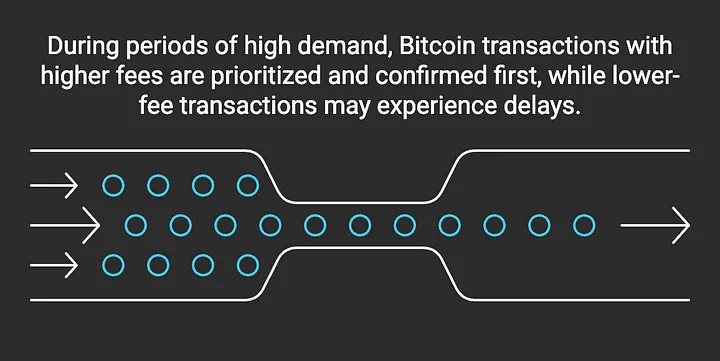
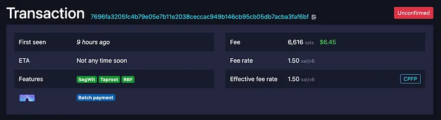
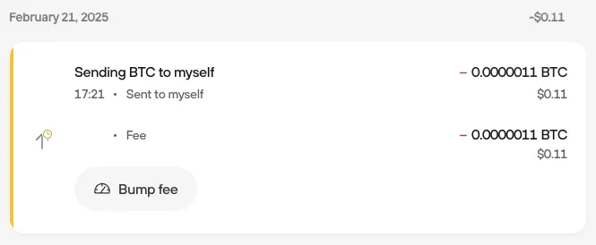
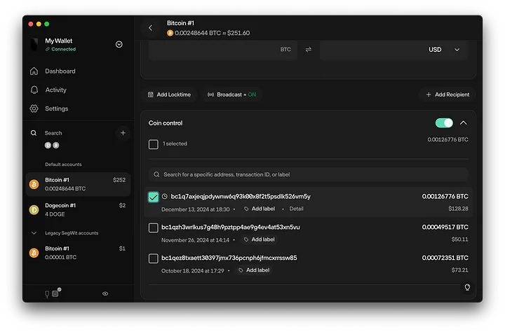
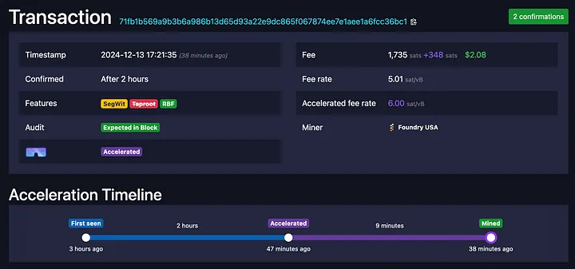
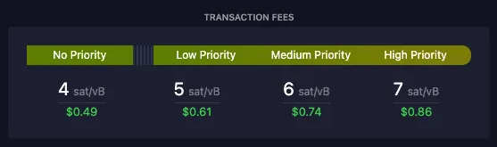
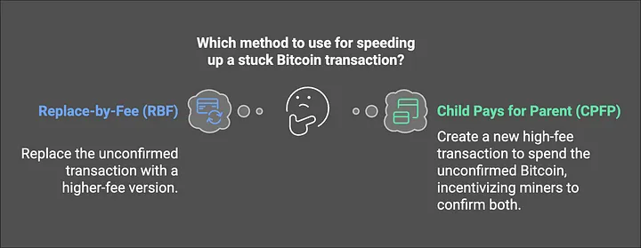

> *作者：Lucien Bourdon*
> 
> *来源：<https://blog.trezor.io/how-to-fix-a-stuck-bitcoin-transaction-solutions-and-tips-rbf-cpfp-explained-4be1800e987c>*

你发送了一笔比特币，期待它会在几分钟之内进入区块，但现实正好相反，在你的钱包中它一直显示为 “**unconfirmed**（未确认）” 状态。无论你是在给交易所账户存钱、给某人支付，还是要把比特币转移到自主保管的钱包，等待太久都可能让你觉得挫败 —— 尤其是在时间真的很紧张的时候。

交易不会无缘无故卡住。在你发送之后，交易就进入了公开网络，矿工会从这些公开交易中选出一些予以确认。如果你的交易给出的手续费太低（相比于当前网络中的主流水平），你的交易就可能迟迟得不到确认，而其它带有**更高手续费**的交易会被矿工优先考虑。

那么，这时候，你可以做什么呢？无论你是交易的**发送者还是接收者**，都有办法给交易加速。

## 1. 比特币交易手续费：矿工如何确定优先级

发送到公开网络中的比特币交易要竞争获得区块链上的空间。因为区块空间是有限的，矿工就会根据手续费来确定交易的优先级（因为他们能够获得交易的手续费作为收入）。手续费率（以 聪/虚拟字节 `sat/vB` 来衡量）越高，矿工就越有可能先确认它。

- 在确认需求高涨的时候，更高费率的比特币交易会被优先对待、更早确认，而低费率的交易会遭遇延迟。 -

**什么因素会影响所需的手续费？**

1. **网络拥塞** —— 在比特币网络较为繁忙的时候，你就要支付更多手续费，因为更多人在竞争让自己的交易得到确认。
2. **交易的体积** —— 手续费率的分母是交易的 *数据体积*，不是要发送的比特币的数额。因为带有更多输入和输出的交易需要更多计算机资源来处理。

## 2. 如何检查你的交易是否被卡住了

如果你的交易尚未被确认，你可以在 Trezor Suite 软件或 [**mempool.space**](https://mempool.space/)（一个区块浏览器网站）中查看它的状态。

在 **Trezor Suite** 中打开你的账户、回顾你的**交易历史**。如果你的交易一直是未确认状态，距离你发出它已经超过了一个小时，那么就有可能是卡住了。要了解情况，从 Trezor Suite 中**复制交易 ID（TXID）**，然后打开 [**mempool.space**](https://mempool.space/) 网站。

在首页上，你将能看到实时的**手续费率估计**，显示网络现在有多繁忙。如果你将你的 TXID 粘贴到**页面内的搜索框**，你将了解关于你的交易的更多细节，包括它是否还在排队、预估还需要多长时间才能得到确认。

如果看起来你的手续费太低了，别担心，下文就介绍你可以用来给交易加速的办法。

- 如果你的交易状态显示 “**Unconfirmed**”，而且 “**ETA**（预估确认时间）” 显示 “Not any time soon（看不到迹象）”，那就说明你的手续费太低了。
 -

## 3. 如何挽救卡住的比特币交易

如果你的交易没有得到确认、而且等待时间超过了你的预期，你不是只能坐着干等 —— 有一些办法可以加速确认。正确的解决方案取决于你的钱包，以及你是交易的**发送者**还是**接收者**。

## 4. 你发送了比特币？使用 RBF 来提高手续费

如果你发送了一笔交易，并且等待确认等了很长时间，你可以将它**替换成一个更高费率的版本**。这种方法叫做 “**手续费替换**（RBF）”，让你的交易可以挤到队列前面去。

**在 Trezor Suite 中以 RBF 提高手续费**

1. **打开 Trezor Suite**，在你的交易历史中选中你要处理的交易。
2. **点击 “Bump Fee”** 以提高该交易的手续费。
3. **选择更高的手续费** —— “High（高）” 选项通常可以保证快速确认。
4. **在你的 Trezor 设备上签名新版本的交易**并将它广播出去。

（译者注：在其它支持 RBF 的钱包软件上也是类似的流程。）

完成上述步骤之后，原版的交易就被替换了，而且矿工更有可能会快速确认你的新版交易。

**提醒**：如果网络的手续费率持续上涨，你可以多次重复上述流程，直至交易确认（当然你要支付的手续费也会越来越高）。

想了解更多信息，请阅读 [Trezor 知识库中的 RBF 词条](https://trezor.io/learn/a/replace-by-fee-rbf-bitcoin)。

- 选择 “**Bump fee**” 以使用新的、更高费率的版本替代原版交易。 -

## 5. 收到了低费率的比特币交易？使用 CPFP 来加速

如果你收到了一笔**费率较低**的交易，它可能会卡住几个小时，甚至几天。发送者可能无法挽救它，但你可以 —— 通过花费该未确认的交易，并在新交易（花费交易）中使用更高费率的手续费。

这种方法叫做 “**子为父偿**（CPFP）”，它之所以有用，是因为矿工会**希望能够收到你的新交易（子交易）中的更高手续费**。但要想做到这一点，就必须先确认**原先那笔卡住的交易（父交易）**。

**如何使用在 Trezor Suite 中使用 CPFP**

1. **在 Trezor Suite 中使用 “Send（发送）” 功能**。
2. **选中尚未确认的比特币**（带有 🕒 标记）。
3. **选择一个交易目的地**：
   - **发送给你自己**，可以加速确认
   - **如果你有计划发送比特币**，也可以直接给他人支付，同样可以加速
4. **选择一个较高的手续费率**，使之对矿工有吸引力。
5. **签名并广播交易**。如果两笔交易的总手续费对矿工有吸引力，他们会同时确认两笔交易。

（译者注：在其它支持 CPFP 的钱包软件上也是类似的流程。）

**提醒**：这样的方法，仅在未确认的比特币可以花费时才有用。如果原先这笔未确认交易的体积很大，CPFP 可能就没有用了。

（译者注：如果未确认交易的体积很大，为之提高费率就需要追加大量手续费，这可能不经济。）

- 在 “**Coin Control**” 界面选择未确认的交易（带有 🕒 标记），以发起 CPFP -

## 6. 无法使用 RBF？在你的找零输出上使用 CPFP

如果你发送了一笔比特币交易，但**无法使用 PBF**，那么你依然可以使用 CPFP 来加速 —— 尽管这时候你是**发送者**。

**Trezor Suite 软件默认为交易启用 RBF 特性**，所以如果你发送的交易被卡住了，一般来说总是可以使用 RBF 来加速。但如，如果你使用的钱包软件并不支持 RBF，或者在你发送交易时还没启用 RBF，那么你依然可以通过花费交易的找零输出，来加速确认。这同样是 CPFP。

**在 Trezor Suite 中如何对找零输出使用 CPFP**

- 在你发送比特币的时候，你的钱包通常会给交易**创建一个找零输出**（将多于支付数额的资金返回给你）。
- 如果你的交易**卡住了**，那么这个**找零输出就是一个未确认的输出**，所以你可以在一笔新交易中**花费这个找零输出**；这时候你就可以选择**更高的手续费率**。
- 这同样给矿工提供了同时确认两笔交易的激励。

**提醒**：如果你使用的是 Trezor Suite，这种方法可能是不必要的，因为软件默认启用了 RBF。不过，这种办法可以帮助没有支持 RBF 的钱包。

（译者注：RBF 比 CPFP 方法更加经济，因为 CPFP 要额外发送一笔交易。）

## 7. Mempool Acceletator：在协议外支付，以加速确认

如果你无法使用 RBF 和 CPFP，依然有别的选择 —— **交易池加速器**，这种服务让你可以用比特币协议以外的方式给加速器的合作矿池支付，从而提高你的交易的确认优先级。当比特币协议内置的手续费调整工具（上述两者）无法派上用场时，这就有用了。

**Mempool Acceletator的工作原理**

在你使用交易池加速器的时候，你的交易会被当成具有**更高费率**的交易来处理，所以它更有可能在下个区块获得确认。比如说，一笔交易原本只有 10 聪/vB 的费率，但加速器让它可以被当成 20 聪/vB 费率的交易，具体取决于你的加速请求。

**为什么要使用 Mempool Acceletator？**

- **即使你不是发送者或接收者，也能使用它**。不像 RBF 和 CPFP，任何人都可以使用这种手段给交易加速。
- **钱包软件可能有局限性**。如果你的软件不支持 RBF 和 CPFP，那你依然可以用加速器来帮助你的交易。
- **流程简单**。输入你的交易 ID，支付额外的手续费，就能提高交易的 优先级。

因为这是一种第三方服务，请在**使用之前检查你要支付的费用以及使用条款**。想了解更多细节，请看这个 [Mempool Acceletator页面](https://mempool.space/accelerator)。

（译者注：尽可能使用上述两种方法而不是这种第三方服务，因为它会给挖矿行业带来一些不利于去中心化的激励。）

- 之前卡住的交易，通过 Mempool Accelerator 获得了确认。页面上显示了加速流程和时间。 -

## 8. 如何避免发送卡住的交易

关于网络当前的状态、设定合适的手续费，可以在一定程度上避免遭遇延迟。

- **使用 Trezor Suite 的建议费率** —— 它会基于网络的状况自动更新。
- **在发送交易之前查看 [mempool.space](https://mempool.space/) 以了解实时费率**、确保使用最优的费率
- **如果有所怀疑，就支付更高的手续费率** —— 少量的额外手续费可以帮助你的交易更快获得确认，尤其是在确认需求高涨的时候。

- 查看 mempool.space 上的手续费率 -

## 9. 何时应该使用 RBF 或 CPFP

如果你的交易迟迟得不到确认，最好的解决方案取决于你在交易中的角色（你**是发送者还是接收者**），以及**已经发出的交易是否启用了 RBF 特性**。

- **如果你是发送者**，而且你的钱包支持，**请使用 RBF** 。RBF 让你可以**用更高费率的版本替代未确认的交易**，从而对矿工变得有吸引力。**Trezor Suite 默认启用 RBF**，所以你直接直接用它来加速交易确认。
- **如果你是接收者**，而且发送者使用了低费率，**请使用 CPFP** 。CPFP 通过**在新交易中花费未确认的比特币、并携带更高的手续费**，来吸引矿工同时确认两笔连贯的交易。
- **如果 RBF 无法使用**，而你的交易有找零输出，**你也可以使用 CPFP** 。在这个时候，你可以在**新交易中花费找零输出**，并携带更高的手续费。

## 10. 使用 Mempool Accelerator

（略）

## 11. 结语

卡住的比特币交易可能让你挫败，但最终它会确认的，而且你可以用正确的办法来加速。无论你**是发送者还是接收者**，都有选择 —— **提高手续费、发送零一笔交易，或使用一种第三方服务**。

避免延迟最好的办法是在发送交易之前了解网络的状况，从而为交易**设置合适的手续费**。理解了手续费的工作原理，并且知道了在交易卡住时该怎么做，可以在未来节约你的时间，缓解你的压力。

如果你的交易久久不能确认，别担心 —— 比特币网络是设计成可以可靠处理交易的，**而且总是有办法加快进度的**。

## 12. 常见问题

**什么是 “聪” ？**

“聪” 是比特币的最小单位。

- **1 聪 = 0.00 000 001（亿分之一） BTC**
- 比特币的交易费率以 **聪/vB** 来度量 —— 这个值越高，这笔交易被快速确认的概率就越高。

- - -

**“聪/vB” 意味着什么？**

- 字面上看，**聪/vB** 的意思是 “**为每一虚拟字节支付的聪的数量**”，用来衡量你的交易的手续费率。
- 所以，费率的高低取决于**交易的体积**，而不是你所发送的比特币的数额。
- 一笔交易的手续费率越高，矿工就越会优先确认这笔交易。

- - -

**比特币交易一般要多长时间来确认？**

通常需要 **10 到 60 分钟**，但具体取决于**你的交易的费率和网络的拥堵程度**。高手续费的交易会更快得到确认，而低手续费的可能需要等待**几个小时甚至几天**（如果网络非常拥堵）。如有需要，你可以使用 **RBF 或 CPFP** 来追加手续费。

- - -

**等了多久就该采取行动？**

如果你已经等了**几个小时**，而网络上的费率还是很高，你就要考虑追加手续费了。

如果网络并不是那么繁忙，那么你可以等待 **12~24 小时**再采取行动。

- - -

**我能不能取消一笔比特币交易？**

不能，比特币交易一旦发送到了公开网络中，就**不能再取消**。

不过，如果你的交易启用了 **RBF**，就是 “**可以替换的**”，你可以用**更高费率的版本**来替换它，而在替换版本中，你可以将比特币发送到另一个地址。这实质上就是覆盖了原本那笔交易。

- - -

**什么是 “RBF”？**

“手续费替换（RBF）” 让你可以**用更高费率的版本来替换一笔未确认的交易**，从而加速确认。（译者注：之所以是 “替换”，是因为前后两笔交易至少要有一个相同的输入，也就是形成冲突。）

- **只有交易在发送的时候启用了 RBF 特性，才能使用这种方法。**
- **Trezor Suite 默认为交易启用 RBF 特性。**

- - -

**什么是 “CPFP”？**

“子为父偿（CPFP）” 就是**用更高费率的交易来花费一笔尚未确认的交易**、吸引矿工同时确认连贯的两笔交易。

- **如果你在接收比特币**，而交易的费率太低、你又希望加速，**那么可以使用 CPFP**。
- **如果你发出的比特币交易无法使用 RBF**，那么可以通过**找零输出**（如果有的话）来使用 CPFP。

- - -

**什么是 “mempool”，什么是 “mempool.space”？**

“mempool（交易池）” 是 “memory pool” 的缩写，是临时存储未确认的比特币的区域。每一个比特币节点（参与比特币网络的计算机）都有自己的交易池，而矿工（运行自己的节点）会从交易池中挑选要确认的交易 —— 更高费率的交易可以获得**更高的优先级**（因为矿工可以获得交易的手续费）。

**mempool.space** 则是一个**区块浏览器**网站，让你可以**实时了解比特币网络的情况**，包括最新的手续费预测，以及交易的状态。它是有用的工具，可以检查你的交易会不会很快得到确认。

其它著名的比特币区块浏览器包括：

- [**Trezor’s Block Explorer**](https://btc1.trezor.io/)
- [**Blockchain.com Explorer**](https://www.blockchain.com/en/)
- [**BTCScan**](https://btcscan.org/)

**提醒**：如果你想跟踪具体的一笔交易，请在 Trezor Suite 中找出它的 **TXID**，然后复制到上述网站内的搜索框中。

