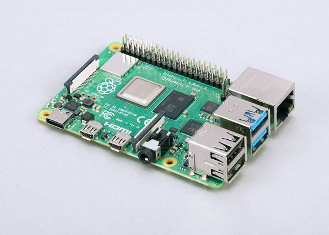
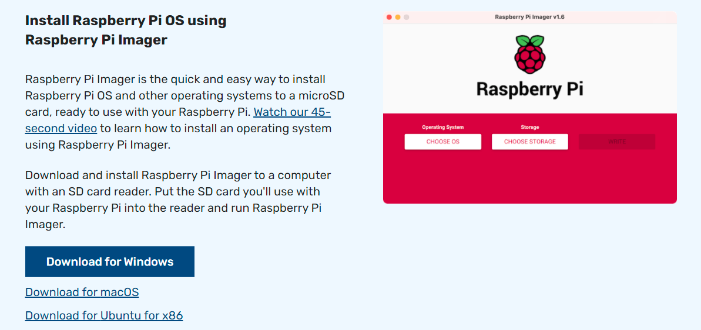
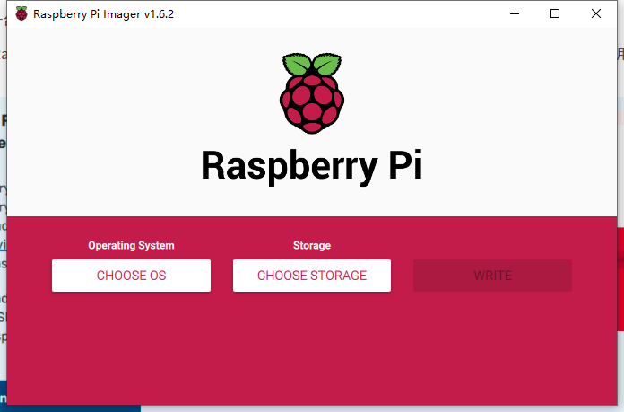
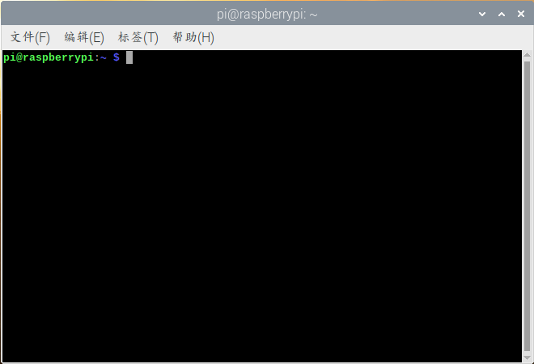
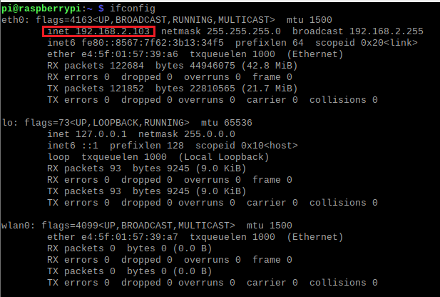
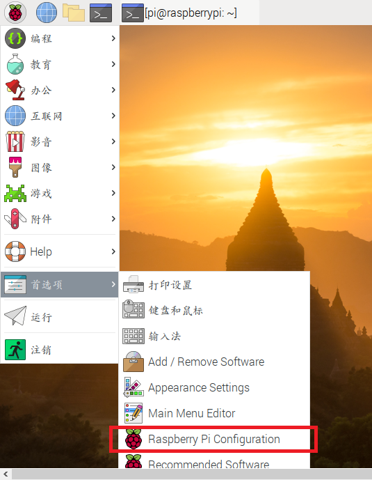
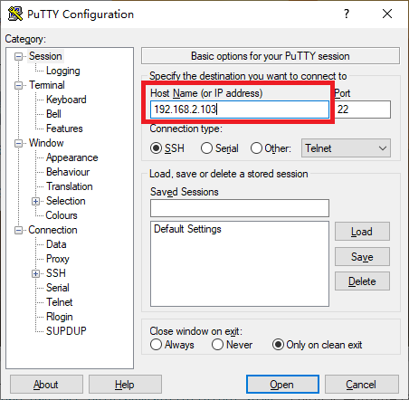

近日，笔者在一台树莓派小电脑上跑起了比特币全节点和闪电网络节点。由于笔者的计算机知识比较有限，这个过程可谓坎坷。也正因此，觉得自己的经历对大部分没有深入的计算机知识、但又希望以经济实惠的方法跑起节点的朋友来说，是有意义的。所以我准备把这个过程的一些经验总结出来分享给大家。

目前网络上能找到的教程，要么过于极客，包含了许多与主旨无关的指令；要么不完整，只在其中某个步骤上较为有效。有鉴于此，笔者准备给出一份全流程的教程，并在每一个环节上都提供笔者自己认为最有参考价值的文献。此外，还必须指出的是：

- 读者需自行解决科学上网的问题，如果无法解决，你在模仿本教程的过程中有可能卡住（集中在教程最后一部分，只是安装比特币软件应该不会卡住）。这是一个本教程无能为力的问题。文末也会附录如何在运行时使用代理的教程。
- 本教程以文字信息为主，仅在少量时候提供图片，以帮助读者确定自己的进度。
- 本教程的许多参考文献都是英文的（因此读者有英文阅读能力会有所帮助），但对于关键的信息，教程本身会给出足够的说明。
- 本教程的操作以命令行为主。许多人可能看到这一条就退出了，但这是没必要的。首先本教程为树莓派安装的系统也是有图形界面的，其次命令行也无非就是在一个窗口中输入一些英文，甚至你可以复制粘贴教程中的代码，你也无需做到理解自己输入的所有内容。按照本教程来做，出错的概率是很低的（毕竟笔者亲自执行过一遍）。而且，遇到了问题，靠自己去克服它，不正是学习的意义吗？

闲言少叙，直入正题。本教程将分为以下几个部分：（1）硬件选择；（2）系统准备；（3）安装及配置 Bitcoin Core 软件（比特币全节点）；（4）安装及配置 LND 软件（闪电网络节点）；（5）使用 Zap 远程连接闪电节点。（教程看起来很长，但实际上每个章节都只有关键的几个步骤）

## 硬件准备和操作系统选择



上图即是一台树莓派 Model 4B，实体也就巴掌大小，它是一块带有各种接口的电脑主板。选择它来跑节点，最重要的原因是便宜。树莓派本身最贵的不过 800 元，功耗更是只有 15 W；而其余的电脑主机，最便宜的也要上千元，功耗是 50 W 以上，所以树莓派是最经济的。

### **硬件方案**

- 主板：树莓派 4B 8GB 版
- 系统盘 micro SD 卡：闪迪 Class10 64GB
- 硬盘：东芝移动硬盘 1TB
- 显示器（可不选）
- 散热：被动散热合金外壳

### **方案解释**

> （这种底色的内容与主旨无关，只是补充解释，如果你不感兴趣，可以跳过）
>
> - **有关主板**。主板和操作系统的选择要一起考虑。树莓派 Model 4B 有 2GB 内存、4GB 内存、8GB 内存三种，价格（性能）由低到高。操作系统有 32 位和 64 位的区别，如果硬件允许，那么理论上 64 位的系统会有更高的性能；但如果你要安装 64 位的系统，必须具备 4GB 以上的内存。
>
>   树莓派目前支持主流的 Linux 操作系统，比如 Ubuntu；也支持 Windows 操作系统；当然，树莓派官方也推出了一个基于 Linux 的系统，叫做 “Raspberry OS”，这个操作系统只有 32 位的版本。
>
>   笔者最终选择的是 8GB 的树莓派，安装 Raspberry OS 32 位版。从实际运行的结果看，树莓派的内存利用率从来没到达过 50%，所以 4GB 的树莓派也是可以接受的（我甚至觉得 2GB 版也没问题）。
>
>   由于 Raspberry OS 与 Ubuntu 系统算是同源（都源自 Linux），所以教程中的大部分操作都是通用的；如果你希望安装 Ubuntu 或者 Raspberry OS，不必另外下载，下文的 “系统准备” 一节会指导你用 Raspberry Imager 软件自动完成下载和烧录系统盘。
>
>   此外，网购树莓派时，店家肯定会提供一些套餐。mini-HDMI 线和带开关的电源线是必选项，一定要有；其余则不必，但店家一般都会提供塑料外壳和风扇。散热方案下文有述。套餐里面往往也包含 micro SD 卡，但这个可以另外买，如果不希望浪费或者担心赠卡的质量，可以找到不包含 micro SD 卡的套餐。
>
> - **有关 micro SD 卡**。树莓派没有自带的存储空间，系统都是烧录到 micro SD 卡中，再插入树莓派的卡槽中。micro SD 的容量只要是 16GB 及以上都行。因为我们要预先在这张卡中写入操作系统，你还得有一个读卡器；网购时选择附赠读卡器的商家即可（读卡器有不同的类型，如果你现在用的电脑没有 SD 卡接口，请选择 USB 接口的读卡器）。
>
> - **有关硬盘**。除了使用 micro SD 卡作为系统盘，我们还需要一块硬盘来储存比特币整条区块链的数据（目前在 500 GB 左右，还会继续增长），硬盘容量必须 1 TB 起步。树莓派只有 USB 接口，没有 STAT 接口。所以无论你选择 3.5 寸硬盘（台式机硬盘）还是 2.5 寸硬盘（笔记本硬盘），都要配备一个 USB-STAT 线，或者一个硬盘盒。笔者在这里就偷懒选了移动硬盘（自带 USB 接口线；算下来其实价格差不多）。可以选择固态硬盘（SSD），性能会更好，但不是必需。
>
> - **有关屏幕**。如果你已经有带 HDMI 接口的显示器了，就不必另外买。但如果没有，那为了维护的方便，还是要配一个。这个屏幕不必追求性能（除非你还想用在别的地方），因为配置好树莓派之后需要用到屏幕的地方不多，而且，windows 系统的远程屏幕功能可以部分代替屏幕（但是开启这个功能还是需要用到屏幕，除非你现在用的不是 window 系统而是 linux 系统）。**显示器必须有 HDMI 接口，否则你要买 miniHDMI 到你的显示器接口的转接线**！
>
> - **有关散热**。在网购树莓派套餐时，一般会附赠一个塑料外壳和小风扇，由于保护主板和散热。小风扇的散热效果是不错的，但问题是制造噪音，而且可能有光污染。如果你也讨厌噪音，笔者推荐使用合金的外壳，完全被动散热，或附带风扇的合金外壳。
>
>   合金外壳的介绍见此 B 站视频：<https://www.bilibili.com/video/BV1JK4y1r7qf/> 。淘宝上有同款，非常便宜。也有在此基础上加风扇的。笔者用下来，CPU 温度是没有超过 50 度的。
>
>   小风扇的接法：小风扇需要使用树莓派外侧的针脚来供电。将树莓派的网线接口对准自己，右边（也就是最外侧）一排针脚，**从上到下数第二针、第三针**可以为小风扇供电。将风扇插头插上这两个针脚即可。插错了树莓派会无法启动。可网上搜索教程。
>
> 笔者方案的总成本：树莓派套餐 830 元；micro SD 卡 50 元；移动硬盘 280 元；散热外壳 20 元；合计 1180 元。树莓派还可选更低配置的。

## 系统准备

系统准备分为烧录系统盘、初始化 Raspberry OS 系统、挂载硬盘三个步骤。

### **烧录系统盘**

先将 micro SD 卡插入你现在使用的电脑。笔者使用的是 Windows 系统的笔记本电脑。

在此处下载 Rapsberry Pi Imager 软件：<https://www.raspberrypi.com/software/> 。（如果你无法访问，可以用软件名搜索并下载。）（记得为你的电脑选择对应的版本。）



下载后打开，页面如下所示：



左边的选项选择你要给树莓派安装的系统，中间的按钮选择你要烧录到哪里（它会自动识别你的 micro SD 卡），最右边的按钮是启动。

在选择操作系统时，可以选择置顶的 “Raspberry Pi OS (32-bit)”，也可以选择 “Raspberry Pi OS (other)” 或 “Other general purpose OS” 中的其它选项。笔者自己选择的是 “Raspberry Pi OS (other)” 中的 “**Raspberry Pi OS Full (32-bit)**”，它会预装一些软件。如果想跟本教程保持完全一致，可以选择这个系统。如果你想安装 64 位的系统，到 “Other general purpose OS” 中选择 Ubuntu (64-bit)。

然后是等待软件自动下载镜像并写入 micro SD 卡。成功后即可从电脑上拔下 micro SD 卡，插入到树莓派的插口中（位于树莓派的背面，是网线接口的反方向）。

### **初始化系统**

给树莓派连接屏幕、移动硬盘、鼠标键盘之后，插电启动树莓派。你会在显示器上看到如下的一个画面：


左上角的几个图标对我们是最重要的，分别是系统菜单（相当于 windows 里面的开始按钮）、网络浏览器、文件管理器、LX 终端（下文简称 “终端”）。**其中 LX 终端就是我们输入命令行的窗口，是我们最重要的工具**。终端的界面如下图所示：



初次进入系统时，系统会要求你给当前的账户（用户名为 “pi”）安排一个登录口令，可任意设置。**建议用纸笔把用户名和口令记下来，并用于记录其它关键口令**。

设置完成后，为树莓派接通网线，或点击右上角的图标，为树莓派设置 wifi。

值得一提的是，Raspberry OS 本身不带中文输入法，如果你希望安装中文输入法，请自己在网上搜索教程。

如果你不想用 Windows 电脑来远程控制树莓派（两台电脑连入同一个路由器，就可以远程控制）、你可以全程使用键盘和屏幕来控制树莓派，那你初始化系统的这一步，到这里就结束了。但**如果你希望用 windows 来远程控制树莓派（比如你只有一个显示器），那下面这部分关于远程控制的内容，你一定要看**。

> **远程控制方法**
>
> 远程控制的方法既有完全命令行的，也有具备图形界面的。但无论哪种方法，都有两个前提：（1）Windows 电脑和树莓派连入同一个路由器，有线无线皆可；（2）知道树莓派在这个内网中的 IP 地址。
>
> 既然如此，**我们先来学习如何获得树莓派的 IP 地址**（两种方法，任一皆可）：
>
> - 在树莓派中打开 LX 终端，输入命令 `ifconfig` （注意是 if 不是 ip）然后按回车键。它会将你的树莓派的网卡信息显示给你。如果你是有线连接，找 “eth0” 开头的信息；如果你是无线连接，找 “wlan0” 开头的信息；内网的 IP 地址一般是 `192.168.x.xxx`，以下图为例（笔者这个时候的 IP 就是 `192.168.2.103`：
>
>   
>
> - 确保你的 windows 电脑和树莓派处在同一个网络中（比如连接同一个 wifi），在 windows 电脑的网络浏览器中输入你的路由器地址并登录（路由器地址常常是 `192.168.1.1` 或 `192.168.0.1`，具体你可以在 “命令提示符（CMD）” 中输入 `ipconfig` （注意是 ip 不是 if），“默认网关” 的值一般就是你的路由器地址）。在路由器的后台中查找 “用户侧信息” 或者 “lan 口信息”，它会显示该路由器的所有用户及其内网 IP 地址，也包括你的树莓派的。树莓派的设备名很显眼，就是 “raspberrypi”。
>
> 拿到这个 IP 地址是远程控制的第一步。第二步是选择一种控制方法，第一种方法只能输入命令行，第二张办法可以用图形界面操作树莓派。
>
> - **SSH 方法**。此方法是命令行方法。需要两方面的操作，一是在树莓派上打开 SSH 服务；二是在 Windows 电脑上使用 Putty 软件使用 SSH 服务。
>
>   - 在树莓派的 “系统菜单” - “首选项” 中打开 “Raspberry Pi Configuration”，在 “Interfaces” 一栏中找到 SSH，勾选为 “enable”。
>
>     
>
>   - 在 Windows 电脑中下载 Putty 软件。下载页：<https://www.chiark.greenend.org.uk/~sgtatham/putty/latest.html> （如果无法访问请自行搜索下载）。安装 Putty 之后，在 Hostname 一栏输入树莓派的 IP 地址，即可用命令行控制树莓派。开始连接前它会要求你输入树莓派的用户名和登录口令。**输入口令时你输了多少个字都是看不见的，这是命令行的特色**。放心输入，不用担心。你可以认为，这种方式就是让你在 Windows 电脑上打开了一个树莓派上的终端，你在这个 SSH 窗口中输入命令与在树莓派的终端窗口中输入是一样的。
>
>     
>
> - **远程桌面方法**。此方法也需要两个步骤。一是在树莓派上安装 xndp 服务，二是在 windows 上运行 “远程桌面连接” 软件。教程见此处：<https://zhuanlan.zhihu.com/p/61405964> 。
>
>   - 你需要在命令行中输入三行命令，每一行输入后按回车结束，系统会在后台下载或安装一些东西，也会给你下载成功或失败的反馈。
>
>     ```bash
>     sudo apt-get install xrdp
>     sudo apt-get install vnc4server tightvncserver
>     sudo /etc/init.d/xrdp restart
>     ```
>
>   - 执行完这些命令后，在 Windows 电脑中搜索系统自带的 “远程桌面连接” 应用，打开后输入树莓派的 IP 地址即可连接。
>
> 两种远程控制方法都是有意义的，都推荐学习。

### **挂载硬盘**

**挂载硬盘是很关键的，绕不过去的一个步骤**！不论你的移动硬盘接入树莓派之后，树莓派能否读写它，都一定要执行挂载硬盘的步骤，否则你会发现，当要运行 bitcoin core 软件选择区块的存储位置时，将无法存储在你的硬盘上！

教程见此处：<https://zhuanlan.zhihu.com/p/137711099> 。

注意：（1）**如果你是移动硬盘，一定要先取消挂载，再手动挂载**！（2）如果你想保证移动硬盘在 Windows 下仍然可读，不要执行参考教程中的第三步（格式化硬盘）。移动硬盘一般是 NTFS 文件系统，在 Windows 系统下和 Linux 系统下都是可读可写的。（考虑到你可能希望复制自己的比特币区块链数据，建议不格式化；或者，如果你的硬盘不是 NTFS 文件系统的，那就格式化为 NTFS 系统。）

## 安装和配置 Bitcoin Core

完成了系统准备之后，我们就要开始安装 Bitcoin Core 软件来运行比特币节点了。分为三个部分：安装 Bitcoin Core、配置 Bitcoin Core 和快捷方式创建。

### **安装 Bitcoin Core**

关于安装的过程，只推荐这个来自 bitcoin.org 的教程：<https://bitcoin.org/en/full-node#linux-instructions> ，可惜只有英文。其命令行可以总结如下：

```bash
wget https://bitcoin.org/bin/bitcoin-core-0.21.1/bitcoin-0.21.1-arm-linux-gnueabihf.tar.gz
tar xzf bitcoin-0.21.1-arm-linux-gnueabihf.tar.gz
sudo install -m 0755 -o root -g root -t /usr/local/bin bitcoin-0.21.1/bin/*
```

在桌面打开一个终端窗口，逐行输入、逐行回车、等待执行（**每一步都必须执行，不能打折扣**）。

第一行命令的意思是，使用 wget 软件（一种下载工具），从后面这个地址中下载内容。下载到的内容是 bitcoin core 软件 0.21.1 版（最新版）的 arm 架构 Linux 系统版本（树莓派的 cpu 是 arm 架构，raspberry pi os 是 Linux 系统）的压缩包。它会自动存储在用户的默认存储空间，在我们这里就是 `/home/pi`（如果你的用户名不是 pi，它就会存在 `/home/<你的用户名>` 下面）。你可以用 “文件管理器” 看到。

第二行命令的意思是用 tar 软件去解压缩这个文件包，获得 bitcoin core 的软件代码。跟压缩包存储在同一个位置。

第三行的意思是把解压出来的 bitcoin core 代码安装到一个系统可以自动识别的位置 `/usr/local/bin`（是环境变量位置之一）。**第三步千万不能忘**！

**运行完了这三个命令，Bitcoin Core 的软件就已经安装成功啦**！是不是很方便！

如果你希望使用 Bitcoin Core 的图形界面，现在你只需打开一个终端，输入 `bitcoin-qt`，按下回车，就可以看到 Bitcoin Core 软件在前台执行。首次执行，它会询问你：比特币区块链数据存储在哪？是否在同步后修剪数据？有关前者，请安排在你的硬盘中（如果你发现无法将它存储在你的硬盘中，你肯定是跳步了，请回头看上文的 “挂载硬盘” 一节）；有关后者，请取消 “prun（修剪）” 的选项，这样它将下载和保存完整的比特币区块链。

初次同步区块链需要花一些时间，具体多久要看你的网络环境。可能需要两天到一周不等。

**如果你只是想运行 Bitcoin 节点，教程看到这一步就可以结束了**。但如果你想用命令行运行比特币节点、想运行闪电网络节点，后面的配置过程也是绕不过去的。

> 插一句话：
>
> 作为读者，你怎么知道我让你 wget 下载的正是比特币开发者们编写出来的软件呢？你怎么知道它没有被修改过？
>
> 你可能想到了，说这个网址不会骗人吧，它是 bitcoin.org 呀。
>
> 那你怎么知道 bitcoin.org 没有被劫持呢？
>
> 验证方法是有的，尽管并不完美。这部分技能与文章主旨无关，我把它放在文章末尾的附录中。（剧透一下，它也跟密码学有关）

### **配置比特币**

这部分我们将学习用命令行来定制化地运行 Bitcoin Core 软件。使用命令行在后台启动 Bitcoin Core 很简单，输入：

```bash
bitcoind
```

或者：

```bash
bitcoind -daemon
```

然后你就可以看到它开始运行了。打开另一个终端，输入：

```bash
bitcoin-cli -getinfo
```

可以看到 bitcoin core 运行的情形，比如同步了多少区块，有几个对等节点，等等（一般来说你需要等待一段时间才能看到结果，因为软件要在后台处理）。`bitcoind --help` 和 `bitcoin-cli --help` 会告诉你可以用命令行做的其它操作，包括生成新的钱包，发送交易，等等。这些命令的描述都是英文的，感兴趣的话你可以看看，但跟我们主要目的不大相关。相反，`bitcoin-cli -getinfo` 这个命令是一定要记住的。

> 一个无用的小知识：bitcoind 的后缀 “d” 表示 “daemon”，后台程序；bitcoin-cli 的 “cli” 表示它是一个命令行工具，可以控制 bitcoind。

用这种方式运行软件，你肯定会觉得很奇怪：它都不问我要把数据存在哪里，那它怎么知道要存在哪里呢？而且我的 micro SD 卡肯定是不够大的，它难道会自动存到硬盘上去？

答案是，软件的运行有一个默认配置，如果你不手动用命令告诉它该做什么，它就按默认配置运行。比如，你的 micro SD 卡（系统盘）不够大，软件会自动选择修剪数据模式，这样最终存在你的 micro SD 卡里的数据只有 8 GB 左右，不是完整的比特币区块链，也没有交易的索引。

如果你在一开始输入：

```bash
bitcoind -datadir=<你的硬盘挂载点>
```

它就会把比特币区块链的数据存到你的硬盘上去，如果硬盘空间够大，它就会选择完整区块模式。

这些配置命令，可以用 `bitcoind -help` 看到。

但仔细想想又不对了。命令行一次只能输入一个命令，如果我想做多方面的配置，那一行一行输入，多麻烦呀，而且每次启动都要输入，不是人都要疯了吗。

这就要用到 “配置文件” 了：我们可以把需要额外执行的配置命令（比如存储在哪里）都写在一个文件中，让软件运行时就按照这个配置文件来运行，这就起到了定制化和便捷运行的效果。

打开你的文件管理器，它的默认位置是 `/home/pi`（或者 `/home/<你的用户名>`），在这里选择新建一个文件，命名为“xxx.conf”，XXX 可以是任意字符，比如是 “bitcoin”。对这个文件使用鼠标右键，可以用 text（文本模式）来编辑它，打开了就是像 Windows 的笔记本一样的界面。如果你想用命令行来偷懒，也可以直接打开一个终端，输入 `nano bitcoin.conf`，它会创建一个 bitcoin.conf 文件并自动进入编辑界面。在编辑界面输入以下内容：

```bash
# 以 “#” 号开头表示这是一个注释行。软件会自动跳过这些行，开发人员使用这种格式来说明代码的含义
# 在我们这里也是如此。笔者用注释来说明这些配置命令的含义。你们不必复制，当然复制了也没啥问题。

# 这是笔者自己使用的配置文件，可以当作一个模板。

# datadir 命令用来安排比特币区块数据的存储位置。
# 比如这里，我把它安排到了 /home/pi/Toshiba-storage （我的移动硬盘）的 Bitcoin-blockchain 文件夹。
# 你可以安排为 <你的硬盘挂载点>/XXX 文件夹
datadir=/home/pi/Toshiba-storage/Bitcoin-blockchain

# 表示开启服务器，必须开启
servr=1

# 表示使用 bitcoin core 的钱包功能，可不复制
disablewallet=0

# 设置连接对等节点时候的超时时间，可不复制
timeout=6000
 
# 表示将存储完整的比特币区块链数据，不使用修剪数据的功能。建议复制
prune=0

# 表示在本地生成交易的索引。尽管不是必须，但使用了这个功能会方便闪电网络节点，建议复制
txindex=1

# 设置交易池的内存用量。这里我设置为 1000 MB，也即 1 GB
# 如果你不添加这一行，节点默认的交易池内存用量是 300 MB
datacache=1000

# 下面这两行是为闪电网络节点准备的，如果你想搭配闪电网络节点，就必须复制
# 两行的内容都可以随意设置，在配置闪电网络时原样复制过去即可
rpcuser=<随意设置的用户名>
rpcpassword=<随意设置的口令>

# 下面这两行也是为闪电网络节点准备的，闪电网络节点将使用 ZeroMQ 来与 bitcoind 通信
# 127.0.0.1 后面的是端口号，可以任意设置
# 可能你得额外安装 ZeroMQ。打开一个终端，使用命令 `sudo apt-get install libzmq3-dev` 即可
zmqpubrawblock=tcp://127.0.0.1:27500
zmqpubrawtx=tcp://127.0.0.1:27501
```

编辑好之后保存。**如果你是使用 nano 命令来编辑的，窗口下方会有各种操作的快捷键**。比如 “^X 离开” 表示你按 “ctrl + x” 会退出程序，而 “ctrl + s” 是保存，“ctrl + o” 是另存为，等等。

保存好之后，你就有一个比特币配置文件啦！在用命令行启动 bitcoin core 时使用 `-conf=` 标签接上你安排的配置文件路径即可。例如，我的配置文件路径是 `/home/pi/bitcoin.conf`，则我这样填写运行命令：

```bash
bitcoind -conf=/home/pi/bitcoin.conf
```

在终端中输入这个命令后按回车，你会看到各种信息显示出来，表示 bitcoin core 软件开始按你在配置文件中的要求开始运行。

**当你为 bitcoind 使用这样的配置文件之后，也必须为 bitcoin-cli 安排一个相应的配置文件**。步骤如下：

- 用文件管理器打开 /home/pi/.bitcoin 路径，这是一个隐藏文件夹，你需要在文件管理器的地址栏里面手动输入。
- 在这个文件夹里新建一个 “bitcoin.conf” 文件，并将你在上文中形成的比特币配置文件的 `rpcuser` 和 `rpcpassword` 两行复制到这个文件中。（这个文件夹里的配置文件名必须是 “bitcoin.conf”，但 bitcoind 的配置文件名可以任意安排；重点是，**两个文件里面的 rpcuser 和 rpcpassword 两行内容必须完全一致**）
- （如果你只有 SSH 方法可用，也可以用命令 `nano /home/<你的用户名>/.bitcoin/bitcoin.conf` 来生成和写入信息）
- （背后的原理是，bitcoin-cli 会自动读取 .bitcoin 文件夹里的 bitcoin.conf 文件，而只有其中的 rpc 信息与 bitcoind 所用的 rpc 配置完全一致，bitcoin-cli 才能正常访问 bitcoind）

设置好之后，使用 `bitcoin-cli -getinfo` 来检查你配置对了没有。如果配置对了，这个命令将可以正常使用，否则你会看到消息，表示 bitcoind 拒绝 bitcoin-cli 的访问。

另外，当你要关闭后台运行的 bitcoin core 软件时，你需要用到命令：

```bash
bitcoin-cli stop
```

这在你需要关机或重启时用到。

### **设置快捷方式和开机启动**

使用 `-conf` 标签固然已经很简便了，但是，每次启动 bitcoind 都需要手动输入配置文件的路径，有没有更简单一点的办法呢？就像 windows 的快捷方式一样？有的，就是 alias。

alias 的介绍可见这个网站：<https://wangchujiang.com/linux-command/c/alias.html> 。

设置 alias 和开机启动的方式参考这篇：<https://wangchujiang.com/linux-command/c/alias.html> 。

**先来设置快捷方式**。打开终端输入下列命令：

```bash
sudo nano ~/.bashrc
```

打开编辑页面后，在最底部添加一行：

```bash
alias bitcoind='bitcoind -conf=<你的 bitcoind 配置文件的地址，比如 /home/pi/bitcoin.conf>'
```

它的意思是 “每当我运行 bitcoind 命令时，我都是在要求你运行 bitcoind -conf=xxx”。注意前后的引号，另外就是路径和文件名要写对。

保存退出后，在终端运行下列命令：

```bash
source ~/.bashrc
```

此后你在终端中运行 `bitcoind` 命令时，它都会自动使用你安排的配置文件。

**再来设置开机启动**。用终端运行下列命令：

```bash
crontab -e
```

在底部加入下列代码：

```bash
@reboot /usr/local/bin/bitcoind -conf=<你的 bitcoind 配置文件的地址，比如 /home/pi/bitcoin.conf>
```

保存后退出。使用 `bitcoin-cli stop` 关闭 bitcoind 之后，重启树莓派系统，再用 `bitcoin-cli -getinfo` 或者任务管理器（在 “系统菜单” 的 “附件” 中）查看 bitcoind 是否在运行。

## 安装和配置 LND

闪电网络目前已经有多种实现，而 LND 是最多用户的一种，可能是因为 LND 最早出现了配套的图形界面 Zap（也即是在下一章我们要学习使用的一种软件）。笔者最早接触到的闪电网络钱包也就是 Zap，所以在树莓派上安装时路径依赖地选择了 Zap。相比比特币，LND 的安装和配置要更加复杂，需要更加细心。

本章节同样分成三个步骤：安装 LND、配置 LND 和使用简介。设置 alias 的方法与比特币的相同，我们就简单带过。

### **安装 LND**

安装 LND 的教程只推荐 LND 代码库里的说明：<https://github.com/lightningnetwork/lnd/blob/master/docs/INSTALL.md#installing-a-binary-release> 。它不仅说明了几种安装 LND 的方法，还介绍了 LND 的配置命令。

在这里，我们选择用 binary 方法安装 LND，这样最简单，还不用安装 go 语言。根据文档里面的说明，可以总结为三条命令：

```bash
wget https://github.com/lightningnetwork/lnd/releases/download/v0.14.0-beta.rc2/lnd-linux-armv7-v0.14.0-beta.rc2.tar.gz
tar xzf lnd-linux-armv7-v0.14.0-beta.rc2.tar.gz
sudo mv /home/pi/lnd-linux-armv7-v0.14.0-beta.rc2/* /usr/bin/
```

第一行是下载压缩包；第二行是解压缩；第三行是把解压得到的文件移动到 /usr/bin/ 文件夹下。**第三步必须做，但笔者已经不确定第三行命令是不是有效了，如果无效，读者可以自行搜索在 Linux 系统中移动文件的方法**（就移到 `/usr/bin/`）。

好了，LND 装好了。

### **配置 LND**

依样画葫芦，打开文件管理器，在 `/home/<你的用户名>` 新建一个文件，命名为 “YYY.conf”（比如 “lnd.conf”），用文本编辑器来编辑它（或者使用命令行 `nano /home/<你的用户名>/lnd.conf`），输入下列内容：

```bash
# 这一行表示将 LND 的节点数据存在哪里
# 如果不手动设置，lnd 和 lncli 都会使用默认存储位置（/home/<你的用户名>/.lnd），实际上更为方便
# 若设置了，后面也会需要额外配置 lncli  的快捷方式
# 所以推荐不设置
datadir=/home/pi/Toshiba-storage/lnd-data

# 下面的三行定义你的闪电网络运行在哪个网络上
# 我们这里的设置表示运行在比特币的主网上，并使用 bitcoind 来作为节点的后台
bitcoin.active=true
bitcoin.mainnet=true
bitcoin.node=bitcoind

# 下面这四行定义 lnd 程序如何与 bitcoind 通信
# 必须与你一开始的 bitcoind 配置文件里面的相应内容完全一致
# 注意开头的前缀，是 bitcoind
bitcoind.rpcuser=<你在 bitcoind 配置文件里设置的 rpc 用户名>
bitcoind.rpcpass=<你在 bitcoind 配置文件里设置的 rpc 口令>
bitcoind.zmqpubrawblock=tcp://127.0.0.1:27500
bitcoind.zmqpubrawtx=tcp://127.0.0.1:27501

# 下面这两行表示使用 TLS 方法，从这个 IP 的端口接受 rpc 请求
# 暂且先加上，在下一个章节我们会说明它的用法
tlsextraip=0.0.0.0
rpclisten=0.0.0.0:10009

listen=0.0.0.0:9735  
listen=[::1]:9736
```

输入后保存。此后，我们就可以使用这个配置文件来运行 lnd 了，例如：

```bash
lnd -C <你的 lnd 配置文件的位置，比如笔者的 /home/pi/lnd.conf>
```

如果你在 lnd.conf 中设置了 datadir，即安排了 LND 节点的数据存储位置，在你使用 lncli 时，还需加入一个参数，例如：

```bash
lncli --macaroonpath <datadir 参数>/chain/bitcoin/mainnet/admin.macaroon
```

这是因为 lnd 使用 macaroon（直译为 “马卡龙”，一种饼干）文件来存储一些信息，lncli 要获得这些信息才可以访问 lnd。如果你不手动设置 lnd 的 datadir，它会默认存储在 `/home/<你的用户名>/.lnd` 文件夹中，而这个文件夹是 lnd 和 lncli 默认访问的。所以，**如果你没有设置 datadir，就不必加这个参数**。

我们先把这些命令设置为 alias，再介绍闪电网络节点的使用方法。

打开终端使用 `sudo nano ~/.bashrc` 命令，在文件最后面输入下面两行代码：

```bash
alias lnd='lnd -C <你的 lnd 配置文件的位置，比如笔者的 /home/pi/lnd.conf>'
alias lnlic='lncli --macaroonpath <datadir 参数>/chain/bitcoin/mainnet/admin.macaroon'
```

**如果你并未设置 datadir，第二行不必输入**。

保存后在终端运行 `source ~/.bashrc`。

此后，你就可以在命令行里直接运行 lnd 和 lncli 了，程序将读取你在配置文件中的设置。

###**LND 的使用**

初次运行 `lnd` 时，它会提醒你，需要使用 lncli 来创建一个钱包：

- 打开一个终端，输入 `licli create` 按下回车，终端窗口的信息会引导你生成一个闪电网络钱包
- 第一步是要求你设置一个 password（口令），**请用纸币把这个口令写下来，此后每次你启动 lnd 都需要用到**
- 第二步是向你出示一套 24 个单词的助记词，**请用纸币把助记词写下来，如果你忘了 password，会需要用它来恢复钱包**
- 第三步是询问你，是否要加上一个 passphase（密语），密语会跟助记词一起参与你的钱包私钥和地址的生成，可以在助记词之外提供额外的保护。**如果你设置了，请用纸币把密语写下来**（也可以不设置）

生成钱包之后，就可以正常使用 `lncli getinfo` 来查看 lnd 的运行状况了。同样地，在终端使用 `lncli stop` 的命令会关闭 lnd 的运行。

此后，每当你使用 `lnd` 时，它都会要求你（在另一个终端窗口）使用 `lncli unlock` 来解锁钱包。解锁钱包需要你手动输入你上面设置的 password；必须解锁了钱包，lnd 才会继续运行，实际搭起一个节点（这也是为什么我们不必为 lnd 设置开机启动，设了也还是需要手动用 lncli 解锁）。

有关使用 lnd 来开设通道、发送支付的方法，见：

- <https://stopanddecrypt.medium.com/a-complete-beginners-guide-to-installing-a-lightning-node-on-linux-2021-edition-ece227cfc35d#675f>
- <https://medium.com/coinmonks/the-lightning-network-part-2-running-a-bitcoin-lightning-node-on-raspberry-pi-616e009529f2>

这两个教程也包含了其他内容，是我找到的最有用的教程之一。

## 使用 Zap “远程” 连接你的闪电网络节点

**说实在的，笔者非常怀疑，在大部分读者的网络环境下，学习这个章节有什么意义**。在中国，公网 IP 是非常稀缺的，我们大部分人的家用宽带，使用的都是运营商的内网 IP，这意味着，虽然我们能上网，却不能指望家用宽带能让我们的电脑成为一个可以稳定运行、访问的服务端。

这也意味着，如果只使用家用宽带，不借助其他手段，本章节学习的最终成果就是，当你的手机和树莓派在同一个 wifi 下时，你的手机闪电网络钱包可以直接借助你的节点发起交易，也即自主托管。你仍然做不到可以随时随地使用自己的闪电网络钱包。

因此，本章节的性价比并不高，请读者自行判断是否要继续学习。

本章节分为三个步骤：安装 lndconnect、配置 lnd、手机连接。

### **安装 lndconnect**

lndconnect 是 Zap 开发人员为 lnd 节点开发的一个暴露节点信息的工具，借助它我们可以获得让 Zap 钱包连接我们节点的信息。**安装 lndconnect 是第一步，做不到这一步，后面的步骤就无从谈起了，而且安装过程强烈依赖于你有访问外国网站的手段**。

安装 lndconnect 同样分两步。

**第一步是安装 go 语言**。（这一步我们同样借鉴了上文参考的 stopanddecrypt 的文章。）

```bash
wget https://studygolang.com/dl/golang/go1.17.3.linux-armv6l.tar.gz
sudo tar -C /usr/local -xzf go1.17.3.linux-armv6l.tar.gz
echo "export PATH=$PATH:~/go/bin:/usr/local/go/bin" >> ~/.bashrc
```

第一步是获得压缩包，第二步是解压缩，第三步是把 go 语言的文件夹设为环境变量，这样才能在终端里面直接使用 go 命令。

**第二步是安装 lndconnect**。（**请保证你开启了 https 代理以及你的代理确实有用**。）（这一步我们参考了 <https://github.com/LN-Zap/lndconnect/issues/20#issuecomment-825211584> 。）

```bash
git clone https://github.com/LN-Zap/lndconnect.git
```

这一步会把 lndconnect 的代码库下载到你的默认存储位置，也就是 `/home/<你的用户名>`。

使用命令：

```bash
cd /home/<你的用户名>/lndconnect
go mod init github.com/lndconnect/v2
go mod edit -require github.com/lightningnetwork/lnd@v0.14.0-beta.rc2
go build
```

从笔者的个人经验来看，第二行和第三行的作用是不明确的，但我们姑且这么输入。**go build 这一步一定会报错，但我们要的就是它报错**！

执行 go build，它会打印出一些信息，告诉你缺少了哪些依赖，**关键字是 “to add”**。对于这些信息，我们不用管，直接看最后一行，最后一行往往是 `go mod download ...` 或者 `go get ...` 开头的命令，我们直接复制下来执行。

每次它执行完下载，我们就重新运行一次 go build，直到它成功为止！（如果笔者没记错，最后一个命令是 `go get lndconnect`）

build 成功之后，我们再运行：

```bash
sudo cp lndconnect /usr/local/bin/lndconnect
```

它会把 lndconncet 整个文件夹搬到第二个地址上去。然后我们就可以直接在终端中使用 lndconnect 了。

### **配置 LND**

这一步的参考是：<https://docs.zaphq.io/docs-desktop-lnd-configure> 。

原理大意：Zap 钱包软件会使用 gRPC 方法与 lnd 通信，但是通信的端口要提前在配置文件里定义好，否则 lnd 会拒绝连接。

因为随时随地访问的目标暂时不可能实现了，**我们这里的配置的目标是，让我们手机上的 Zap 钱包可以连接、使用我们的 lnd 节点**。

- 首先，在终端使用 `lncli stop` 命令关闭 lnd。

- 在终端使用 `ifconfig` 命令获得树莓派的内网 ip 地址（不懂怎么做的可以看本文 “系统准备” 的 “初始化系统” 一节）

- 编辑 lnd 的配置文件（例如，在笔者这里，就是 `nano /home/pi/lnd.conf`），在其中加入：

  ```bash
  tlsextraip=<你的树莓派内网地址，比如 192.168.1.5>
  rpclisten=<你的树莓派内网地址，比如 192.168.1.5>:<端口号，比如 5356，等等，不要跟其它软件的端口号重合>
  
  # 例子：
  # tlsextraip=192.168.1.5
  # rpclisten=192.168.1.5:3399
  # 如果你设置错了，比如本地的 ip 写错了，lnd 会无法启动；端口号被占用也是如此，你改成一个可用的即可
  ```

- 保存退出后，访问 `/home/<你的用户名>/.lnd` 文件夹，把里面的 tls.cert 和 tls.key 两个文件删掉（命令行操作为 `rm /home/<你的用户名>/.lnd/tls.cert /home/<你的用户名>/.lnd/tls.key`）

- （据我所知，上面这一步是为了重新生成这两个文件，但我们这种方法几乎不会用到这两个文件，所以我不确定这一步是不是非做不可，但是，让 lnd 与本地的 Zap 软件搭配使用的场景应该是会用到的，这里我们把它当成一个好习惯，学习一下。）

- 在终端用 `lnd` 命令重新启动 lnd 节点，看配置是否可行。不可行侧则重新配置一遍。

### **使用 Zap 连接你的闪电网络节点**

关键事实：（1）Zap 钱包没有 arm 架构的版本，所以我们没法在树莓派上直接使用 Zap 钱包，有就不用做上面这些事了；（2）**不要尝试在 Windows 上使用桌面版 Zap 钱包连接你的闪电节点，桌面版的软件有逻辑问题，会陷入死循环，不可能真正用得上**！

开搞！

- 在手机上下载 Zap 钱包：<https://www.zaphq.io/download>

- 确保手机和树莓派处在同一个 wifi 下

- 使用 `lncli unlock` 命令先解锁闪电钱包

- 使用以下命令：

  ```bash
  lndconnect --configfile=<你的 lnd 配置文件的路径> -i -o
  ```

  `-i` 表示使路由器下的 ip 地址；`-o` 会在你的默认存储位置（/home/<你的用户名>）生成一个二维码图片

- 如果你没有图形界面，可以不使用 `-o` 标签，它会把二维码直接打印在终端窗口中；又或者，你可以使用 `-j` 标签，它会在终端窗口打印出 url 信息（你要有方法把这段 url 信息发送到手机上才能用）

- 在手机上使用 Zap 钱包，打开扫描功能，扫描你在上一步生成的二维码。现在你可以用手机来操作自己放在 lnd 节点里的钱包啦！（即两者是完全同步的）

（完）

## 附录

### A. 在终端中使用代理

- 出于我们的目的，在终端中使用代理的方法，看这个就够了：<https://zhuanlan.zhihu.com/p/46973701> 。（我们比较需要打开 https 代理）
- 这里的前提是你有一个科学上网的工具，然后你可以在 Windows 上用某个软件的 “允许其它设备连入” 功能，把 Windows 电脑的代理开放给同一路由器下的其它设备使用，比如在终端中使用 `export https_proxy='https://<你的 windows 电脑的 ip 地址>:<你的代理软件打开的端口，比如 1080>'`

### **B. 验证自己下载的软件**

简而言之，我们是用密码学方法来减少下载软件时需要信任的人和主体。

以比特币软件为例，比特币每次发布新版本时，都会提供代码的哈希值，以及比特币开发者对这些哈希值的签名。

哈希值我们知道，是哈希函数的输出。密码学哈希函数是抗原像攻击的和抗碰撞的：无法从哈希值反推出原像，而且原像只要改动了，哈希值几乎一定会变。那么好了，只要我们拿到了代码的哈希值，在本地验证代码的哈希值与之是否一致，就可以看出代码是否被改过（这就是校验数据的完整性）。

在比特币软件的发行页，它同时也发布了软件的哈希值：<https://bitcoin.org/bin/bitcoin-core-0.21.1/>，就是列表中的 .asc 文件。

你肯定又会说了，这没彻底解决问题呀，要是有个人把 bitcoin.org 黑了，发布一个篡改后的代码，他直接把 .asc 里面记载的哈希值都改过来，你们不就验证不出来了吗？

好问题。这问题大家也都想到了。所以我们使用密码学里面的数字签名方案：开发者先把自己的公钥公布出来，此后每次发布软件，都附上一个自己的私钥对哈希值的签名。只要有公钥，签名，就能验证一个哈希值是不是对应于这个签名的。即，签名绑定哈希值，哈希值绑定代码。

.asc 文件也附带了开发者的签名。

最后一个问题，我要在哪里获得开发者的公钥呢？（如果这个步骤不安全，我拿了个假公钥，不也验证不出来吗？）

也是一个好问题。笔者自己验证比特币软件用的公钥也是从 bitcoin.org 获得的，它的 run a full node 页面披露了开发者 W. J. van der Laan 的 PGP 指纹；在开发者个人的 GitHub 主页上也可以找到一个指纹（这个指纹已经过期）。

我们先用终端来验证一遍，再说点题外话：

先获得 bitcoin-core-0.21.1 软件各版本的哈希值、开发者签名，以及 Wladmimir J. van der Laan 的公钥：

```bash
wget https://bitcoin.org/bin/bitcoin-core-0.21.1/SHA256SUMS.asc
wget https://bitcoin.org/laanwj-releases.asc
```

再来校验我们下载的软件的哈希值，以及开发者的签名：

```
sha256sum bitcoin-0.21.1-arm-linux-gnueabihf.tar.gz
gpg --import laanwj-releases.asc
gpg --verify SHA256SUMS.asc
```

第一步是获得软件压缩包的哈希值。你可以把得到的哈希值，与 SHA256SUMS.asc 中提供的哈希值相比对。

第二部是加载开发者的公钥。第三步是验证签名。你应该会看到这样的信息：

```bash
gpg: 签名建立于 2021年05月02日 星期日 03时33分58秒 CST
gpg:               使用 RSA 密钥 90C8019E36C2E964
gpg: 完好的签名，来自于 “Wladimir J. van der Laan (Bitcoin Core binary release signing key) <laanwj@gmail.com>” [未知]
gpg: 警告：此密钥未被受信任签名认证！
gpg:       没有证据表明此签名属于其声称的所有者。
主密钥指纹： 01EA 5486 DE18 A882 D4C2  6845 90C8 019E 36C2 E964
```

这个主密钥指纹，也会跟 <https://bitcoin.org/en/full-node#linux-instructions> 上提供的一致。

直到这一步为止，我们仍然做不到无需信任。我们还是信任了 bitcoin.org。完全免信任是非常困难的。

gpg 的消息里有一句话，很有意思：“没有证据表明此签名属于其声称的所有者”。意思是说，没有机构验证过只有这个人能控制这笔私钥，签出这样的签名。

确实没有。

但聪明如你，肯定也想到了，如果我们安排一个受信任的第三方来做这件事，那接下来我们就会变成信任这个第三方。这也只是转移了信任需要，而没有消除信任需要。

实际上，我们每天浏览的网站，就是有这样的机构来为网站使用的公钥提供证书的，就是所谓的 KPI（公钥基础设施）。这样好不好呢？

推荐阅读：[受信任第三方与安全漏洞](https://www.btcstudy.org/2021/09/10/trusted-third-parties/)

想得越深，你将越理解比特币区块链结构的可贵，以及比特币总是选择软分叉（后向兼容升级方法）的可贵：它是在尽可能免除这个系统需要的信任。
