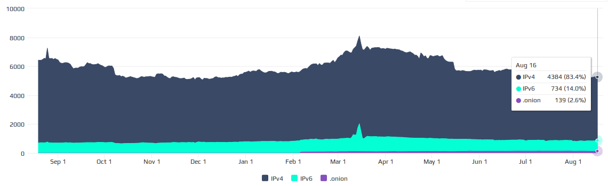
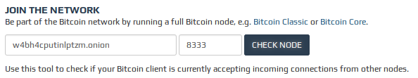

> *作者：Jameson Lopp*
> 
> *来源：<https://blog.lopp.net/how-to-run-bitcoin-as-a-tor-hidden-service-on-ubuntu/>*


为什么你应该在节点上运行比特币隐藏服务（Bitcoin hidden service）？

- 这会提升其他通过 Tor 网络来匿名化行动的比特币用户的隐私性。具体来说，这是对许多 “网络监控者” 攻击的对抗措施（这些攻击可在 Open Bitcoin Privacy 项目的[威胁模型](https://github.com/OpenBitcoinPrivacyProject/wallet-ratings/blob/master/report-02/threat model.wiki)页面了解）。
- 这使你自己的节点对 Sybil 攻击和网络分隔更加健壮。
- 运行它不需要更多的计算资源，只需要一次性的配置成本。



<p style="text-align:center">- 只有 2.6% 的可触达节点正在运行 Tor 隐藏服务。数据来自 https://bitnodes.21.co -</p>


[这里有一份文档](https://github.com/bitcoin/bitcoin/blob/master/doc/tor.md)，已经列出了你可以将比特币节点配置成使用 Tor 网络的几种方法；出于本指南的目的，我们专注于第三个选项：“自动监听 Tor 网络”。

从 Bitcoin Core 0.12 开始，节点会自动运行隐藏服务，只要它能连接到一个本地的 Tor 后台。但是，我们需要确保一些东西正确配置了，这样节点和 Tor 后台才能相互交谈。

首先，我们需要[使这些指令](https://www.torproject.org/docs/debian.html.en)来安装 Tor。我们需要知道所用的 Ubuntu 版本的代码：

```bash
username@host:~$ lsb_release -c
Codename: xenial
```

现在，我们课程安装 Tor 了；把下列命令中的 “\<codename>” 换成你的版本。

```sh
username@host:~$ sudo vim /etc/apt/sources.list
```

为这个文件写入这两行文字，并保存下来：

deb http://deb.torproject.org/torproject.org <codename> main
deb-src http://deb.torproject.org/torproject.org <codename> main

```sh
username@host:~$ gpg --keyserver keys.gnupg.net --recv 886DDD89
username@host:~$ gpg --export A3C4F0F979CAA22CDBA8F512EE8CBC9E886DDD89 | sudo apt-key add -
username@host:~$ sudo apt-get update
username@host:~$ sudo apt-get install tor deb.torproject.org-keyring
```

现在，Tor 安装好了，可以运行了，检查配置文件：

```sh
username@host:~$ sudo vim /usr/share/tor/tor-service-defaults-torrc
```

确保配置文件里有下面几行（不管放在哪个位置都行）：

```
ControlPort 9051
CookieAuthentication 1
CookieAuthFileGroupReadable 1
```

要是哪一行没有，先写入、保存配置文件，然后通过下列命令重启 Tor 后台：

```sh
username@host:~$ sudo /etc/init.d/tor restart
```

现在，我们需要确保运行 bitcoind 进程的 linux 用户拥有阅读 Tor 身份验证 cookie 的权限。你可以使用下面这个命令，安排 Tor 用户的名字：

```sh
username@host:~$ grep User /usr/share/tor/tor-service-defaults-torrc
User debian-tor
```

现在，修改运行 bitcoind 进程的用户，使之成为 Tor 群组的一员：

```sh
username@host:~$ sudo usermod -a -G debian-tor <username>
```

这时候（为了安全），你应该开启一个新的 命令行窗口/SSH 线程，确保 bitcoind 用户拥有正确的权限。在新的窗口中，你可以通过下列命令来检查许可：

```sh
username@host:~$ id <username>
uid=1000(username) gid=100(users) groups=100(users),121(debian-tor)
```

如果你的用户在 tor 群组里面，现在你就可以启动 bitcoind 了。要是它正在运行，请先关闭它，再启动。

```
username@host:~$ bitcoin-cli stop
username@host:~$ bitcoind -daemon -debug=tor
```

现在，检查 bitcoin 的日常，确保配置文件生效了：

```sh
username@host:~$ tail -f ~/.bitcoin/debug.log | grep tor
```

你应该会看到这样的输出：

```
2016–08–18 20:36:10 torcontrol thread start
2016–08–18 20:36:10 tor: Successfully connected!
2016–08–18 20:36:10 tor: Connected to Tor version 0.2.8.6
2016–08–18 20:36:10 tor: Supported authentication method: COOKIE
2016–08–18 20:36:10 tor: Supported authentication method: SAFECOOKIE
2016–08–18 20:36:10 tor: Using SAFECOOKIE authentication, reading cookie authentication from /var/run/tor/control.authcookie
2016–08–18 20:36:10 tor: SAFECOOKIE authentication challenge successful
2016–08–18 20:36:10 tor: AUTHCHALLENGE ServerHash af7da689d08a67d5b4e789a98c76a6eacbabaa32baefc223ab0d7b1f46c3d
2016–08–18 20:36:10 tor: Authentication successful
2016–08–18 20:36:10 tor: ADD_ONION successful
2016–08–18 20:36:10 tor: Got service ID w4bh4cputinlptzm, advertising service w4bh4cputinlptzm.onion:8333
2016–08–18 20:36:10 tor: Cached service private key to /home/username/.bitcoin/onion_private_key
2016–08–18 20:36:10 AddLocal(w4bh4cputinlptzm.onion:8333,4)
```

如果你看到这个错误：

```
2016-08-18 19:51:48 tor: Add onion failed with unrecognized command (You probably need to upgrade Tor)
```

那说明你没有正确配置 Tor 的代码库（译者注：安装的来源出了问题），而且意外地从 Ubuntu 的过时仓库中安然了 Tor。你需要使用 “sudo apt-get remove tor”，然后在重新安装前重新配置代码库。

如果你看到这个错误：

```
2016–08–18 20:01:28 tor: Error connecting to Tor control socket
2016–08–18 20:01:28 tor: Not connected to Tor control port 127.0.0.1:9051, trying to reconnect
```

那说明你没有把运行 bitcoind 的 linux 用户添加到 tor 群组里面。同样地，请先注销登录，然后重新登录，确保你当前的 shell 窗口拥有正确的群组权限！

如果看起来一切顺利，请访问 https://bitnodes.io/，使用 “check node” 工具，确保你的节点可以接受连接。



如果 bitnodes 可以连接，你可以单击显示你的节点状态的绿色连接、滚动到页面底部、输入你的邮件地址，这样当 bitnodes 无法连接你的节点的隐藏服务时，你就会收到提醒。

感谢你运行比特币隐藏服务！

（完）