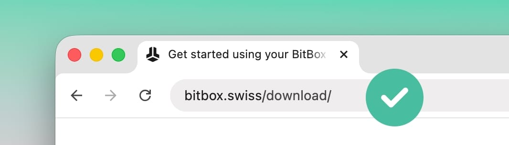

> *作者：Sebastian*
>
> *来源：<https://blog.bitbox.swiss/en/how-to-steal-someone-elses-bitcoin/>*
>
> *编者注：原标题可直译为 “如何盗取某人的比特币”，依据摘要改为当前形态。*

作为硬件签名器的制造商，本文的标题似乎有些反直觉。当然，我们的目的并不是要去盗取比特币，而是要让人们配备工具、让他们的比特币自主保管尽可能简单、尽可能安全。但是，想想看攻击者如何偷盗比特币，会是非常有用的练习。

采用攻击者的思维，可以帮助你发觉自己的防御措施的薄弱之处、提高对你所面临的潜在风险的整体觉察。为此，我们要了解一些常见的盗窃手段 —— 然后看看你如何保护自己。

## 诱骗下载假 app

假的钱包软件可以诱骗你以为自己正在使用一个来自可靠来源、经过认证的软件，办法就是模仿那些正派软件的动作和用户界面。熟悉感可以很快让人放松警惕，所以这是一种非常强大的攻击方法。

这样的恶意软件可能有几种路径进入你的设备，比如，（攻击者）操纵搜索引擎的结果（吸引你进入给你提供恶意软件的网站）、给你发送恶意链接，或者是将恶意软件的安装程序植入另一个似乎毫无关联的软件的安装程序中（在后者启动时偷偷安装）。

- “为了更新你的钱包的安全性，请输入你的钱包复原词” -

所有攻击都有一些灵活性，假钱包软件攻击在计划和实施攻击的精巧程度上也可能有许多不同。在上面这张图所示的案例中，这种攻击是非常明显的，因为这个 app 在直接问你索要钱包的复原词（种子词），这应该立即就能警醒绝大部分用户，因为他们知道真正的 BitBoxApp（恶意软件尝试模仿的正派软件）绝对不会做这样的事。

> 编者注：敏锐的读者想必马上就能想到，如果有人能够让你安装上恶意软件，或者你无意中安装上了恶意软件，这个恶意软件为什么不能直接记录你生成或者导入它的种子词，转发给攻击者呢？
>
> 当然可以。实际上，恶意钱包软件能玩的花样还真不少。比如：
>
> - 在你用它生成种子词时，并不是随机生成，而是给出攻击者早已知晓的种子词。一旦你用该种子词生成了地址并存入了金钱，攻击者就可以把钱转走。
> - 如果你导入了种子词，恶意软件可以在后台直接把它发给攻击者。
>
> 作者之所以没有提到它们，是因为 TA 假设了用户使用了硬件签名器 —— 种子词从一开始就是用签名器生成并保存在签名器里面的，所以恶意软件才需要主动询问用户，而不是直接在后台悄悄转发。
>
> 这些案例可以提炼出一种极为重要的安全原则：由于单签名钱包的安全性完全取决于种子词（私钥）的机密性，因此，必须极为严肃地关注种子词生成和可能暴露的环节。
>
> - 不要使用他人提供给你的设备，尤其是知道你要用它来保管密码货币的人。应该自己向硬件制造商购买并在开封时执行基本的设备未篡改验证。
> - 也不要使用你没有执行过真实性验证的软件。
> - 更不要使用他人提供给你的种子词。

但是，虚假的 BitBoxApp —— 或者别的假冒软件 ——— 可以看起来跟其模仿对象一模一样，仅仅在后台发生微妙改变，从而操纵地址或是交易的数额。具体见下一节！

### 如何保护自己

为了避免安装假冒软件，请总是直接从软件开发者的正式网站下载软件。比如，对 BitBoxApp 来说，就是 [**bitbox.swiss/download**](https://bitbox.swiss/download) 。虽然也能通过 [Apple App Store](https://apps.apple.com/us/app/bitboxapp/id6670479223) 和 [Google Play Store](https://play.google.com/store/apps/details?id=ch.shiftcrypto.bitboxapp&hl=en) 来下载，我们推荐在你第一次安装时使用我们网站的链接。

检查你的浏览器地址栏里面的域名，也是一个有用的步骤，确保你一开始就进入了正确的网站。进入网站后把它加进你的浏览器收藏夹，可以防止你下次手动输入的时候输错。还有，在安装敏感软件的时候，避免使用搜索引擎，因为它们的算法可能会给你提供广告或者错误的结果，而不是你要找的东西的[正式网站](https://x.com/BitBoxSwiss/status/1725491137165590672)。

（编者注：避免下载到恶意软件的基本方法是多方查证，通过 搜索引擎、社交媒体网络、资讯网站、熟人朋友、GitHub 代码库搜索多个信息源来查找自己想要的软件。如果它们都指向同一个下载网站，那么这个下载网站就更有可能是真的，不是假冒软件。）

如果你有技术只是，你也可以验证我们为 app 的每一个版本发布的[电子签名](https://support.bitbox.swiss/en_US/verify-app-signature)，以验证你下载到的 BitBoxApp 的真实性；或者，你可以[验证校验和](https://support.bitbox.swiss/en_US/download-installation/how-do-i-verify-my-bitboxapp-download)。

无论你在下载软件时多么谨慎，请记住，不要完全信赖你的智能手机和电脑。在验证交易地址和交易细节的时候，你应该总是把硬件签名器和它的显示屏当成你最终和最重要的安全屏障。即使你在使用一个非常精巧的假冒 app ，硬件签名器的显示屏还是会向你揭晓真相。这就是硬件签名器的设计目的：保存私钥、使你无需信任你的主机设备（运行钱包软件、联网和构造交易的设备）。

想要了解更多，请看：《[为什么硬件签名器绝对需要自己的显示屏](https://blog.bitbox.swiss/en/heres-why-a-hardware-wallet-absolutely-needs-a-display/)》。

## 篡改比特币地址

最强大的攻击手段之一是直接篡改收款地址。这种攻击可能发生在任何人神圣，不论你使用的钱包配置本身（理论上）有多安全，因为跟收款地址有关的交互绝大部分都发生在硬件签名器的安全环境之外。

地址欺诈也有不同的形式。可能是攻击者假装成你的一个朋友，然后给你一个假的收款地址，也有可能是恶意软件在你构造交易的时候，悄悄替换掉收款地址 —— 你原本想发给某甲，实际上却因为地址替换而发给了攻击者，钱当然是再也找不回来了。

在近期发生的一个案例中，[流行的 “Node 软件包管理（NPM）” 自动化系统中出现的一次供应链攻击](https://jdstaerk.substack.com/p/we-just-found-malicious-code-in-the)，导致许多软件用到的上游软件包被恶意代码感染。对此类软件包的使用方式，使得恶意软件在很短的时间内就被安装了几十亿次。这个恶意软件的目标是尝试将看起来相似的钱包地址替换掉 —— 换成属于攻击者的 —— 来盗窃密码货币。幸运的是，这一攻击并没有得手，但它表明了地址替换风险迅速成真的可能性。BitBoxApp 和 BitBox02 固件不受此漏洞影响。

### 如何保护你自己

保护自己免受基础形式的地址替换攻击的方法很简单，但需要你的非常有耐心。归根结底，这种攻击意味着你不能信任你的主机设备来验证一个收款地址是否属于你的钱包、一笔交易是否使用了你希望使用的正确地址。

也就是说，你应该总是比较出现在硬件签名器屏幕上的地址，*与你希望发送到的地址*。比如说，当你要给交易所分享一个新的收款地址时，把签名器上显示的你的钱包的收款地址，跟你（从软件钱包）复制到浏览器输入框的地址，先比对一番。同样地，如果某人给你发送了一个地址（你要给 TA 支付），那么在构造交易、签名的时候，请检查一下 BitBox 屏幕上显示的地址，与你最初在收信渠道上看到的地址。

确保你比对了比特币地址中的绝大部分字符！“只需检查第一个和最后一个字符” 这样的建议很流行，但却是不够可靠的，因为有很多办法，可以让特定区域的字符看起来非常相似（例如，通过利用 “  [Levenshtein distance](https://en.wikipedia.org/wiki/Levenshtein_distance) ”）。事实上，这样巧妙的地址篡改方法，正是上述 NPM 软件包漏洞攻击的一部分。

### 安全发送

100% 确定你即将发送比特币的地址正确无误，是非常困难的。因为，地址的真实性不仅取决于你的主机设备，也跟你最初收到这个地址的收信渠道有关。为了进一步减少发送比特币到错误地址的风险，你可以额外用一个独立的通信渠道来验证这个地址（例如，使用另一台设备或者另一款通信软件）。

## 发送诈骗邮件

电子邮件钓鱼就跟互联网的历史一样悠久，比特币也不能例外。诈骗邮件和 “社会工程学攻击” 是一个非常广义的模糊用词，不幸的是，它依然是那么地准确。这是因为，这样的攻击实在是太容易拓展了：发送相同的邮件给几千个人，或者是在即时聊天软件中假装自己是某个人，这非常容易做到，而且对攻击者来说没有高昂的前置成本。即使只是少数人上了当，可能也足以让攻击有利可图。

### 如何保护自己

任何人如果向你询问敏感的钱包信息，比如你的钱包复原词，你脑中就应该立即响起警钟，不管你收到的信息看起来多么合理、措辞多么文明 —— 也不管这个发信人是不是你的熟人。

尤其要关注的是 —— 看起来由硬件钱包制造商发给你的假消息。如果你收到一封电子邮件或者 Telegram 信息来自 “BitBox Support（BitBox 支持团队）”，管你要复原词，因为 “重要的安全升级”，**这绝对是钓鱼诈骗**，你应该无视它们、立即删掉这些消息、不要点击其中的任何链接和邮件附件。

要了解更多，请看我们的专题文章《[如何保护自己免受诈骗邮件攻击](https://blog.bitbox.swiss/en/staying-secure-understanding-and-identifying-scam-emails/)》。

## 键盘记录器

我们要提到的最后一种但是不可小觑的攻击是一种更加 “传统” 的攻击手段，打从我们开始使用 “键盘” 开始，这种攻击就出现了：键盘记录器，它会记录你在键盘上的输入，然后发送给攻击者。它们可以在后台运行、不会引起你的关注；甚至可以在你的电脑的操作系统之外运行 —— 直接安装在键盘的固件中、使用键盘的无线通信来转发信息。

如果说键盘记录器知道了你发给了同事的邮件，虽然不美，但也不是什么大事，那它知道了你输入的 12 词或者 24 词的钱包复原词，那就是灾难了 —— 你会拱手交出对应钱包的全部控制权。这也是你应该避免使用纯粹基于软件的钱包（也就是所谓的 “热钱包”）保管大额资金的原因之一。

### 如何保护你自己

除了使用硬件签名器来保护自己免受键盘记录器的攻击，最重要的规则是：**永远不要在你的硬件签名器之外的地方输入你的复原词**。确保将自己的钱包备份存储在安全且隐秘的区域，绝对不要跟你无法将整个钱包交托给 TA 的人分享你的复原词。

## 结论

了解了这些攻击手段，这些保护你自己的方法看起来都是困难重重。自主保管是不是太难了？是不是要记住很多东西，才能避免犯错？

其实，如果你仔细阅读了上面提到的所有建议 —— 以及所有攻击硬件签名器用户的手段 —— 你要遵循的核心安全原则其实很简单。只要你：

- **总是**在你的硬件签名器的安全屏幕上验证所有的交易细节和收款地址。
- **绝不**把自己的钱包复原词分享给别人，仅在你的硬件签名器上输入。

…… 那攻击者可以耍的把戏就很少了，而你和你的比特币也可以获得更多宁静！

（完）