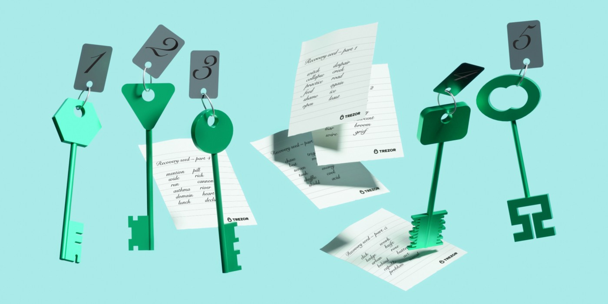

> *作者：SatoshiLabs*
> 
> *来源：<https://blog.trezor.io/how-to-store-your-bitcoin-wallet-backups-5ada1a65a665>*

若你用心持有比特币好几年甚至数十年，妥当地保管比特币至为关键。使用 [Trezor](https://shop.trezor.io/product/trezor-model-t?utm_source=medium.com&utm_medium=referral&utm_campaign=2022-06_Seed-storage&utm_content=link) 硬件钱包可以脱网保管私钥，让你免受远程攻击；同时，你的种子词（recovery seed，也称 “助记词”）可以保护这些私钥，即时设备损坏也可找回这些私钥。保证助记词的长期安全是个令人头疼的事，所以我们提供了一些协议，可以帮助你选择备份的存放地点。

## 确定你的风险模式

在手忙脚乱开始应对你的比特币可能遭遇的各种风险之前，先花点事件想想你所面临的最大的威胁。

### 远程攻击

大多数时候我们面临的最大威胁就是远程攻击，也就是攻击者尝试利用恶意软件或在互联网上钓鱼来窃取你的私钥。从案例上来看，实物盗窃要少见得多，但如果你会被瞄准成有价值的目标，这依然是一种风险。

硬件钱包可以缓解远程攻击，因为你的私钥是完全脱网保管的。而且，硬件钱包也让你可以看到你到底在签名什么，因此可以揭开更复杂的攻击的伪装。上手使用硬件钱包，是最大的安全升级措施。

### 人身威胁

用自己的 Ttrzor 持有 100 btc 的人，自然要比只拥有几百万聪的人更有被攻击的价值，但仅当这些信息都被他人知晓时，才有可能瞄准。不过，直言自己拥有比特币必定会让你暴露在风险中，不论你到底持有多少。

你今天说自己只有一点点，似乎不可能被盯上，但比特币的价值可能会提高，或者潜在的攻击者根本就不会相信你的说法。低调一些，你的风险就会小一些。

处理人身威胁需要采取一些纪律。硬件钱包可以阻止盗贼获得你的私钥，但最好是永远不要陷入这种情形。不要说你拥有比特币，分享数据时要小心，并且私钥应该放在只有你自己能拿到的地方。

## 使用标准的 BIP39 种子词

复原私钥的种子词，也就是所谓的 “seed phrase”，是一种复原私钥和资金访问权的办法。它本身是一个单点故障，因此必须时刻妥善保管。

Trezoo 钱包所创建的种子词，使用了我们帮助提出的 [BIP 39 标准](https://wiki.trezor.io/Cryptocurrency_standards#BIP39_-_Mnemonic_code_for_generating_deterministic_keys)。现在 BIP 39 已被行业广泛用于备份钱包，其常见形式是 12 个或者 24 个有顺序的单词。

在保管助记词时，有两个点需要注意：（1）**它必须放在只有你能拿到的地方**；（2）**其存储介质必须是耐久不变的**。耐久问题的常见解决方案是将助记词刻在坚硬的材料上，比如不锈钢或钛，这些材料能够在灾难中幸存。对普通人来说，保管备份是更困难的一件事。

### 使用家用保险柜

把助记词放在家里的秘密保险柜，是保证只有你能拿到它的办法之一。但是，看到保险柜，潜在的小偷就会动心思，所以如果你真要这样做，请把保险柜放在秘密的地方，远离客人、保姆和清洁工的视线。

如果别人有可能会知道你拥有比特币，而且他们知道你的家庭地址，那保险柜这个办法就不能用了。更灵活的复原方法（例如 [**Shamir 备份**](https://blog.trezor.io/how-to-store-your-bitcoin-wallet-backups-5ada1a65a665#c5c9)）可能是更好的办法，这样即使保险箱里的助记词被盗了，你的资金也依然是安全的。

如果你拥有多个钱包，用多签名设置来使用它们也是一种办法：每个钱包作为一个私钥，每个钱包的助记词都放在不同的地方，因此保险箱被盗也不会造成灾难性的后果。这种办法比 Shamir 要更复杂，但如果资金由多个人共同保管，多签名可以提供一些好处。

### 藏在家中某个角落

虽然不像秘密保险柜这么安全，你的房子可能有一些很难进入的角落，比如上锁的阁楼和上锁的房间里不起眼的角落。有很多选择，你需要自己研究房子的布局，以确定有没有真正安全的位置。

### 埋起来

也有人建议在地下保存助记词，但这可能不是个好办法，原因有很多。许多材料在潮湿、酸性的环境中会腐蚀得更快，所以你必须采取预防措施，要把助记词转录到耐久的材料上，并减少暴露在肮脏和潮湿的环境中。

把助记词埋起来的另一个问题是地点的选择。你要选出一个只有你能进入的区域，并采取措施防止它被意外发现，还得保证自己不要忘了埋在哪里。

## 用 12 个还是 24 个的助记词？

通常的助记词都是 12 个或者 24 个有顺序的英语单词。这些单词都来自 [BIP39 标准中的 2048 个单词](https://github.com/bitcoin/bips/blob/master/bip-0039/english.txt)。从概率上来说，按照正确的顺序猜对 12 个单词的概率是 1/2128，而猜对 24 个单词的概率是 1/2256。

显然，24 词型猜测起来更困难，但即使是 12 词型，也已经足以应对暴力破解了。Trezor 硬件钱包可以配置成使用 12 、18 和 24 词的助记词，但每种模式都有不同的默认设置，因为助记词输入设备的方式不同。

[Trezor Model One](https://shop.trezor.io/product/trezor-one-black?utm_source=medium.com&utm_medium=referral&utm_campaign=2022-06_Seed-storage&utm_content=link) 默认使用 24 词型助记词，因为用户可以把单词输入电脑来恢复它。而在 [Trezor Model T](https://shop.trezor.io/product/trezor-model-t?utm_source=medium.com&utm_medium=referral&utm_campaign=2022-06_Seed-storage&utm_content=link) 上，用户需要使用触摸屏将助记词输入，所以 12 词型助记词就已经足以保护你的资金了。

12 词型的助记词可以保证你的资金安全，而且也便于使用，你甚至可以直接记下来。而 24 词型助记词虽然从技术上来说更安全，如果你需要把助记词直接输入硬件钱包，那就有点不必要了。

链接：[如何记住助记词](https://blog.trezor.io/how-to-memorize-a-seed-phrase-building-narratives-from-nonsense-a306e48dfb39)

使用 [trezorctl 命令行工具](https://wiki.trezor.io/Using_trezorctl_commands_with_Trezor#Initialize_device)可以配置助记词的词语数量，但我们不推荐这样做，除非你完全知道这意味着什么，因为过于复杂的安全设置也很置你的钱于危险之中。

无论你用的是几个词的助记词，千万不要把它直接拆分成几份分别保管。这会降低你的资产安全性，因为任何一部分暴露，都会极大地降低猜出剩余词语的计算量。想要把一个备份分散在不同的地方，请使用 [Shamir 备份](https://blog.trezor.io/how-to-store-your-bitcoin-wallet-backups-5ada1a65a665#c5c9)。

### 助记词的局限性

虽然 BIP39 助记词让脱网保管比特币容易很多，它依然不够理想，因为你必须小心保管它，而且它是一个单点故障，一旦曝光就将导致你的资金全部丢失。你可以采取预防措施，通过设置一个密语（pass phrase）来生成一个秘密钱包。秘密钱包中的资金只能在同时具有助记词和那个密语时才能使用；密语既可以自己记住，也可以单独存放（译者注：你也必须记得这个口令，否则你的秘密钱包中的资金就再也找不回来了）。

SatoshiLabs 还提出了一个新的标准，叫做 Shamir 备份，可以提高 BIP39 的效用；你可以安全地生成多组词，这些词组必须结合在一起才能恢复资金的访问权。Sharmir 备份具有冗余，所以你的某一组或者多组词丢失或被盗也不会影响你的资金安全性，普通人保管起来就容易、安全很多，甚至无需使用非常安全的存储方式。

## 使用 Shamir 备份

助记词虽然很常用，但保管起来并不容易。Shamir 备份可以让多地保管一个备份变得更容易，并降低你因为失窃或损坏而丢失资金的风险。

Sharmir 备份也叫 “[SLIP39](https://github.com/satoshilabs/slips/blob/master/slip-0039.md)”，是 Trezor Model T 提供的一个特性，你可以用它把一套助记词分成最多 16 个碎片，每个碎片都是一个 20 个单词的词组。你可以同时配置一个阈值，只要手中碎片的数量超过这个阈值，就可以复原私钥。有了这两个选项，你就可以定制自己的方案来适应自己的风险模型。

视频讲解：[什么是 Shamir 备份？](https://youtu.be/cRh-NCvHkzM)

Shrmir 备份有两种常用的形式，一种是 2-of-3，一种是 3-of-5，前一个数字表示阈值，后一个数字表示碎片的总数。

最好不要把 Shamir 备份弄得太复杂。除非你有某一个用途需要这样的配置。不然最好直接使用 2-of-3 或者 3-of-5。 2-of-3 的冗余是 1，即你可以弄丢、损坏或失盗 1 个碎片。而 3-of-5 的冗余是 2。

使用 Shamir 备份意味着更少的偏执和更实用的物理安全。虽然最好的习惯是把碎片锁起来，但你也可以把碎片分散存储在家里、亲戚的家里和你的办公室里，等等。这样即使一个地方被攻破，也不会影响你恢复资金的能力。

### Shamir 备份的局限性

Shamir 备份比 BIP39 助记词强大很多，但接受度却不如 BIP39 那么高。这意味着，如果你使用了 Shamir 备份，你将需要另一台 Trezor Model T 或其它支持 Shamir 备份的第三方钱包以备不时之需。

Shamir 备份是开源的，也就是说这个标准已经交给了社区，任何人都能使用它，我们相信，对 SLIP39 的支持将逐渐出现。假设 Trezor 停止运营了，也有[开源的工具](https://github.com/trezor/python-shamir-mnemonic)可以恢复钱包。

你可能会因为使用了 Shamir 备份而得意忘形，但你还是应该把它们藏起来，以防止有人暗中追踪它们。你也要定期检查碎片的状态，以防止它们被损坏。虽然失去几个碎片不会让你的资金置于危险境地，你还是要保证自己拥有足够多的碎片，因为碎片数量超过阈值才能恢复钱包。

## 为你的备份选择合适的载体

纸备份，也就是用钢笔或铅笔在纸上写下你的助记词，对于火灾和水灾毫无抵抗力。如上所述，BIP39 助记词是一个单点故障，只要它被摧毁了，同时你的 Trezor 也丢了，就永不可能再找回你的钱。只要你使用了 BIP39 助记词，你就应该尝试把助记词刻在金属材料上，这样可以应对灾难的风险。

如果你使用了 Shamir 备份，它的冗余性允许一部分碎片丢失或损坏，那么金属备份所能提供的额外好处就不多了。你可以根据自己分散碎片的方式，你可以选择为更有可能被损坏的碎片使用金属材料，例如为埋起来的或长期无法触达的碎片使用金属材料。

### 实物备份的类型

实物助记词备份有许多形式和材料。最常见的材料是纸和金属。要想获得一份全面的指南，Jameson Lopp 的文章对比了数十种金属备份方案，检验了许多品牌的解决方案。

链接：[金属助记词版评测](https://jlopp.github.io/metal-bitcoin-storage-reviews/)

金属备份可以用五金店贩卖的材料组装起来，比如不锈钢和钉子。也可以使用雕刻工具，但最重要的是，要保证即使金属严重变形和受热损坏，也依然能读出上面的词语。

（完）

