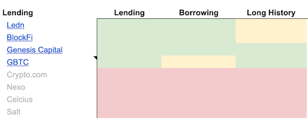
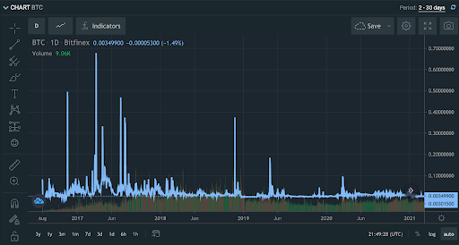
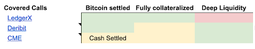
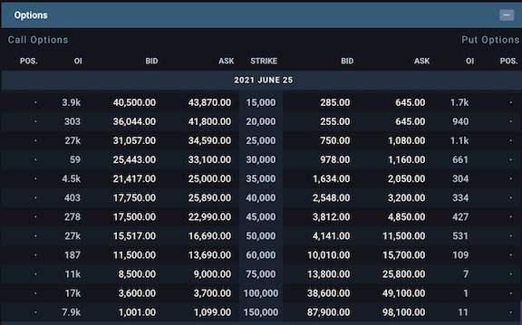
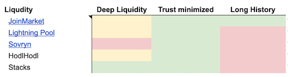
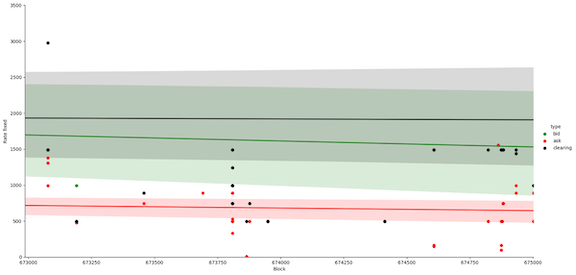
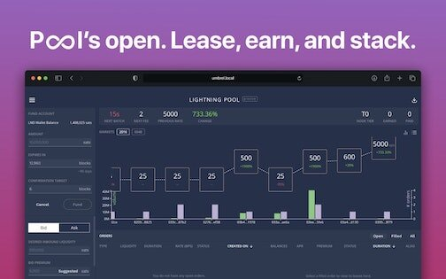

> *作者：Dan Held*
>
> *来源：<https://www.danheld.com/blog/2020/9/17/howtoearnayieldonbitcoin>*
>
> *本文首发于 2020 年 9 月 17 日。*

## 背景

过去 1.5 年来，我在密码学货币领域亲身[体验](https://twitter.com/danheld/status/1367181263761670145?s=20)了不同的借贷服务。我将近期的持仓情况记录在了[在线表格](https://docs.google.com/spreadsheets/d/1ZoapTCl76wahFMeNISSx9UdC3QBx-zC_jY4Le1H5Sdg/edit?usp=sharing)中，每月更新一次。

赚取收益不仅能让你囤积更多比特币（我就是这么做的），还能帮你克制想要卖出比特币的欲望。

## 风险

我将风险放在开头部分，因为我希望每个人在权衡是否要利用比特币赚取被动收益之前重视相关风险。

正如我在上一篇文章中所提，借贷是最古老、也是最基本的金融形式之一。当你借出自己的比特币时，你赚取的收益是对你所承担风险的补偿。

承担风险是一个中性词。任何投资都会带来风险。每个投资者希望自己已经合理权衡了收益风险比。

当你借出自己的密码学货币时，你必须信任服务提供方会合理评估对手方风险，包括对手方的财务状况、质押物要求、托管等等。

与传统的最佳实践相反，多元化或许有害无利，因为你不知道你的对手方背后有多少个贷方（Ledn、BlockFi、Genesis）。

很多人问我是否应该使用有代币的借贷服务（Celsius、Nexo）。我认为引入代币会增加监管和结构性风险。请注意，这些代币借贷服务常常吹嘘自己是“监管难题”，但是实际上它们[只](https://www.coindesk.com/why-celsius-thinks-cel-wont-receive-the-same-sec-treatment-as-xrp)向 SEC（美国证券交易委员会）提交了表格 D。这意味着，它们应当只向合格投资者提供服务。另外，它们通常声称自己“已投保”，但其实就是 Bitgo 为所有托管客户[投保](https://nexo.io/security)了 1 亿美元。

例子：今年早些时候 Cred 的[破产风波](https://cointelegraph.com/news/cred-customers-demand-answers-after-platform-files-for-bankruptcy)。

我将在下文介绍传统金融和去中心化金融的收益方案。你会注意到，我在每个类别下只介绍了几个潜在方案。如果你想进一步了解，可以查看我在[表格](https://docs.google.com/spreadsheets/d/1ZoapTCl76wahFMeNISSx9UdC3QBx-zC_jY4Le1H5Sdg/edit?usp=sharing)中关于其它方案的备注。

*请注意，我在建议中包含了推荐链接。推荐成功之后我会得到奖励。在我的*[*收益表格*](https://docs.google.com/spreadsheets/d/1ZoapTCl76wahFMeNISSx9UdC3QBx-zC_jY4Le1H5Sdg/edit#gid=1458233507)*中，我备注了我本人正在使用的服务*。

## 传统金融

- <a href="https://docs.google.com/spreadsheets/d/1ZoapTCl76wahFMeNISSx9UdC3QBx-zC_jY4Le1H5Sdg/edit#gid=1458233507">收益表格</a> -

### 借贷平台

[Ledn](https://platform.ledn.io/join/e2ac0411b98e7dec0d9d8ed01d054d11) 和 [BlockFi](https://blockfi.mxuy67.net/vdmmL) 之类的公司会将你存给它们的比特币借给交易所、对冲基金和矿工等。你可以将其理解为“比特币银行”。正如我在上文所提，我不推荐任何引入代币的解决方案，因为这样做弊大于利。因此，这类解决方案我统一标红了。

**收益**：3%~6%（具体取决于行情）

**风险类型**：这类平台的风险是已知的，但对手方（从平台那里借得比特币的人）是未知的。此外还有托管风险。知道一个对手方（如 Bitfinex 之类的交易所）或许比一个对手方都不知道（如 Ledn）风险更低一些，但事实上你还是不清楚对手方是谁。

**流动性**：你可以轻松存入和提取不超过 x 千万美元的比特币。

**易用性**：只要轻点几下，几乎人人都能注册账户、参与质押并赚取收益。

*具体流程*：

- 在 [Ledn](https://platform.ledn.io/join/e2ac0411b98e7dec0d9d8ed01d054d11) 上注册账户（~6%）

- 存入比特币

- 立即开始赚取收益

### 保证金池

另一种通过借贷赚取收益的方式是交易所的保证金池。这种方式的优点是能让你清楚了解对手方风险。你知道自己的资金借给了哪家交易所。

[Bitfinex](https://www.bitfinex.com/?refcode=eRDZwArgH) 就是个很好的例子。下图显示了 2018 年以来的每日资金费率。如你所见，资金费率根据行情而产生较大变化。（撰写文本时）当前的年化收益率为 1.469%，但是如下图所示可能会高得多。

- 每日资金费率 -

**收益率**：平均 1%~10%（会随行情出现剧烈波动）

**风险类型**：你将代币借给了交易所的保证金池。如果交易所的保证金风险引擎出现问题，交易所又决定不使用公司资金来填补漏洞，你有可能[失去](https://www.coindesk.com/margin-lenders-lost-13-5-million-in-may-to-poloniex-crypto-crashhttps://www.coindesk.com/margin-lenders-lost-13-5-million-in-may-to-poloniex-crypto-crash)你的本金。

**流动性**：你可以存入和提取合理数量的比特币（累计可达数百万美元）

**易用性**：只要轻点几下，几乎人人都能注册账户、存入资金并赚取收益。

*具体流程*：

- 注册 Bitfinex 账户

- 存入比特币

- 下单

### 有担保期权

- <a href="https://docs.google.com/spreadsheets/d/1ZoapTCl76wahFMeNISSx9UdC3QBx-zC_jY4Le1H5Sdg/edit#gid=1458233507">收益表格</a> -

“有担保期权（covered call）”是什么？

有担保期权是一种期权交易，即，标的资产的所有者（“有担保”）出售高于某一价格（“行权价”）的上涨获利来换取现金（“期权费”，即，收益）。

关于预期收益，一个简单的逻辑是收益（期权费）越高，表明期权的购买者认为某事件发生的概率越高。如果说得复杂一点，就是收益取决于行权价与现价之间的差值、隐含波动率和其它因素。

如果当期权期限结束（到期）时，现价高于到期时的行权价，有担保期权的卖方必须按之前约定的行权价出售其比特币，无论比特币的当前价值有多高（卖方只能保留不超出行权价那部分的价值）。如果到期时，当前价格低于行权价，卖方不仅能足额收回自己的比特币，还能获得溢价。

换作真实的数据会是什么样？（价差 = 买入价和卖出价之间的差值。）请注意，“年化率”用在此处并不妥当，因为你不知道下一次卖出期权时收益率是多少。

5 月 25 日，行权价是 6 万美元时，溢价为 12595 美元（年化收益率为 61%）

5 月 25 日，行权价是 10 万美元时，溢价为 3650 美元（年化收益率为 18%）

**收益率**：1% ~ 80%（取决于行权价与现价之间的差值 + 波动率）。这类投资最吸引人的一点是，无论到期日是哪一天，你都能立即获得收益。这就意味着，除了有担保期权带来的收益外，你还可以通过再投资产生额外的收益。

**风险类型**：交易所/托管 风险确实存在，但是对手方风险并不存在。目前已采取的额外安全措施有延迟提款（例如，LedgerX）。

**流动性**：具体取决于你选择哪家交易所。由于比特币期权市场爆炸式增长，买入和卖出变得轻而易举。请注意，你的比特币在到期之前会被锁仓，这需要你完全信任交易所。

**易用性**：一旦你理解了基本原理，出售有担保期权会容易得多。但是，买入时需要跨过心理障碍。

具体流程：

- 注册[ Deribit](https://www.deribit.com/reg-10991.9148)（通过[该链接](https://www.deribit.com/reg-10991.9148)注册，立减 10% 的交易费）

- 在你的账户中充值比特币

- 出售有担保期权

## 去中心化金融

### JoinMarket（CoinJoins） 

Coinjoin 可以让比特币用户将自己的比特币与其他用户的比特币混合起来，以混淆比特币的归属情况。建立一个健全的混币市场需要挂单者和吃单者。挂单者源源不断地提供可用于混币的流动性，吃单者为挂单者提供的便利付费。

**收益率**：0.5%~[1%](https://www.reddit.com/r/joinmarket/comments/4hwwa0/calculate_your_yield_generators_perannum_return)（低位的可能性更高）

**风险类型**：极低。但是，你必须将你的比特币存放在热钱包（即，联网钱包）内。随着 Layer 1 上比特币的手续费走高，人们或许需要靠闪电网络等 Layer2 方案来处理混币/CoinJoin 的需求。请注意，这一方法在某些国家可能是非法行为，务必确认当地的法律法规。

**流动性**：你随时都可以[点击此处](https://joinmarket.me/ob)了解市场深度（但是该链接现已失效，我不知道还能在哪里找到），查看混币所需支付的手续费。如果你持有超过 100 万美元的比特币，JoinMarket 带来的收益实在太低。你可以随时取走你的比特币。

**易用性**：在所有方式中，JoinMarket 绝对属于难度系数较高的一种。

具体流程：

详细[说明](https://github.com/JoinMarket-Org/joinmarket/wiki/Running-a-Yield-Generator)

- 运行比特币全节点

- 安装 JoinMarket

- 往钱包中充值比特币

- 使用 JoinMarket、节点和收益生成机器人进行技术设置

### 闪电网络池

- 当前流动性低且价差大（<a href="https://twitter.com/LightningPool/status/1372488010441367554?s=20">来源</a>） -

简单来说，闪电网络池是以非托管方式为闪电网络提供流动性（或创建通道市场）的订单簿（但是，这里面还涉及到一个协调服务器）。

每个通道租约都有几个基础参数：金额、期限和每区块利率。针对每个期限会有不同的拍卖活动。Lightning Labs 将在项目上线时提供长达 2016 个区块的期限，之后会提供更多期限（4032 个区块、6048 个区块等）。

目前，期权保险费（premium）是一次性预付款，未来有可能变成按每区块支付的流式付款。

[Getumbrel](https://getumbrel.com/) 是一个很棒的节点软件，[最近](https://twitter.com/getumbrel/status/1361316184449159171?s=20)启用了闪电网络池，使得非工程师也能使用。

**收益率**：闪电网络池只运行了几个月，流动性极低。我预计其收益率将长期低于 1%。[点击此处](https://twitter.com/LightningPool)，查看最新交易。

**风险类型**：该项目的代码运行时间不久，很有可能存在漏洞。

**流动性**：很低

**易用性**：目前有带 Getumbrel 的 UI，但是很新

具体流程：

[说明](https://getumbrel.com/#start)

- 在你自己选择的硬件上安装 umbrel

- 运行闪电网络池

### **Stacks**

之前有一些付费订阅用户问我对比特币上的智能合约平台 [Stacks](https://stacks.org/?=danheld) 的想法。具体来说，你可以购买 Stacks 代币。虽然你不是直接买入比特币，但是你可以通过质押 Stacks 代币来赚取比特币收益。当前的[年化收益率](https://stacks.org/stacking#calc/?=danheld)是 13%。

我被赠予了 500 美元在移动端上体验该质押机制（我会将这笔钱归还或捐赠出去）。目前，协议的最低质押要求非常高，因此出现了低额质押池（可低至 500 美元）。这就是我使用 [Xverse](https://www.secretkeylabs.com/) 应用所做的。这一过程需要几天至几周时间，具体取决于你选择的质押周期。

总而言之，这是一种不需要依靠比特币就能赚取比特币收益的有趣方法。

（完）