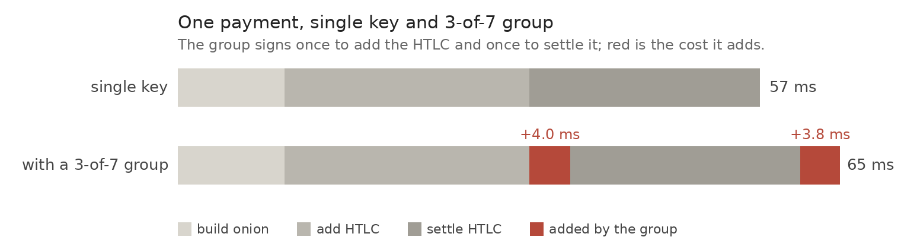

> *作者：Nadav Kohen*
> 
> *来源：<https://nkohen.github.io/blog/iceberg/>*

自 Taproot 软分叉依赖，比特币协议已经允许使用 Schnorr 数字签名来花费钱币。最近，BOLT（闪电网络规范）也加入了对 “Taproot 通道” 的支持；Taproot 通道就是使用 [BIP 327](https://github.com/bitcoin/bips/blob/master/bip-0327.mediawiki)（MuSig）的闪电通道，它将两个参与者的公钥聚合为一个公钥，从而通道的链上活动与普通的单方比特币支付没有区别。这种转变使得通道的参与者更难通过比特币脚本（OP_CHECKMULTISIG/OP_CHECKSIGADD）来使用阈值保管方案，但依然与交互式的门限签名方案兼容。[FROST](https://eprint.iacr.org/2023/899) 是众所周知的 Schnorr 门限签名，但在绝大多数语境下，它都不适合嵌入 MuSig 。

（译者注：在这里，“阈值保管” 指的是通过多个密钥来保管资金，只需持有达到阈值数量的密钥即可转移资金。）

在本文中，我们会介绍我们的提议 “Iceberg”，它如何在一个阈值托管的闪电网络通道中签名。这是与   Paul Gerhart 和 Jesse Posner 的[合作成果](https://nkohen.github.io/publication/2026-08-22-iceberg)，而且 Matias Furszyfer 编写了一个实现和[性能基准测试](https://github.com/furszy/benchmark-iceberg)。

[论文链接](https://eprint.iacr.org/2026/1757)

## 多方钱币中的门限密钥管理

在多方的比特币合约（比如闪电通道，或是 “谨慎日志合约”、Ark，等等）中，资金是通过 “注资交易” 投入共同保管的装置中的，靠所有相关方的 n-of-n 多签名装置来锁定（在闪电通道中是 2-of-2）。在发送资金到注资交易之前，所有参与者要预先生成和签名所有可能花费注资交易的交易。这保证了有一个枚举的花费方式集合，任何一位参与者都能单方面花费注资交易（因为他们已经拥有了所有必要的签名），而且除非所有人都同意，否则无法添加新的花费条件。在加入 Taproot 软分叉之后，比特币协议允许使用 Schnorr 签名，也正因此，使用 BIP 327 MuSig 这类协议来取代基于脚本的 n-of-n 多签名以强制执行合约，成为标准的做法，因为在这类协议中，通过公钥聚合和签名聚合，只需一个暴露一个聚合公钥，就能强制执行同样的 n-of-n 约束。这带来一些好处：更小、更不显眼的链上足迹，因此拥有更好的隐私性以及更低的手续费。不过，这也让密钥管理变得更加麻烦，因为现在需要在这些密钥聚合协议中使用 t-ofn 的密钥分割装置，这更难；但是，门限密钥管理又是比特币专业托管商保护自己免受攻击和私钥丢失灾难的标准做法。

在闪电网络中，节点运营者必须保持私钥联网且能够签名，但这就意味，他们有一个单点故障或者说单一漏洞 —— 一个私钥就决定了他们的所有通道资金的命运。对于大体量的通道运营者来说，最好是能够拥有一些断网的后备密钥，并且能够容忍一定熟练的联网密钥被劫持，就像标准的门限密钥管理一样。这就是 “嵌套的门限签名方案” 能够提供的东西：一个基于 BIP 327 MuSig 的合约的参与者，可以使用一套嵌套的门限签名协议，为自己构造出一个聚合的 MuSig 参与者公钥，而实际上，这个公钥是由多个私钥组成的。此外，其中一些私钥还可以是空气隔离的（air-gapped）、断网的冷存储私钥；一部分私钥被劫持并不会导致通道资金丢失。

## 通过 RSS 实现嵌套门限签名

### 背景

Iceberg 只能在特定的假设下工作，这些假设是专门考虑了闪电网络的情形而选出的。

闪电通道的工作原理是双方用承诺交易来花费注资交易的 2-of-2 输出，将双方份内的资金发回给他们。但当要发送闪电支付时，双方要构造一笔新的承诺交易并签名它，以反映双方更新后的余额。这笔交易还不算终局，除非不再能使用上一笔承诺交易，因为，只要能使用上一笔承诺交易，就能回滚到上一个状态。一旦一笔比特币交易得到了签名、成为有效交易之后，就没有简单的办法能作废它们；所以，闪电通道的做法是，在承诺交易中包含一个毒丸条款，允许一方取走注资交易中的所有资金，只要 TA 知道了对应着这笔承诺交易的一个秘密值（称作 “撤销秘密值”）。（在构造新的承诺交易时，）双方都要将自己的上一笔承诺交易的撤销秘密值分享给对方，从而，不管哪一方发布旧的承诺交易，另一方都能转走通道内的所有资金。因此，只有最新的一笔承诺交易是可以无风险地使用的。

了解这些背景之后，自然就能勾勒出门限化一个闪电节点的几个困难。

其一，非常重要的是，诚实的（即未被攻破的）签名设备应该能对最新的通道状态达成一致，这样，它们才能只签名自己应该签名的交易、永不签名旧的承诺交易。即使诚实的签名设备的密钥没有泄露，它们也不应该随便签名闪电交易，因为这可能会签名一笔已经作废的承诺交易，从而导致资金全部丢失。在操作层面，这意味着我们需要 “拜占庭容错（BFT）” 状态管理机制，需要诚实的联网签名设备占多数，以保证诚实的断网设备（在回到线上时）能够知道正确的通道状态。

其次，让单个设备知道你的通道这一端的撤销秘密值也是不安全的，因为它又会变成一个单点故障，攻击者可以攻破它然后取走所有的通道资金，就像你已经作废了最新的承诺交易而你并不知情一样。这需要一种门限的多方安全计算（MPC）协议，以计算出撤销秘密值的哈希值，而不让任何一个设备知道这个撤销秘密值，直到需要撤销旧的承诺交易。这类似于我们让多个联网的签名设备集体计算出一个聚合签名，只不过它们需要计算的是一个秘密值的聚合哈希值，不让任何一个设备知晓这个秘密值。

（译者注：这种攻击似乎需要与通道对手串通。这里多方计算的对象是 `per_commitment_secret` 的种子，因为各 `per_commitment_secret`（私钥）就是各承诺交易的撤销秘密值，并且是由种子用 shachain 派生出来的；不得不如此，因为通道对手会检查这些秘密值位于哈希链条上。）

乍看起来，在一个 MPC 中计算撤销秘密值的 shachain（哈希链条）似乎成本高不可攀。SHA-256 并没有让 Schnorr 门限签名得以高效运行的代数结构，所以必须转而使用一个布尔电路来求值。在我们的实现和基准测试中，一次 shachain 哈希操作需要 1614 次连续的通信回合，在分散在美国和欧洲的四个云服务区域的设备间需要 65.5 秒来完成，这是在有意设计的三方安全计算容忍一个被攻破的设备的情形下。

幸运的是，未来的秘密值可以并行预先计算，并提前放入一个预读缓冲区。在同一个广域网上，填充一个包含 1024 个秘密值的缓冲区需要 12.6  分钟，但这已经足以让一条通道每 0.74 秒撤销一笔承诺交易。计算在每个签名设备上只需花费 1.09 秒的 CPU 时间；几乎所有时间都花在了等待网络往返上。

一旦准备好了一个秘密值，揭晓它就不再需要 MPC 计算。我们将一个公开的带有掩码的数值与该掩码的一个复制型碎片（replicated sharing）放在一起，从而，得到授权的参与设备可以发送自己的碎片、验证复制的副本，然后在单轮通信中重新构造出秘密值。然后，这个重构出来的秘密值，会用为承诺交易而发布的椭圆曲线点来检查。在我们的实验中，这会花费 139 毫秒。准备好的秘密值使用跟长期种子相同的复制型分割结构，所以从在线的参与设备中表换签名设备并不需要重新构造缓冲区。

有可能，在未来我们会停止让闪电通道用户使用 shachian 来生成撤销秘密值，因为本来这也不是非常重要。

（译者注：使用 shachain 来生成撤销秘密值的用意在于减少需要为每一笔承诺交易存储的数据量。）

所以，需要实现两个基于阈值的非签名结构，以在闪电节点中安全地使用阈值保管。不过，两者都可以靠现有的密码学原语做到 “开箱即用”，我们的贡献是解决一条闪电通道的嵌套门限签名机制。

### 复制型秘密值分割

就如我在[上一篇博客文章](https://nkohen.github.io/blog/some-secrets-shared/)中说的（[中文译本](https://www.btcstudy.org/2026/07/16/some-secrets-shared-by-dadav-kohen-part-1/)），“复制型秘密值分割（RSS）” 是一种依靠每一方都存储一个碎片清单来创建门限共享秘密值的做法；同一个碎片被不止一个参与者所知（这就是为什么它叫 “复制”），从而任意 $t-1$ 方都缺失至少一个碎片，而任意 $t$ 方都能复原出秘密值。这个聚合的秘密值，是所有汇集在一起的碎片去除重复元素之后的和。比如说，假定 Alice、Bob 和 Carol 希望使用 RSS 来形成一个 2-of- 3 的共享秘密值，他们可以运行一个 DKG（分布式密钥生成）协议，从而 Alice 知晓 $x_1$ 和 $x_2$，Bob 知晓 $x_2$ 和 $x_3$，而 Carol 知晓 $x_3$ 和 $x_1$ ，而聚合的私钥是 $x = x_1 + x_2 + x_3$ 。这样一来，任何一方都缺少三个秘密加法项的其中之一，而任何两方都能一起知晓所有三个秘密加法项。这并不是一种广泛使用的做法，因为它无法从容地扩展到大体量的参与者集合，但对于标准的密钥管理使用场景来说，它是非常实用的。

在我的《[嵌套的 MuSig2 签名](https://nkohen.github.io/publication/2026-02-12-nested-musig2)》论文中，我已经证明了，以嵌套门限签名的必要方式（的类似方式）那样在 MuSig 中嵌套 MuSig，是安全的，但是 MuSig 不支持门限签名（只支持 n-of-n 签名）。所以，Iceberg 背后的想法就是，实现一种 N-of-N 的嵌套 MuSig ，但其中的 N 个秘密值并非参与者的私钥，而是 RSS 的秘密加法项（它们显著多于参与者的数量，即 $N >> n$，但对密钥管理应用场景来说依然是实用的）。这样一来，任意 $t-1$ 方都将缺少 N 个秘密值的至少一个，因此无法满足 N-of-N 的嵌套 MuSig 花费条件，同时，任意 $t$ 方都能知道全部 N 个秘密值，从而一起生成一个嵌套的 MuSig 碎片签名（partial signature）。本质上，RSS 让我们可以将一个 N-of-N 机制转化为一种 t-of-n 机制（其中 $N = \binom{n}{t-1}$ 是 n 个签名人的大小为 $(t-1)$ 的子集）。 

（译者注：“嵌套” 的含义是，MuSig 本身已经允许将多个独立的公钥聚合为一个公钥，而 “安全嵌套” 使我们可以先将多个独立公钥（使用 MuSig）聚合为一个公钥，再让这个公钥参加上一层的 MuSig 公钥聚合。作者此处的想法是，将 N 个独立公钥聚合为一个公钥，再用这个公钥参与闪电通道的 MuSig 公钥聚合；同时，使用 RSS，就可以将这个 N-of-N 机制转化为门限机制。）

但是，我这里讲的这种方案，在应用到 nonce 秘密值上时，基本上是不安全的；在签名不同消息时，不能重复使用 nonce 秘密值，不然就会泄露（聚合的） 私钥。考虑这样一种攻击：我们有一个 3-of-3 的MuSig 装置，使用私钥 $x_1$、$x_2$ 和 $x_3$，它们已经提早在 Alice、Bob 和 Carol 之间分发，从而形成一个 2-of-3 的聚合私钥 $x = x_1 + x_2 + x_3$ 。如果 Alice 是恶意的，她可以要求 Bob 签名一条消息（并声称 Carol 下线了），然后让 Carol 签名另一条消息（同时声称 Bob 下线了）。如果 Bob 和 Carol 都签名了自己拿到的（不同的）消息，那么同一个聚合的（复制的）nonce 值就在实质上用在了不同的签名中（用了两次），那么知道这个值的 Alice 就可以从签名中计算出聚合私钥。这就是为什么状态共识不仅对 闪电通道的功能有意义，对于启用这种有些幼稚的 RSS 变换（从 N-of-N 转化为 t-of-n）也有意义。 使用状态共识机制，我们可以保证，所有诚实的参与者集体拿到任意的聚合 nonce 值，都只会用来签名一条消息。

在无法使用状态共识机制（比如无法保证诚实参与者占绝对多数，这是 BFT 的前提）时，还有一种抵御这种攻击的办法，但需要稍微偏离 BIP 327 ，所以算是超出了本文的内容。这是我还在准备种的下一篇论文的话题。敬请期待！

## 为生产环境而优化：VPSS 和基准测试

虽然基本的 RSS 方法提供了我们需要的门限机制，但它也有高昂的存储和通信开销。这就是我们要使用VPSS 的理由，它让我们可以将绝大部分存储和通信开销转化为接近基于 Shamir 秘密值分割的方案。

“伪随机的秘密值分割” 最初由 [Cramer 等人](https://link.springer.com/content/pdf/10.1007/978-3-540-30576-7_19.pdf)提出。他们的两大洞见是，其一，只需一次启动仪式，就能生成许多 RSS 秘密值；其二，RSS 分发的秘密加法项，可以在本地（无需通信）转化为同一秘密值的 Shamir 秘密值碎片，这个过程叫做 “碎片转化”。

与 Shamir 私钥分割不同的是，RSS 碎片是加法性质的，也就是说，我们可以使用伪随机函数（PRF），将一次 RSS 启动仪式转化为在同一装置中分割的任意数量个秘密值。也就是说，从一次启动仪式中获得碎片之后，我们不把它当成秘密加法项，而是把它当成一个伪随机函数的种子；然后，每次想要一个新的秘密值，我们就生成一个独一无二的会话标识符（$sid$），然后用它作为每一个带有种子的伪随机函数的输入，从而在相同的结构中生成复制型（碎片和）秘密值。因此，虽然 Shamir 秘密值分割可以使用更加轻量的 DKG（从需要通过线路的通信规模来比较），但它的代价是每次都要运行一次新的 DKG 。而使用我们前述的过程，一次冗余的 RSS DKG 就足以 “免费” 产生任意数量的共享秘密值。

不过，RSS 在重复使用中有另一个缺点：每一方都将保存一个很长的碎片清单，并且，每次想要使用共享秘密值，就必须传输许多秘密值碎片的碎片签名。这是很可怕的；相比之下， 在 Shamir 秘密值分割中，每个碎片只是一个秘密数值，只需为之传输一个碎片签名。这就是我们需要用到碎片转化的地方！我们运行一次 RSS 启动仪式，用得到的碎片作为伪随机函数的种子，然后，我们在本地运行碎片转化，将我们的秘密加法项清单转化为同一个（聚合的）私钥的 Shamir 碎片。这意味着，在启动仪式结束后，使用共享秘密值不再需要通过线路发送大量消息，只需像普通的基于 Shamir 秘密值分割的方案那样，发送碎片签名消息。这个过程 —— 使用 RSS 来提供 PRF 的种子，然后使用碎片转化来优化通信和计算负担 —— 叫做 “伪随机的秘密之分割（PSS）”。

Komlo 和 Goldberg 还在他们的 [Arctic 论文](https://eprint.iacr.org/2024/466)中提出了 PSS 的一个可验证的变种，“VPSS”，只能在诚实参与者占多数的环境下使用（由于状态共识协议的存在，我们已经使用了这个假设）。我的[上一篇文章](https://nkohen.github.io/blog/some-secrets-shared/)解释过这个方案（[中文译本](https://www.btcstudy.org/2026/07/16/some-secrets-shared-by-dadav-kohen-part-2/)）；简单来说，这里说的 “可验证” 意味着在一个诚实参与者占多数的 PSS 中，参与者们仅通过观察聚合的数值就能侦测出恶意的行为。这意味着，我们可以使用一个聚合人（就像 MuSig 做的那样）来优化通信，无需让状态共识机制跟踪额外的状态，因为签名人可以验证他们正在签名的输入是正确的，因此，只要能通过验证，所有诚实签名人的输入就都是一样的。

总结一下：使用 VPSS，意味着在一次 RSS 种子分发之后，所有新的 nonce 值碎片都被计算为一个秘密碎片（就像在 Shamir 方案中一样，但无需通信）以及一个对应的碎片签名，这使得 Iceberg 签名的通信复杂性 —— 在启动之后 —— 优于基于 Shamir 的（以及其它基于交互式 DKG 的）门限签名方案的复杂性。主要的缺点在于，每一方都必须存储自己所有的 RSS 种子（数目会随着签名人数量的增加而缓慢增加），并且每次生成 nonce 都必须运行本地计算，其计算量随种子数量的增加而增加。我们认为，在密钥管理应用场景中，Iceberg 的好处远远超过这些代价；并且，还有一项好处是我们在此处没有讨论的，就是就是聚合的 nonce 值不依赖于正在签名的签名人集合（FROST 就如此），这使得 PSS 成为嵌套门限签名方案中的 nonce 生成的理想机制 —— 在门限签名方案中，聚合的 nonce 值必须在待签名的消息和参与的签名人集合浮现之前被参与者知晓。

### 真实闪电节点中的基准测试

为度量 Iceberg 的使用成本，我们实现了完整的技术栈，从 secp256k1 内部的 Iceberg 模块、到比特币的主要密码学库、在此基础上的 JVM 绑定，最后集成到 eclair 客户端已有的 taproot 通道特性中。我们作出的唯一变更是使用注资密钥签名时要调用的函数。其余部分没有修改。通道对手方是普通的 eclair 客户端， 并且修改后的装置字节可以通过通道测试套件，无需变更与本方案的参考实现逐字节复现的签名模块。因为签名需要 $2t-1$ 个成员在线，一个 2-of-4 的团体允许 1 个成员离线（而依然能签名），3-of-7 的团体允许 2 个成员离线，而 4-of-10 的团体允许 3 个成员离线。用这些团体来替换单个密钥的代价是每次支付多出 4 到 18 毫秒的 CPU 时间；代价会随着阈值 t 的数值增加呈平方级增加，但团队规模 n 的增加只会带来微小的增加：

| 容错 | 团队规模 | 在线成员数量要求 | 额外的 CPU 时间（每笔支付） | 每秒支付次数 | 每 10 万笔支付的计算成本 |
| :--- | :------- | :--------------- | :-------------------------- | :----------- | :----------------------- |
| 无   | 单密钥   | 1                | 0                           | 17.3         | $0.064                   |
| 1    | 4        | 3                | +4.0 毫秒                   | 16.2         | $0.069                   |
| 2    | 7        | 5                | +8.0 毫秒                   | 15.2         | $0.073                   |
| 3    | 10       | 7                | +17.5 毫秒                  | 13.3         | $0.084                   |

*通道环境的 CPU 时间。每一行都是 1500 次普通的 MuSig2 支付与团体处理相同支付的背对背比较取平均值，计算核心是 10 核的 AMD EPYC 7543 。计算成本以每个虚拟 CPU 小时价值 0.04 美元计算得出，每秒可处理的支付数量才是核心约束。*

可见，额外的成本是很小的，因为签名只是一笔闪电支付的一个微小部分。一笔支付要更新承诺交易两次，一次为了添加 HTLC，另一次为了结算它，这两次更新就占到了其处理量的 4/5 ，而发送者的洋葱包裹构造占到了剩余处理量的大头。Iceberg 尝试替代的碎片签名流程只消耗 1.5 毫秒，不到所有处理量的 3% 。使用团体签名所带来的额外成本只存在于这两次承诺交易更新中，不影响其余任何部分：

从这个角度看，签名并不是限制一个门限闪电节点的因素。实际的边界性成本是操作层面的。为处理支付，至少要有一定数量的签名设备在线，而只要这些成员运行在不同的机器上，就会有网络往返，时间都花在等待消息上，不是计算上。这些成本都来自环境，而不是 Iceberg 。完整的基准测试，以及这个方案可以表达的所有二十项配置，都放在[这个代码库](https://github.com/furszy/benchmark-iceberg)中。

## 未来的工作

Iceberg  解决了闪电节点语境下的门限签名问题，但它也利用了一些较强的假设，在这个环境下可以满足，却不能应用在别的环境中。

Arctic2 是一种新的 Schnorr 门限签名方案，基于 PSS，并且不依赖于诚实参与者占多数的假设，所以它支持任何门限装置，不依赖于状态共识机制来保证安全性。此外，它还被设计成完美兼容一种稍微偏离 BIP 327 的 MuSig2 版本。我已经为这种新的签名方案完成了安全证明（包括在嵌套环境下），正在准备它的论文。

我们给闪电通道应用场景的建议是 Iceberg  而不是 Arctic2 ，因为 Iceberg 相对于 Arctic2 的缺点 —— 诚实参与者占多数、状态共识机制 —— 已经是门限闪电节点的前提，而 Iceberg 还有完全无需修改 BIP 327 MuSig 的优点。

不过，嵌套在 MuSig 的门限签名还有别的应用场景，是没有状态共识机制和诚实参与者占多数的假设的，在这些环境下，嵌套的 Arctic2 就能做到 Iceberg  做不到的事。我们将提议创建一种 BIP 327 版本，只需添加一个参数，无需改动其它。使用这种变种的实现将能让嵌套的门限参与者看起来于普通的单公钥毫无区别。

## 安全证明附录

相比本文其余部分，阅读这个附录需要更多的背景知识。如果你想学习更多，请看看 [cryptocamp](https://github.com/cryptography-camp/prework) 。

嵌套门限装置的 安全性/不可伪造性 在 Iceberg 论文的图 3 有述，基本上是一个攻击游戏：敌手最多可以攻破 t-1 个签名人，然后与诚实参与者运行密钥生成，并且能够访问诚实签名人的签名接口。攻击者在并发的签名会话中发送任意多次签名查询之后，必须产生一次伪造，也就是对任何诚实参与者都没有签过名的一些消息，生成对聚合公钥有效的签名。

类似的，嵌套多重签名装置（比如嵌套的 MuSig）的 安全性/不可伪造性 的攻击游戏是：只有一个诚实参与者，而敌手控制着任意数量的其他参与者，并且能够在并发的签名会话中与诚实参与者交互，最终产生一次伪造，也就是对一条该诚实参与者从未在这个聚合公钥团体中签名过的消息，产生对包含了该诚实参与者的聚合公钥有效的签名。

Iceberg 的安全证明将 Iceberg 的不可伪造性化约（reduce）为[嵌套的 MuSig](https://nkohen.github.io/publication/2026-02-12-nested-musig2) 的不可伪造性。这完全符合我们的直觉：Iceberg 本质上是在状态共识机制的帮助下，在在 MuSig（N-of-N）密钥上执行 VPSS 。第一步是证明，Iceberg 的安全性等价于一个未经优化的 Iceberg 版本的安全性；在这个未经优化的版本中，我们直接使用 RSS（使用 nonce 秘密值清单和碎片签名，不使用碎片转化），这是一个直接的模拟，因为化约（reduction）只是运行碎片转化以使接口匹配。然后，将这个未经优化的版本的安全性化约为嵌套的 MuSig 的安全性。首先，我们嵌入敌手不知晓的一个 RSS 碎片，作为嵌套 MuSig 的挑战密钥；因为腐化阈值大于腐化成员的数量，必然存在至少一个这样的碎片。然后，每一个其它碎片都诚实地运行计算并缓存 —— 这是可以做到的，因为状态共识机制保证了，没有诚实参与者会在一个与其他诚实参与者不一样的计算中使用应对的复制秘密值。最后，使用一些随机断言机（Random Oracle）编程来匹配接口，使得我们可以使用嵌套的 MuSig 的 EUF-CMA（存在性不可伪造）签名断言机，为嵌入的挑战值碎片计算碎片签名。这就完成了！没有分叉（forking）和回滚（rewinding），唯一损失的优势来自随机断言机编程的可能故障，是微小到可以忽略的。因此，这是一条紧密的直线，将 Iceberg 的安全证明化约为嵌套 MuSig 的安全性。

（译者注：fording 和 rewinding 都是在制作密码学安全证明时可能使用的技术。）

（完）