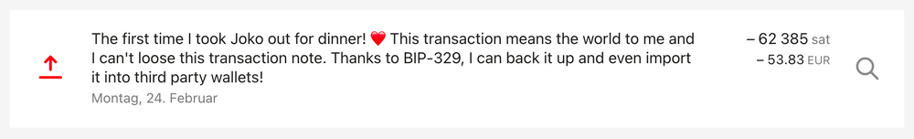
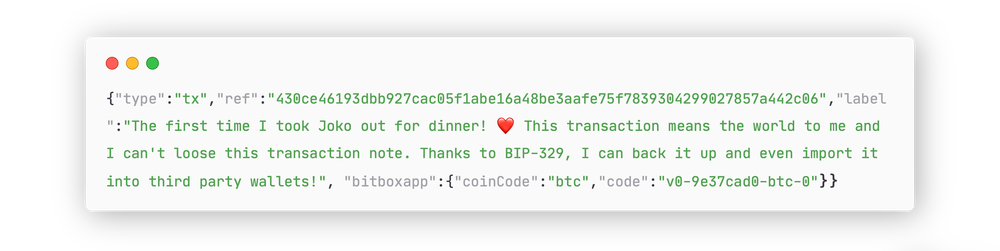
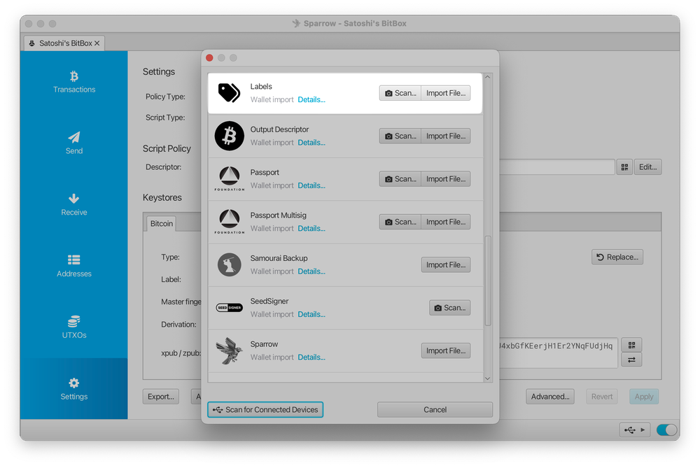

> *作者：Sebastian*
> 
> *来源：<https://blog.bitbox.swiss/en/import-and-export-wallet-labels-with-bip-329/>*

随着不同账户间的入账交易和出账交易越来越多，比特币的钱包软件很快会产生一堆乱糟糟的数据，很难管理和掌控。单纯的交易哈希值和比特币地址，不能表明相关交易的任何事情 —— 尤其是你几年之后回来看的时候。这个跟常规的银行账户可能没有什么区别：想想如果没有标签和关于交易背景的信息，面对一长串的支付历史，你会不会非常困惑？

这就是我们需要交易备注和账户标签的地方，这样我们就能用文字标注交易和账户的背景。简而言之：打标签太棒啦！

但是，要是你不得不迁移到一台新的计算机上，或者需要重装自己的钱包软件呢？如果这些标签最终都会弄丢，那就没有理由建立这些标签了。自 2024 年 7 月我们 BitBox 发布 [Ritom 升级](https://blog.bitbox.swiss/en/bitbox-07-2024-ritom-update/)以来，BitBoxApp 的用户就已经可以**导入和导出自己的交易备注**了。但很多人不知道：这些备注可不是只能待在 BitBoxApp 里面！你可以在**不同的软件钱包之间交换这些标签** —— 而且不是什么生硬死板的办法。

让我们来看看这些钱包标签背后的东西：BIP-329 标准，以及你在 BitBoxApp 里可以如何使用它，以及为什么我们鼓励其他钱包开发者也支持它、使之成为行业标准。

## BIP-329

热门的 [Sparrow Wallet](https://sparrowwallet.com/) 软件的创建者 Craig Raw 编写了这个比特币优化提议 [*“钱包标签导出格式”*](https://github.com/bitcoin/bips/blob/master/bip-0329.mediawiki)，致命了钱包应该如何构造交易和账户的标签，使这些标签能在不同钱包之间互操作。换句话说，该 BIP 引入了一个标准，而标准通常是让事情变得简单、有组织的好方法。

这个标准的工作原理挺简单的：在一个钱包软件导出其内部的交易标签时，产生的文件必须具有一种非常具体的格式，让其它钱包软件能够理解。文件内的每一个条目都被归类为你在比特币钱包中可能遇到的概念，比如：交易、地址、公钥，等等。然后，这些条目会包含一个对实际数据（比如比特币地址）的参考，以及相关的标签。其它理解这个文件结构的钱包软件就能解析文件中的这些条目，并相应为本地数据添加标签。

- BitBoxApp 中的一个交易备注 -

BIP-329 标签导出格式最棒的一点是，这些标签依然是直接可读的形式。如果你用文本编辑器打开导出的文件，你可以直接阅读和理解文件的内容，因为它使用了一种叫做 “JSON（JavaScript 对象表示法）” 的常用数据结构：

- BIP-329 标签导出文件中的同一个交易备注 -

这个标准还允许用少量的比特来提供额外的信息，比如这些标签产生于什么钱包软件，以及一个输出是否应被钱包软件标记为可花费 —— 但这些完全是可选的特性，BitBoxApp 当前就不使用它们。

请注意，在你导出的交易备注中，不仅包含了这些标签，还有关于你的钱包地址和公钥的信息。为了保护隐私，应该只跟你信任交付这些数据的人和设备分享这些信息。

## 与第三方钱包联合使用

默认情况下，BitBoxApp 可以根据 BIP-329 标准导出你的交易备注和账户名。这意味着，将这个文件导入其它支持 BIP-329 的钱包软件应该是没有障碍的；一个这样的例子是 Sparrow Wallet。你可以在[这个网站](https://bip329.org/)检查哪些钱包和服务支持 BIP-329 。一些钱包软件可能会强制使用 “.jsonl” 的文件格式，这时候你只需要在导入之前重命名一下文件的后缀，改一下字符就行。

类似地，要导入来自其它钱包软件的标签到 BitBoxApp，请先把文件格式改成简单的文本格式（也就是重命名，将文件名的后缀改为 “.txt”），这样你在 BitBoxApp 的文件选择框里面才能选中这个文件。在下一个版本的 BitBox 中，app 将允许直接导入 “.jsonl” 文件，进一步提升与其它钱包软件的互操作性。

- 在 Sparrow Wallet 中导入标签 -

注意，你的交易标签是不会在不同的钱包软件之间实时同步的 —— 并不必然是坏事，因为它们本来就不应该能够相互通信。如果你真的想获得这种效果，[Labelbase](https://labelbase.space/) 这样的服务可以集中管理你所有的标签。

如果你需要在 BitBoxApp 内使用导入和导出功能的帮助，请看我们的[知识库文章](https://support.bitbox.swiss/transactions/how-to-import-and-export-transaction-notes)。

## 扩散出去

标准是好事，但越多人使用它，就越好。想想看 BIP-39 种子词标准，它将今天几乎所有钱包软件和硬件签名器的钱包备份都标准化了，所以比特币的自主保管对每个人来说都变得更加容易、更加顺滑。

这道理对 BIP-329 也是一样的。如果你喜欢的（BitBoxApp 以外的）钱包软件还不支持 BIP-329，请联系它的开发者，请求加入这个功能！钱包软件开发者一般对直接来自用户群体的特性需求都很开放。

## 结论

有个客户联系了我们的支持团队，询问如何将 Sparrow Wallet 中的交易备注转移到 BitBoxApp 中，我们才意识到，大部分用户并不知道 BIP-329 标准！我们希望这篇博客不仅能提供关于在 BitBoxApp 中使用标签导出标准的有用信息，还能增加人们对这个简洁的小标准的认识。随着采用率增加，它将能够优化自主保管的尚不尽人意的一个方面，并提升每个人的使用体验。

（完）