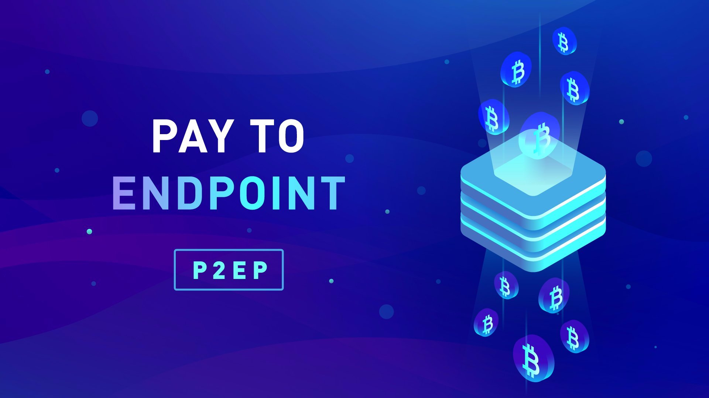

> *作者：Matthew Haywood*
>
> *来源：<https://blog.blokstream.com/en-improving-privacy-using-pay-to-endpoint/>*
>
> *原文出版于 2018 年 8 月 8 日。*




一种资产要想成为交换媒介，就必须是同质化的：它的一个单位可以很容易换成另一个单位，而且每一单位的价格都相同。而因为比特币区块链的交易历史是公开的，区块链分析使得一些公司可能会声称某些比特币是 “带污染的”、不接受它们作为支付。尝试追踪比特币的所有权变更的区块链分析公司可以伤害用户的隐私性以及无偏见地自由交换比特币的能力。除非交易的隐私性可以得到保证，不然比特币就失去了一些同质性。

最近，一个社区研讨会的参与者给自己制定了提高比特币基本交易隐私性的目标。我们给这个团体的努力做了一份总结，为钱包开发者提供了一个常用的手段来抵御区块链分析公司最常见的启发式分析法，如此一来，也为比特币提供了更强的同质性。

这个团体的目标是鼓励社区讨论和付出进一步的努力，为钱包和支付处理商提供一个标准化的方法，以更隐私地交互。

## 打破区块链分析工具

在 2013 年的[论文](https://cseweb.ucsd.edu/~smeiklejohn/files/imc13.pdf)中，Meiklejohn 等人列举了一种关键的启发式分析法，可将比特币区块链上的地址联系起来。他们发现，区块链分析领域的一项基本原则是 “一笔交易的多个输入的公钥都来自同一个人”。

因此，常规的比特币交易的构成，就给了希望跟踪一个地址及其所有者的分析公司一个切入点。这也正是研讨会希望解决的问题。

需要指出的，要打破这种 “输入所有权同一（common input ownership）” 假设，并不需要每一笔交易都使用某种解决方案。只需要保证一定数量的交易是由多个不同所有者提供输入的，就自然使之不再有效。而因为这种假设是区块链分析的基石，可以进一步合理假设，如果这样的解决方案能得到广泛的应用，比特币区块链的分析也将被打破。

这个思路给了这个团体一个更明确的目标：

> 提供一种方法，让超过一方提供输入的交易变得足够普遍，从而让 ‘输入所有权同一’ 的假设不再成立

## 确定前提条件

在提出的各种方案中，许多都被发现有同样的问题。我们不详细介绍每一种方案并给出相应的批评，它们共同的问题在于需要一种有效的解决方案来处理下列问题：

- 在点对点的参与者之间要建立一个交互式的流程
- 防范或减少 UTXO “窥探” 攻击的影响（就是支付者尝试发送重复、不完整的请求来知晓接收者的 UTXO）
- 减少无响应攻击的影响

## “Pay-to-EndPoint（P2EP）” 提议

多种思路融汇后的结果就是 “P2EP” 提议。虽然也不是十全十美，但它似乎能满足我们一开始的目标：让 “输入所有权同一” 假设失效，并解决了需要参与者点对点交互并具备一定攻击抗性的问题。

> P2EP 的基本思路是让支付者和接收者都为交易提供输入，并由接收者使用 BIP21 兼容的 URI 呈现的端点来协调交互。

P2EP 不需要比特币协议的变更，而且这样创建的交易也不会被容易识别出来，因为它们跟常规交易有着同样的 “指纹”。

也许最好的解释方式就是介绍一下如何使用 P2EP 来构造一笔交易：

### 步骤 1

接收者（商家或者终端用户）声称一个 BIP21 格式的 URI，加入额外的参数来指明自己的 P2EP 端点。因为 BIP21 允许使用当前不被理解的变量，所以它不会打破现有的钱包实现。端点地址不必非得是洋葱地址，任何兼容的端点的 URI 都行。

一个 URI 示例（改编自 BIP21 的示例）：

```java
bitcoin:175tWpb8K1S7NmH4Zx6rewF9WQrcZv245W?p2ep=3j4tau93wkc8mh32.onion
```

### 步骤 2 

支付者通过确认接收者提供的端点可用来初始化交互。如果不可用，则交易会按常规方式广播，支付给接收者的 BIP 21 常规比特币地址。如果接收者提供的端点可用，支付者提供一个签过名的交易作为 UTXO 的所有权证明。

### 步骤 3

接收者可以发送多笔交易给支付者，供支付者签名。在这些交易中，只有一笔包括了实际由接收者持有的 UTXO，其余的都是从可用的 UTXO 池中挑选出来的，这些交易既可以串行发送，也可以并行发送给支付者。两者在隐私性和交互速度上各有优劣，所以实际上该怎么做是一个开放问题，留待讨论和实现。

**按顺序发送**：依次发送的每一笔交易都有一定概率是发送者的。这个概率依赖于接收者选出的交易数量，以及整个队列是如何随机化的。整个交换过程结束后，接收者会收到支付者签过名的、包含了他自己的 UTXO 的交易。

**并行发送**：接收者创建的多笔交易一次性发送给支付者。支付者拿到的一组交易中，预计只有一笔是接收者能够动用的。支付者猜测正确的概率与接收者选出的交易数量成正比。支付者签名所有交易并一次性返回。

接收者发送的交易数量，当前的提议是 100 个，这平衡了支付者和接收者两端的隐私性和 数据传输/处理速度。

应该指出的是，Bulletproot 有很大潜力可以替代 UTXO 交换方法。

### 步骤 4

无论是上述哪种情形，但接收者拿到包含了其 UTXO 的、支付者签过名的交易之后，他们就可以加上自己的签名，并广播到网络中。这笔交易包含了支付者和接收者两端的输入。

不论 P2EP 的流程在哪一个环节失败，支付者的交易都会以普通交易的形式广播。

### P2EP 交易示例

如果 Alice 要给 Bob 支付 1 BTC：

- Alice 为一笔交易提供面额为 3 BTC 的输入
- Bob 为同一笔交易输入 5 BTC
- Alice 收到 2 BTC（作为她的找零）
- Bob 收到 6 BTC

上述交易就打破了 “输入所有权同一” 的启发式分析法，可以[交易含义的解释也很多样](https://youtu.be/IKSSWUBqMCM?t=2454)。比如，它可以被解释成是 Alice 在给 Bob 支付 6 BTC，因此她提供了总计 8 BTC 的输入，拿回 2 BTC 作为找零。

## P2EP 的优点和缺点

**优点**：

- 打破了 “输入所有权同一” 假设。即使是很小规模的采用，累积起来也会帮助常规的 “非 P2EP” 交易提高隐私性。
- 打破 “subset sum” 分析。
- 接收者的 UTXO 消耗可以帮助减少 “UTXO 集膨胀”。
- 接收者可以使用 P2EP 来整合自己的 UTXO 集。
- 不像传统的、面额固定的 CoinJoin 交易，P2EP 这种交易没有明显的 “指纹”，也就是它外观上跟常规交易没有什么不同。
- 支付方的钱包可以是轻钱包。
- 支付者和接收者都获得了更好的隐私性。

**缺点**：

- 接收者以及支付者，必须在构造 P2EP 交易时在线。

- P2EP 的在线交互属性会稍微拖延交易的广播。

- 接收者需要有一个 “热钱包” 来签名交易

- 发送者的手续费可能增加，因为交易的体积增大。如果接收方也有意整合 UTXO，那么可以向接收方收费来缓解这一点。

- 相比于传统的交易，钱包的处理负担增加。

- 接收者需要能够访问一个全节点。

## P2EP 的下一步？

P2EP 依然处于早期阶段，在提出正式的提案之前，我们需要社区的评论和提炼。

这个想法也可以延伸到包含其它的交易形式，比如支付分割（payment splitting）和简单 coin swap。

（完）