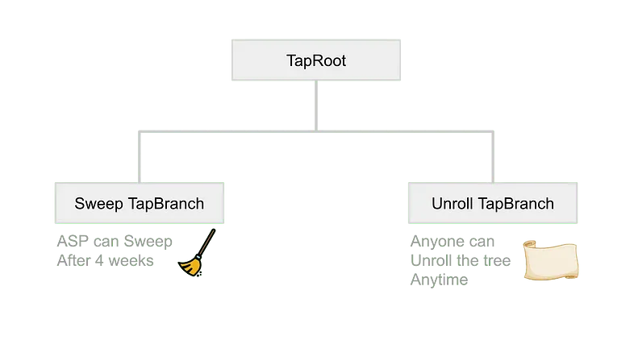
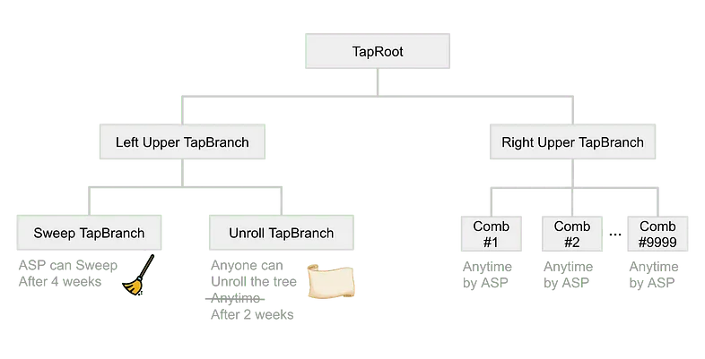
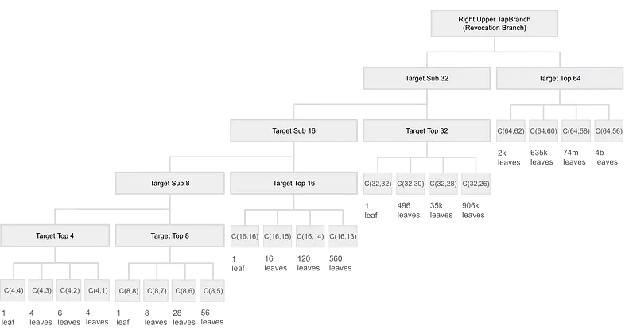
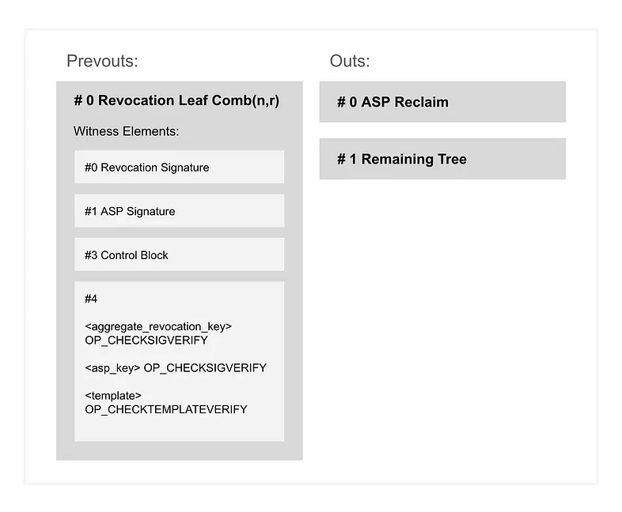
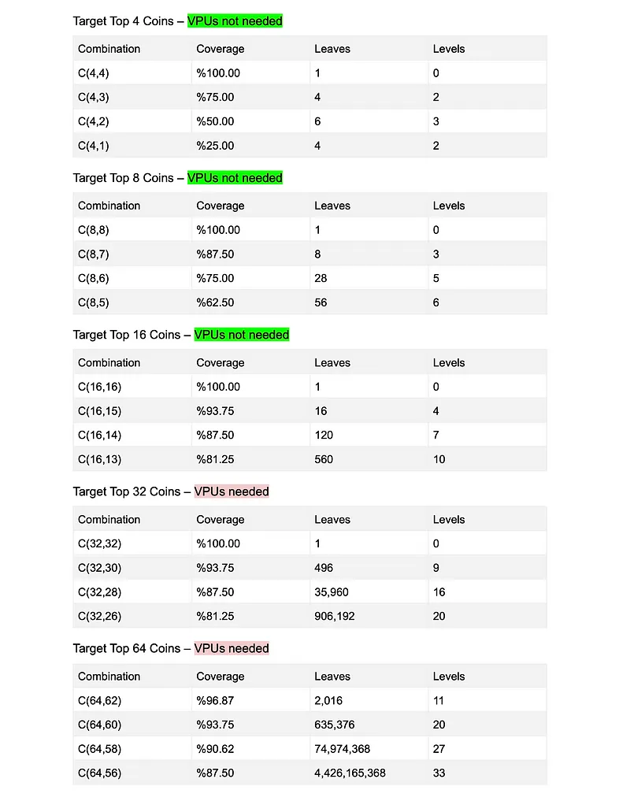

> *作者：Burak*
> 
> *来源：<https://brqgoo.medium.com/introducing-ark-v2-2e7ab378e87b>*


迄今为止，对 Ark 构造最主要的顾虑是流动性锁定问题。随着网络中交易量的增加，服务供应商必须锁定更多的流动性，这让 Ark 最终成为高容量但低流动性的网络。

在一个服务器上运行 Ark 已经在实质上解决了流动性顾虑。在服务器上，Ark 可以将 24 小时作为一个回合，也就是 ASP（Ark 服务供应商）可以每日循环自己的资金。光这一点就胜过了闪电通道，因为建立服务器之后，你就可以毫不费力地接受支付，而不需要开启通道。

虽然在服务器上运行 Ark 从流动性角度看已经非常高效了，Ark 背后的理念是消灭技术门槛、为所有人拓展比特币支付，并且要做到对用户友好。这就是 Ark v2 的由来了。

Ark v2 让 ASP 可以回收流动性而无需等待过期时间（4 周）。看起来是不是美好得不真实？

在当前的 Ark 架构中，用户共享的 UTXO 的 TapTree 结构是这样的：



<p style="text-align:center">- Ark v1 中共享 UTXO 的 taproot 脚本树结构 -</p>


这个脚本树有两个分支：一个是 ASP **清扫资金**分支，另一个是用户**展开内部状态**分支。

清扫分支可以由 ASP 在 4 周后动用，以高效地回收锁定的资金。

而展开分支则可以由任何用户在任意时间动用，将解除拥堵控制而让所有用户共享的 UTXO 的内部状态全部暴露。

<p style="text-align:center">- - -</p>


而在 Ark v2 设计中，新的 TapTree 结构是这样的：



出现了两个更高层级的分支：**左顶层分支**和**右顶层分支**。

清扫分支和展开分支都在左顶层分支内，并且：

1. 清扫分支保持原样；
2. 展开分支不能再随时触发；相反，只有在资金创建的 2 周之后才能触发。

此外，还增加了一个顶层分支。我们管这个分支叫 “右顶层分支”，或者直接叫 “**撤销分支**”。这个分支对应的是撤销可能性的多种组合。

有足够多的用户花费自己的 vTXO 时，ASP 就会进入撤销分支，高效地回收对应的流动性，而不必忍受任何时间限制。

（译者注：如前所述，在一个 Ark 构造控制的资金（UTXO）中可能存在多位用户，他们是共享（share）这个 UTXO 的。为了分析的便利，我们就使用 “vTXO（虚拟的交易输出）” 这个概念 —— 这些用户在这个共享 UTXO 中的资金可以概念化为 vTXO，他们都是 vTXO 的持有者。）



<p style="text-align:center">- 撤销分支 -</p>


Ark v2 引入了跟闪电通道类似的撤销机制。在闪电通道中，用户通过揭晓一个私钥来撤销自己的通道状态。类似地，在 Ark v2 中，用户在花费一个 vTXO 时就揭晓一个私钥。不过，有区别的地方在于，在这里，用于作废状态的私钥会被聚合，然后用到集中回收资金的时候。

每个 vTXO 的拥有者都持有一个单独的撤销私钥。当足够多 vTXO 持有者揭晓自己的私钥，ASP 就会聚合这些私钥：

**聚合撤销私钥** = *sec1 + sec2 + sec3 … + secn*

**聚合撤销公钥** = *sec1⋅G + sec2⋅G + sec3⋅G … + secn⋅G*

使用一个来自这个聚合私钥的有效签名，ASP 就可以获得**撤销分支**内对应叶子的访问权。

一个**撤销分支**可以压缩几百万甚至数十亿个叶子，每个叶子都代表一种**聚合撤销公钥**组合，也就对应着具体的一种撤销可能性。虽然构造这么大的树可能是计算密集的，但具体的一个叶子可以很容易解锁，只需一个检查签名的操作码（CHECKSIG）：

```
<aggregate_revocation_public> OP_CHECKSIG
```

**位于撤销分支中的叶子**，也必须使用一种限制条款来限制花费交易的输出，将资金交给 ASP 以及一棵修剪后的树，也就是在把锁定资金交还给 ASP 的同时，将资金重新分发给剩余的 vTXO 持有者。



撤销分支的叶子中的最终脚本将是这样的：

```
<aggregate_revocation_key> OP_CHECKSIGVERIFY <asp_key> OP_CHECKSIGVERIFY

<constrained_outputs_template> OP_CHECKTEMPLATEVERIFY
```

<p style="text-align:center">- - -</p>


一个包含 16 个 vTXO 的共享 UTXO 将包含一个带有总计 805 个叶子的撤销分支。ASP 可以容易地构造出这样的分支，要验证内容的客户端也容易重新构造出来。

如果一轮中注册的 vTXO 的数量超过 16 个，那么组合树就会加深，最终可能让撤销分支包含几百万、数十亿个叶子。幸运的是，一棵 MAST 可以拥有高达 [340282366920938463463374607431768211456](https://bitcoin.stackexchange.com/questions/110243/maximum-number-of-possible-mast-leaves) 个叶子，而且其 control block 的链上踪迹（体积）是 log n 级增长的，并且还能从隔离见证的折扣中获得好处。

问题不在于链上足迹，而在于计算。为了构造这样大型的撤销分支，ASP 可能需要定制化的硬件，比如 VPU。

又因为客户端无法重新构造出这样大的撤销分支，他们必须使用一种由 ASP 提供的 VPU 所生成的零知识证据，来验证撤销分支的内容。



<p style="text-align:center">- vTXO 的数量-运算量对照表 -</p>


此外，ASP 可以将共享 UTXO 切成几份，每份包含 16 vTXO；每多一份，链上体积会增加 43 vByte。

总体来说，这个新的设计引入了重大的开销，但似乎是值得的。

<p style="text-align:center">- - -</p>


注意，撤销点的设计改变了 vTXO 的输出点索引，让基于 CHECKSIG 的连接器（connector）设计变得无用。相反，新设计必须使用内省能力以及基于 CSFS 的连接器。这意味着，vTXO 的持有者必须仅签名连接器的输出点索引，以除去自身，也就是从签名消息中清除自己的输出点上下文。

<p style="text-align:center">- - -</p>


格外感谢 [Matt Corallo](https://twitter.com/thebluematt?lang=en) 启发我开发出这个撤销设计。

（完）