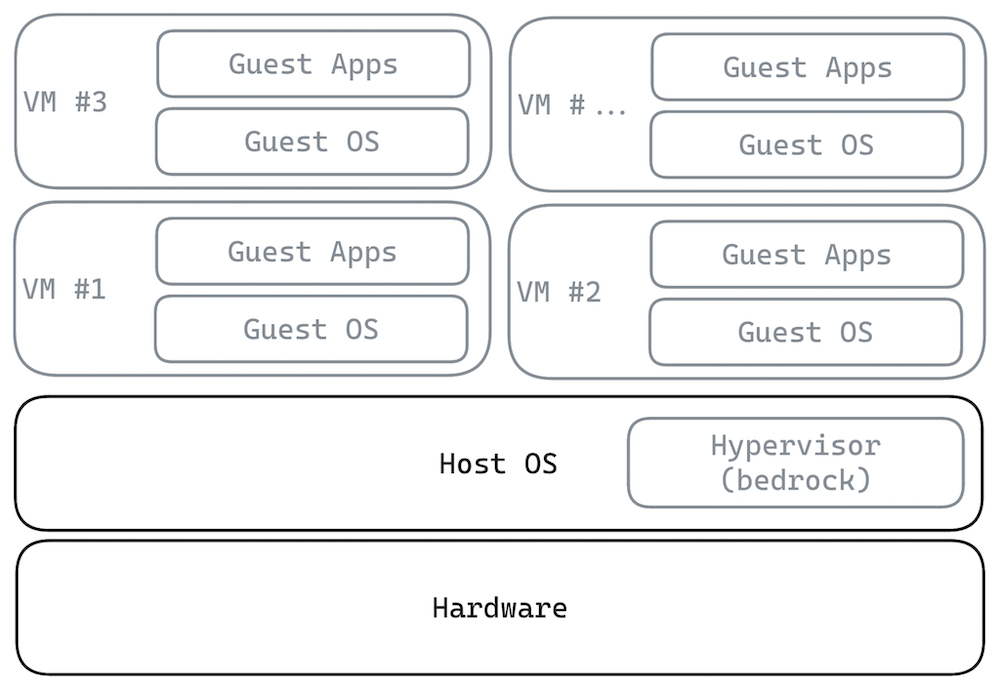
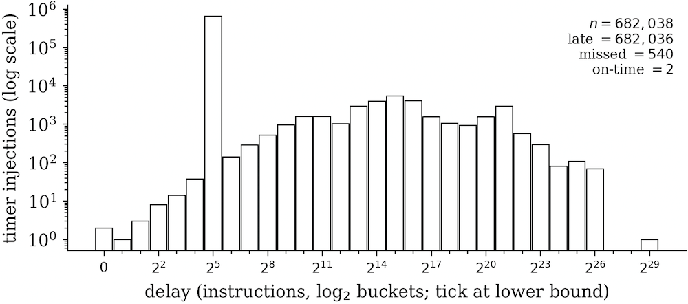
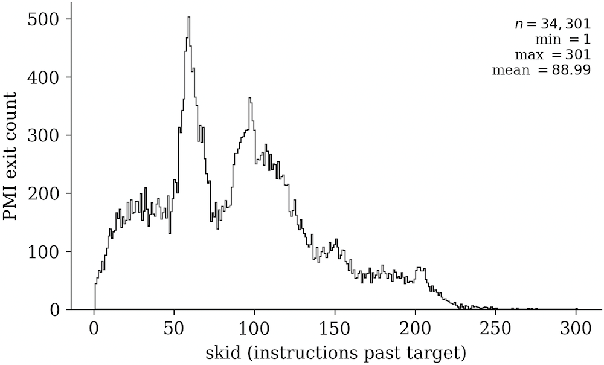
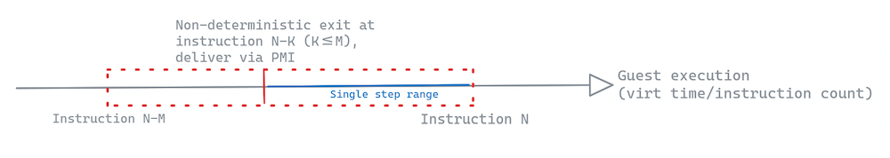
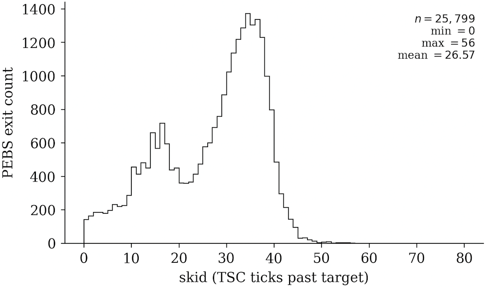
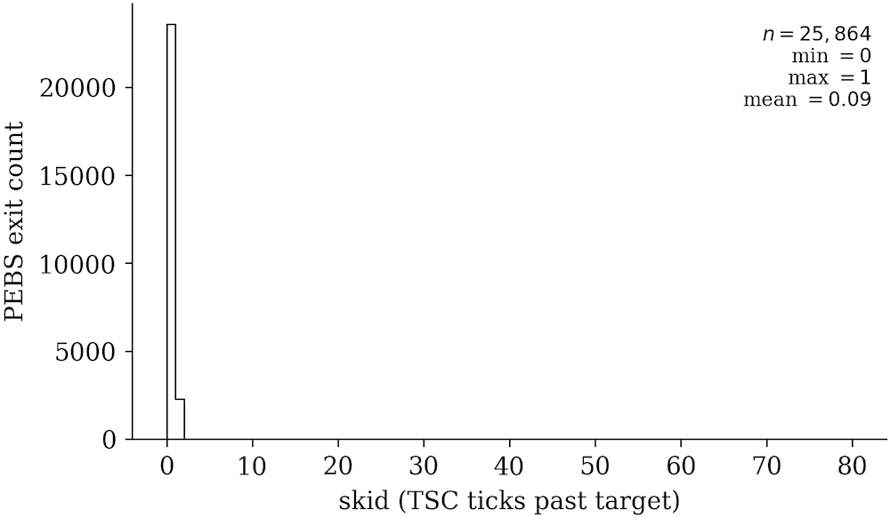

> *作者：NIKLAS GÖGGE*
>
> *来源：<https://brink.dev/blog/2026/06/25/bedrock-deterministic-hypervisor/>*
>
> [*前篇见此处*](https://www.btcstudy.org/2026/05/13/fuzzamoto-non-determinism/)

在 [Fuzzamoto 系列博客的第二篇](https://brink.dev/blog/2026/04/09/fuzzamoto-non-determinism/)（[中文译本](https://www.btcstudy.org/2026/05/13/fuzzamoto-non-determinism/)）中，我指出了 “非确定性” 在模糊测试中引发的困难、非确定性的来源，以及 Fuzzamoto 在减少非确定性上的一些机智的变通措施。

在本文中，我将介绍在软件测试中实现完全的确定性的一种通用的解决方案：开发一种确定性的虚拟机管理软件（hvpervisor）。具体来说，我将深入讨论模拟时间的挑战，以及如何让虚拟机在达到准确的指令计数后退出，办法是（过度）使用 CPU 的性能监控单元。

我并不是第一个尝试开发此类技术的人，[Antithesis](https://antithesis.com/) 已经开发出了一款确定性的虚拟机管理软件，以及围绕它的一个全面的自动化测试平台。就我个人经验而言，他们已经开发出了当前最先进、最易用的 模糊测试/基于属性的测试 系统之一。他们的整个系统是专有的，也是闭源的，所以当我阅读他们的博客文章《[*你想自己编写一个确定性的虚拟机管理软件吗？*](https://antithesis.com/blog/deterministic_hypervisor/)》时，我马上作出了决定，“是的，我正有此意”。

唯一的问题是，我对 hypervisor 如何工作一无所知，甚至连它是什么都不清楚，只知道一个抽象的概念：“一种管理虚拟机的东西”。所以为了起步，我打开了 claude code 软件，开始输入提示词让 AI 帮我编程。不幸的是，这可不像 “Claude，帮我开发一款确定性的虚拟机管理软件，别犯错” 这么简单。但 8 个多月以后，Claude 和我成功制作出了似乎可以工作的东西：[bedrock](https://github.com/dergoegge/bedrock) 。

所以，一个 hvpervisor 到底是什么呢？它就是一种运行虚拟机的软件：它使用 “硬件虚拟化” 技术（比如 Intel CPU 的 VT-x），以原生系统一样的速度直接在 CPU 上执行客机（guest）代码，同时保持拦截客机任何动作的能力。这个机制是，虚拟机（VM）退出，CPU 运行客机指令，直到客机触及 hypervisor 要求拦截的东西，这时候，控制流回归 hypervisor ，由它来处理事件并恢复客机运行。说得简单一些，你可以认为它是一个巨大的循环，它运行了一个虚拟机， 在退出时，会参考一个巨大的 switch 语句来决定如何处理特定的退出，然后，下一个循环迭代开始、虚拟机恢复运行。

Claude 一开始告诉我，我们可以直接使用 KVM（与 Linux 内核一起发布的虚拟机管理软件），将它配置成只要客机尝试搞出非确定性就退出（例如执行 `rdtsc` 指令），然后转而模仿这种动作。这个想法在概念上是正确的，但我们接下来就会看到， 实际上是无法成立的。将确定性的虚拟机管理软件作为软件确定性的通用解决方案，这背后的洞见是，所有的非确定性都来自于底层的硬件，而虚拟机管理软件可以充当我们要测试的软件与底层硬件之间的一个确定性边界。

任何知道这些虚拟机管理软件如何运行的人（我就不在其中），都会立即知道现有的 KVM 做不到这些事，也没有所需的配置能力，而且完全不是为这种用法而设计的。你可以拿到 KVM 的源代码、改成支持确定性执行（这就是 Antithesis 的做法，只不过其基础不是 KVM，而是 [bhyve](https://bhyve.org/)），但无法开箱即用。

以今天的事后之明，我知道了选择一款已有的虚拟机管理软件、修改成确定性的，会是更聪明的办法（我可能花了一个月甚至更多时间才让一个 Linux 内核启动），但是 —— 我也不记得为什么了 —— 我选择了自己从头开发一个新的软件。最初的 2 ~ 3 版迭代，是作为一个 Linux 内核模块、用 C 语言写的，但最终 —— 在因为内存不安全问题、缺乏测试以及忘记在一些退出路径中重新启用内核抢占而导致的许多次主机内核崩溃之后 —— 我决定用 Rust 语言重写我的内核模块。你当然可以为用 C 语言编写的内核模块编写测试，但使用 Rust，我可以用 “trait”（Rust 语言的一种特性）来创建内核或者硬件特性的抽象，然后为运行在用户空间中的 hypervisor 逻辑编写标准的 cargo 单元测试。

事后证明，这种用户空间内测试比我最初想得要没用一些，因为绝大部人恼人的 bug，实际上都来自缺失的硬件特性或者内核 API（正是这些单元测试不会覆盖的部分）。为了解决这个问题，我创建了 Claude skill 文件，让 LLM（大语言模型）可以访问 5000 页的 Inter 软件开发者手册（SDM），以及这个模块所依赖的具体 Linux 内核版本的源代码。这些 skill 大大提升了 LLM 一次就生成正确代码、调试说外出现的 bug 以及探索必要硬件特性的能力。那个 SDM skill，按我自己的理解，也尤其好，因为它大大提升了 Claude 解释的准确度。

因为 becrock 无意称为通用的虚拟机管理软件，可以采取大量简化措施，包括但不限于：只支持一部分新式的带有 Intel® VT-x  的 Interl x86 CPU ；由该虚拟机管理软件管理的虚拟机只有一个 CPU；客机和主机都只支持一部分 Linux 内核版本；并且，不关心安全性。

## 模拟时间

我现在要深入讨论一个确定性的虚拟机管理软件不得不面对的一个显而易见的问题：模拟时间。不能允许客机观察真实的硬件时间戳计数器（TSC），不然，它的执行就会依赖于真实 TSC 的非确定性本性。这个虚拟机管理软件的工作就是：无论什么时候，只要一个 VM 尝试读取真正的 TSC，就强迫它退出，然后转而返回一个模拟的数值。这需要诱捕 `rdtsc` 这样的指令以及特定的 “模式专用注册器（MSR）” 读取动作，同时找出一些确定性的指标，可以作为客机花费在执行上的时间的代表（proxy）。

Claude 的第一个幼稚的建议是统计 VM 退出的次数，然后将这个计数器作为模拟的 TSC 数值返回给客机。VM 退出的此处显然并不是时间的合理代表，因为两次退出之间的时长可能有很大的差异。绝大部分确定性虚拟机管理软件的做法是统计被客机执行的指令的数量，然后使用这个记录下来的指令计数器除以主机的时钟频率，作为模拟 TSC 的数值。这也并不完美，因为并非所有的指令都花费一样长的时间来执行，但也够用了。

模拟的 TSC 也用来决定什么时候注入定时器终端。问题就出在这里，因为在特定的模拟 TSC 数值（也就是一个具体的指令计数值 N）出现时叫停客机，从而在正确的时机注入一次中断，并不是 Intel CPU 的有文档说明的应用场景。一种幼稚的 “解决方案” 是不作准确的中断，只在自然的确定性退出边界上注入中断。我度量了这种办法的误差，在虚拟机上观察到的计时器注入延迟中，最坏情形是大约 0.2 秒。

即使这看起来能工作 —— 而且我没有从客机上观察到任何因为这种不精确而出现的意料之外的动作 —— 计时器中断是驱动 Linux 内核任务调度器的部件，而且大多数软件都假设它能可靠工作。除此之外，我们还需要准确的中断交付来向客机注入其它事件（比如，执行 bash 指令）。在测试语境下，这种不精确也可能导致 bug 漏网。所以我们还需要一些机制，在具体的指令计数值出现时触发 VM 退出。

性能监控单元（PMU）支持多种常用的性能监控计数器（PMC），用于软件的基准测试（顾名思义）。有些 PMC 可以编程为倒数指令数量，然后在计数器到达 0 值时触发一次性能监控中断（PMI）。这是通过将计数器设置为其最大数值减去所需的指令计数 N 来实现的，每执行一个指令，指令计数器就递增 1，最终总会在它溢出后触发 PMI 。

虽然我们可以使用虚拟机管理程序拦截 PMI，这些中断会通过“高级可编程中断控制器（APIC）” 异步地交付，同时客机会继续执行。Antithesis 也在他们的博客文章中提到，“*PMC 支持一种门限通知系统，你可以将计数器设为一个 ‘倒计时’，在数值变为 0 时获得一次中断。不过，因为这种中断是通过 APIC 交付的，在 CPU 真正注意到门限事件之前，还会再执行数十个指令。而且，这种中断交付的开销，如果以 CPU 循环来度量，会有很大差异，意味着你实际上无法知道从触发一次中断到你收到它之间隔了多少时间。*” 我度量了这种 PMI 延迟，可见下图。

这个数据集虽然样本较少（大约 34k 次 PMI），我观察到的最长滑行距离（超过目标范围之后被执行的指令数量）是 301 个指令。从我的实验来看， 通过向我们感兴趣的确切指令计数添加一个滑行范围，然后利用基于 “监控陷阱标签（MTF）” 的步进来吸收掉这个滑行，就足以创建一种精确的退出原语。

也就是说，我们编程了 INST_RETIRED.ANY PMC ，它在指令数量 N 减去我们的滑行窗口 M 时溢出，然后我们逐步逐步走完剩余的窗口，抵达 N 。在我的测试中，这似乎能够工作，而且看起来是确定性的，只不过，尤其在嵌套虚拟化条件下，这种许多单步推进的性能非常差（而这种条件对测试又很有用）。Antithesis 的博客和 SDM 都包含了提示，让我觉得我可以做得更好。

尤其是，“基于精确事件的采样（PEBS）” 特性吸引了 Claude 和我的注意，因为它承诺可以精确地统计指令数量，尤其在其 “精确分布模式（PDist）” 内。在我的测试中，使用 PEBS，可以将观察到的滑行距离从几百个指令缩减到几十个。我的理解是，上述 INST_RETIRED.ANY PMC 方法实际上有两种延迟，都进入了观察到的滑行中，一种是 APIC 延迟，另一种从计数器溢出到实际触发 PMI 的延迟。但使用 PEBS 以及 PDist，我们只承担 PMI 延迟，所以观察到的滑行分布变得更集中，如下图所示。

这更接近与理想的零滑行目标，而且，虽然它看起来已经足够好了，我还是好奇能不能再进一步。

当一个 PEBS+PDist 计数器溢出的时候，CPU 会写一段 PEBS 记录到你提前设定的内存位置，准确地放在触发溢出的指令之后。这个记录包含了紧跟在计数器溢出时间之后的一些 CPU 注册器数值，也可以编程为包含其它数据。不过，我们感兴趣的不是记录的内容，而仅仅是这个动作：在非常接近于我们关心的时间点之后，一些东西会被写入内存。我们能不能设置 PEBS 的缓冲位置，从而触发一次 VM 退出？也许可以借助 “拓展页表（EPT）” 偏离？EPT 偏离是 VM 退出，不是中断，因此不需要通过 APIC 来交付，所以，如果可以这样做，我们就能避免 APIC PMI 时延。事实证明，在带有 Ice Lake-SP（或者更新）微架构的 CPU 上，这是一种得到支持的特性，叫做 “EPT 友好的 PEBS”，它让我们可以设置 PEBS 缓冲位置到一个客机线性地址（guest-linear address），并且更重要的是，它可以在 PEBS 缓冲写入时触发一次 EPT 偏离。使用这种办法，我们就在 Sapphire Rapids CPU 上得到了下面的滑行分布。 

（绝大部分）零滑行！【1】但是观测到的这 9% 的滑行了 1 个指令的情形，是怎么回事呢？Claude 告诉我，使用 PEBS+PDist 要求至少至少重新加载 256 条指令到一个计数器中，这意味着，如果两个精确的退出动作之间相隔不到 256 个指令，我们就无法使用 PDist，只能使用默认的 PEBS 动作，在 N+1 个指令时写入记录。给定这种有时会 +1 的滑行动作（在比如外部中断这样的情况下，也是非确定地发生的），我们依然不得不依赖于 MTF 逐步推进，但好在只有几个指令，而不是几十上百个！

【1】：在一个 Ice Lake-SP CPU 上，观测到的滑行分布要多几个指令。我的设想是，这是因为用到的 PMC 在 Ice Lake-SP CPU 上的精度只达到循环级别，而不像在 Sapphire Rapids 上可以达到指令级别。

Antithesis 在他们的博客中有暗示过这种机制吗？我不这么认为，或者说，至少没有直接提到，因为他们产品使用的是运行 Skylake 微架构的机制，而这种微架构应该不支持 EPT 友好的 PEBS。不过，他们通过一些没有文档记录的特性、得到了相同的动作，也是有可能的。他们指出：“*我们利用了多种 CPU 特性，稍稍越出了它们的设计用途，这意味着，在每一步中，都要细致地探索它们的真正的、没有明说的功能。*” 也许他们发现了一些完全不一样的机制，或者仅仅是接受了更高的步进开销（我怀疑是这样），但只有他们才能揭晓这个秘密。

## 结论

我一直认为，在软件测试中实现完全的确定性，是一个遥不可及的目标；直到大约一年以前，有人在本地聚会上跟我提起 Antithesis 。了解他们的产品以及开发 bedrock 的过程，完全改变了我的想法。最初是一些令人生畏的抽象概念，但经过与 Claude 的几个小时的连续对话以及对 Intel SDM 的深入研究，它们变成了一个有形的项目。这个项目是一个欢迎招牌 —— 即使是最复杂的系统，也可以被正确的工具和足够的耐心揭开。

本文专注于模拟时间的问题，具体来说，是如何实现精确的 VM 退出。这套虚拟机管理软件已经支持许多有趣的特性（写入时复制的 VM 复刻、客机与 hypervisor 之间的确定性 I/O 通道，等等），未来我可能会写更多文章介绍它们。如果你对某些东西好奇，请让我直到。

当然，还有很多很多东西要实现和修补。如果这篇文章引起了你的兴趣，请放心联系我，或者你可以直接看[这个库的代码](https://github.com/dergoegge/bedrock)，然后开始贡献。

（完）