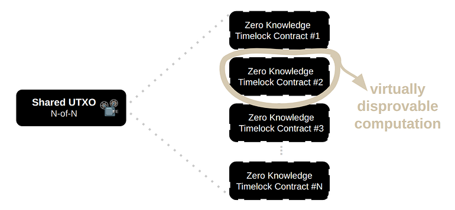
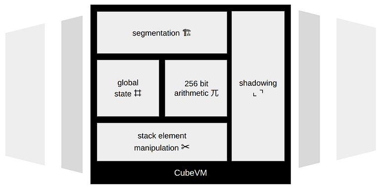
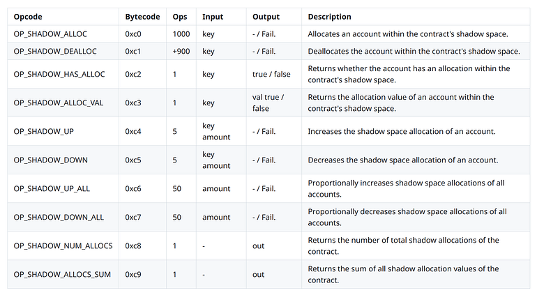
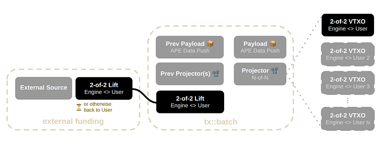
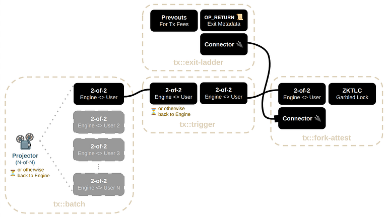
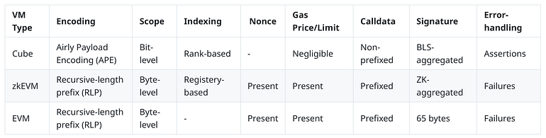
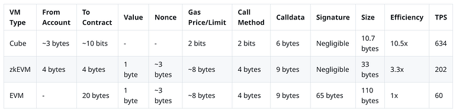
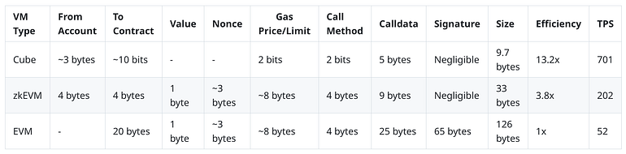

> *作者：Buark*
> 
> *来源：<https://medium.com/cube-bitcoin/introducing-cube-8b3702e470a5>*


“[Cube](https://github.com/cube-btc/cube/tree/main)”是一种专门为以原生于比特币的方式启用**免信任的智能合约执行**而设计的虚拟机。它能提供带有单方面退出能力的免信任的执行环境，从而保证用户对自己的资金保持完整的控制权。通过结合 BitVM 与 “超时树”，并利用比特币区块链作为 “数据可得性（DA）” 层，Cube 将 BTC 直接置入一个带有 “全局状态（global-state）” 的虚拟机。这种方法结合了比特币的基础设计以及一种图灵完备的智能合约执行模式，并且无需引入对手方风险，从而为拓展比特币的功能提供了一种全新的框架。

## 圣杯

比特币是最安全、最久经考验的密码货币，但它在脚本编程上的局限性、以及在可扩展性上的难题，限制了它支持除了点对点支付以外的复杂金融交易的能力。这并非缺陷。它们是为了保护让比特币有价值的属性 —— 抗审查性、自主保管、抗压能力 —— 而有意设计的约束。不过，结果是比特币无法原生支持一个全球货币层所需要的可编程性、吞吐量和金融复杂性。智能合约、去中心化的金融，以及高频结算，都要求一个执行环境，比特币从未被有意设计成在其基础层提供这样的环境。

解决方案并不是改变比特币，而是以它为基础。有意义的二层网络（layer 2）必须拓展比特币的能耐，且不牺牲它的核心属性。它必须**带来可编程的智能合约**，同时保持**自主保管**属性：没有中间人能冻结火罚没用户的资金。它必须能实现这一切而不要求比特币协议变更、不引入可以盗窃的受信任的中间人，并且不强迫用户信任启动仪式、委员会以及他们不知底细的桥接合约（bridge）运营者。

许多人提议的扩容方案虽然拓展了比特币的功能，但牺牲了免信任的模式。许多设计依赖于 1-of-n 可信任假设，也就是安全性依赖于至少有 1 个运营者是诚实的。这些设计牺牲了比特币的核心伦理：去中心化和免信任性；它们不会是比特币的长期扩容方案。

## **CUBE**

Cube 为比特币的可编程性带来了一种完全不同的方法：专门为直接在比特币上**执行完全免信任的智能合约**而设计的原生 layer 2，无需桥接合约、运营者联盟、外部共识系统乃至修改比特币协议。Cube 不是将比特币转移到一个另类的信任域中、换来可编程性，而是将比特币原生的自主保管和结算模式延展为一种可编程的执行环境，同时保持对比特币网络的锚定。

Cube 所要实现的核心目标，曾被认为在比特币系统中是矛盾的：免信任的保管与通用的可编程性。传统的智能合约环境通过抽象掉比特币的所有权和结算模式、代之以外部验证器、桥接合约、多签名或者说联盟托管假设，来实现可编程性。Cube 不这样做。Cube 的执行层之下直接就是比特原生的所有权模式，这让可编程的智能合约可以运行而无需牺牲单方面退出能力（自主保管特性，或者说比特币强制执行的赎回保证）。

Cube 利用了比特币自身作为执行环境之下的结算、纠纷解决以及最终所有权层。智能合约环境在链外以乐观模式运作，而结算保证、单方面退出以及 挑战-应答 机制的强制执行，都通过原生于比特币的原语回归到比特币自身。

Cube 的架构围绕着 “Engine”，这是一个协调层，负责接收来自参与者的交易条目、排序成批次、并产生锚定到比特币网络的结算交易。在常规运营中，Engine 乐观地推进状态转换、协调执行，不要求立即在链内结算。关键是，Engine 纯粹是一个协调员，绝不是托管商。

Cube 的首要设计目标是免信任的可编程性，不牺牲比特币原生地自主保管特性。每一个参与者在所有时段都保留资金的单方面控制权，靠的是直接由比特币脚本强制执行的由 [MuSig2](https://github.com/bitcoin/bips/blob/master/bip-0327.mediawiki) 多签名模拟的限制条款。资金一直锁定在合作的 2-of-2 多签名构造中（参与者与 Engine 一对一），这就形成了管辖 Cube 执行环境的所有权原语基础。

因为 Cube 从不直接处理参与者的资金，Engine 无法独自移动资产、罚没余额和阻止单方面取款。参与者保留在比特币网络上通过 “超时树” 结算路径和 挑战-应答 机制直接执行单方面退出条款的能力。

结果是，在保管层面，Cube 保留了完全的免信任性，同时，直接在比特币上带来了通用的智能合约可编程性。参与者们不依赖于运营者、委员会、联盟和外部验证器的品格来保管资金。所有权保证一直是由比特币脚本、单方面退出路径和密码学 挑战-应答 构造直接强制执行的。Engine 无法盗窃，因为协议结构自身就不允许；凭借密钥和比特币强制执行的赎回保证，参与者对自己资金的掌控不会中断。

## 虚拟化的计算所有权



Cube 的执行架构是两种原生于比特币的原语的结合：（1）Ark 式的超时树所有权虚拟化；以及（2） BitVM 式的可证否计算（disprovable computation）。

超时树提供了可扩容的虚拟化所有权和单方面赎回保证，让参与者可以在链外交换虚拟输出，同时保持独立退出到比特币链内的能力。BitVM 补充了这种模式：它将虚拟化的所有权延展为虚拟化的计算，让比特币原生的可证否计算来挑战、强制执行得到断言的状态转换。

Cube 将这两种基础性原语组合成一种统一的执行原语，称为 “**零知识时间锁合约（ZKLTC）**”。

从概念上来说，（1）超时树解决了所有权虚拟化问题；而（2） BitVM 解决了计算的强制执行问题。Cube 将两者结合在一起，所以可编程的状态转换可以在链外乐观地发生，同时始终保持通过比特币自身来赎回和挑战的能力。

（译者注：“乐观” 在这里意味着默认提议的状态变更是有效的，除非其他人提出反对。）

一言以蔽之，`ZKTLC` 是一个超时树虚拟输出、携带着一个可以通过 BitVM 挑战机制来强制执行的零知识的计算断言。

## ZKTLCs

`ZKTLCs` 延申了在 Ark 式超时树系统中使用的 [VTXO 模型](https://ark-protocol.org/intro/vtxos/index.html)，使之带有可编程的计算和 挑战-应答 语义。传统的 VTXO 主要代表的是对价值的单方面赎回请求权，`ZKTLC` 则额外代表了用户和 Engine 之间的一个可以挑战的计算断言。因此，这个输出不仅是一个对价值的请求权（claim），还是对 Engine 所断言的状态转换的正确性的声明（claim）。

抽象地说，其中的关系可以类比为已有的比特币两方合约。在闪电网络中，一条通道在绝大部分时候是一个用户和一个闪电网络服务商（LSP）的一对一关系。在 Ark 式系统中，虚拟输出表达的是一个用户和该系统的 Ark 服务商的一对一关系。而在 Cube 中，一个 `ZKTLC` 表达的是用户和 Engine 之间的一对一 BitVM 挑战-应答 关系。

Cube 的执行环境遵循 [BitVM3](https://bitvm.org/bitvm3.pdf) 范式的执行模型：在其中，得到断言的 Groth16 验证器运算，会被转化为可以通过比特币原生的 挑战-应答 机制来执行的混淆电路（garbled-circuit）验证器环境。这些被断言的计算对应着 Engine 所承诺的状态转换。更具体地说，Engine 要证明的是所提议的状态转换，根据（1）比特币和（2）CubeVM 的共识规则，得到了正确的执行，并且相对于以往承诺的状态，没有发生无效的状态转换。

Cube 的做法不是直接在比特币商执行任意计算，而是执行紧凑的验证器断言，断言的正确性可以在稍后通过 BitVM3 证否环境来挑战。因此，底层的验证器电路代表了 CubeVM 状态转换系统自身的有效性规则，包括执行语义、合约约束、余额不变量、状态转换有效性条件，以及管辖结算正确性的相关比特币共识规则。

被断言的计算是通过被承诺的混淆表（garbled tables）、线路标签承诺（wire-label commitments）、挑战记录，以及对应于验证器电路的秘密值揭晓结构，来表示的。在合作式执行时，裁决环境保持休眠，Engine 乐观地推进状态转换。而在对抗条件下，参与者可以强迫披露可以求值的验证器输入（通过断言见证本身）、在本地重新构造出得到承诺的混淆 Groth16 验证器，然后自己求值得到断言的状态转换。如果求值产生了一个无效的结果，那么混淆验证器会产生对应于出错的输出线路标签的证否秘密值，它允许参与者触发在已经承诺的比特币哈希锁条件中相关的惩罚性结算路径。

因此，参与者控制着虚拟化的所有权对象，这样的对象既包含着单方面的赎回权利，又包含可以强制执行的、密码学证否 Engine 所断言的执行状态的权利。

传统的零知识证明系统依赖于整个生态参与的受信任启动仪式（或者说多方安全计算委员会），Cube 与此不同，它将证明环境限制为每个参与者有一个独立的环境。在账户初始化期间，每个参与者都直接跟 Engine 一起执行一个单独的启动仪式、生成专属的证明参数、参与有毒废料（toxic-waste）的生成，并控制自己的有毒废料的销毁。（译者注：此处的 “有毒废料” 指的是会泄露启动仪式相关信息的数据。）

结果是，启动装置自身，对参与者来说就编程了免信任的。信任不是投放给外部的 MPC 委员会、协调员或者共享的证明环境，而是局限在这个参与者专有的 `ZKTLC` 环境中。

## 超时树

Cube 利用超时树作为底层的所有权和单方面退出架构， 比执行环境更为底层。

超时树就是一棵由预先签名的交易组成的树，它允许大量的虚拟化所有权对象共享一个共同的结算结构，同时保护每一个参与者的单方面赎回保证。参与者们在嵌进一棵共享交易树的虚拟化输出上乐观地交易，而不是让所有权的每一次中间转换都立即在比特币链内结算。

在合作式执行时，超时树保持休眠，所有权转换发生在链外。如果协调失败，或者 Engine 变得不诚实，参与者们可以在相关的超时条件成熟后，在比特币链内独立地实体化并赎回对应的超时树分支。

Cube 采用超时树，作为 `ZKTLC` 执行机制之下的基础性结算和所有权原语。系统中的每个参与者的余额，最终都可以解析为可以通过比特币脚本强制执行的一条超时树赎回路径。

从概念上来说，超时树结构给 Cube 提供了所有权虚拟化能力，而 `ZKTLCs` 用可编程的计算和 挑战-应答 语义丰富了这些所有权对象。在这个意义上，Cube 的执行架构可以理解为结合了 Ark 的虚拟所有权和 BitVM 的可证否计算，都直接锚定比特币的结算保证。

## CubeVM



Cube 引入了一种定制化的虚拟机，叫做 “CubeVM”， 实现为 [Bitcoin Script（编程语言）的一种延申复刻](https://github.com/cube-btc/cube/tree/main/src/executive/vm/opcodes)，是专门为在比特币上执行免信任的智能合约而设计的。CubeVM 不会替换比特币的脚本执行理念，而是将 Bitcoin Script 的基于堆栈的执行环境延展成一种专门为单方面退出和可证否计算优化的可编程全局状态环境。

CubeVM 用泛化的智能合约计算所需的额外操作码延展了 Bitcoin Script 。这个虚拟机原生支持全局状态管理、持久化合约存储、隔离的执行环境、增强的内存管理、 256 比特算术、椭圆曲线运算、堆栈元素操作、合约调用语义，以及直接操作底层资产比特币的[投影操作码](https://github.com/cube-btc/cube/tree/main/src/executive/vm/opcodes#shadowing)。

与账户原生的虚拟机（比如 “以太坊虚拟机（EVM）”）不同，CubeVM 是从第一性原理（将可编程的执行带给比特币原生的自主保管装置）设计的。因此，智能合约的状态转换永远跟 Cube 的超时树结算结构和证否模式保持兼容。

CubeVM 的定义性架构原语，是它原生支持 “**投影**”，允许将合约控制的逻辑余额不断投射成归属于参与者的单方面退出对象。投影操作是介于可编程的智能合约执行与比特币的基于密钥的所有权模型之间的语义桥。通过这一机制，CubeVM 让可编程的智能合约可以直接在比特币上操作，并且保持完全担保的单方面赎回保证，并且在合约执行期间，保持自主保管特性。

## 投影


可编程的智能合约系统，比如以太坊，运行在与比特币的原生设计截然不同的所有权模式上。在比特币中，资金是由公钥来控制的。所有权表示为制作有效电子签名的能力，自由行使签名权的账户最终管辖的是钱币（coins）。智能合约则完全不同。一个智能合约并不具有账户原生的那种自由裁量权或者说自由意志。由一个合约只有的资金，完全是管局确定性的程序逻辑和状态转换来管辖的。尤其是，合约逻辑自身会成为价值的托管商。这种区别，让比特币原生的所有权和可编程的智能合约语义在根本上无法兼容。

BitVM 和混淆电路，基本上还是在密钥原生的环境中操作。它们的原语围绕着公钥、签名、挑战-应答 协议，以及跟单个实体关联的可证明计算。虽然 BitVM 可以验证任意计算，其底层的所有权模式没有改变：比特币理解的依然是密钥，而非逻辑。可执行的逻辑自身无法直接以 UTXO 的形式持有比特币。结果是，产生了两种不同的语义域。比特币说的是公钥语言，而智能合约说的是逻辑语言。这些系统并不天然可以互操作，因为比特币没有让逻辑持有价值的原生抽象。为了弥合这种不兼容性，我们的工作引入了一种中间抽象，就是 “投影”。

投影是一个翻译层，介于逻辑原生的保管模式与比特币原生的持有语义之间。它不是让可执行的逻辑自身成为一个持有比特币的实体，而是让一个由合约控制的余额可以投射为一组归属于各个参与者的、与公钥关联的余额。投影背后的核心观察是，虽然资金可能暂时存在于合约逻辑的托管之下，但这些资金，在这个合约的整个生命周期中，从经济上来说依然归属于各个参与者。

通常来说，在可编程的智能合约系统比如以太坊上，钱币会通过一种重复的托管周期来转移：最初是在账户的直接所有权之下，然后是临时进入合约控制的逻辑托管，最终，因为取款或者结算，回到直接账户所有权。一个参与者可能最初是通过原生的密钥控制的账户余额来控制钱币。然后，这个参与者可能会将这些钱币存入一个智能合约 —— 比如用比特币担保的稳定币合约、一个自动做市商（AMM）流动性池，或是另一种可编程的金融原语 —— 这时候，资金就不再是由这个参与者的签名权限直接持有的了，而是完全由合约的执行逻辑和状态转换规则来管辖。最终，到赎回担保品、流动性撤出或者合约结算的时候，钱币会再次回到参与者的公钥控制保管之下。因此，这个过程有问题的地方在于，在中间状态中，资金不再直接由参与者的公钥控制，同时也就无法表示为由公钥持有的余额，因为它们处于逻辑托管之下。这种中间状态，由逻辑持有的状态，正是比特币原生的所有权语义和智能合约原生的执行语义无法天然对齐的地方。

（译者注：实际上，在以太坊这样的协议上，能够使用公钥直接持有的钱币只有以太坊原生货币 ETH 本身；其它钱币都是在其发行合约的执行逻辑定义下可以由公钥操作，也即逻辑托管是第一位的。）

投影解决这种不兼容性的办法是不表示合约的托管本身，而是表示合约对参与者的义务。合约持有的余额会不间断地投射为一组余额，对应于参与者公钥在任一合约状态中（经济意义上）持有的具体数量。这种投射出来的表示 —— 影子状态 —— 是可以通过比特币原生的结构来表达的，尽管其底层的托管依然是完全由可执行的逻辑来管辖的。通过这种机制，由合约管辖的钱币可以不断投影到与参与者公钥关联的可单方退出的超时树上。结果是，虽然背后的比特币依然是逻辑托管的，参与者们永远保留在任一状态中对属于他们的具体数量的可赎回请求权。所以说，投影是 BitVM 的密钥原生挑战框架与智能合约式的逻辑托管之间的语义桥。可执行的逻辑管辖着资金，但这些资金的影子，永远可以通过比特币原生的公钥结构赎回。

### 投影空间

从实现的角度看，投影抽象机制形成了一个专门由合理管理的分配空间，叫做 “[投影空间](https://github.com/cube-btc/cube/blob/main/src/inscriptive/coin_manager/bodies/contract_body/shadow_space/shadow_space.rs)”。每一个部署在 Cube 上的智能合约都被安排了自己的投影空间，这是记账层，符合管理归属于参与者的影子余额。概念上来说，投影空间是一个合约自己分配的数据库，由 `账户公钥 -> 影子余额` 这样的映射组成；其中每一个条目都表示经济意义上归属于（或者说 “欠”）某个参与者账户的比特币数量，虽然背后的钱币是在合约托管之下。因此，投影空间并不以 UTXO 的形式表达钱币的所有权，相反，它表示的是由合约持有的流动性的计划中的赎回状态，其形式兼容于 BitVM 的密钥原生的框架以及单方退出框架。影子的分配由一组专门的投影操作码来创建和管理，从而允许合约在状态变化过程中初始化、增加减少和按比例调整归属于参与者的余额。

对于任何一个参与者账户，以下两项的和：

1. 账户的原生余额；
2. 在所有合约中归属于该账户的影子分配（shadow allocations）；

定义了这个参与者在任一给定的状态中，其在超时树上的实质可赎回余额。

重要的是，一个合约的影子分配总额，严格受到由该合约持有的实际余额的约束。一个合约投影空间内所有影子余额的总和，永远不能超过该合约当前持有的比特币数量：`Contract Balance ≥ ∑Shadow Allocations`

任何导致影子分配超过该合约的实际比特币余额的操作，都被认为是无效的，会在虚拟机层面被拒绝。这种约束保证了所有投射出来的影子余额都总是由合约持有的流动性全额担保，从而保证对于所有归属于参与者的余额，总是有充足的单方退出流动性。

### 投影操作码

CubeVM 加入了一族专设的[操作码](https://github.com/cube-btc/cube/tree/main/src/executive/vm/opcodes#shadowing)来管理一个合约的投影空间：



<p style="text-align:center">- 投影操作码 -</p>


这些操作码，提供了在合约执行期间管理归属于参与者的影子余额所需的状态转换操作原语。`OP_SHADOW_ALLOC` 的作用是在一个合约的投影空间内，为一个参与者账户初始化一个新的影子分配条目，其初始余额为 0 。分配之后，`OP_SHADOW_UP` 和 `OP_SHADOW_DOWN` 可以用来增加或减少跟这个参与者相关的影子分配。

比如说，设想一种以比特币为担保的稳定币合约。当一个参与者存入比特币到这个合约作为担保品时，存入的钱币变成由合约的内部执行逻辑来管辖，不再由参与者的签名权限来管辖。测试后，合约会调用`OP_SHADOW_UP` 来增加这个参与者的影子分配，数额是对应的担保品数量。虽然存入的比特币现在，从技术上来说，处在合约的逻辑托管之下，但是等量的归属于参与者的余额，通过投影空间被投射为可以单方退出的超时树。这保证了充足的单方退出流动性，永远可以由参与者赎回，哪怕背后的钱币在合约内保持虚拟化锁定。这就是投影沟通 BitVM 的密钥原生赎回模型与智能合约式逻辑托管的核心机制。

除了按账户分配的操作码，CubeVM 还加入了按比例调皮操作码，包括 `OP_SHADOW_UP_ALL` 和 `OP_SHADOW_DOWN_ALL`。它们与 `OP_SHADOW_UP` 及 `OP_SHADOW_DOWN` 不同，后两者只会改变单个参与者的余额，而它们会按比例增加或减少一个投影空间内所有参与者的影子分配（根据他们现在的相对权重）。这些操作码，对于池化流动性系统（比如 AMM）尤其有用。当池化的比特币流动性因为互换、手续费或流动性事件而增加或减少时，合约需要在一个操作码的执行中按比例调平所有流动性提供者的影子分配，而不是逐个调整各流动性提供者的影子分配。这大大简化了池化金融原语的实现复杂性，同时为所有参与者保持了全额担保的单方面退出保证。

## **投射器**

Cube 使用一种修改过的 MuSig2 聚合构造，作为一种轻量化的限制条款模拟机制（因为比特币现在没有原生的限制条款操作码）。不能依赖协议层的限制条款原语，Cube 就通过绑定价值的聚合签名结构来模拟限制条款；这种聚合签名结构就叫 “投射器（Projectors）”。

与传统的 MuSig2 聚合签名不同的地方是，投射器让聚合的限制条款公钥不仅跟签名者的身份绑定，还跟显式的数值承诺绑定。这让限制条款脚本公钥与其意图的价值状态形成密码学绑定。

投射器的首要目标是启用轻量化的限制条款执行环境，让参与者们可以安全地参与限制条款签名会话，并且不要求对合约执行状态或者说交易内容的完全语义性觉察。投射器参与者们不需要分析可能性无限多的限制条款逻辑，只需使用尽可能少的确定性验证，就能安全操作，而且依然能抵抗重放（replay）、重绑定和恶意的重复签名尝试。

抽象地说，投射器是将限制条款签名转化成一种带有约束的投射问题：可执行的合约状态被投射成绑定价值的公钥结构，与 BitVM 的公钥原生的挑战模式兼容。

投射器通过一个预处理的规划阶段，延申了原本的 MuSig2 聚合流程：在执行标准的 `KeyAgg(pk_1 … pk_u)` 步骤（由 [BIP-327](https://github.com/bitcoin/bips/blob/master/bip-0327.mediawiki) 定义）之前，先执行这个规划阶段。

Cube 引入了一种绑定价值的确定性投射函数（而不是将参与者的公钥直接投入 `KeyAgg` 函数）：

```
KeyProjectorAgg(pk_1...pk_u, val_1...val_u)
```

其中：

- `pk_i` 为参与者的公钥；
- `val_i` 表示以 聪 为单位的价值承诺，与每一个参与者相关

对于每一个参与者（以编号 `i` 区分），一个投射调整项这样计算出来：

```
t_i = H CubeProjector(val_i // i)
```

其中，`H CubeProjector` 表示的是一个带标签的哈希函数，使用的标签为 “CubeProjector” 。

然后，每一个公钥被投射为：

```
pk_i'= pk_i + t_i.G
```

最终的投射公钥集合为：

```
(pk_1', pk_2', ... , pk_u')
```

然后，它们被传入原本的 MuSig2 聚合流程中：

```
KeyAgg(pk_1', pk_2', ... , pk_u')
```

剩下的 MuSig2 签名流程无需再修改。至于签名的正确性，每一个参与者都可以使用一样的调整项来投射自己的私钥：

```
sk_i' = sk_i + t_i
```

投射出来的私钥会用在剩余的 MuSig2 nonce 生成和碎片签名生成中，就跟原本的协议一样。最终得到的聚合公钥 —— 叫做 “投射器公钥” —— 就同时绑定了签名人身份和显式的价值承诺。

这种价值绑定属性，对于轻量化的限制条款模拟来说是极为关键的。在标准的 MuSig2 构造中，聚合仅仅承诺签名者的公钥。 结果是，恶意的协调者可以尝试手机对多个限制条款状态都有效的签名，只要签名者不完全知晓自己在签名什么。

在投射器中，这种攻击收到实质性的约束，因为只要被承诺的价值改变了，聚合限制条款公钥自身就会改变。因为限制条款脚本公钥是从投射聚合公钥中推导出来的，签名权限就跟内在弟跟一个具体的价值状态绑定。因此，不完全验证的签名运行环境也能安全地参与限制条款执行，只需运行最少量的确定性验证逻辑。

## 主机箱子投射

“主机箱子投射（Hosted Box Projection）” 指的是轻量级的限制条款签名运行环境，对广阔的限制条款执行图谱仅有少量语境感知。一个主机箱子本质上就是一个轻量级的、永远在线的限制条款模拟服务，运行在一个用户控制的设备上，类似于一直在后台工作的路由器、转发器或者节点软件。这个设备可能是参与者自己运行的，也可能部署在外部的托管基础设施上，但它的角色是有意限定的：在 Engine 请求时，参与投射器签名会话。

主机箱子不是一个完整的智能合约运行环境，而是一个有限的限制条款模拟节点，仅仅负责参与绑定价值的投射器签名流程。主机箱子不需要完全理解合约语义、交易流程乃至执行内容。它只需要安全地参与投射器签名会话，这个过程只需要验证很少的一些确定性属性，例如：

- 自己的公钥是否在聚合集合中，以及
- 所请求的价值绑定投射器参数是否有效。

一旦这些检查通过，主机箱子就可以安全地参与剩余的 MuSig2 签名流程、为投射出的聚合公钥制作一个碎片签名。

这个模式的安全性来自绑定价值的聚合自身。因为限制条款脚本公钥与显式的价值承诺形成了密码学绑定，在替代性限制条款状态中复用签名权限的恶意尝试，只会得到另一个投射器聚合公钥，以及完全不同的限制条款脚本公钥。因此，主机箱子可以安全地作为一个轻量级的限制条款模拟引擎，无需完全知晓限制条款的执行；所以它也适合放在永续运行的低能耗设备中。

## 黑箱投射

投射器还带来了一个广阔的未来研究方向，叫做 “黑箱投射（Black Box Projection）”。在这种模式下，限制条款签名运行环境是一个受到限制的 输入/输出 系统，暴露尽可能少的内部状态、签名逻辑和执行语义，同时依然能安全地参与绑定价值的限制条款执行。

因为投射承诺在限制条款层面绑定了价值，黑箱投射也许能带来非交互的限制条款参与：签名运行环境不再需要完全解读或验证相关的执行背景，只需要执行最简单的结构性检查。这将让限制条款模拟流程流畅很多、减少交互的复杂性，并且打开极易扩容的轻量化限制条款签名运行环境作为受约束的密码学投射设备（而不是完全带状态的执行参与者）的可能性。

### 虚拟黑箱

一种可能的方向是隔离的虚拟限制条款签名运行环境，作为一个 输入/输出 黑箱。这样的系统可以安全地参与投射器签名会话，只需执行尽可能少的确定性验证逻辑，比如验证签名人队伍和验证价值绑定投射器参数符合与其。因为投射器聚合公钥是价值绑定的，在多个限制条款状态中重播或者恶意的双重签名尝试已经受到限制。这让高度简化的签名环境有能力安全地参与限制条款执行，无需对智能合约执行的完全感知。

### 物理黑箱

一个更加不确定的方向则是物理黑箱限制条款设备。这样的系统，理想情况下，允许实际传递一个签名设备给对手方，同时依然完全不会暴露其内部的私钥材料，不论检查还是篡改。

一种假想的架构可能包括在稳定可持续的电磁场中，或者在真空隔离的密闭环境中存储签名私钥。在这种模式下，任何物理上的侦测、拆卸或干扰设备的行为，都会摧毁这个密闭环境，从而不可避免会摧毁其中的私钥。虽然这有些异想天开，但这样的系统表面了限制条款签名基础设施中的一个可能的长期方向：物理上受约束的签名运行环境，有能力安全地参与投射器限制条款执行，同时保持强壮的密码学隔离安全。

## 跳跃

“跳跃（Lifting）” 是链内的比特币 UTXO 原子化地转型为 Cube 原生的虚拟输出的过程。从概念上来说，跳跃将比特币从直接的链内所有权 “转移” 到 Cube 虚拟化执行环境中，然后，资金可以在这个环境中参与普通的转账和智能合约调用。

比特币必须先跳跃，然后才能在 Cube 系统中流通。因此，跳跃是正式的入门机制，经过这个机制，外部的链内流动性进入 Cube 执行环境，在整个过程的每一步中，都保持保管能力。



<p style="text-align:center">- 跳跃 -</p>


### 跳跃输出

一个 [`Lift`](https://github.com/cube-btc/cube/blob/main/src/constructive/txout_types/lift/lift_versions/liftv1/liftv1.rs) 是一种专门的入门交易的输出，用来将裸的链内比特币转化为 Cube 原生的虚拟输出。一个 `Lift` 输出得到注资后，参与者和其 Engine 在跳跃过程中将这个 `Lift` 输出换成 1:1 对应的 `VTXO`。实际上，这个 `Lift` 输出是被提升为一个超时树虚拟所有权对象。`Lift` 输出携带以下的花费条件：`(Self + Engine) or (Self after 3 months)`：

- **跳跃路径**：参与者和其 Engine 通过 `Self + Engine` 路径合作式签名。作为交换，参与者在 Cube 系统内收到一个 1:1 对应的 `VTXO`。
- **退出路径**：如果 Engine 不合作，或者拒绝处理跳跃操作，参与者可以在定义好的超时时段结束后，独自通过超时复原路径取回其中的比特币。


## 阶梯式退出与分叉见证



<p style="text-align:center">- 单方面退出路径 -</p>


在不合作情形中，也就是 Engine 拒绝合作式处理参与者取款或者合约退出，Cube 提供了单方面退出机制，办法是一种携带元数据交易类型，叫做 `tx::exit-ladder`。

参与者可能会为这两种资金形式调用单方面退出路径：

1. 直接取出余额，例如未解决的互换（Swapout）条目，以及
2. 退出合约控制的影子余额，通过 `Call -> Swapout` 执行路径。

在正常情况下，这些退出活动会由其 Engine 在一个 “批次（Batch）” 中合作式处理。如果 Engine 拒绝包含或者说执行参与者请求的退出活动，这个参与者可以转而通过在链内广播 `tx::exit-ladder` 交易强制执行。

`tx::exit-ladder` 交易包含了元数据，编码了 Engine 拒绝合作式处理的待处理退出操作。具体来说，这种交易携带了 APE 编码的 “条目类型（Entry Kind）”，对应着意图执行的批次操作。因此，这种单方面退出交易是一种链内的上诉路径（否则，相关状态转换将在链外保持虚拟化状态）。

除了退出元数据本身，`tx::exit-ladder` 交易还携带了一个 “连接器（Connector）” 输出点，用于 “分叉见证（fork attestation）”。

这个连接器存在，是为了解决存在于许多基于 BitVM 的桥接合约和争议解决架构中的一个基本的 “分叉挑选问题（fork-selection problem）”：无论挑战者还是证明者，都无法可靠地见证（attest）有争议的状态转换实际发生的那条正统链。

没有这样的见证，恶意的运营者就可以尝试挖出或者转发一个替代性的、不诚实的分叉，单方面退出交易在这个分叉上并不存在，从而逃避激活挑战机制或者 `ZKTLC` 的惩罚流程。

Cube 通过显式的输出点见证来防止这种攻击。

来自 `tx::exit-ladder` 交易的连接器输入会成为对应的 `tx::fork-attest` 交易的输入。因为连接器必然来自单方面退出交易自身，Engine 就无法在一个不存在这笔 exit-ladder 交易的冲突链条上构造出有效的分叉见证路径

因此，单方面退出交易的存在，就跟可挑战的争议环境自身形成密码学关联。Engine 无法通过选择性确认另一个没有单方面退出请求的分叉链来逃避激活挑战机制。

`tx::fork-attest` 交易是通过一个 2-of-2 构造、使用 `SIGHASH_ALL | ANYONECANPAY` 标签预先签名的，并且额外嵌入了一个 `SIGHASH_ALL CHECKSIG` 验证路径来确保交易包含了来自 `tx::exit-ladder` 交易的连接器输出点。

最终，单方面退出路径通过显式的输出点关联，见证了自身所在的链条。这让挑战者和参与者可以可靠地证明这次单方面退出的申诉所发生的争议链条，防止针对 `ZKTLC` 挑战-应答 机制的分叉选择模棱两可攻击。

## 数据可得性编码



<p style="text-align:center">- 编码方法比较 -</p>


Cube 使用了一种定制的交易编码格式，叫做 “**Airly Payload Encoding（APE）**”，这是专门为优化 Cube 的数据可得性效率而设计的。

APE 的主要目标是在比特币区块空间中尽可能提高交易密度，办法是尽可能较低每一笔交易的编码开销。通过激进的载荷压缩、紧凑索引和基于聚合编码策略，Cube 能够可靠地在一个比特币区块内容纳更多的状态转换（相比传统的 EVM 或 zkEVM 架构）。

通用的编码方法，比如 “RLP”，会将灵活性和递归结构表示放在首位，但 APE 是专门为确定性的 rollup 执行和紧凑的状态转换编码而设计的。这种编码方法假设了一个受约束的执行环境，它带有预先定义的类型系统、确定性的调用数据（calldata）格式，以及协议层的所隐藏保证，所以 Cube 能够消除 大量传统的 EVM 兼容系统所需的元数据开销。

APE 由以下几种互补的压缩和编码技术组成。

### 1. 比特级编码

Cube 为交易字段和数值类型使用了比特级编码，而不是 EVM 和 zkEVM 系统所使用的传统的基于字节的编码方案。

传统的编码方案，比如 [RLP](https://ethereum.org/developers/docs/data-structures-and-encoding/rlp/)，其操作粒度是字节，意味着数值将被扩展为字节对齐的表示形式，连数值的实际熵只需要少得多的比特（就能表示）时也不例外。在体积较大的交易载荷中，这会带来客观的累积开销。

APE 取消了这个字节对齐假设，直接以比特来编码数值，根据它们的实际熵，而不是它们名义上的类型宽度。

比如说，传统的系统会：

- 使用 4 字节来序列化一个 `u32` （无符号的 32 比特整数）数值；
- 使用 8 字节来序列化一个`u64` 数值；

不管实际的表示范围。然而，实际上，许多交易字段，比如索引号、标签、选择符、计数器和紧凑的数值类型 ，很少用尽全部空间。

因此，APE 将这些字段动态地压缩成更小的字节表示，通常可以：

-  为一个 `u32` 数值节约大约 1 ~ 3 字节
- 为一个 `u64` 数值节约大约 1 ~ 7 字节

同时只会带来额外的 1 到 2 比特开销。

因为 Cube 只在一个确定性的、协议约束的执行环境中操作，调用数据的格式和类型结构都是已知的，这种方法变得非常高效。因此，Cube 可以激进地降低序列化开销，而不需要 [RLP](https://ethereum.org/developers/docs/data-structures-and-encoding/rlp/) 这样的递归的自我描述的元数据结构。

详见：[数值类型](https://github.com/cube-btc/cube/tree/main/src/constructive/core_types/valtypes)。

### 2. 基于排名的索引

Cube 根据交易的频率而不是登记的顺序来索引账户和合约。

每次一个账户发起一笔交易，或者一个合约被调用的时候，它的分数就会增加 1 。随着时间推移，频繁被访问的账户和合约会获得更小的索引表示。

这让被重度使用的系统原语 —— 比如 AMM 池，稳定币合约以及主要的流动性中心 —— 最终可以压缩成非常小的索引表示，通常可以实现单字节寻址。

这个排名和索引求解系统是在内存和执行层中维护的，所以 Cube 可以避免重复地传输大体积的静态标识符，比如 20 字节长的 EVM 地址或者固定长度的合约标识符。

详见：[登记管理器](https://github.com/cube-btc/cube/blob/main/src/inscriptive/registery/registery.rs)。

### 3. 无前缀的调用数据

Cube 将调用数据元素直接映射成预先定义的类型格式，都有确定性的长度。

结果是，calldata 元素不需要以数值长度为前缀的显式递归编码方法（比如 RLP 中的方法）。因为解码器已经知道了预期的结构和 calldata 格式的字段宽度，额外的前缀元数据也就变得不必要了。

这又消除了一直跟 EVM calldata 序列化相关的前缀开销，同时简化了确定性的载荷解析。

详见：[Calldata 元素](https://github.com/cube-btc/cube/tree/main/src/constructive/core_types/calldata)。

### 4. 常见数值查找表

Cube 为经常出现的交易数值使用了一种基于查找表（lookup）的编码机制。

频繁使用的数值，比如常见的转账数额、流动性数量，乃至合约互动面额 —— 都会通过紧凑的查找表索引来表示，而不是反复地序列化成全宽度格式。

这种优化对于面额模式在大的交易集合中反复出现的金融原语尤为有用。通过将反复出现的数值模式编码成紧凑的查找表索引，Cube 实质性减少了大量重复的载荷开销。

详见：[常见数值](https://github.com/cube-btc/cube/blob/main/src/constructive/core_types/valtypes/maybe_common/common/common_short/common_short.rs)。

### 5. 紧凑调用方法

Cube 还通过一种紧凑的变长原语来编码合约调用方法，叫做 `AtomicVal` 。

EVM 使用 4 字节长的函数选择器，Cube 则动态分配尽可能少的比特来表示一个合约内可以调用的方法。

举个例子，一个暴露了 4 个可调用方法的合约，只需要 2 比特就可以选出方法。

这大大降低了每次调用的开销，并且随着交易吞吐量提高会变得更有好处。

详见：[AtomicVal](https://github.com/cube-btc/cube/blob/main/src/constructive/core_types/valtypes/val/atomic_val/atomic_val.rs) 。

### 6. 签名聚合

Cube 将账户的 Schnorr 公钥映射到 [BLS 兼容的聚合空间](https://github.com/cube-btc/cube/blob/main/src/constructive/core_types/entities/account/root_account/unregistered_root_account/unregistered_root_account.rs)，并在交易间执行非交互的签名聚合。

结果是，多笔交易的签名可以[压缩](https://github.com/cube-btc/cube/blob/main/src/executive/exec_ctx/exec_ctx.rs#L718)成一个固定长度的聚合签名，而不是每一笔交易都需要一个签名或者大体积的零知识有效性证据。

这大大减少了跟签名相关数据可得性开销，同时保持了紧凑的区块层面的验证语义。

详见：[BLS](https://github.com/cube-btc/cube/tree/main/src/transmutative/bls) 。

### 7. 最小化的 target 编码

Cube 还将传统的基于 nonce（流水号）的交易排序替换成一种紧凑的、抗重播的字段，叫做 `Target`。

在 Cube 中，各条目（Entries）不是携带单调递增的账户 nonce，而是一个最小化编码的 Target，表明这个条目意图在某个批次高度执行。这种 Target 机制支持当前的批次机制，以及由受限制的回溯窗口（最多 5 个批次）。

这防止了推迟广播的重播行（恶意的 Engine 尝试扣住想要执行的条目，或者等到未来的状态转换再广播 以往签名的条目）。仅在其意图的执行窗口内，条目才是有效的，所以未来的重新广播的尝试是无效的。

因为在实践中，绝大多数条目都以当前的批次高度为 Target ，编码开销变得非常小。一个比特就足以表示在当前高度执行，额外的回溯深度也只需要多两个比特。

结果是，Cube 将传统的固定宽度 nonce 字段 —— 通常是 8 字节 —— 换成了一种抵抗重播的机制，通常需要几个比特。详见：[Entry](https://github.com/cube-vm/cube/tree/main/src/constructive/entry) 。

详见：[Target](https://github.com/cube-btc/cube/blob/main/src/constructive/core_types/target/ext/codec/ape/encode/encode.rs) 。

### 8. 最小化的经济字段

Cube 将传统的统计 gas 的字段换成了紧凑的、基于执行操作的字段，叫做 `Ops Price` 以及 `Ops Budget`。

Cube 不会为每一个条目重复编码大体积的固定宽度的 gas 参数，而是假设协议定义的默认值，仅仅编码对默认值的偏离。

`Ops Price` 字段指明这个条目是否要使用协议的基础执行价格，还是指定一个额外的执行溢价。在常见情形中，一个比特就足以指明使用默认基础价格。如果要求使用溢价，只需紧凑地编码超过基准的差值。

类似地，`Ops Budget` 字段表明这个条目是否要指定一个自定义的执行预算。一个比特就足以确定是否存在一个显式的预算。如果有，额外的比特只编码请求预算数量。

因为在现实中，绝大部分条目都按默认的执行假设下操作，两个字段通常都只消耗很少的比特；单依然能支持变动的执行价格和受约束的执行控制（在有必要时）。

详见：[Ops Price](https://github.com/cube-btc/cube/blob/main/src/constructive/core_types/ops_price/ext/codec/ape/encode/encode.rs) 以及 [Ops Budget](https://github.com/cube-btc/cube/blob/main/src/constructive/core_types/ops_budget/ext/codec/ape/encode/encode.rs) 。

### 9. 断言

Cube 是在一个依靠断言的执行模式种运行的，在其中，只有有效的交易会被允许进入有价值的批次。

失败的状态转换会被排除在最终载荷之外，因此永远不会消耗永久性的数据可得性空间。相反，EVM 和 zkEVM 系统都允许失败的交易永远记录在区块链上，哪怕它产生了无效（或者说逆转）的执行结果。

通过消除永久记录失败执行的机制，Cube 实现了额外的历史区块空间效率，并且形成了一种更加清晰地执行状态模式。

## TPS 预估

下文预估了 Cube 的理论交易吞吐量，假设使用 APE 的普通交易范式。这份预估主要关注的是裸的数据可得性效率，并将 Cube 与 zkEVM 风格的 rollup 和传统的 EVM 交易格式作对比。

因为 Cube 通过比特极编码、紧凑索引、无 nonce 机制、最小化经济字段、紧凑的 calldata 格式，以及情况话的调用方法编码，激进地降低了序列化开销交易，平均的交易载荷体积大大小于传统的智能合约系统。

### AMM Swap



<p style="text-align:center">- 自动做市商互换 —— TPS 预估 -</p>


以普通的自动做市商互换操作为例，Cube 每笔交易只需消耗大约 10.7 字节（大约 2.67 vByte）的区块空间。

相比之下：

- 同等级的 zkEVM 交易消耗大约 33 字节；
- 传统的 EVM 交易消耗大约 110 字节。

因此，Cube 预计可以支持：

- 大约 **3.1 倍**数量的 AMM 互换（相比等价的 zkEVM 系统，在比特币上）；
- 大约 **10.5 倍**数量的 AMM 互换（相比标准的 EVM 环境）。

### Token 转移



<p style="text-align:center">- Token 转移 —— TPS 预估 -</p>


以标准的 token 转账为例，Cube 每笔交易只需消耗大约 9.7 字节（大约2.42  vByte）的区块空间。

相比之下：

- 同等级的 zkEVM 交易消耗大约 33 字节；
- 传统的 EVM 交易消耗大约 126 字节。

因此，Cube 预计可以支持：

- 大约 **3.1 倍**数量的 token 转账（相比等价的 zkEVM 系统，在比特币上）；
- 大约 **10.5 倍**数量的 token 转账（相比标准的 EVM 环境）。

（完）