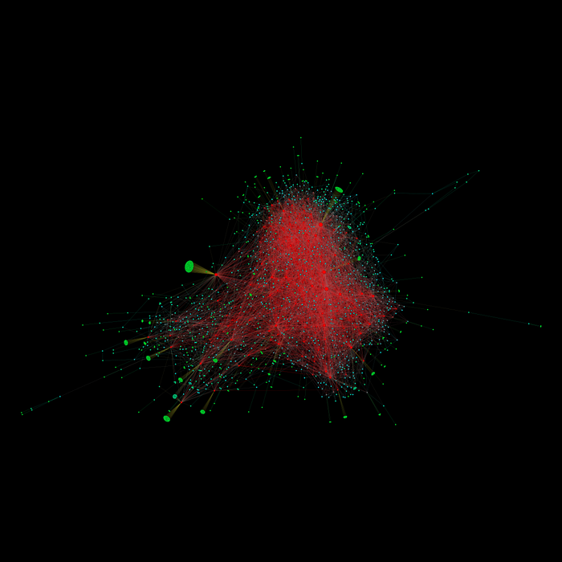

> *作者：Roy Sheinfeld*
> 
> *来源：<https://medium.com/breez-technology/introducing-lightning-service-providers-fe9fb1665d5f>*

闪电网络经济即将到来，它将粘合两大基础元素：技术创新和需求人群。这里的技术就是闪电网络本身：[点对点](https://medium.com/breez-technology/bitcoin-is-peer-to-peer-or-it-is-nothing-3ec724c1c0e?source=collection_home---2------4-----------------------)、[免信任](https://medium.com/breez-technology/the-only-thing-better-than-minimal-trust-is-none-at-all-34456f650332?source=collection_home---2------7-----------------------)、快速、经济的比特币支付。当然，还有一些[用户体验问题](https://medium.com/breez-technology/lightning-at-the-end-of-the-tunnel-overcoming-bitcoins-ux-challenges-5738171c759e?source=collection_home---2------5-----------------------)需要解决，但毫无疑问比特币将取代法币，而闪电网络就是它的道路。

但是，还有另一半，是实际的采用。需求人群必须开始使用这种技术，并将它作为默认的交换工具。为了取代法币，闪电网络必须吸引数百万的新用户 …… 然后是几十亿的用户。我们如何引导大量用户进入？

简单的答案：闪电网络服务提供商（Lightning Service Providers，LSP）。

## 什么是 LSP？

在我们思考引导用户进入的挑战时，应当谨记的是，许多用户不会来自比特币，而是 *直接从法币系统* 过来的。所以他们需要别人指引他们进入闪电网络。

甚至富有经验的、通晓技术的用户，也需要一些帮助以避开不常见的陷阱。举个例子，虽然某个用户自愿而且能够手动开启自己的通道，但 TA 也不得不先花一些钱（即，将本地余额向外转移，以创造入账容量），然后才能接收支付；这跟大多数新用户喜欢的情形正好相反。在为自己选择首个连接的对象时，谁能告诉 TA 哪个节点是稳定的、而且跟网络中的其它节点有充分的连接呢？即使 TA 使用了 [autopilot](https://blog.lightning.engineering/announcement/2019/04/23/mainnet-app.html) 算法来帮助发现活跃的节点，跟算法所推荐的节点开启通道依然是在打赌该节点的稳定性。TA 在用自己开启通道的费用打赌：如果某个对等节点单方面关闭了 TA 的通道，TA 不必再重复这个挑选的过程。

这就是 LSP 所解决的问题之一。他们给用户提供通往闪电网络的稳定连接、简化的通道管理，还有流动性。

虽然 “ISP（互联网服务供应商）” 是一个路人皆知的词语，你可能还没听过 “LSP”。闪电网络和互联网，在许多方面都有惊人的相似之处。 LSP 跟 ISP 在词语上的相似性并不是偶然。相似之处在于：他们都帮用户连入更加广大的网络，之时不同的网络对服务供应商提出了不同的功能要求。

那我们就来看看这些功能。

## LSP 实际上做什么？

闪电网络是一个由[支付通道](https://medium.com/breez-technology/understanding-lightning-network-using-an-abacus-daad8dc4cf4b?source=collection_home---2------12-----------------------)连接起来的网络。这些支付通道有一系列的特性，既能让整个网络安全且免信任，同时也可能给新用户带来难题。这样的特性包括：容量限制、入账和出账流动性、通过从发送者连到接收者的路径转发支付，以及跟比特币主网的同步需求，等等。

基本上，LSP 就作为用户的支付通道的对手方，执行自动化的通道管理功能，以保证在用户眼中，支付通道的工作稳定且毫不费力。比如：

### 1. 开启通道

LSP 的第一个功能就是跟新用户的闪电节点开启一条通道，并确认其激活状态。由于通道是由 LSP 初始化并创建的，所以用户不需要自己用现有的一个链上钱包为通道充值，这就大大简化了进入闪电网络的流程。LSP 可以直接吸引使用法币的用户，绕开跟区块链技术有关的部分，并让学习曲线变得平坦。

### 2. 入账流动性

如果一位用户手动开启了一条通道，她必须先花出一些通道余额，然后才能使用闪电通道接收支付。

在 LSP 模式中，因为一开始由 LSP 为通道充值资金，所以用户马上就有了入账流动性。虽然用户也必须先向通道存入一些资金，否则就不能立即用闪电通道来支付，但 LSP 所提供的入账流动性，让他们可以立即通过闪电网络接收支付（只要通道激活了）。

### 3. 路由

LSP 让用户可以安全、稳定地连接到一个中心（hub），这个中心又跟其它中心有充分的支付通道连接，这就保证了用户总能随心所欲地发送支付（经由 LSP 转发）。LSP 的连通性就是自己的资源。

- 支付通道是无形的，所以人们很容易忘记可靠路由的重要性（图片来源：<a href="https://www.flickr.com/photos/welshedout/17490067632">Edward Crompton</a> -

### 4. 再平衡

中心们需要相互开设通道以路由支付。他们也各有己方余额和对方余额，如果这些余额偏离了平衡，他们就无法再转发用户的支付了。如果一个繁忙的中心在所有通道中都没有了己方余额，它就无法再转发支付；而一个中心如果收到了大量的入账支付，那将耗尽其对方余额，从而无法再接收新的支付。

因此，LSP 的另一个有用的功能，是在彼此间再平衡资金在己方余额和对方余额中的分布，从而保证他们的支付通道的流动性以及用户资金的转移能力。

（译者注：对一个节点来说，其在一条通道中的己方余额就是自己可以用来支付的额度，而对方余额就是自己可以接收支付的额度。己方余额和对方余额之和约等于通道的容量。）

### 5. 可靠性

为了避免宕机，用户既可以跟许多位于不同地点的节点按照不同的条件开启许多通道，也可以连接到一个或少数几个必定能提供可靠服务的中心。第一种策略需要大量的维护工作，而且需要大量资金（锁定在不同通道中）；而第二种策略依赖网络内在的激励结构来解决这个问题。

除了在线时间，还有一种更基础的需要，要让通道保持可用。在事态严重的时候，一条通道的不论哪一个节点，都可以强制关闭通道，他们很少甚至不会警告对方。

在给用户提供可靠的[服务级合同](https://en.wikipedia.org/wiki/Service-level_agreement)时，LSP 也让用户安心：他们可以随时支付和得到支付，无需管理多条通道、在许多通道中锁定资金。而且，因为服务级合同让用户安心，通道的关闭也就可以在可预期的、完善的环境中发生。

## 要 LSP，不要中心化

乍看起来，带有 LSP 这样的中心的网络，跟比特币的去中心化、点对点、免信任的特性是矛盾的，不是吗？如果用户全部都通过一个中心连入网络、支付全部都通过这个中心来转发，这不是中心化的吗？

- 但网络的图谱 <em>看起来</em> 并不中心化，不是吗？（图片来源：<a href="https://de.wikipedia.org/wiki/Datei:Bitcoin%27s_Lightning_Network_Visualization.png#filelinks">Wikipeida</a>） -

并不必然如此，因为这是很容易解决的。为何每个人都要通过同一个 LSP 来连接？为何他们不能选择 app 里的多个 LSP，并观察哪个 LSP 收取的服务费最低？

只要我们保证门槛较低，而且有一个 LSP 的活跃市场，用户就可以换用不同的 LSP 以适应自己的需要。他们不需要依赖于某一个 LSP，网络也可以保持去中心化。

此外，理论上，LSP 不需要信任，用户还是会运行自己的全节点，本质上就是成为自己的 LSP。对于不那么懂技术的用户来说，公开的 LSP 就为他们提供了保持自治和自主的需要。

## LSP 帮助吸引用户，Breeez 帮助吸引 LSP

尽管这是一个几乎向所有人开放的伟大商业模式，现在还没有很多 LSP。[Breez](https://breez.technology/) 自己是其中之一（一个非常好的例子）。当用户安装 Breez app 的时候，我们向用户提供 100 万聪的入账流动性，是放在 Breez 中心自动跟用户开设的通道中的。我们的中心也有很好的连接：它积极在不同支付通道中再平衡资金，以保证跟超过 [70 个中心](https://1ml.com/node/031015a7839468a3c266d662d5bb21ea4cea24226936e2864a7ca4f2c3939836e0)的不同通道中的流动性。

- 唇语考试：“一百万聪！木哈哈哈哈！”（图片来源：<a href="https://tenor.com/view/dr-evil-one-million-dollars-austin-powers-gif-11678082">tenor</a>） -

当前，Breez app 的用户会自动连接 Breez LSP。但在未来，我们将允许用户在应用内自选不同的 LSP。他们可以获得使用 Breez app 的一切好处，但同时可以自选 LSP —— *包括他们自己的节点*。

有选择，对用户就是好事；有竞争，对市场就是好事；去中心化对网络是好事，用户对 Breez 是好事。这是多方共赢的局面。

但我们不是唯一在运行的 LSP。市场上还有其它一些 LSP，也在向用户提供通道充值（并或多或少带有通道管理和平衡管理）的服务：例如，[LightningTo.Me](https://lightningto.me/)、[LNBIG.com](https://lnbig.com/#/)，以及 Bitrefill 的 [Thor](https://www.bitrefill.com/thor-lightning-network-channels/?hl=en)。他们都在尽自己的吸引用户、扩展闪电经济的责任。

我们正在积极证明 LSP 模式的可行性，我们也欢迎你加入我们。如果你运行自己的 LSP，或者有兴趣建一个，但需要用户，请[联系我们](https://breez.technology/#contact)。我们乐于将你加入我们的 [Android](https://medium.com/breez-technology/breez-open-beta-lightning-fast-bitcoin-payments-no-compromises-14fabca76396?source=collection_home---2------9-----------------------) 和 [iPhone](https://medium.com/breez-technology/breez-on-ios-a-big-step-towards-the-lightning-economy-and-a-giant-leap-for-breez-cbcf2db77acb?source=collection_home---2------2-----------------------) 应用，作为一个可选的 LSP。

让我们一起，将世界带入闪电经济。

（完）

