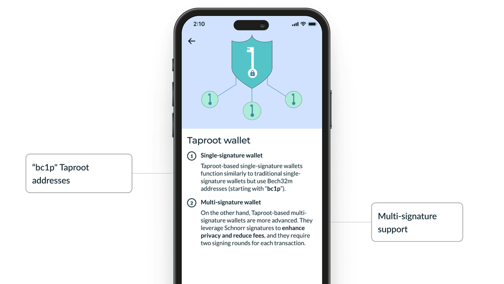
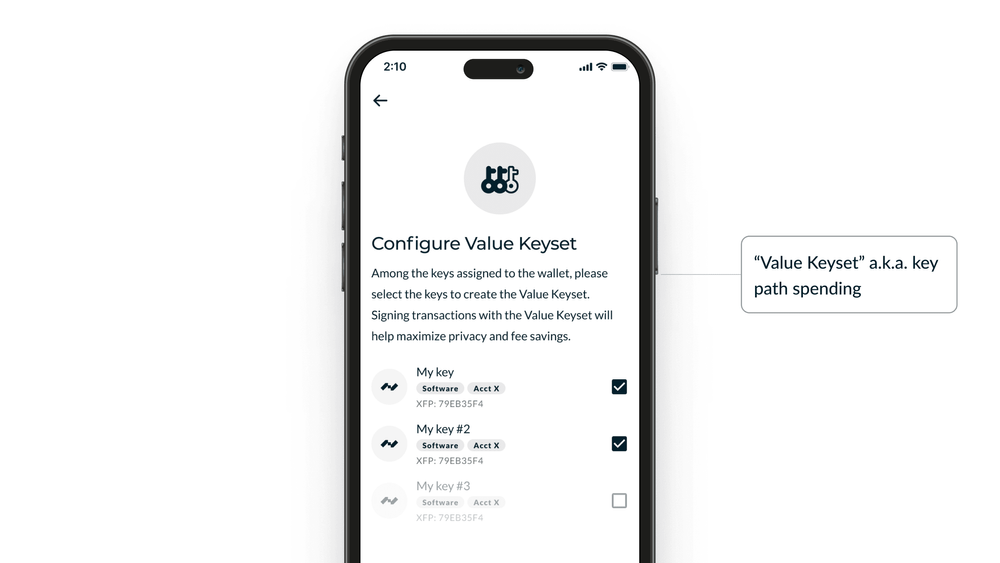
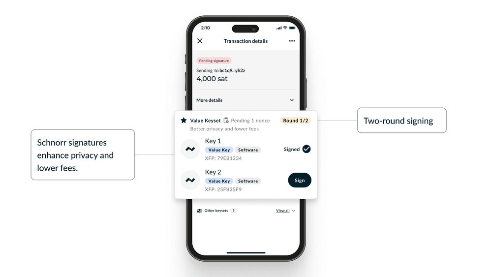
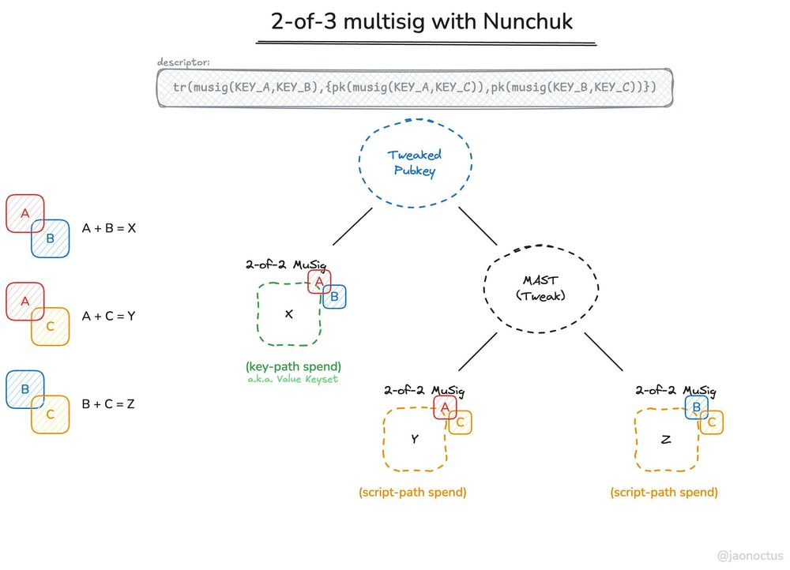

> *作者：Nunchuk*
> 
> *来源：<https://nunchuk.io/blog/taproot-multisig>*

出于我们提升比特币自主保管体验的一贯承诺，我们激动地宣布，我们发布了 “Taproot Multisig Wallet”，这种新的多签名钱包利用了 Taproot、Schnorr 签名和 MuSig2 协议来提供更强的隐私性和更低的链上手续费。**我们的 Taproot 钱包还是测试功能，所以请将这个多签名钱包理解成实验性功能，不要在其中存储大量资金。**

（译者注：需要指出的，密码学界通行的 “multi signature” 的定义与比特币世界中的 “multisig” 的定义并不相同；前者严格指的是每一个预定签名人都必须参与生成的（n-of-n）的签名；而后者在前者之外，还包含了只需部分预定签名人参与的（t-of-n）的签名（也称 “门限签名”）。也许是为了解释方便，原文将 “Taproot Multisig” 一律大写，即当成一个专有名词，指的是 Nunchuk 当前的实现。）

## 什么是 “Taproot Multisig”？

“Taproot Multisig” 是一种钱包设计，使用 “**Taproot**（[BIP 341](https://github.com/bitcoin/bips/blob/master/bip-0341.mediawiki)）” 以让出现在比特币区块链上的多签名交易看起来跟单签名交易看起来毫无分别。所有的 Taproot 地址都以 “**bc1p**” 开头，可与传统的比特币地址区别开来。这种实现提高了用户的隐私性，并帮助降低了手续费 <a href="#note1" id="jump-1">[1]</a>。为 Taproot Multisig 赋能的两项关键创新是：

- **Schnorr 签名**（[BIP 340](https://github.com/bitcoin/bips/blob/master/bip-0340.mediawiki)）：一种更高效且可证明安全性的签名方案（相较于 ECDSA）。
- **MuSig2 协议**（[BIP 327](https://github.com/bitcoin/bips/blob/master/bip-0327.mediawiki)）：一种将多个签名聚合为一个签名的技术，优化了多签名交易的链上处理。

通过实现这两项前沿的技术，Taproot Multisig 为传统的多签名钱包提供了一个丝滑、强化隐私的替代品。

## 为什么要使用 Taproot Multisig 呢？

**强化的隐私性**

Taproot 交易让多签名钱包的活动从链上看来跟单签名别无二致。观察者将不能从你的交易中看出有多少个参与者参与了签名。

**降低的手续费**

将多个签名合并为一个 Schnorr 签名降低了交易的体积，这一般来说会带来更低的手续费。

**可证明的安全性**

Schnorr 签名的安全性具备数学证明，不像 ECDSA 需要更为针对性的安全假设。

**密钥路径花费**

Taproot 有一项特性叫做 “密钥路径花费”，允许特性的一组密钥 —— 我们称为 “**Value Keyset**（价值密钥集合）” —— 以最大化隐私性和最小化手续费的方式来签名交易。不同的密钥子集合（也称作 “脚本路径花费”）依然能从 Taproot 的隐私和手续费提升中获益，但使用价值密钥集合可以获得最大的好处。

## 理解取舍

虽然 Taproot Multisig 在隐私性和手续费上提供了显著的好处，理解其取舍依然重要。Taproot Multisig 与传统多签名钱包的关键区别在于签名的过程：

传统的多签名钱包只需要一轮的签名（通信），每一个签名者都可以独立签名。相反，Taproot Multisig 使用了 MuSig2，需要在参与者之间执行两轮签名通信。这额外的一轮通信，就是为了实现更强的隐私性和更好的手续费而需要付出的代价。

这意味着：

- 在两轮通信中，参与者要保持在线
- 签名过程需要花费稍长一些时间才能完成

对于将隐私性和低手续费看得比较重的用户来说，这种取舍通常是值得的。两轮通信让 Taproot Multisig 可以将多个签名聚合成一个，让在链上出现的最终交易跟单签名交易没有分别。

### “价值密钥集合”：我们对最优密钥子集的新命名

在传统的（非 Taproot 的）多签名钱包中，所有的密钥在实质上都是平等的，任意的 M-of-N 的公钥有效组合都可以从钱包中花费。而在 Taproot Multisig 中，我们引入了一种用户友好的概念，叫做 “价值密钥集合”：

**价值密钥集合**：一组特定的密钥，在签名交易的时候，可以完全理由 Taproot 的密钥路径花费。这个子集提供了隐私性和手续费节约的最佳组合。

虽然任意的密钥子集都能从 Taproot 的内在优势种获得好处，但使用价值密钥集合是我们推荐的做法（性能最优）。

### Nunchuk 复用了 Bitcoin Core 的代码和 licsecp256k1

就像我们所有的钱包实现一样，Taproot Multisig 延续了 Nunchuk 的基础性方法：复用 Bitcoin Core 的[代码](https://github.com/bitcoin/bitcoin)和密码学库（例如 [libsecp256k1](https://github.com/bitcoin-core/secp256k1)）。这包含了 Taproot 和 Musig2 的关键部分，保证我们守住了 “使用比特币生态系统中最为久经考验、审核最充分的代码” 的承诺。这一方法：

- 尽可能减少了依赖、减少了潜在的攻击界面。
- 确保我们利用了 libsecp256k1，是比特币生态系统中经过最广泛审核的密码学库
- 包含了遵循社区审核最佳实践的安全敏感模块，比如 MuSig2 的 nonce 生成

通过延续我们直接在 Bitcoin Core 的健壮代码和密码学库上开发的做法，我们得以发布一套健壮、安全性优先的 Taproot Multisig 解决方案，秉承我们的核心架构原则。

### Beta 版免责声明

因为我们的 Taproot Wallet 依然是测试版，**我们强烈建议不要在其中放置大量资金，直到其功能成熟**。

要指出的关键是：

- 仅允许热密钥：在初版中，只允许使用软件密钥（热密钥）
- 硬件签名器集成：我们计划在未来添加硬件签名器支持。虽然一些硬件签名器供应商，比如 Ledger 和 Coinkite 已经在开发 Taproot 支持，他们的实现也依然在实验阶段。广泛的硬件签名器支持还在推进中。

### 灵活的 M-of-N 和最多 5 个密钥

在当前的实现中，Taproot Multisig 支持任意的 M-of-N 组合，最多加入 5 个密钥。虽然我们的传统多签名钱包支持最多 15 个密钥，我们依然将初版实现限制在 5 个密钥。无论你需要一个简单的 2-of-3 多签名，还是具备额外安全性的 3-of-5 多签名，我们的 Taproot 实现都能满足你。

## 在 Nunchuk 中创建一个 Taproot 钱包

准备好使用 Taproot Multisig 了嘛？以下是在 Nunchuk 中创建一个 Taproot 钱包的步骤：

1. **添加密钥**：首先，创建或导入你希望添加到钱包中的软件密钥。注意，在这个 beta 版中，仅支持软件密钥（热密钥）。硬件签名器支持将在不远的将来实现。
2. **添加钱包**：在 App 的主界面，选择 “Add Wallet”。在后续出现的界面中，选择 “Create New Wallet（创建新钱包）”。
3. **Taproot 地址类型**：在弹出的界面中，选择地址类型，选择 “Taproot”。

然后，你就可以配置 M-of-N 结构、分配密钥到钱包中，然后定义你的价值密钥集合。请记住，这是一个 beta 版本 —— 请使用少量资金，先熟悉 Taproot 的工作流程和好处。

## 结论

Taproot Multi Wallet 代表了比特币自主保管的一个飞跃，它通过前沿的密码学创新结合了隐私性和手续费效率。我们非常高兴能够推动比特币的多签名技术前进 —— 所以，不妨使用少量金额尝试以下，试试价值密钥集合，然后耐心等待我们的硬件兼容性升级。

- - -

**技术注解**

1.**MuSig2 如何能实现 M-of-N 签名呢？** <a href="#jump-1">↩</a>

虽然 MuSig2 在技术上是一个 N-of-N 的签名方案，我们通过结合 Taproot 的功能，实现了 M-of-N 多签名。原理如下：

我们以 2-of-3 的多签名钱包为例，将 3 个密钥分别标记为 A、B、C。这个钱包是这样构造出来的，从而任意两个密钥都能够签名：

- 密钥 A 与 B（密钥路径）
- 密钥 A 与 C（脚本路径）
- 密钥 B  与 C（脚本路径）

上述每一个组合，在操作的时候都是一个 2-of-2 MuSig2 签名。使用 Taproot，我们可以指定最常使用的组合（比如 A 和 B）作为密钥路径，从而获得最优的隐私和经济性，同时，其它有效组合（比如 A 与 C、B 与 C）就包含在脚本路径中。

MuSig2 和 Taproot 的优雅组合，使我们可以：

1. 实现 M-of-N 签名功能，同时利用 MuSig2 的签名聚合功能
2. 通过密钥路径，为你最常使用的签名场景优化性能
3. 通过脚本路径，为其余的签名场景保持灵活性