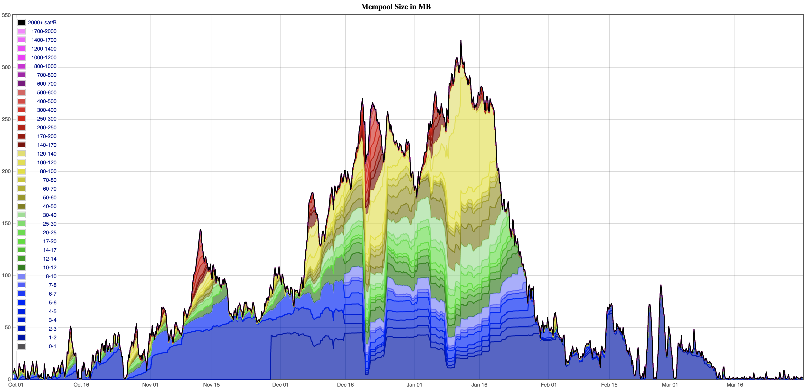

> *作者：Bitcoin Optech*
> 
> *来源：<https://bitcoinops.org/en/scaling/fee-bumping/>*

比特币的手续费市场瞬息万变，可能会导致交易上链所需的手续费剧烈上升或下降。

- <em>（6 个月的交易池规模图，以手续费率的高低分组及着色，来自 https://jochen-hoenicke.de/queue/#1,24h）</em> -

手续费波动性的原因之一是市场选择哪些交易能进入一个区块的机制。在市场上，矿工们每 10 分钟左右供给 400 万重量（weight）（译者注：一种虚设的计量单位，用来度量一笔交易的体积）的区块空间，而用户们则（通过交易费率）竞拍，让自己的交易进入区块。许多钱包的手续费估计算法都粗糙，而用户有时候对高费率并不敏感，这就意味着，当交易池规模急速增长、预期的确认时间开始增加的时候，用户之间的竞拍战争可能迅速升温，钱包也开始为交易附加极高的手续费。

但这个市场还有个奇怪之处：当用户的竞拍失败、交易未能入块时，*这个竞标并不会撤回*，而是继续参与下一个区块的竞标。这是因为交易具有一种不变的属性：一旦它从某个区块开始是一笔有效的交易，那么它往后就一直是有效的交易。实际上，作废一笔已然有效的交易（从而 “撤回” 竞标）的唯一方法就是在另一笔交易中花费原交易的输入（不论一个还是多个）。

这种奇怪的特征一般来说不会对用户造成困扰，因为如果一个用户签名了一笔交易，那他们当然愿意这笔交易立即就能进入区块得到确认，而且相比他们愿意让这笔交易在不远的将来、以同样的代价进入区块。但是，有一种情境中，无法从交易池中撤回交易可能给用户造成严重的困扰：当用户没有给交易附加足够高的交易费，因此交易无法入块，但用户又有紧急需求，想让交易入块。遭遇这种情形可能有很多原因：钱包或者用户个人低估了所需的交易费、用户尝试在预期的手续费范围的底部出价来节约手续费，或者仅仅因为交易广播出去之后，入块所需的手续费率意外暴涨。不论是什么原因，用户会发现自己的交易因为低手续费率而 “困” 在了交易池里，而且未来能入块的希望也非常渺茫。

交易可能卡住的风险也会影响用户给交易费出低价的空间。如果没有办法让交易在广播之后解除困局，那么用户就不得不在一开始出一个保守（较高）的价格来避免交易卡住的风险。

因此，我们需要一种办法给已经广播出去的交易追加手续费，原因有：

1. 为了让用户能 “解困” 已经广播出去的交易
2. 为了让用户能在一开始给出较低的交易费率、后面再追加手续费

## 解决方案

当前有两种常见的释放滞留在交易池中交易的办法：“手续费替换（Replace-by-fee，RBF）” 和 “子为父偿（Child Pays for Parent，CPFP）”。

### 手续费替换（RBF）

用户构造和签名一笔替换交易，替换交易要花费被阻交易的一个或多个相同输入，并且要支付更高的手续费（一般来说是通过减少找零输出的数额，减少的数额就是额外支付的手续费）。如果替换交易附带了足够高的手续费，矿工就有激励打包它。

### 子为父偿（CPFP）

用户创建一笔新的交易，新交易要花费被阻交易的一个或多个输出。这笔子交易附带了一大笔手续费 —— 足以提高其自身与被阻交易的联合手续费率，使之高于入块所需的费率。但是，这种办法只有在用户拥有交易的输出时才能动用。

在选择打包入块的交易时，矿工将需要考虑交易 “包”，要看整个交易包的总体费率。矿工为了最大化区块的手续费收入，是有激励这样做的。

这个特性也可正确称之为 “裔为祖偿（Descendants-Pay-For-Ancestors）”，因为一个理性的矿工会尝试最大化自己的手续费收入，哪怕交易包内的交易大于两代，也不是问题。举个例子，Bitcoin Core 的挖矿代码会考虑最高达 25 笔交易组成的任意长度交易链条的交易包。

## 用户体验考量

手续费追加策略对比特币钱包和服务的用户体验有显见的影响。比特币服务需要考虑的问题比如：

- 完全不提供手续费追加策略，那么用户体验在交易池手续费率暴增以及交易无限期卡住的时候非常差
- 一些服务提供了服务层面的合约（Service Level Agreements），保证交易会在一定区块数量或者一定时间内入块确认。不能履行这些 SLA 会导致用户的投诉和罚单。（这些 SLA 是否现实、是否有吸引力，就不在本文讨论范围之内了！）
- 一些比特币钱包和服务将发信号表示使用 RBF（signal opt-in RBF）的交易与不使用  RBF 的交易区别对待（比如说不展示 RBF 交易在用户的余额中）。这可能让用户使用选择性支持 RBF 的钱包发送交易时感到困惑。
- 使用 RBF 追加手续费会创建一笔新交易（具有新的交易 id）。用户在这一点上也可能感到困惑，如果他们不知道当交易被 RBF，其 txid/vout index 会变化的话。
- 使用 RBF 追加手续费，无法使用原交易的签名，需要所有签名者重新签名。这对多签名的交易以及签名在专用硬件钱包或者 HSM 上完成的交易影响尤为严重。
- 按照定义，手续费追加要提高一笔交易所附带的手续费。尤其对 CPFP，新的手续费率可能会高很多。计算这个手续以及决定谁来支付它（用户还是服务提供商）可能是难题。

这些问题会在本文的后续章节中得到更细致的讨论。

## 大体量用户的考量

对于那些重度使用比特币区块链的实体（比如交易所和托管商），还有额外的考量：

- 服务商有一定数量的 UTXO 在热钱包里。如果所有这些 UTXO 都绑定在卡住的交易中，而这个服务商的钱包不使用未经确认的 UTXO 作为输入，那么他们可能会因为新交易而用尽 UTXO。
- 使用选择性 RBF 让这些服务可以在初步发起交易时附带较低的手续费，当交易不能如愿在一定时间内确认时再追加手续费。对于发送大量交易的实体，这种节约会很可观。
- 使用 CPFP 追加手续费可能导致总体手续费成本大幅上升，因为子交易和父交易都要支付手续费 —— 但 RBF 交易会完全替换掉原交易，所以你不需要支付额外一笔交易的手续费。对于发送大量交易的实体，CPFP 造成的额外费用可能会很惊人。
- 高频花费而且每个区块都广播交易到区块链商的服务商，可以将花费交易关联起来并使用 CPFP，而无需额外的开销。如果一笔交易在该服务商需要广播下一笔交易时还未上链，那他可以在第二笔交易中使用第一笔交易的找零输出，并附带足够高的手续费来提高整个交易包的手续费率。
- 实质上使用 “[批量支付](https://en.bitcoin.it/wiki/Techniques_to_reduce_transaction_fees#Payment_batching)” 的服务商可以使用单笔 RBF 或者 CPFP 交易为多笔支付追加手续费。
- 不使用批量支付的服务商可以使用一笔较大的 CPFP 同时为多笔交易追加手续费，而且也可能同时合并这多笔交易的输出。
- 交易池的代码允许交易包最多容纳 25 笔未确认的交易（另一重限制是不能超过 404 K 的重量），所以可以用单笔 CPFP 交易来加速的交易的数量是有限的。
- 使用择币算法并实质上 “[规避找零](https://en.bitcoin.it/wiki/Techniques_to_reduce_transaction_fees#Change_avoidance)” 的服务商将有许多没有找零输出的交易，这些交易是无法使用 CPFP 来追加交易费的。更大的钱包有能力规避找零更通常是因为有一个更大的 UTXO 集合可供挑选。

这些问题也会在本文的后续章节得到更深入的讨论。

## RBF 简介

（待续 1）

### 概述 RBF 是什么

（待续 2）

### RBF 的历史 

（待续 3）

### BIP125

（待续 4）

### RBF 的 5 个条件

（待续 5）

### 用户体验建议

即使钱包和服务自身不支持用户创建选择使用 RBF 的交易以及替换交易，也应该在处理 RBF 交易时向用户提供清晰和准确的体验：

- 钱包在收到选择使用 RBF 的交易时，可以显示这笔交易是表态使用 RBF 的（使用工具提示或弹窗，给出关于 RBF 的额外信息）。
- 钱包一定不能将被替换的交易重复计算进去（也就是如果一个 UTXO 在被替换的交易和替换交易中出现就增记或减记两次）。
- 钱包和区块浏览器在一笔交易被替换之后，也应该继续显示这笔交易（要么标灰，要么隐藏），并且清晰提示这笔交易已经被替换掉了，不再有效了。
- 已经被替换的交易的连接在区块浏览器中应保持可用；也可重定向到替换了该交易的交易处。

### 互操作性和兼容性矩阵

（待续 6）

### 使用 RBF 的公司案例

（待续 7）

## CPFP 简介

子为父偿（CPFP）是一种钱包功能，用户可以花费一笔未确认的交易（*父交易*）的输出、作为一笔新交易（*子交易*）的输入。钱包会让子交易附带足够的交易费，从而提高父交易和子交易的联合交易费率。

 ## CPFP 工作原理

在构造一个新区块时，矿工的利益在于用手续费最高的一组交易填满 1vMB 的区块（译者注：vMB 也是一个虚设的计量交易体积的单位，跟上面说的 weight（重量）可以相互换算）。如果所有的未确认交易都是独立的，那么操作就很直接 —— 矿工只需按手续费率高低降序排列，从上往下加入候选区块中直至区块满载。这样做就能最大化矿工从区块中获得的收入（围绕一个区块的最后几个字节，要做稍微复杂一点的操作才能保证尽可能填满了区块）。

不过，未确认的交易 *不是* 独立的。有可能会有一连串的未确认交易在花费一笔尚未确认的交易的输出。举个例子，交易 A 有输出 a1 和 a2，交易 B 可能在 A 打包入块之前就使用其中之一作为输入。这时候，如果矿工想要在区块中包含 B，就必须先包含 A，因为如果没有 A，B 就是在花费一个不存在的输出，因此是无效的交易。

如果一个矿工在构造区块时总是孤立地考虑交易给自己带来的好处，她可能会因为前序交易的低手续费而错过后序交易的极高手续费（甚至更糟糕，她可能会创建一个带有无效交易（依赖于未上链交易）的无效区块）。因此，为了最大化自己的利润，在构造新区块时她应该以 *交易包*（相互依赖的交易的集合）的角度来选择交易。

钱包可以利用矿工的这种理性行为模式，激励她们将一笔因低手续费而卡住的交易打包上链，办法就是花费这笔卡住交易的一个输出，并提高整个交易包的整体手续费率。

### CPFP 的历史

想要利用 CPFP 来追加手续费，有两个前提条件：

- 所用的钱包要允许花费未确认交易的输出，从而能提高联合手续费率
- 预期矿工会通过考虑交易包来最大化自己的利润

在 2012 年以前，区块很少是满的，所以也没什么手续费市场可言。Bitcoin Core 的挖矿部分因此没有特别优化以尽可能获得更多手续费。交易首先按照 “优先级”（每个输入的币龄总和（value X coin age），除以交易的体积）排序，并在区块可以打满的时候[提高所需的手续费率](https://github.com/bitcoin/bitcoin/blob/9b8eb4d6907502e9b1e74b62a850a11655d50ab5/main.h#L586)。Bitcoin Core [PR #1590](https://github.com/bitcoin/bitcoin/pull/1590) 改变了挖矿的代码，变成主要按照手续费率对交易排序，同时保留了一些空间给优先级分数较高的交易。因此，2012 年 9 月发布的 [Version 0.7.0](https://bitcoin.org/en/release/v0.7.0) 是一个主要按照手续费率来排序交易的 Bitcoin Core 版本。

大约在同一时间，Luke-jr 开始维护[一个补丁](https://github.com/bitcoin/bitcoin/pull/1240)，它会在排序可加入区块的交易时考虑其子交易的手续费。这个补丁至少被一些矿工使用了，但因为缺少测试和基准测试，以及担心它可能开启针对矿工的 DoS 攻击界面，从未合并到 Bitcoin Core 中。

更细致考虑交易包的 Bitcoin Core 挖矿代码在 [2016 年](https://github.com/bitcoin/bitcoin/pull/7600)更新。这段代码会考虑 25 笔交易以及 101 vkB 以内的交易包。这个更新纳入到了 [V0.13](https://bitcoincore.org/en/releases/0.13.0/#mining-transaction-selection-child-pays-for-parent)。

在本文撰写之时（2018 年 11 月），基本上可以确定，大部分矿工都在运行 Bitcoin Core V0.13 或手续版本，或者其衍生软件。因此，钱包可以安全地假设，后代交易的手续费会在祖先交易是否能入块时被考虑进去。

### CPFP 案例研究

Holders 比特币交易所（Hodlers Bitcoin Exchange，HBE）有几十万用户，并且每天都有几千笔取款。因为他们每个区块都要发送许多区块支付，他们会每十分钟发起一笔交易，批量处理取款。

HBE 希望保持客户的手续费低廉，所以他们总是非常设定非常经济的手续费 —— 他们喜欢给出刚刚好足够入块的交易费，不想多给！这就意味着，偶尔，他们的取款交易不会立即得到确认，会卡在交易池中。用户因此会抱怨取款速度慢或者卡住。

为了提升他们客户的体验，HBE 实现了 CPFP 来为卡住的批量取款交易追加手续费。为此，他们会使用一笔批量区块交易的找零输出作为另一笔取款的第一个输入，并保证第二笔交易会给出足够高的手续费来拉高两笔交易的平均手续费率。如果这还是不足以让交易被打包，他们会使用第二笔批量取款交易的找零输出作为第三笔交易的输入，以此类推。

在实现 CPFP 系统时，HBE 需要考虑一下几个方面：

- 他们需要保证每一笔批量取款交易都有给自己支付的找零输出。如果没有找零输出，那就没法构造子交易来为父交易追加手续费了。
- 他们需要仔细测试手续费率计算的逻辑。子交易必须为父交易支付一些手续费，所以他们的算法需要考虑父交易的重量以及已经支付的手续费，这样才能计算平均手续费率。在创建第三代交易乃至第四代交易时，也要有同样的流程。

总的来说，HBE 非常满意自己的新 CPFP 实现。客服工单减少了，用户一般都不会注意到他们的取款用到了 CPFP 来追加手续费，因为他们取款交易的 id 和输出的索引都不会改变。

### 用户体验建议

钱包和浏览器应该向用户提供关于交易包的相关信息：

- 如果一笔未确认的交易是未确认的交易包的一部分，服务应该允许专业用户看到祖先和后代交易的手续费率，以及整个交易包的手续费率，从而用户能更准确地估计交易包在未来被打包的机会。
- 区块浏览器在一笔交易的其中一个输入不是 segwit 类型的时候，会显示这笔交易 “可以变形”。可以变形的交易加入未确认交易的链条可能是不安全的，因为签名变形会作废所有的后代交易。

## RBF 还是 CPFP（还是两者都要）？

（待续 8）

### RBF 的优势

（待续 9）

### CPFP 的优势

（待续 10）

### 两者都用

（待续 11）

### 实现问题

（待续 12）

## 结论

手续费替换和子为父偿都是有用的手续费追加技术。两个各有各的优点和不足，视场景而定，使用其中某种（或两者都用）可能会比另一种要更合适。

比特币工程师应该熟悉这两种技术，而且比特币的产品和服务应该（在用户用到这些技术时）向用户提供清晰和准确的体验，即使自身并不支持创建 RBF 和 CPFP 交易。

## 脚注

### 共识，对策和激励兼容

这篇文章里讨论的两种方案都跟网络中的节点和矿工在一笔交易入块之前的行为模式有关。因此，这些行为模式更多与对策相关，而不是与共识相关。两种解决方案都是跟矿工的激励兼容的 —— 一个想要尽可能获得收益的矿工，既会接受 RBF 替换交易，也会接受 CPFP 交易包。因此个体节点的交易池（是最便于一个节点猜测下个区块的内容的工具）应该也会接受 RBF 替换交易和 CPFP 交易包。

