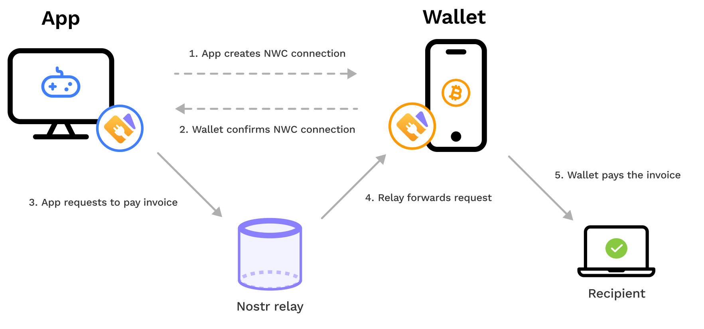

> *作者：NWC Docs*
> 
> *来源：<https://docs.nwc.dev/introduction/introduction-to-nwc>*

“Nostr Wallet Connect（NWC）” 协议提供了一种办法，让一个客户端 app 可以通过一套标准化的协议来远程访问一个比特币闪电钱包软件。钱包软件和 app 有此意愿，是为了让用户能够流畅地访问自己的钱包账户、用于 app 中的简单支付。

## NWC：一套免费而且开放的协议

NWC 是一套免费而且开放的协议。这一点非常关键，因为它带来了多种优势：

1. 任何人都可以使用 NWC。
2. 实现基于 NWC 的支付不会陷入供应商锁定。
3. NWC 更加灵活，而且在现有 app 和新 app 中的集成选择也更多。

采用 NWC 的 app 可以强化自身的易用性和创造性。最重要的是，这保证了你的 app 跟整个生态系统是可以互操作的，从而可以从网络效应的增强中获益。

## NWC 建立在比特币的闪电网络之上

比特币是一种去中心化的电子货币，支持点对点的支付，而且不需要依赖于银行和中间商。闪电网络则是比特币之上的二层协议，支持即时、低手续费的支付，它让交易在次级网络中转发（而不是在比特币网络中得到确认），同时继承了比特币的安全保障。两者共同为一个全球的开放金融系统提供了一个强大的基础。它们是天作之合，因此也是 NWC 的首选支付协议。

请注意，NWC 只决定支付内容如何在 app 和钱包软件之间传递。NWC 可以支持任何支付网络。实际上，也可以支持比特币的链上交易和多种货币的支付。

## 为什么它叫做 “Nostr Wallet Connect”？

如文章开头所述，NWC 提供了让 app 连接钱包软件的一种方法，这也是它的名字的来源。“Nostr” 是 NWC 的支撑性技术之一。Nostr 自身是一种简单、开放的协议，让抗审查、去中心的消息流可以建立在公钥密码学和消息转发服务器之上。它并不依赖于一个中心化的服务器或者网关。NWC 使用 Nostr 协议的转发技术和公钥密码学，来保护 app 和钱包软件之间往来的下车。

作为一个启用了 NWC 的钱包软件的终端用户，你不需要知道关于底层转发技术的任何东西，甚至不需要持有你自己的 Nostr 密钥。就像电子邮件服务商不会在用户界面中展示 SMTP 协议，你的钱包软件和连接它的 app 会处理信息交互。

## 工作流程（概述）

以某个 Nostr 消息转发服务器（relay）为桥梁、建立会话之后，app 和钱包软件就可以交互。Relay 提供了一种可靠且高效的办法来连接闪电节点，无需使用洋葱网络或者暴露节点到公网（clearnet）中。

如果用户希望执行一个操作（例如，支付闪电发票 `pay_invoce`），那么交易会由 app 前段准备好、序列化和加密，然后发送给 relay。Relay 会转发给钱包应用。钱包应用读到来自 relay 的消息之后，解密交易并展示给钱包用户，或者自动执行操作。在整个过程中，relay 只是协助通信，但所有的请求都是加密的，relay 无法读取。

## 工作流程（逐步分解）

1. 用户使用自己的**客户端应用**，扫描由**钱包服务器**生成的一个 QR 码，他们会进入一个 `nostr+walletconncet:`  深链接（deeplink），或者手动配置连接的信息。这个建立连接的步骤只发生一次。
2. 这个**客户端应用**收取来自各种来源（比如 NWC 自身或者 LNURL）的发票。
3. **客户端应用**通过一个 relay 向**钱包服务器**发送一个事件。事件的内容是一个 `pay_invoice` 请求。其中用到的私钥来自前面所说的连接字符串。
4.  Relay 转发 `pay_invoice` 请求给**钱包服务器**。 
5. **钱包服务器**验证事件的作者公钥，然后解密消息、发送支付。
6. **钱包服务器**给客户端应用回复一条具体的事件，内容要么吃报错消息，要么是支付发票所得到的原像。

## 给应用开发者带来的好处

- **轻松快捷的实现**

  使用清楚、说明详尽的 API，几分钟就可以集成 NWC。可以专注于开发特性，而不是基础设施。

- **免费和开放**

  NWC 是开源的，而且免费使用 —— 没有许可费、供应商锁定和隐性成本。

- **无托管**

  消除托管用户资金的需要。让钱包软件来处理钱的事情，你的应用只是协调安全操作。

- **灵活**

  使用 NWC，既可以获得完整的钱包使用体验，也可以只使用一部分特性（比如发送和收取支付）。它的设计是模块化的。
  
- **互操作性**

  可以连接到任何支持 NWC 的比特币钱包软件。一套协议，多种钱包软件 —— 不需要定制化的集成。

- **平台独立**

  跨环境工作：移动 app、网页后台、命令行工具、桌面应用 —— NWC 不挑食。

- **持续连接**

  一旦连接建立，只要用户的钱包软件在线，你的应用就能连接它，无需用户再配置。

## 给用户带来的好处

- **便捷的应用内支付**

  一口气完成支付 —— 不需要扫描 QR 码，不需要切换 app、不需要手动确认。

- **更快上手**

  只要钱包软件支持 NWC，用户就能即时连接 —— 不需要登录、KYC 和启动步骤。只要钱包里有钱，就准备好支付了。

- **单一钱包，便于管理**

  用户可以在多个应用中使用同一个钱包 —— 不需要为每一个应用单独 “充值”。

## NWC 功能

- **发送支付**

  发起单笔支付、批处理交易，甚至自动定期支付。

- **收取支付**

  实时显示支付请求和收款请求。适合打赏、应用内付费、捐赠。

- **钱包余额**

  在你的应用内查询和显示被连接的钱包的实时余额。

- **支付历史**

  列出入账和出账支付。

- **支付验证**

  自动检查支付的状态 —— 待定、完成或失败。

