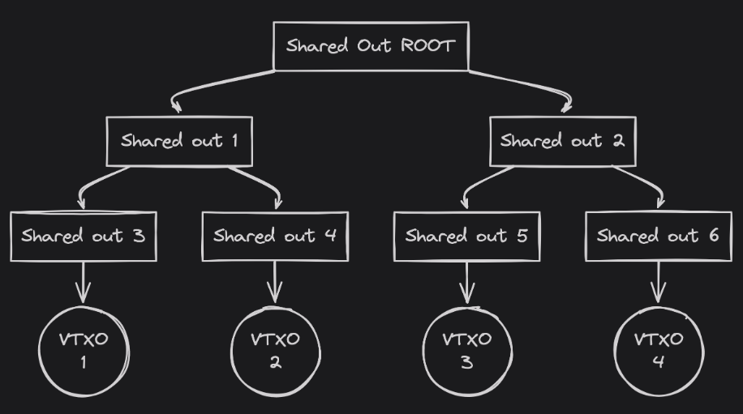
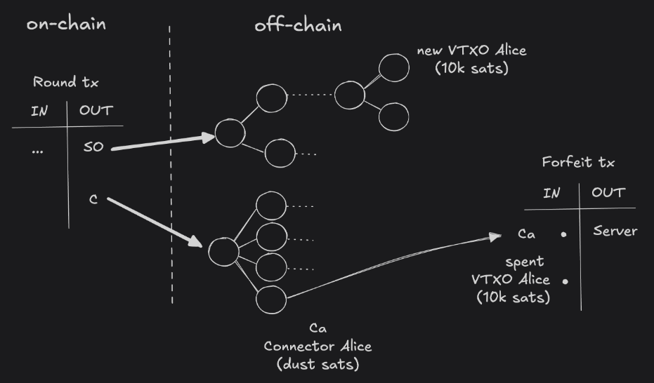

> *作者：arkdev*
> 
> *来源：<https://arkdev.info/docs/learn/concepts/>*


## 角色

### 服务商

“**Ark 服务商**” 是一项永远在线的服务，具有两种主要功能：

1. 将 VTXO 批量处理为 UTXO：Ark 服务商将 “虚拟交易输出（VTXO）” 汇集成链上的未花费的交易输出（UTXO），从而将链上足迹减少到只剩一笔链上交易，不论有多少 VTXO 参与其中。
2. 为链上交易注资：Ark 服务商提供这些链上交易所需的交易输入并发布到网络中，以利用自身的流动性。

值得指出的是，Ark 服务商对用户的资金没有任何需要用户信任的控制权。

### 用户

“**用户**” 是发送和接收 VTXO 的人。VTXO 可以随时转化成 UTXO，但为了经济性和结算速度而保存在链下。他们可以单方面从 Ark 实例中拿着资金退出（到主链上），无需向服务商请求许可，只要退出到链上所涉及的交易费用不大于用户的 VTXO 的价值。

## 合约和原语

> 提醒：
>
> 所有的时间锁的长度（5 秒、24 小时、4 周、1 年）都是任意的：不同的服务商可能会使用不同的数值。

### VTXO

“虚拟的 UTXO”，缩写为 “VTXO”，是一笔比特币交易的一个输出，可以在链下花费，也可以随时在链上赎回。一个 VTXO 是一棵 “VTXO 树” 上的一个叶子，是一笔 “轮次交易” 的 “共享输出” 所承诺的东西。VTXO 反映了一名用户拥有的一组比特币交易，这些交易的有效性不能被任何人撤销，所以只要该用户愿意，就可以在区块链上创建出对应的一个具体的 UTXO。

仅在拥有者决定单方面退出所在的 Ark 实例时，其 VTXO 才会出现在链上。

VTXO 是用 [taproot](https://bips.dev/341/) 脚本来锁定的，必须包含以下的花费条件：

- 不可花费的密钥路径
- 脚本花费路径要么是**合作花费路径**，要么是**单方面退出路径**

**退出路径**

退出路径允许 VTXO 的所有者单方面花费它，无需服务商的合作。退出路径必须以下的规则：

- 必须经过 CSV（相对时间锁）的延迟
- 上述延迟必须短于服务商所设定的一个门槛
- 不得要求服务商的签名
- VTXO 的脚本必须包含至少一个退出路径

脚本案例：

```
// 单签名退出路径
<delay> CHECKSEQUENCEVERIFY DROP <pubkey> CHECKSIG
```

**合作花费路径**

合作花费路径允许 VTXO 的所有者跟服务商合作、在链下花费它。合作花费路径必须符合以下规则：

- 可以使用 CLTV（绝对时间锁）来推迟
- 必须要求服务商的签名
- VTXO 的脚本必须包含至少一条合作路径

脚本案例：

```
// 双签名的合作路径
<pubkey> CHECKSIGVERIFY <server_pubkey> CHECKSIG
```

在最常见的 VTXO 脚本中，Alice 是一笔资金的唯一所有者，其一条合作路径和一条退出路径的组合将是这样的：

```
（Alice 与 服务商 合作花费） 或者 （Alice 在 24 小时后独自花费）
```

```
<delay> CHECKSEQUENCEVERIFY DROP <alice> CHECKSIG
<alice> CHECKSIGVERIFY <server> CHECKSIG
```

### VTXO 树

VTXO 是通过一个共享输出创建出来的。一棵 VTXO 树的源交易会花费源共享输出、分割成两个子共享输出；这两个子共享输出又会被交易各自分割成两个共享输出，以此类推。

在这棵二叉树的叶子层（最末一层），我们会得到一笔只有一个输入和一个输出的交易。这些交易的输出就是用户的 VTXO。



那么：

- 区块链上的一个源共享输出，就代表着一棵由虚拟交易组成的树
- 所有的交易都得到了完整的签名，准备好了让用户在单方面退出时广播到网络中
- 在理想的情形中，VTXO 树永不会在链上揭晓

### 共享输出

一个 “共享输出” 是由服务商注资的一笔比特币交易的输出，它被一个 taproot 脚本锁定，该 taproot 脚本必须包含下列花费条件：

- 不可花费的密钥路径
- 必须只有两个脚本花费路径：**展开路径**和**清扫路径**

**展开路径**

展开路径是服务商和用户在签名 VTXO 树时使用的路径。服务商构造好一棵 VTXO 树并将它分享给用户。一旦所有参与者都验证了这棵树，他们就可以签名它，使之准备好在链上揭晓；如果用户决定单方面退出、兑现其 VTXO，就可以使用它（尽管按照设想，这是罕见情形）。

**清扫路径**

清扫路径允许 Ark 服务商在一个时间锁过期后（比如 1 个月之后）花费共享输出。这个时间锁也定义了包含在这棵树中的 VTXO 的生命长度。

### 轮次

Ark 服务商的主要工作是在用户希望将自己即将过期的 VTXO 换成新 VTXO（等同于延长原 VTXO 的生命）的任何时候，构造新的 VTXO 树。

为了能随时响应，服务商可以采用的一种策略是定期尝试，在所谓的 “轮次交易” 中创建一个新的 VTXO 树。用户可以向服务商注册加入下一个轮次，当他们被选中的时候，他们就放弃自己的权利（将即将过期的 VTXO 发回给服务商），以换取在下一棵 VTXO 树上的一个新的 VTXO。

这种做法的结果是服务商在链上发起一笔交易，一般来说，这样的交易会有两个输出：一个 *共享输出*，承诺了一棵 VTXO 树；还有一个 *连接器输出*，承诺了一连串的 “连接器”。

### 连接器

连接器用于在用户弃权旧的 VTXO 时保证 “原子性”。

如前所述，一笔轮次交易一般有两个输出：一个是 *共享输出*，会承诺一棵 VTXO 树；另一个就是 *连接器输出*，承诺了一棵连接器所组成的树。

一个连接器自身的价值仅仅是粉尘大小，将花费一个 VTXO 的弃权交易与创建新 VTXO 树的轮次交易 *连接起来*。

具体来说说这样的：连接器是由服务商在新轮次交易中创建的；它会被用作用户的弃权交易的一个输出。连接器只需要得到服务商的签名，其目的是，它迫使弃权交易仅在创建连接器的新轮次交易被广播的前提下，才能得到广播。如果没有连接器，用户在签名弃权交易之后，就需要信任服务商会广播新轮次交易。但有了连接器，就不再需要信任，因为它保证了，服务商是无法广播弃权交易的，除非创建连接器的新轮次交易已经广播并得到区块链确认。



在这个案例中，Alice 当前持有一个价值 10 千聪的 VTXO，并且希望加入新的一轮以刷新它。服务商创建带有对应新的 VTXO 的下一棵 VTXO 树，以及一棵连接器树，树上的每一个叶子都是为一个被花费的旧 VTXO（也即具体的一笔弃权交易）而准备的，旧包括 Alice 的弃权交易。为简单起见，上述案例没有考虑服务费。

## 交易

### 入群交易

- 由 Alice 注资，创建一个在未来轮次中可以被**接受为一个 VTXO** 的输出
- Alice 可以在一个时间窗口（比如 6 个月）后解锁
- Alice 和服务商可以合作，将交易输出作为一笔轮次交易的一个输入

| 输入          | 输出                                                      |
| ------------- | --------------------------------------------------------- |
| Alice 的 UTXO | （Alice 在 6 个月后独自花费）或（Alice 与服务商一起花费） |

### 弃权交易

- 由 Alice 和服务商一起注资，发送由 Alice 持有的一个旧的 VTXO 给服务商，使 Alice 在下一个轮次交易中得到一个新的 VTXO
- 服务商使用来自下一个轮次交易中的一个连接器作为弃权交易的输入，以实现原子性
- 服务商必须收到所有的新轮次参与者的签名弃权交易之后，才能广播新的轮次交易

| 输入                            | 输出   |
| ------------------------------- | ------ |
| VTXO 花费 `Alice + 服务商` 分支 | 服务商 |
| 来自新轮次交易的连接器          |        |

### 轮次交易

- 由服务商注资，用来创建 VTXO
- 具有至少两个输出：
  - 一个共享输出，承诺了一棵 VTXO 树
  - 一个连接器输出，承诺了一棵连接器树
- 服务商会周期性广播新的交易，以创建新的 VTXO。

| 输入        | 输出       |
| ----------- | ---------- |
| 服务商 UTXO | 共享输出   |
|             | 连接器输出 |

### 赎回交易

- 由 Alice 注资，为 Bob 创建一个输出、为 Alice 创建一个最终找零。他们都可以在另一笔赎回交易中花费自己的 VTXO，或者可以结算，也即，在 VTXO 过期之前，弃权自己的 VTXO 并加入新的一轮
- 由 Alice 和服务商共同签名

| 输入                            | 输出                                                     |
| ------------------------------- | -------------------------------------------------------- |
| VTXO 花费 `Alice + 服务商` 路径 | （Bob 与服务商）或（Bob 在24 小时之后）                  |
|                                 | （Alice 与服务商）或（Alice 在 24 小时之后）（也即找零） |

