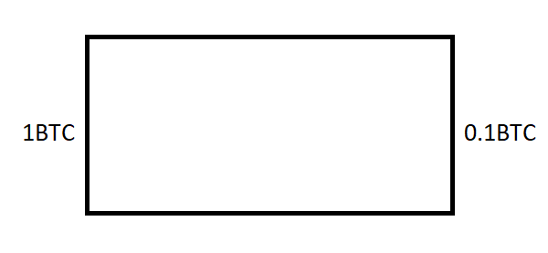
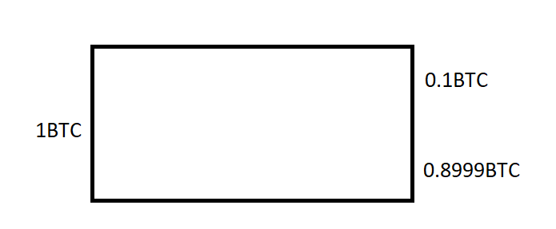
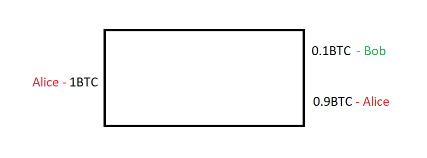
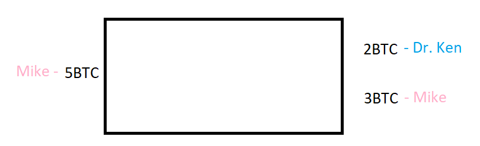
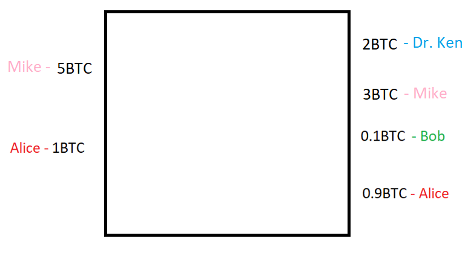
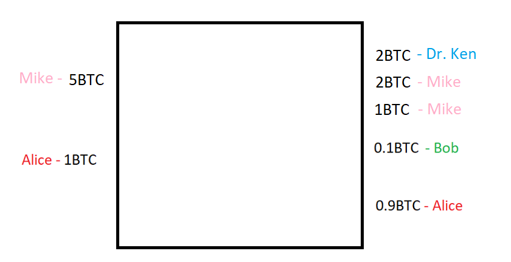

> *作者：nopara73*
> 
> *来源：<https://medium.com/coinmonks/knapsack-mixing-6a5b1ac95c33>*


我想要简单介绍一篇 [2017 年关于 Knapsack 混币的论文](https://www.comsys.rwth-aachen.de/fileadmin/papers/2017/2017-maurer-trustcom-coinjoin.pdf)，因为我相信这个概念有点被忽视，而且没有得到很好的研究。

## 正常交易

我是 Alice。很久以前，Satoshi 给了我 1 BTC，因此我有了一枚价值 1 BTC 的币。

昨天，我花 0.1 BTC 从 Bob 那里买了几双羊驼袜。于是，我创建了一个比特币交易，如下图所示：



剩下 0.9 BTC 去哪儿了？怪我太傻，不小心将 0.9 BTC 当作矿工费付掉了，因为 1 BTC 的输入减去 0.1 BTC 的输出得到的差值就是矿工费。你不会像我这么傻，你会添加另一个交易输出 0.8999 BTC。这个输出由你控制，可以留到以后再用。只要我看一眼比特币区块链，就会立马发现自己真是傻到无与伦比。正常的比特币交易应该如下图所示：



但是，我想要简化这一模型，不将矿工费考虑在内。这样在下文讨论起 Knapsack 混币会更容易：



## 粗糙的 CoinJoin 交易

事实证明，我们可以将交易合并起来。以 Ken Hurt 和 Mike Oxmaul 之间的交易为例：



利用 Ken 和 Mike 之间的交易与 Alice 和 Bob 之间的交易创建 coinjoin 交易：



问题在于，如果我们求解这个 coinjoin 交易的子集合加总问题（subset sum problem），就可以找到所有可能的子交易：

```java
Sub mappings:
5,1 -> 2,3,0.1,0.9
5 -> 2,3 | 1 -> 0.1,0.9
```

### 题外话

如果没有作进一步启发和假设，复杂计算会让大型原生 coinjoin 交易的去匿名化难度剧增，因为用来解决子集合加总问题的最知名算法在复杂程度上是指数级的。上述论文甚至估算了复杂度下限：

> 这意味着，我们至少要对所有可能的子集合进行迭代，例如，幂集（power set）。一个大小为 n 的集合的幂集大小为 2^n。因此，我们假设在没有有效分区的最优情况下找到所有映射的复杂程度下限至少是 O (2^n*m)，其中 m 是为每个集合解决子集合加总问题所用的时间。正如图 3 所示，我们的求值程序的运行时间确实呈指数级增长，印证了我们的假设。

## GCD 混币

我们将各个输出的最大公约数（即，0.1 BTC）混合起来。在这种情况下，输出如下所示：

```java
0.1 (Bob), 0.1(Alice), 0.1(Alice), 0.1(Alice), 0.1(Alice), 0.1(Alice), 0.1(Alice), 0.1(Alice), 0.1(Alice), 0.1(Alice), 0.1(Dr.Ken), 0.1(Dr.Ken), 0.1(Dr.Ken), 0.1(Dr.Ken), 0.1(Dr.Ken), 0.1(Dr.Ken), 0.1(Dr.Ken), 0.1(Dr.Ken), 0.1(Dr.Ken), 0.1(Dr.Ken), 0.1(Dr.Ken), 0.1(Dr.Ken), 0.1(Dr.Ken), 0.1(Dr.Ken), 0.1(Dr.Ken), 0.1(Dr.Ken), 0.1(Dr.Ken), 0.1(Dr.Ken), 0.1(Dr.Ken), 0.1(Dr.Ken), 0.1(Mike), 0.1(Mike), 0.1(Mike), 0.1(Mike), 0.1(Mike), 0.1(Mike), 0.1(Mike), 0.1(Mike), 0.1(Mike), 0.1(Mike), 0.1(Mike), 0.1(Mike), 0.1(Mike), 0.1(Mike), 0.1(Mike), 0.1(Mike), 0.1(Mike), 0.1(Mike), 0.1(Mike), 0.1(Mike), 0.1(Mike), 0.1(Mike), 0.1(Mike), 0.1(Mike), 0.1(Mike), 0.1(Mike), 0.1(Mike), 0.1(Mike), 0.1(Mike), 0.1(Mike)
```

虽然查看该交易的分析会很有趣，但不幸的是，我的软件无法产生分析，因为求解该交易的子集合加总问题在计算上过于复杂。但是，我们知道该交易将产生大量有效子集和。这是否意味着 GCD 混币比原生 CoinJoin 好得多？

并非如此，因为真正重要的不是子集和的数量，而是能够打破多少 输入-输入关联、输入-输出 关联和 输出-输出 关联。上述论文提供了计算这些值的模型。接下来，我将介绍一种更易于分析的 CoinJoin。

## 即席混币

如果 Mike 将 3 BTC 输出拆分成两个输出 0.9 BTC 和 2.1 BTC 会怎么样？

```java
Sub mappings:
5,1 -> 2,0.1,0.9,0.9,2.1
5 -> 2,0.9,2.1 | 1 -> 0.1,0.9
5 -> 2,0.9,2.1 | 1 -> 0.1,0.9
```

我们得到了 3 个子映射。这样就好多了。请注意，虽然`5 -> 2,0.9,2.1 | 1 -> 0.1,0.9`一行看似重复了，但是事实并非如此，因为有两个不同的 `0.9BTC` 币。只是我不想引入标识符，以免影响软件输出的美观。

## Knapsack 混币

Knapsack 混币的构想是取输入之间的差值：`5-1=4`，并在较大输出集（即，2 BTC 和 3 BTC 这两个输出）上实现子集和。



```java
Sub mappings:
5,1 -> 2,2,1,0.1,0.9
5 -> 2,2,0.1,0.9 | 1 -> 1
5 -> 2,2,1 | 1 -> 0.1,0.9
```

Knapsack 混币通过拆分一个额外的输出多创建了一个子映射，就像即席混币那样。但是，正如我们在 GCD 混币一节所指出的那样，子映射的数量并非 CoinJoin 的终极评价指标，真正重要的是输入-输入 关联、输入-输出 关联和 输出-输出 关联。

### 输入-输入 关联、输入-输出 关联和 输出-输出 关联

```java
粗糙 COINJOIN
Sub mappings:
5,1 -> 2,3,0.1,0.9
5 -> 2,3 | 1 -> 0.1,0.9
输入匹配概率:
5 - inputs: 1(0.5) | outputs: 2(1) 3(1) 0.1(0.5) 0.9(0.5)
1 - inputs: 5(0.5) | outputs: 2(0.5) 3(0.5) 0.1(1) 0.9(1)
输出匹配概率:
2 - inputs: 3(1) 0.1(0.5) 0.9(0.5) | outputs: 5(1) 1(0.5)
3 - inputs: 2(1) 0.1(0.5) 0.9(0.5) | outputs: 5(1) 1(0.5)
0.1 - inputs: 2(0.5) 3(0.5) 0.9(1) | outputs: 5(0.5) 1(1)
0.9 - inputs: 2(0.5) 3(0.5) 0.1(1) | outputs: 5(0.5) 1(1)
```

在粗糙的 CoinJoin 中，输入 5 BTC 有 1(=100%) 的概率匹配 2 BTC 和 3 BTC 这两个输出，因为这两个子映射将输入 5 BTC 映射至 2 BTC 和 3 BTC 这两个输出。

有 0.5(=50%) 的概率匹配输出 0.1 BTC，因为 2 个子映射中有 1 个将输入 5 BTC 映射至输出 0.1 BTC。

虽然关于 Knapsack 的论文止步于此，但是我想要引入一个 CoinJoin 混淆性指标：`CJA`。该指标能够用来比较不同的混币方案。上述交易的`CJA` 是`(5BTC*1BTC)/0.5 + (5BTC*2BTC)/1 + (5BTC*3BTC)/1 + ... = 102`。

我们将原生 CoinJoin 混币与即席混币和 Knapsack 混币进行比较：

```java
CJA(naive)=102
CJA(ad-hoc)=116
CJA(knapsack)=115
```

令我惊讶的是，即席混币的 CJA 居然高于 Knapsack 混币的 CJA。但是，别因此停下进一步探索的脚步。为完整起见，我们来看看上文讨论的 3 种混币方案的全部分析：

```java
NAIVE
Sub mappings:
 5,1 -> 2,3,0.1,0.9
 5 -> 2,3 | 1 -> 0.1,0.9
Input match probabilities:
 5 - inputs: 1(0.5) | outputs: 2(1) 3(1) 0.1(0.5) 0.9(0.5)
 1 - inputs: 5(0.5) | outputs: 2(0.5) 3(0.5) 0.1(1) 0.9(1)
Output match probabilities:
 2 - inputs: 3(1) 0.1(0.5) 0.9(0.5) | outputs: 5(1) 1(0.5)
 3 - inputs: 2(1) 0.1(0.5) 0.9(0.5) | outputs: 5(1) 1(0.5)
 0.1 - inputs: 2(0.5) 3(0.5) 0.9(1) | outputs: 5(0.5) 1(1)
 0.9 - inputs: 2(0.5) 3(0.5) 0.1(1) | outputs: 5(0.5) 1(1)
CoinJoin Ambiguity Score: 102
AD-HOC
Sub mappings:
 5,1 -> 2,0.1,0.9,0.9,2.1
 5 -> 2,0.9,2.1 | 1 -> 0.1,0.9
 5 -> 2,0.9,2.1 | 1 -> 0.1,0.9
Input match probabilities:
 5 - inputs: 1(0.33) | outputs: 2(1) 0.1(0.33) 0.9(0.67) 0.9(0.67) 2.1(1)
 1 - inputs: 5(0.33) | outputs: 2(0.33) 0.1(1) 0.9(0.67) 0.9(0.67) 2.1(0.33)
Output match probabilities:
 2 - inputs: 0.1(0.33) 0.9(0.67) 0.9(0.67) 2.1(1) | outputs: 5(1) 1(0.33)
 0.1 - inputs: 2(0.33) 0.9(0.67) 0.9(0.67) 2.1(0.33) | outputs: 5(0.33) 1(1)
 0.9 - inputs: 2(0.67) 0.1(0.67) 0.9(0.33) 2.1(0.67) | outputs: 5(0.67) 1(0.67)
 0.9 - inputs: 2(0.67) 0.1(0.67) 0.9(0.33) 2.1(0.67) | outputs: 5(0.67) 1(0.67)
 2.1 - inputs: 2(1) 0.1(0.33) 0.9(0.67) 0.9(0.67) | outputs: 5(1) 1(0.33)
CoinJoin Ambiguity Score: 116
KNAPSACK
Sub mappings:
 5,1 -> 2,2,1,0.1,0.9
 5 -> 2,2,0.1,0.9 | 1 -> 1
 5 -> 2,2,1 | 1 -> 0.1,0.9
Input match probabilities:
 5 - inputs: 1(0.33) | outputs: 2(1) 2(1) 1(0.67) 0.1(0.67) 0.9(0.67)
 1 - inputs: 5(0.33) | outputs: 2(0.33) 2(0.33) 1(0.67) 0.1(0.67) 0.9(0.67)
Output match probabilities:
 2 - inputs: 2(1) 1(0.67) 0.1(0.67) 0.9(0.67) | outputs: 5(1) 1(0.33)
 2 - inputs: 2(1) 1(0.67) 0.1(0.67) 0.9(0.67) | outputs: 5(1) 1(0.33)
 1 - inputs: 2(0.67) 2(0.67) 0.1(0.33) 0.9(0.33) | outputs: 5(0.67) 1(0.67)
 0.1 - inputs: 2(0.67) 2(0.67) 1(0.33) 0.9(1) | outputs: 5(0.67) 1(0.67)
 0.9 - inputs: 2(0.67) 2(0.67) 1(0.33) 0.1(1) | outputs: 5(0.67) 1(0.67)
CoinJoin Ambiguity Score: 115
```

### CoinJoin 效率

请注意 CJA 分数没有将占用的区块空间计算在内。为了切实比较不同的 CoinJoin 方案，我们需要将该因素考虑在内。不过，如果是比较即席混币和 Knapsack 混币，我们可以不考虑该因素，因为这两个方案产生了相同数量的输出。

### 拆分活跃输出

请注意，我们有时想要拆分活跃输出，但实际操作起来很难。虽然我可以为自己生成多个找零地址，但是我无法为收款人（即，我想要将比特币发送给谁）生成多个地址。这里可以使用 Stealth Addresses 和 Payment Codes 等技术，但是存在权衡取舍，因此没有得到采用。

### 非衍生映射

请注意，每个分析中都有一个没有子交易的映射。这就是我们在区块链上看到的交易。这就是 CoinJoin。为了更准确地比较粗糙 CoinJoin 和其它混币方案， 该映射应该被排除在外，不应计入输入-输入、输入-输出和输出-输出链接的概率矩阵中，当然也不应计入 CJA 等衍生指标。

### 协调

构建 CoinJoin 需要解决的一个问题是，如何通过免信任的方式协调 CoinJoin 交易。CoinShuffle、Chaumian CoinJoin、TumbleBit、Xim 都有效，因为输出相等。

尽管我认为这不是个不可能完成的任务，但是我们眼下还不能进行深入研究，因为我们首先要弄清楚什么是区块空间效率最高的混币算法，然后在此基础上实现一个免信任方案。

### 其它混币技术

上述关于 Knapsack 的论文提供了另一个改良版 Knapsack 混币技术，其 CJA 分数是 `126`。这是迄今为止最好的混币技术：

```java
Sub mappings:
5,1 -> 1,1,3,0.1,0.9
5 -> 1,3,0.1,0.9 | 1 -> 1
5 -> 1,1,3 | 1 -> 0.1,0.9
5 -> 1,3,0.1,0.9 | 1 -> 1
Input match probabilities:
5 - inputs: 1(0.25) | outputs: 1(0.75) 1(0.75) 3(1) 0.1(0.75) 0.9(0.75)
1 - inputs: 5(0.25) | outputs: 1(0.5) 1(0.5) 3(0.25) 0.1(0.5) 0.9(0.5)
Output match probabilities:
1 - inputs: 1(0.5) 3(0.75) 0.1(0.5) 0.9(0.5) | outputs: 5(0.75) 1(0.5)
1 - inputs: 1(0.5) 3(0.75) 0.1(0.5) 0.9(0.5) | outputs: 5(0.75) 1(0.5)
3 - inputs: 1(0.75) 1(0.75) 0.1(0.75) 0.9(0.75) | outputs: 5(1) 1(0.25)
0.1 - inputs: 1(0.5) 1(0.5) 3(0.75) 0.9(1) | outputs: 5(0.75) 1(0.5)
0.9 - inputs: 1(0.5) 1(0.5) 3(0.75) 0.1(1) | outputs: 5(0.75) 1(0.5)
CoinJoin Ambiguity Score: 126
```

论文的另一位作者 Felix 和我们分享了混币技术的[另一个改进措施](https://www.youtube.com/watch?v=XDCQI7hrB58&list=PLPwc75tPMdsgTYlu9dJZlosCm0s7WmIpF)，我还没有研究过。目前，我仅在此处提供其代码库链接：https://gitlab.com/maufl/cja/

## CoinJoin 分析工具

我用来生成上述分析的软件是我自己编写的一个 CoinJoin 分析小工具：

https://github.com/nopara73/CoinJoinAnalysis

## 更新

CJA 分数计算有误，因为当我们检查两个 UTXO 之间的距离时，我们想要的是二者的总和而非乘积。这里的指标是互不相关的 UTXO 的总量。因此，CJA 分数的变化如下所示：

```
NAIVE
 CoinJoin Ambiguity Score: 120
AD-HOC
 CoinJoin Ambiguity Score: 162
KNAPSACK
 CoinJoin Ambiguity Score: 148
KNAPSACK 2
 CoinJoin Ambiguity Score: 161
```

如你所见，现在即席混币算法的 CJA 是最高的。

（完）