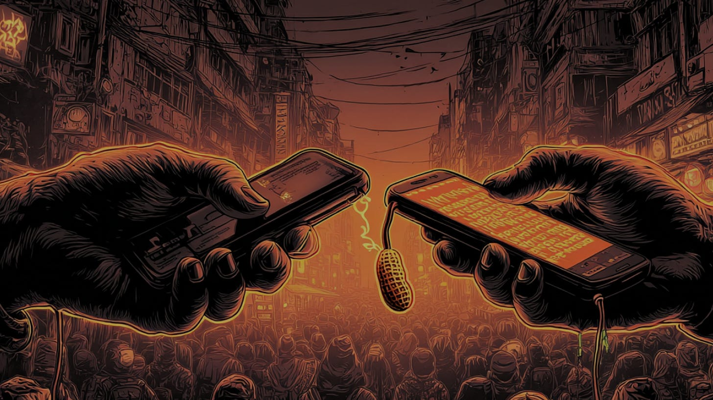
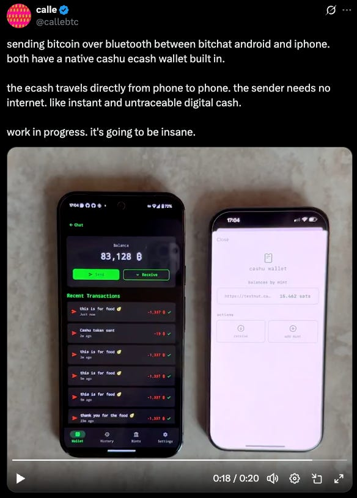

> *作者：JANUSZ*
> 
> *来源：<https://insider.btcpp.dev/p/knock-knock-its-cashu-bitch>*




我相信，有些事情正在互联网上酝酿。虽然成千上万人都参与其中，[我会说](https://x.com/januszg_/status/1945958844594606428)我是最先指出来的那个。

如果你使用 Nostr 协议，或者 Bird app，你可能已经知道了：Jack Dorsey 最近发布了一个 Bitchat 应用。这款应用迅速走红，也引起了这个领域的许多开发者的关注。Cashu 协议的作者 Calle 正在开发 Bitchat 的 [Android 系统](https://github.com/permissionlesstech/bitchat-android?tab=readme-ov-file)实现，而且 …… 你可能也猜到了：

一个原生的 Ecash 钱包[集成](https://x.com/callebtc/status/1945903479693705607)到了这个 Bitchat 移动应用中。




结合了大卫·乔姆式 E-cash 的 [Bitchat](https://github.com/permissionlesstech/bitchat/blob/main/WHITEPAPER.md) 应用，有望在移动设备上打造一种新的匿名、离线支付方式。以前需要信鸽的事情，现在可以使用 noise 协议。以前需要纸币的事情，现在可以使用大卫·乔姆式 E-cash。

我的观点是：Bitchat 和 Cashu 是有前景的匿名、离线比特币支付工具。它当然也有所牺牲，但在特定环境下，它们可以给用户提供便捷的离线价值传输方法。在危机时刻，这甚至可以成为一种救命的基础设施。

有趣的是，就在 Calle 发布公告之前的几个小时，我们团队还在讨论这种组合的功能。本文就是我们的讨论的反映。

## 了解 Bitchat

Bitchat 是一款点对点的即时通讯应用，使用了蓝牙（Bluetooth）协议来跟空间上近距离的对等节点发送消息。它的技术栈可以分成三层：蓝牙网状（mesh）组网，用于消息收发；noise 协议，用于隐私通信；临时对等节点 ID，用于保证身份只暴露给你信任的人。

### 蓝牙网状组网

首先是蓝牙网状组网层。一个网状网络（mesh network）是一个在本地和同地（co-located）对等节点之间创建的局域网络。不同的节点（手机或带有蓝牙芯片的笔记本电脑）发现并连接彼此。一旦通过蓝牙和组网协议连接成功，他们就可以在彼此间传输数据。

在一个网状网络中，每一台手机都既是数据包的发送者，又是数据包的转发者。这意味着，一台设备可以既是一段数据的接收者，又能转发这段数据给网络中的另一个接收者。单个蓝牙设备的通讯范围是有限的，所以这种 本地-对等节点 转发特性扩大了网络中的每一个节点的通讯范围，让每个人的连接能力都超过自己的设备的连接能力。

设想一个简单的例子。Alice 需要给 200 码以外的 Charlie 发送一条消息；而 Bob 刚好在两者中间，离 Alice 和 Charlie 给自只有 100 码远。Alice、Bob 和 Charlie 都在同一个网状网络中。那么 Alice 可以通过广播模式来发送消息，而 Bob 会转发它，然后 Charlie 就能收到。一旦 Charlie 收到了数据，就能解密数据、读出内容。

至于在网络中转发的数据包的加密和解密，Bitchat 使用 noise 协议。

### Noise 协议

“[Noise（噪音）协议](https://noiseprotocol.org/noise.html#introduction)” 是由加密聊天应用 Signal 的创始机构 OpenWhisper Systems 提出的，是一种在两个希望交换私密消息的对等节点之间建立加密通信的框架。

它首先是一套 “握手协议”：允许两个对等节点使用 迪菲-赫尔曼 密钥交换（Diffie-Hellman key exchange）来建立一个安全的、加密的连接，用于持续的私密通信。仅仅使用 DH 密钥交换，噪音协议就能启用端到端加密、前向保密（forward secrecy）、身份隐藏和身份验证。

Bitchat 使用一个 3 步骤的 Noise XX 握手。两个用户在彼此间建立一个安全的信道（也叫 “噪音会话”），双方后续交换的所有消息都将是私密通信。

为了建立这样的连接，其中一个对等节点初始化握手阶段，另一个对等节点响应。在成功交换 3 条消息之后，他们就能使用一个共享的加密密钥来继续私密通信。

会话的密钥会轮换，或者说 “刷新”；每 10000 条消息或者 1 小时轮换一次，以实现健壮的前向保密。

### 临时对等节点 ID

蓝牙让对等节点可以交换数据包；噪音握手协议让对等节点可以加密数据包中的消息；那么，怎么做到既能知道跟自己通信的人是谁、又能持续保持匿名呢？

这就要用到 “临时对等节点 ID” 了。

临时对等节点 ID 确保对等节点的 ID 会定期轮换。这意味着，在一个聊天中的用户的 ID 会经常改变（改变的间隔是随机的）。在 Bitchat 中，每 5 到 15 分钟，以及会话终止的时候，ID 就会改变。Bitchat 的会话管理[框架](https://github.com/permissionlesstech/bitchat/blob/main/bitchat/Identity/SecureIdentityStateManager.swift)保证了这些对等节点 ID 会在一段会话过期之后被妥当地丢弃。

在一次噪音握手期间，应用会将最新的临时 ID [关联](https://github.com/permissionlesstech/bitchat/blob/main/bitchat/Services/NoiseEncryptionService.swift)起来，然后将它们映射为接收者用户公钥的 SHA256 指纹。这保证了即使在一次会话过期之后，已经验证彼此关系的用户也能在对方那里获得一个长久的身份。用户也可以为已经验证了关系的对等节点节点安排社交名称。

用户可以维护与对等节点之间的安全关系，同时防止更广泛网络中的跟踪。

### Bitchat 支持完全离线、私密的数据传输

使用蓝牙网状组网、Noise 加密信道和临时 ID，Bitchat 让用户可以连接到一个更广大的点对点网络、并在其中发送加密消息。用户不需要向网络的其他参与者揭晓自身身份，仅在已经建立的安全连接中揭晓身份。

在许许多多[场景](https://github.com/permissionlesstech/bitchat/blob/main/WHITEPAPER.md#real-world-applications)中，Bitchat 都会有用。它可以用在互联网基础设施和信号塔无法工作的地方。以及，它也可以用在更加普通的情景中 —— 比如，你在一场音乐会上，手机收不到互联网信号。

对于注重隐私的人来说，它提供了对互联网加密聊天应用的替代。蓝牙通信，意味着你不会向信号塔暴露自己的位置。

如果我们在发送比特币的时候，也能保持同样的操作安全性，那就好了 ……

## 与 E-cash 结合

Calle 在昨天给 Bitchat 提出了另一种用途：在离线的时候，通过一个网状网络传输以比特币背书的 token 。

Calle 在 2022 年发明了 Cashu 协议，这是一种大卫·乔姆式 e-cash 支付协议，让用户可以使用不记名的 token 来转移资金。大卫·乔姆式支付系统依赖于 “铸币厂（mint）”，其吸收来自用户的底层资产、发行让用户可以用作支付工具的 e-cash token 。以比特币为本位的 e-cash 铸币厂持有用户存入的链上比特币（译者注：此处理解应有误。Cashu 协议中，铸币厂收取的是闪电支付，而非链上比特币支付）。铸币厂的运营者被信任会保管资金，直至 e-cash token 的持有人要求以 e-cash token 赎回资产，也即保证铸币厂所发行的不记名 token 始终有足额的储备。铸币厂也理所当然不应发行超出自身比特币储备的 e-cash token 。人们期待一个铸币厂所发行的 e-cash token 的价值会跟该铸币厂的比特币储备额相等。通过移除资金托管的顾虑，e-cash 铸币厂为建立面向朋友、家人和社区的比特币托管服务降低了进入门槛。

Cashu 协议也提供了一种离线支付特性。即使支付发送者没有互联网连接，也依然能使用 e-cash 来传输价值，办法是通过一种通道通道，将 token 发送给支付接收者；无论是蓝牙还是 NFC，都没有问题。但离线使用 e-cash 会遇到一个问题 —— 参与支付的其中一方需要上线以敲定这次交易。

### 案例 1：接收者离线，发送者在线

如果接收者没有互联网连接，那么发送者可以将 token 锁定到接收者的公钥。Cashu 的 Pay-to-Public-Key（P2PK）特性让用户可以这样做。只有接收者的私钥能够生成有效的签名，来解锁这样的 e-cash 。

我们来看看 [Cashu 协议说明书](https://github.com/cashubtc/nuts/blob/main/11.md)所提供的一个例子。当接收者离线的时候，发送者构造一笔交易，支付给离线接收者的公钥。然后，发送者将这笔交易提交给铸币厂、并将接收者的公钥作为一个秘密值嵌入。铸币厂提供一个对该秘密值的盲签名，从而让接收者成为唯一能解锁这笔资金的人。发送者将这笔交易以及铸币厂的盲签名发送给接收者；在接收者想要花掉这笔钱的时候，可以生成一个签名来解锁这笔 e-cash token 。

```
{
"amount": 1,
"secret": "[\"P2PK\",{\"nonce\":\"859d4935c4907062a6297cf4e663e2835d90d97ecdd510745d32f6816323a41f\",\"data\":\"0249098aa8b9d2fbec49ff8598feb17b592b986e62319a4fa488a3dc36387157a7\",\"tags\":[[\"sigflag\",\"SIG_INPUTS\"]]}]",
"C": "02698c4e2b5f9534cd0687d87513c759790cf829aa5739184a3e3735471fbda904",
"id": "009a1f293253e41e",
"witness": "{\"signatures\":[\"60f3c9b766770b46caac1d27e1ae6b77c8866ebaeba0b9489fe6a15a837eaa6fcd6eaa825499c72ac342983983fd3ba3a8a41f56677cc99ffd73da68b59e1383\"]}"
}
```

在上面的代码片段中，我们可以看到 “amount（数额）”、“secret（秘密值）”、“C（来自铸币厂的盲签名）”、“id” 和 “witness（见证）” 字段。

“amount” 字段的数值就是被这笔交易花费的 e-cash 数额。在这个例子中是 “1”，表示 1 聪。

“secret” 则是接收者的公钥。

当发送者将交易提交给这个铸币厂的时候，这个铸币厂生成了一个盲签名，就放在证据 “C” 字段中。只有接收者才能生成一个有效签名，来解锁发送给这个公钥的资金。

在回到线上的时候，这个 e-cash token 的接收者可以对 “secret” 中的序列化数据生成一个签名，然后放在 “witness” 字段中。

在这里，接收者（因为不在线）并不知道字段 “C” 中的盲签名是不是该铸币厂的有效签名。为此，我们要利用 “[DLEQ](https://github.com/cashubtc/nuts/blob/main/12.md)（离散对数相等证据）”，为铸币厂的每一个签名生成这样的证据。这些证据让验证者能验证签名来自铸币厂的私钥，而无需上线并与铸币厂比对。这样，接收者就能确信，TA 收到的 e-cash token 是来自这个铸币厂的有效 token 。

这个案例 *要求* 发送者**在线**，以发送 P2PK 交易，因为铸币厂需要生成一个盲签名，跟接收者的公钥绑定。

### 案例 2：发送者离线，接收者在线

*在翻看 Cashu 协议规范的时候我曾经犯过错误。我曾以为离线的发送者也能构造 P2PK 交易。这是错误的。以下是一个经过与 Cashu 贡献者们讨论之后修正的例子。*

上面这个案例反过来行不行呢？能不能在发送者离线的请胯下，让铸币厂来强制执行一笔离线的转账的花费条件？

简单的回答是 “不能”。因为发送者不能离线构造定制化的证据。这意味着，如果他们离线，就不能构造一笔 P2PK 交易从而将 e-cash token 锁定到接收者的某个公钥，也不能分割 token 的面值。

但是，在离线的时候，发送者依然可以发送自己（以客户端身份持有的）token 。他们可以通过互联网之外的一条消息通道发送给接收者，让**接收者**负责跟铸币厂兑现。在接收者跟铸币厂兑现之后，交易就被认为完结了。

这里会引入信任。如果接收者并不立即跟铸币厂兑现收到的 e-cash token，发送者是有可能重复花费的。所以，在发送者离线的情形中，接收者应该尽可能快地联系铸币厂，以将交易敲定。

### 还有其它考虑

**在上面两个例子中，都需要一方在线，才能敲定支付**。而且，关于离线支付，还有别的考虑：

- 用户只能使用自己钱包当前持有的面额。要拆分面额，需要直接联系铸币厂，以创建不同面额的 e-cash token（译者注：e-cash token 就像纸币一样，是有面额的，而且面额一定是 2 的幂）。
- 用户不能花费刚刚离线收到的 token，要回到线上，将这些 token “熔成” 自己钱包的余额才行。
- 如果铸币厂也离线了，那我们必须信任他们有必要的备份，可以回到线上。
- 如果铸币厂离线了，对等节点之间的交易是无法敲定的。

所以，使用 Bitchat 的 Cashu 是一种永久的、“可以放心离线几个月” 的解决方案吗？可能不是。但在特定的场合下，保持离线同时发送 e-cash token，对于没有或者不想要连接互联网的用户来说，是一种可行的选择。

案例 #1：我想要在音乐会上跟一个朋友买杯啤酒，但手机没有信号，因为会场聚集了一万个人。他去了另一个舞台，那里人更少，所以他有信号。那么我只需给他发送价值几千聪的 e-cash token，他可以敲定交易（因为他有网络信号）。

案例 #2：台风刚过，我家的发电机没有油了。我需要去镇上采购一些。但我到了镇上，才发现我的钱包离并没有 e-cash token …… 所以我通过 Bitchat，跟我的妻子和商家建了一个群聊，让她直接给商家发一些 e-cash token 。加油站有电（他们的发电机不会停转），所以他们能连接 WiFi 。这笔支付可以跟铸币厂敲定、变成商家的钱包的余额。

不管怎么说，这两个案例，都可以通过 Bitchat 来协调，发送者不需要互联网连接。而且，因为 bitchat 网状网络可以拓展离线参与者的通信范围，还有许许多多的场景，离线的支付发送者或接收者，可以通过 Bitchat/Cashu 组合来交换价值。

### 但我周围都是朋友和家人 …… 他们会耍我吗？

关于 e-cash 交易是否至少要有一方在线，我似乎有一些误解。昨天，我以为双方都可以离线。但在跟 [niftynei](https://x.com/niftynei) 和 [Tuma](http://primal.net/p/nprofile1qqsfvst7m8feycms4zr5xr70jz6xlwcfa2jgj8hvn0wg06gzv6cz54grfrkq8) 交流并且阅读了协议规范之后，我可以看出，至少一方需要连接到铸币厂，以保证交易可以敲定（如前所述）。

Bitchat 让用户可以跟自己信任的人建立安全的通信通道：朋友、客户，等等。如果你在跟你信任的人联络和做交易，你可以在双方都离线的情况下继续转账。只要 e-cash token 不会复制，理论上，双方可以完全离线地交换 token，而在重新联网后，可以毫无障碍地赎回底层资产或者熔铸成 e-cash 钱包余额。

如果嵌入 bitchat 应用的 e-cash 钱包允许在已经建立安全连接的聊天中发起 离线对离线 的支付，那会怎么样？你必须信任对方的 bitchat 应用不会保存副本或者转发 token，但确实是可行的。

在上面的台风案例中，如果商家和我都没有互联网连接，我们可以使用这种全离线模式来创建一笔交易（让我可以支付给商家）。商家等待自己有网络连接时再联系铸币厂、领取 token 。

这时候，发送者必须是诚实的、不会抢在接收者前面回到网上重复花费。而且，当前的钱包实现甚至不允许发送未熔铸的 e-cash token。但如果钱包能做到，那么上述案例就可能是对等节点在可信的公共环节中，以完全离线的方式传输价值。

## 权衡利弊，享受冒险

在 Bitchat 上使用 E-cash 是一个很酷的实验。离线支付是 e-cash 的强大武器，与 Bitchat 应用协同工作是有前景的。

交易的其中一位参与者需要在线。通过 Bitchat 的组网功能，我们可以扩大离线参与者发起、接受支付的地理范围。这是一个新领域，不仅对比特币来说，也对广大的支付应用领域来说也是如此。

有一个显然的遗憾在于，e-cash 所用的不记名 token 不是原生的比特币。我们必须听从开发者的指导，一以贯之地诚实对待用户：整个协议是基于托管的。但在主链之外使用比特币 *总会* 有所牺牲。

在特定的场景中，Bitchat 和大卫·乔姆式 e-cash 可以提供临时的（可能会是关键的）支付基础设施。对于暂时没有（或者不想要）互联网（或信号塔）连接的人来说，也是一个用户体验提升。全离线模式支付将让他们能够在一个开放（但相互信任）的环境中发起链下价值转移。

Cashu 和 Bitchat 互相独立，没有依赖关系。两种解决方案都会继续得到开发并获得更多采用，不需要等待另一者的成功。

但是，事实上，可以通过 Bitchat 来发送 e-cash token，会让一个孩子好奇完全离线支付的未来。

这能怪他吗？

（完）