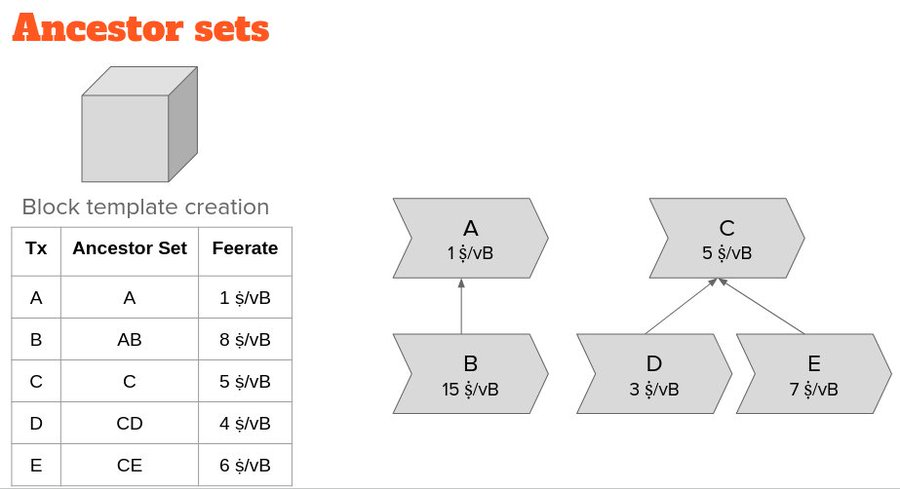
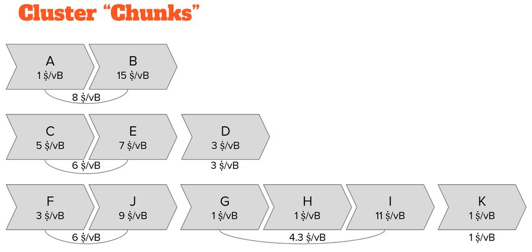

> *作者：Murch*
> 
> *来源：<https://x.com/murchandamus/status/1854678133896626293>*

每一个全节点都在自己的 “内存池” 中存储着未确认的交易。（内存池）这种缓存是节点的一项重要的资源，它带来了点对点的交易转发网络。通过在新区块宣布之前了解和验证（其中将包含的）绝大部分交易，区块传播也能更快。

通过观察哪些交易先出现在交易池中、然后又得到区块确认，节点可以单方面估计未成功竞标一段区块空间、让一笔交易得到确认的必要手续费率。

节点转发交易给它所有的对等节点，对用户隐私性和网络的审查抗性至关重要。快速且不受限制地获取未确认交易，允许任何人构造有竞争力的区块模板、免许可地成为矿工。

当前，`Bitcoin Core` 从 “祖先” 的角度来跟踪每一笔交易。先挑选具有最高祖先集合费率的交易进入区块、然后更新所有受影响的后代交易的祖先集合以及费率，如此不断重复，贪婪地组装起一个区块模板。

这种方法有个缺点：我们需要在构造区块模板的同时不断更新交易数据，而且，我们只能在考虑了所有的相关因素之后才能预测一笔交易的挖矿分数（把它选入一个区块的费率）。

有些时候，对区块空间的需求会变得非常迫切，以至于我们的节点会收到超过它能缓存的数量的交易。而一旦交易池溢出，我们就需要驱逐对挖矿最没有吸引力的交易。

不幸的是，由于一笔交易可能依赖于其它交易，我们只能在计算出所有排在它前面的交易之后，才能准确预测哪一笔交易是最没有吸引力的。如果每次驱逐一笔交易都要付出这么大的计算量，那是无法接受的。

因此，我们采用启发式方法来不完美地评估哪个交易应该先被驱逐。此外，我们还会从 “后代集合” 的角度来跟踪每一笔交易，使用后代集合分数的低分作为驱逐交易的指标。

如果我们交易池中一笔单体交易或者一个叶子交易的后代集合费率是最低的，那么，这个结果是准确的 —— 可以驱逐它。然而，这种启发式方法可能无法正确识别出最后被选入区块模板的交易。

在上面的交易图案例中，“交易 J” 的祖先集合费率最高，将跟它的祖先 “交易 F” 一起挖出；但是 F 本身具有最低的后代集合费率，所以将连同它所有的后代交易（也包括 J）被驱逐。

最后，众所周知，`Bitcoin Core` 所用的 RBF（交易的手续费替换）规则受 BIP-125 启发，并不总能产生激励兼容的替换交易。我们确切地知道有些情况下，替代交易被接受并不能提升交易池状况；而有些情况下，能够提升交易池状况的替代交易会被拒绝。

- 为了展示一些具体的激励兼容问题，来看这样一个例子，“交易 A” 和 “交易 B” 已经在交易吃中，而 “交易 A' ”（与交易 A 冲突）到来了。 -

这就要讲到 “族群交易池（Cluster Mempool）” 提议了（感谢 Suhas Daftuar 和 Pieter Wuille）：如果我们总是能够知道整个交易池 的排序、总是知道每一笔交易的挖矿分数，那是多么美妙？

我们不再使用 “祖先集合” 和 “后代集合” 这样的视角来跟踪交易，而是跟踪交易的 “族群” —— 相关交易整个 “家庭” 。

每一笔交易都只属于一个族群。从属于一个族群的任何一笔交易开始，加入它所有的子交易和亲交易（以及这些子交易的子交易、亲交易的亲交易，周而复始），就能完整地找出这个族群。

然后，我们可以 “线性化” 每个族群：我们可以将交易图转化为一个列表，将它们按照可能会选入区块模板的优先级给它们排序。

到目前为止，我们可以将族群线性化视作在一个族群中运行一次区块构造算法并记录这些交易进入区块的顺序。

在一个规模巨大、结构复杂的族群中计算线性化可能是计算密集的。

在族群上运算的计算成本限制了它们的规模。我们可以暂时搁置这个问题，但如果你想了解更多，Pieter Wuille 在 Delving Bitcoin 论坛上些了一篇讨论如何高效地线性化集群的论文：[Introduction to cluster linearization](https://t.co/RTRy07lnbD)

以前，我们使用祖先集合来发现（比如说）CPFP 中的子交易让同时打包亲交易和子交易变得有吸引力的情形。

而族群线性化，则让我们可以轻易识别出自然会一同打包到区块中的交易片段。当高费率交易跟在低费率交易的后面，我们就可以将它们划分为 “分家”。

这些分家对比祖先集合，有巨大的优势：（1）对比亲交易带有更高费率的多笔子交易，可以自然形成一个分家，这个分家的分率会高于任何一个子交易的祖先集合费率！

（2）一个分家的费率只取决于分家内的交易。甚至当某个祖先被选入区块，一个分家的费率也将保持不变 —— 我们可以预先计算出分家的费率，并读取它们作为分家内所有交易的挖矿分数！

从而，区块构造将直接变成在所有族群中重复地挑选出带有最高费率的分家，直到区块模板满载。这也给了我们对整个交易池的隐式全局排序。

这同时也意味着，我们完全直到哪个分家会被最后挖出。驱逐直接变成了在所有族群中将费率最低的分家移除。

结论是，“族群交易池” 给了我们：

- 更快的区块构筑速度
- 总是可用的挖矿分数
- 近乎最优小庄的驱逐
- 更好的框架（所谓的 “费率图”）来思考交易包 RBF

代价仅仅是一些预先计算的成本以及对族群的规模施加约束。

（完）