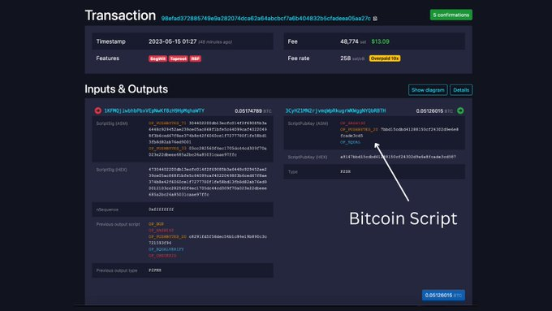
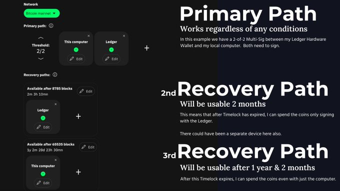
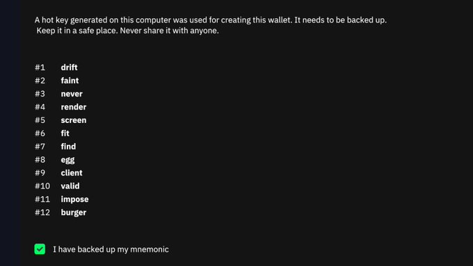
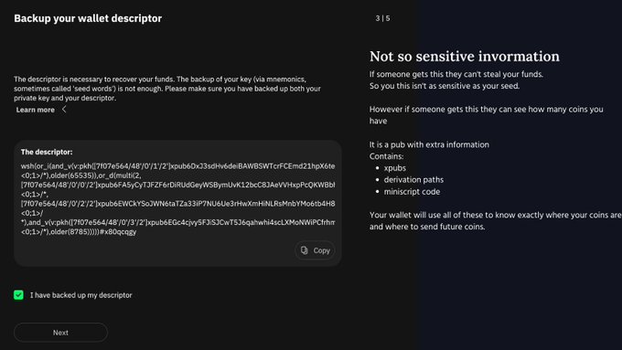
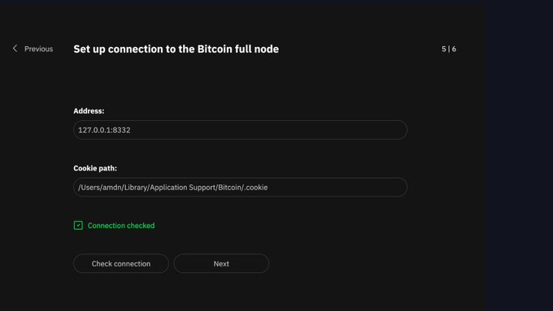
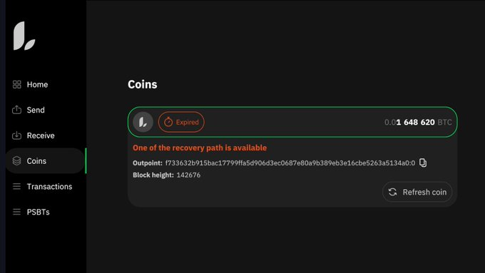

> *作者：Alex Waltz*
>
> *来源：<https://twitter.com/raw_avocado/status/1658099154571218949>*
>
> *推荐阅读：[比特币多签指南](https://www.btcstudy.org/2022/12/09/a-guide-for-bitcoin-multi-sig-wallets-by-mi-zeng/)*

Liana 钱包 v1.0 发布了！

这款比特币钱包支持：

- Miniscript 描述符
- 时间锁
- 多路径花费

这些特性意味着：

- 可以从丢失私钥中回复
- 免信任的财产继承
- 更安全的备份

（详见：[https://wizardsardine.com/liana/](https://t.co/vP113DviIb)）

Liana 是目前支持 Miniscript 和时间锁的三种钱包之一（另外两种是 [@mycitadel_io](https://twitter.com/mycitadel_io) 和 [@bitcoincoreorg](https://twitter.com/bitcoincoreorg)）。让 Liana 区别于另外两者的地方在于，我们格外重视时间锁，这也暗示了我们的目标应用场景。听我细说。

众所周知，比特币是可编程的钱币。Miniscript 是一种框架，让编写比特币程序变得更加简单。粗略地说，Miniscript 为另一种编程语言而设计的编程语言。

比特币的钱币，在区块链上的形式是 UTXO（未花费的交易输出）；在每一个钱币上，都有一个小小的程序，保证只有 “对的那个人（所有者）” 才能花费这笔钱。我们解锁这些钱币的方法是提供 1 个或多个数字签名（通常来说）。

用来编写这样的小程序的编程语言叫做 “Bitcoin Script”。这是由中本聪引入的，并且有意使其简单化、限制其功能。不幸的是，这些限制并没有预期中运行那么良好。

因此，我们能在比特币上做的事情非常有限，很大程度上，这是因为我们无法保证自己所写的程序的正确性。

这就是 Miniscript 的用途。Miniscript 填补了你想要的花费条件及其脚本实现之间的鸿沟。

Miniscript 并没有改变比特币协议，只是在比特币协议的基础上进一步开发。它允许我们释放比特币协议的全部潜能。同时，它还给了我们普通的脚本无法给予的保障。Miniscript 让我们走出了比特币的石器时代。

因为 Liana 长期关注比特币的保管，显然，我们少不了 硬件钱包/签名器。当前，市场上只有 2 种硬件钱包支持 Miniscript：[@Ledger](https://twitter.com/Ledger) 和 DIY 的 [@SpecterWallet](https://twitter.com/SpecterWallet)

这些东西是不是抽象又奇怪？没错，确实是的。但好在，作为用户，你不需要关心这些。钱包软硬件会处理所有这些东西。那么，我们就来看看如何设置一个 Liana 钱包吧。

首先，在你创建一个新的 Liana 钱包的时候，你要选择花费路径：

1. 主路径（Primary Paths）
2. 复原路径（Recovery Paths）

复原路径可以是多签名的，可以在一个相对时间锁解锁后激活，比如，在你存入一笔资金的 X 个区块之后。

（译者注：如图所示，你可以设置多个复原路径。）

下一步，你需要备份由这个钱包生成的 BIP39 种子词。这一步跟其它钱包非常类似，因为 BIP 39 得到了广泛的使用。这是一个热钱包（它会触网）。值得一提的是，当前，Liana 会将种子词不加密地保存在硬盘上。

然后，我们需要备份这个钱包的描述符。描述符的作用就是告诉软件，钱币会在哪里，如何才能花费它。许多人可能对这一笔感到意外，因为他们常常（错误地）以为 “12 个词（种子词）就够了”。其实，只有在软件能够穷举从助记词到钱包地址的路径时，你才能仅仅备份种子词而保证资金不丢失。

（译者注：实际上，一套种子词可以派生出无数个子私钥（以及相应的公钥）。在用户经常接触到的单签名钱包中，比特币社区提出了多个 BIP，来规范如何从种子词派生出子私钥、子公钥和相应的地址。因此，假定你所用的钱包软件遵循了这样的规范，就可以只备份种子词。但在 Liana 这样的多路径钱包中，只备份种子词根本派生不出地址，所以我们必须备份描述符。）

下一步，我们需要在签名设备中登记我们的钱包描述符。这里我用的是 Ledger Nano X。我们需要确认所有 3 个钱包花费条件。视频：https://twitter.com/i/status/1658100886252421122

显然，我们还需要一个节点，跟比特币网络通信。当前，Liana 支持运行在计算机本地的节点。我正在运行 `Bitcoin Core`，使用剪枝模式，它会占用大约 450 MB 的硬盘和 6 GB 的内存。连接成功！

我在这里演示的案例并不一定是最健壮的，但可以看出 Liana 这款软件是怎么工作的。它的意思是：

- 只要我能提供来自我的笔记本**以及** Ledger 的签名，我随时都可以花费这笔钱。
- 如果资金一直没被花费，两个月后，我**只需** Ledger 就可以花费这笔钱。
- 如果资金一直没被花费，一年又两个月后，我**只需**笔记本电脑，就可以花费这笔钱。

（译者注：如果你要使用复原路径而不是主路径，你需要在 Liana 用户界面的左下角 “设置” 界面中使用 “Recovery” 功能。）

Liana（当前）使用的时间锁是相对时间锁，它意味着在一个 UTXO 创建之后、长达 X 个区块的时间。如果你不想让复原路径得以启用，你必须在时间锁到期之前 “刷新” 你的资金（将资金转移到使用相同花费条件的另一个地址中）。钱包会在到期的时候提醒你。刷新本质上是左手倒右手。

使用相对时间锁的另一个结果是，各个 UTXO 的复原路径启用时间是不一样的。如果我们引入绝对时间锁，就可以做到所有 UTXO 都在同一时间启用复用路径。不过，这就没有 “刷新” 一说了，因为你需要创建一个全新的钱包。

时间锁创建了一种自动的开关，到期就会开启，并且也可以重置。这给你的比特币钱包添加了另一个时间的维度，并且可以解锁非常有趣的应用场景。

目前，数字资产的继承都要依靠第三方，或者要跟你的继承人分享你的私钥备份。但在 Liana，你可以为你的继承人设置一个花费路径，还可以为你的朋友设置一个路径。如果你不刷新钱包，他们就总有一天可以动用这里的资金（译者注：前提是他们知晓有这样的路径存在）。

假设两位高管使用一个 2-of-2 多签名来控制公司的资金。使用 Liana，你可以附加一个董事会成员的 3-of-5 多签名，在这两位高管意见不合的时候使用。

还有许许多多这样的案例，但这两个是最常见。

最后，我们鼓励你在 Testnet 上尝试我们的钱包。只需 5 分钟就能建立一个节点，而且不需要用到 Ledger：[github.com/wizardsardine/liana/](https://t.co/dPthu25D6A)

如果你想直接在主网上尝试，请使用较小的数额。如果你想搭配自己的签名设备使用 Liana，让你的制造商增加 Miniscript 支持！

（完）