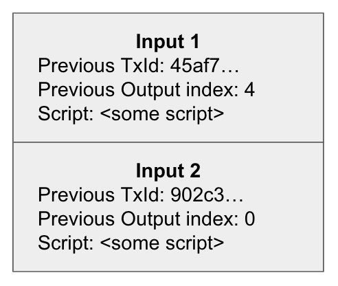
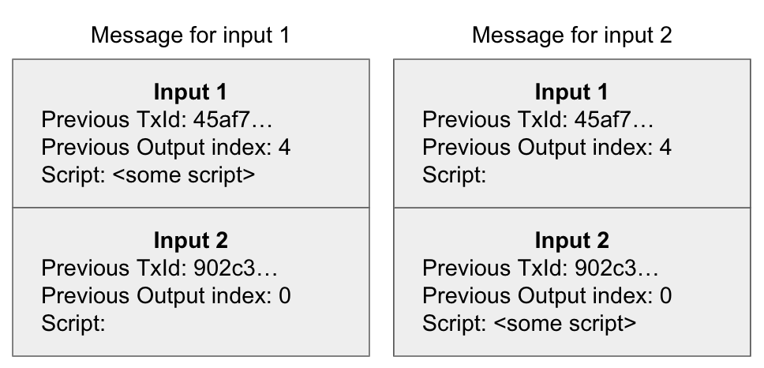
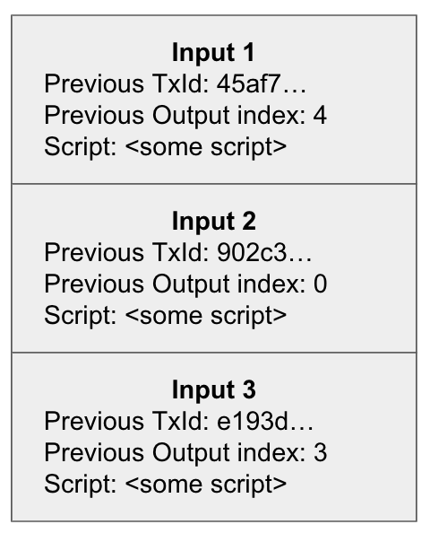
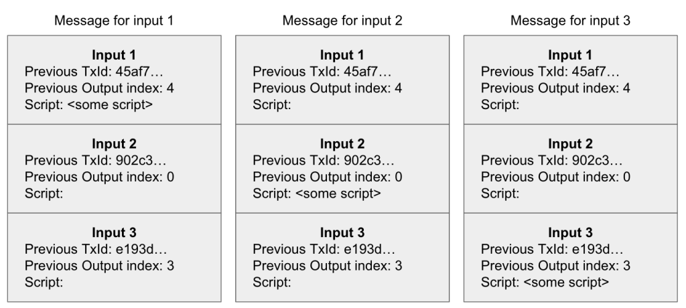

> *作者：technicaldifficulties.io*
> 
> *来源：<https://technicaldifficulties.io/2022/07/22/life-before-segwit-understanding-the-quadratic-sighash-problem/>*

我参加了 Chaincode Lab 的[比特币协议开发研讨会](https://learning.chaincode.com/)。本周，我们深入研究了 SegWit。SegWit 解决了一个叫作 “签名哈希运算平方膨胀（quadratic sighash）” 的问题。

简单来说，这个问题就是签名验证需要长达 O(n²) 的时间来完成。如果你想降低比特币的参与门槛，这是个严重的问题。签名哈希运算平方膨胀之类的问题会将那些算力资源有限（如使用移动节点或树莓派节点）的人拒之门外。如果这个问题没有得到控制，没有专用硬件的人将无法运行节点。运行节点的人越少，比特币的中心化程度就越高。

此外还有一个合法的攻击向量，即，矿工可以创建需要花费很长时间验证的区块，导致其他人无法跟进区块链的最新动态。没了验收方，矿工就可以随心所欲地做自己想做的事。

## 资料

在深入探究上述问题之前，我想要先列出三份很棒的资料，我对此问题的理解就是从中得来。本文实际上对这三份资料里的特定内容进行了整合，只不过增加了一些示意图。

1. fjahar 的[《SegWit 如何解决签名哈希运算平方膨胀问题》](https://fjahr.com/posts/how-segwit-solved-the-quadratic-sighash-problem/)
2. Andrew Chow [在 Stack Overflow 上的回答](https://bitcoin.stackexchange.com/questions/87647/what-is-the-on2-signature-hashing-problem-and-how-does-segwit-solves-it)
3. Rusty Russell 的调查报告[《巨型交易：为何需要花费 25 秒处理？》](https://rusty.ozlabs.org/?p=522)

## 谈谈签名验证

验证签名必须具备以下三个东西：

- 签名

- 公钥

- 被签名的消息

签名和公钥都是需要提供的，但是消息必须经过重新构建。

签名哈希算法 = 消息的构建方式

## SegWit 激活之前的签名哈希算法

在激活 SegWit 之前，我们构建消息的方式如下：

对于每个输入，

1. 获取交易并删除其它所有输入的**脚本**。不是将其它输入完全删除，只是删除其脚本！我们还需要保留其它输入数据，例如，前序交易的 ID 和输出索引号。
2. 对于我们的目标输入，将其脚本替换成来其所引用的输出的脚本。
3. 执行两次 SHA256 哈希计算。

上述步骤生成了可用于签名验证的消息。理解这个问题的关键在于关注第一步中发生了什么。

## O(n²) 是怎么回事？

对于每个输入，你都要略微调整一下交易，再对它进行两次哈希计算。这看上去不是很像二次函数，更像是线性函数，即复杂度为 O(n)，n 就是输入的数量。

将 O(n) 变成 O(n²) 的第二个 n 源于每增加一个输入都会让消息的体积增大。

举个例子可能是最好的说明方法。

## 先看一笔包含 2 个输入的交易

- 包含两个输入的交易（超级简化版） -

现在，我们可以开始为每个输入构建消息。第一步，将非目标输入的脚本删除。

- 包含两个输入的交易经过签名哈希算法第一步处理后得到的消息 -

这看上去可能跟你预期的一样。不是很糟糕。就这笔包含两个输入的交易而言，总共有四部分数据需要经过哈希计算来完成消息构建：

1. **输入 1 的消息**：输入 1（带有脚本）
2. **输入 1 的消息**：输入 2
3. **输入 2 的消息**：输入 1
4. **输入 2 的消息**：输入 2（带有脚本）

4 恰好与 2² 相等。没关系，我们还可以用另一个数据点来证明这确实是二次函数。

## 再看一笔包含 3 个输入的交易

- 包含 3 个输入的交易（超级简化版） -

跟上个例子一样，我们将为每个输入构建消息。以下是每个输入经过第一步处理后的情况：

- 包含 3 个输入的交易经过签名哈希算法第一步处理后得到的消息 -

我们有 3 个输入，就要构建 3 个消息 …… 但是小心了！这 3 个消息全都比上个例子中的更大了！现在，总共有 9 部分数据需要经过哈希计算来完成消息构建：

1. 输入 1 的消息：输入 1（带有脚本）
2. 输入 1 的消息：输入 2
3. 输入 1 的消息：输入 3
4. 输入 2 的消息：输入 1
5. 输入 2 的消息：输入 2（带有脚本）
6. 输入 2 的消息：输入 3
7. 输入 3 的消息：输入 1
8. 输入 3 的消息：输入 2
9. 输入 3 的消息：输入 3（带有脚本）

如你所见，随着输入数量增加，消息的体积逐渐增大，构建这些消息所需的操作也逐渐增多。除了你要构建更多消息之外，每个消息的体积也在变大！

## SegWit 如何解决该问题

SegWit（通过一起部署的 [BIP-143](https://github.com/bitcoin/bips/blob/master/bip-0143.mediawiki)）定义了一个新的签名哈希算法，让见证（签名）数据成为交易之外的一个独立部分，成功解决了二次签名哈希问题。现在的签名哈希算法包含了一个可重复使用的“中间态”，从而省去了以往哈希签名算法中的第一步，将时间复杂度降低至 O(n)。

从某种程度上来说，SegWit 通过 UASF（用户激活软分叉）的方式激活这件事值得我们歌颂。如果我们放任签名哈希运算的平方膨胀问题不管，这世上能够运行节点的普通比特币用户将所剩无几。届时，我们甚至无法通过用户激活软分叉去解决这一问题。

如果你想了解更多关于 SegWit 如何将签名哈希算法的时间复杂度降至 O(n) 的背景知识，请参阅本文开头给出的链接。

（完）