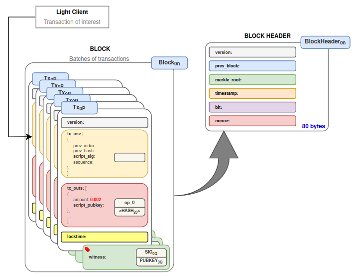
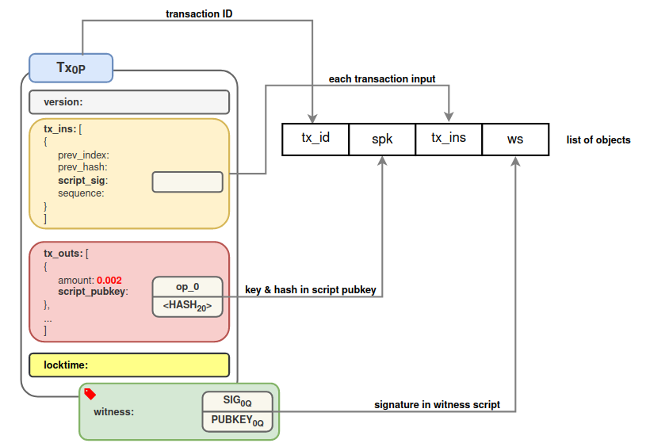
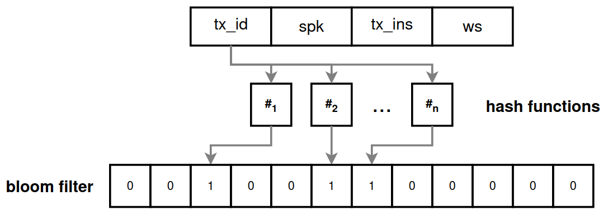

> *作者：ochekliye enigbe*
> 
> *来源：<https://enigbe.medium.com/part-i-bloom-filters-164d046f34b6>*

## 引言

随着比特币的普及，轻客户端的数量也在增长。轻客户端是网络中无法独立验证交易的节点。为了确保这些客户端可以验证跟自己有关的交易，人们提出了在所谓的简单支付验证轻客户端中使用布隆过滤器（bloom filters）的想法。

布隆过滤器的使用让轻客户端可以验证与自己利益相关的交易，并且，在一定程度上，维持隐私性。但是，这种 “保护隐私” 的支付验证方法依然会泄露信息，要求 SPV 客户端信任诚实的对等（全）节点会转发相关交易的默克尔证明过来，而全节点做的这些工作是没有经济激励的。

尽管布隆过滤器提供了许多好处，它的缺点推动了人们寻找基于免信任的对等连接、不会泄露隐私的客户端交易过滤手段。在本文中，我给 SPV 客户端在支付验证中利用布隆过滤器的办法作了基础的介绍，也论述了它面临的一些挑战，以及为什么要有别的办法来构造交易验证。

## SPV 轻客户端的交易验证

并不是所有设备都要能力执行独立的交易验证，因为独立的交易验证的前提是能访问整个比特币账本（区块链）。而许多设备在空间、带宽和处理能力上有特定的限制。实际上，这些能力有限的设备只关心与自己的钱包地址相关的交易，不应该下载几个 GB 的无关数据。此外，随着比特币的普及，运行一个全节点的成本也会越来越高。除了下载区块链，节点还必须跟多个对等节点全天候保持网络连接。内存、运算和带宽要求，都是非常高的，要求网络中的所有节点都要具备这些条件也是不合理的。

- 图 1. 一个包含有某笔轻客户端感兴趣交易的区块 -

对于像手机和笔记本这样的设备来说，可以通过运行轻客户端加入到网络中 —— 轻客户端无法访问完整的区块链，但可以依赖（能够访问完整账本的）全节点来实现支付验证。想要验证自己感兴趣的一笔交易 —— 即支付给某个（些）地址的交易 —— 是有效的，SPV 轻节点可以创建并发送布隆过滤器给全节点，全节点反过来发送足够多的区块信息（以默克尔证明的形式）给轻节点，让轻节点可以重新计算出区块头中的默克尔根。如果默克尔根对得上，就说明这笔交易被包含在了这个区块中。这也是唯一一种轻节点可以确保交易已被包含到这个区块中的办法。

无法访问完整的区块链，意味着轻节点将重复花费的检测委托给了全节点和矿工。轻节点在重复花费攻击面前并不脆弱，因为它们将检测花费相同 UTXO 的交易的任务外包给了矿工。只要诚实的矿工掌握了超过 51% 的算力，就不会有重复花费。

全节点可以对轻节点隐藏交易，也就是拒绝服务。为了跟诚实的全节点建立对等连接，轻节点要随机连接网络中的服务节点，以对抗上述攻击。这使它们对使用假节点围堵它们、将它们隔绝在真实网络之外的攻击很脆弱。这样的攻击无法偷走钱财，但很影响可用性。

轻客户端使用可配置的布隆过滤器来构造交易验证，使自己不会泄露自己钱包地址的信息。

## 布隆过滤器

轻客户端不能分享自己的 地址/script_pubkeys（脚本公钥）给全节点。当然，技术上是可以做到的，但不应该这么做，因为这会让它们丧失隐私性。它们可以做的是创建自己可能感兴趣的交易的超集。这就是用布隆过滤器来实现的 —— 布隆过滤器是一种概率性的搜索过滤器。这种过滤器是一个长度为 **n** 的比特域（bit field），将交易输入一组哈希函数，每个哈希函数都会产生一个哈希值 **q**（q 在 1 与 n 之间），然后我们将位于 **q** 的比特过滤出来（即将 0 换成 1）。

下面就是轻客户端利用布隆过滤器的方式：

- 轻客户端从自己的钱包可以花费的 UTXO 中创建一个脚本哈希值和交易 ID 的列表：对任意一笔给轻客户的钱包支付比特币的交易，轻客户端创建一个列表，包含该交易的 ID、交易输出的 script_pubkey 中的公钥和哈希值、交易输入中的每个输入，以及 witeness 脚本（或者 script_sig）中的签名。见下图：

- 图 2. 创建交易元素的列表 -

- 将所有的列表添加到布隆过滤器中：列表中的每个元素都送入一系列的哈希函数中，并根据哈希值将过滤器对应位置的值设为 1，如下图所示。

- 图 3. 将交易添加到布隆过滤器中 -

- 发送布隆过滤器给对等节点：然后轻节点将完成的布隆过滤器发送给网络中的对等节点。全节点将每一笔收到的交易跟过滤器相比对，在匹配时发送默克尔证明给轻节点。
- 验证交易：得到默克尔证明后，轻节点先检查匹配的交易，然后更新本地对 UTXO 集、钱包余额的视角，以更新布隆过滤器、侦测未来花费新收到的 UTXO 的交易。

布隆过滤器的工作原理看起来非常直接。SPV 轻客户端可以在一定程度上保护自己的隐私，并尽可能地降低了带宽和空间需求。但这些好处不是没有代价的。SPV 轻节点依然有被女巫攻击的风险。全节点也承担着工作负担。这些没有奖励的工作，将全节点暴露在了拒绝服务式攻击的风险中：它们可能被假的布隆过滤器轰炸。而且，为每个轻客户端配置一个过滤器的模式是不可扩展的。

至于布隆过滤器带来的所有好处，似乎大部分的轻客户端都依赖于来自钱包供应商的数据来执行交易验证（Song，2019）。使用布隆过滤器的弊端预示着一种新的方法来执行客户端的交易过滤和验证。这种办法必须能提供如下好处：

1. **隐私性**：布隆过滤器是可以配置的，而且你可以凭借构造的技巧来实现不同程度的隐私性。比特域的长度越长，哈希函数的数量越多，过滤器的准确性和特异性越强，隐私性也就越差。特异性越弱，隐私性就越好。轻客户端已经可以请求区块头而不担心因为自己的过滤器的特异性而泄露隐私。新方法必须能保证轻客户端可以请求区块数据而无需牺牲隐私性。
2. **信任**：轻客户端需要连接到至少一个既不会拒绝服务（不会隐匿交易）又不会发送重复花费交易的诚实节点。新的方法应该鼓励比特币的免信任主义哲学。轻客户端应该能请求和过滤自己想验证的交易的信息，而无需信任任何诚实对等节点。
3. **可用**：全节点一直处在工作状态中，要不断地扫描和重新比对收到的交易和布隆过滤器。除了为不断增长的轻客户端提供服务来保持比特币的网络活跃，它们的服务端交易过滤没有任何报酬。DOS 攻击的风险也要考虑。如果新的轻客户端交易验证方案可以将扫描的工作减轻到一次性计算并消除攻击界面，那才应该探索。
4. **体量**：新的过滤器的体积应该更小。小到可以计算和存储到硬盘中，并在网络中传播。

致密区块过滤器的提议和实现提供了这些好处。在下一篇文章中，我会介绍致密区块过滤器，解释为什么它比布隆过滤器更好。

## 结论

比特币的普及也带来了轻客户端的增长。这些客户端，因为无法访问完整的比特币账本，在交易验证上有特殊的要求。它们依赖于一种创建和发送布隆过滤器给全节点伙伴的支付验证手段。这种过滤器是可以配置的，给了轻客户端隐私上的控制，但也让它们难以招架女巫攻击。为了克服这些缺点，新的过滤系统（叫做 “致密区块过滤器” 出现），这将是我的下一篇文章的主题。

### 联系我

衷心感激您的各种反抗。不论你觉得这篇文章有用，还是发现了其中有事实性错误，都请通过评论区或推特 [@engb_os](https://twitter.com/engb_os) 联系我。

### 参考文献

1. Antonopoulos, A. (2017). *Mastering Bitcoin: Programming the open blockchain*
2. Song, J. (2019). *Programming bitcoin: Learn how to program bitcoin from scratch*
3. Rosenbaum, K. (2019). *Grokking Bitcoin*
4. Mouton, E (2021): *Compact Block Filters Deep Dive (BIP 158)*. https://bitcoin-dev.blog/blog/bip158-deep-dive/. *Accessed 2 May 2022.*

（完）

