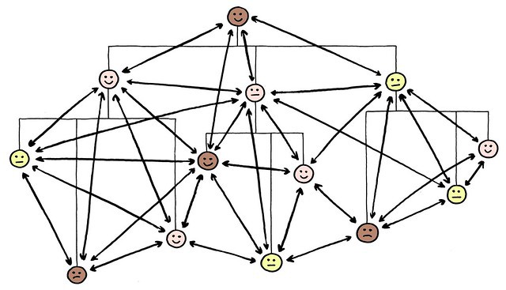
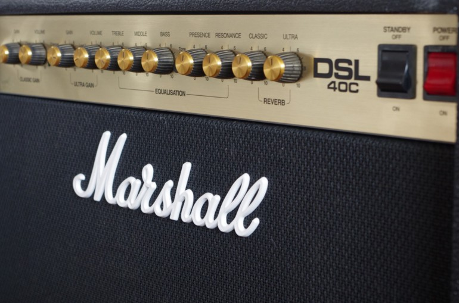

> *作者：Roy Sheinfeld*
> 
> *来源：<https://medium.com/breez-technology/lightning-at-the-end-of-the-tunnel-overcoming-bitcoins-ux-challenges-5738171c759e>*

- 来源：<a href='https://pixabay.com/photos/tunnel-light-hope-mystical-black-3915169/'>pixabay</a> 和<a href='https://www.publicdomainpictures.net/en/view-image.php?image=171437&picture=lightning-display'>publicdomainpictures.net</a> -

闪电网络正在为比特币在演化道路上发起下一次飞跃铺平道路。比特币现在已经不仅是囤币者（HODLers）喜欢的一种资产，它已经具备了成为全球通货的速度和经济体系。我们已经踏在了大规模采用的门槛上。

唯一制约比特币的东西就是用户体验。单纯的技术可能性并不等于对所有用户都有吸引力的、有用的体验。

但用户体验也是一个听起来简单、内涵却极为复杂多样的东西。它意味着许多问题，这些问题都有许多解决方案，每一种方案都有自己的长处和短处、被不同的用户欣赏和喜爱。

对于不同用户群的差异，我们可以假设至少有一个东西是所有用户都想要的：简单的功能性。任何用户可见的方案都必须简单而高效，所以复杂的技术必须在后台无缝运行。也许用户体验最好的衡量标准就是它所提供的功能与它要克服的复杂性之间的差距。

现在，我们来看看闪电网络要成为比特币的一个全球支付解决方案，还有哪些挑战，以及，现在有哪些方法和即将实现的技术可以克服这些挑战。

## 挑战 #1：零配置

如果用户体验的首要目标是将用户与复杂性隔绝，那么用户需要花在配置上的精力就应该是零，是一点也不用操心。

### Autopilot

Lightning Labs 开发了 [autopilot](https://blog.lightning.engineering/announcement/2019/04/23/mainnet-app.html) 功能来减少配置一个闪电网络钱包的难度。Autopilot 扫描整个网络来确定哪些路由节点正在积极管理自己的通道流动性，并建议用户连接到这些节点。

将新用户连接到最活跃的路由节点，背后的假设是这些节点可以提供最好的服务。就像一个 24 小时运行的自动提款机，总比只有 6 个小时的银行柜台的用户体验要好，活跃的路由节点应该能提供更好的联通性和支付的灵活性 —— 其他方面倒没有太大差别。

这是一个很好的起点，但依然很复杂。一方面，用户需要给自己的通道充值。其次，如果用户自己给一个通道充值，那她马上就可以通过这条通道来发送资金，但她得先花掉一些钱，才能靠这条通道来接收资金（她没有入账容量）。第三，用户为了充足的联通性，必须开启多条通道。

### 闪电网络服务提供商

闪电网络服务提供商（LSP）基本上就是网络的中心。就像互联网服务提供商（ISP）一样，LSP 让用户更容易接入网络。

用 autopilot 的语言来说，一个 LSP 就是一个毛遂自荐的路由节点。作为用户的支付通道中的活跃伙伴，LSP 可以帮用户省去进一步配置的麻烦。举个例子，[Breez](https://breez.technology/) 为用户的通道提供入账容量，所以用户马上就能使用闪电网络来接收比特币。Bitrefill 的 [Thor](https://www.bitrefill.com/thor-lightning-network-channels/?hl=en) 也是类似的。LSP 是向迈向零配置的重大一步。

中心化的担忧是没有道理的，因为现在已经有许多 LSP 了（以后还会有更多），所以用户可以连接到多个 LSP。实际上，Breez 钱包很快会允许用户自己选一个 LSP，尽可能减少配置操作的同时保持去中心化和用户匿名。

- 一个好的 LSP 就像闪电网络交易的贵宾服务（来源：<a href="https://commons.wikimedia.org/wiki/File:Valet.jpg">Wikimedia</a>） -

## 挑战 #2：一套余额

闪电网络是比特币主网上的一个二层网络，用户如果想要使用这个网络，就得把资金锁到自己的支付通道里。一笔钱是不能同时既在主网上，又在闪电网络里的。

链上和链下余额的区别，在两个方面影响了用户体验：

1. 为一种货币管理两套余额是没有必要的复杂性。
2. 链下的余额一般来说还分散在多个支付通道里，因此限制了用户在单笔交易中能够支付的数额（至少，没有 AMP 的帮助下是如此，详见下文）。

因此，为了用户体验，链上资金与链下资金的技术区分，是必须隐没在背景中的复杂性之一。实现这种 “幻术” 的技术已经存在，而且还在不断改进。

### 潜水艇互换

潜水艇互换（[Submarine Swaps](https://blockonomi.com/submarine-swaps/)）可以通过中介，在比特币主网和闪电网络之间转移资金 —— 而且，是无需信任的。所以实际上，潜水艇互换可以打通用户的链上和链下余额。

Breez 钱包使用潜水艇互换，将链上的比特币直接转入用户的闪电节点中，无需用户先把资金发到本地的比特币钱包中。因此，用户只会看到自己的闪电网络余额，也只会管理这一套余额，而无需管理一个专门的链上余额。

### 自动再平衡

闪电网络的另一个可能强迫用户处理多个余额的特性是，用户的资金一般来说是分散在多个通道中的。如果用户的资金平均分散在 5 个支付通道中，那么一次支付要动用超过其余额 20% 的资金就成了难事。她要找出一种方法，将其它地方的资金重新分配到合适的支付通道中。

当前，自动化再平衡（automatic rebalancing）可能是绕过这个问题最好的方法。实际上，用户是使用具有富余容量的通道给自己支付，从而提高需要容量的通道中的余额。理想情况下，再平衡要在后台发生，以对用户隐藏通道的边界。自动化再平衡可以让用户能为任何一笔交易动用自己的全部资金。

### 原子化多路径支付

作为一种实现一套余额的工具，原子化多路径支付（atomic multipath payments，AMPs）可以 —— 如果能成功的话 —— 产生跟自动化再平衡同样的结果，而且高效得多。AMP 将一笔支付打散成多个更小的面额的支付，采取多条不同的路径来发送，最终在接收者的钱包中重新组合成一笔支付。这套协议保证了只有在所有散装支付都到达了共同的目的地时，整一笔转账才会被标记为成功，这就防止了混淆和欺诈。

AMP 克服了资金分散在各处的问题，因为它同时使用多个通道将比特币支付到单个接收方，而且不需要提前在本地再平衡。这就像你直接到餐厅去跟朋友会合，而不是让他们在去餐厅之前先全部到你家集合。而且，这个功能是可以自动化的，可以让用户忘掉自己在哪一条通道中有多少钱。

- AMP：从一个点到另一个点的多条路径（图片来源：<a href="https://www.flickr.com/photos/jurgenappelo/5201869924">Jurgen Appello</a>） -

## 挑战 #3：入账流量

一个通道中的资金是分散在通道两端的两个节点的：从一方的角度看，通道的一些资金是属于本地的，另一些是属于远端的。要是远端的余额下降到了零，那么本地的用户就没法靠这个通道来接收支付了。假设一个店家收到的支付多于其发起的支付，TA 的客户最终将无法给 TA 支付，因为通道中的所有资金都 *已经* 属于店家了。现在有几种方案能保持支付通道的双向功能。

### 连接到 LSP

因为 “入账容量问题” 取决于资金是如何在用户的本地和远端分布的，LSP 可以通过主动管理余额来帮助解决这个问题。举个例子，[Breez](https://breez.technology/) 在用户的通道打开后立即为之注入资金，从而赋予用户立即接收资金的能力，而且 Breez 会自动管理用户的入账容量。LSP 提供入账流动性的其它例子有 [LNBig.com](https://lnbig.com/#/) 和 Bitrefill 的 [Thor](https://www.bitrefill.com/thor-lightning-network-channels/?hl=en) 服务。

### 双方充值通道

如上所述，如果一方打开了一条通道，对方没法立即使用这条通道来给 TA 支付，要等 TA 先发起一笔支付才行。但是，现在有一种很有前景的提议将引入 “双方充值通道（[dual-funded channels](https://gist.github.com/bretton/53bc511b6fdafef31951199dd25bbf88)）”。两个用户可以一起开启一条双方充值通道，双方都有初始余额，因此双方都有入账容量和出账容量。

### Loop Out

使用 Lightning Labs 的 Loop 模块，用户可以从本地余额中转出资金到另一个链上钱包，或者转入冷存储钱包。逻辑上来说，移出本地资金就会给通道的另一个用户支付，让对方能给你支付更多钱。

Loop out 解决了入账容量的问题，但它远远不是一个用户体验的灵丹妙药。因为在你将资金移出之前，你需要一个可用的比特币钱包（又会回到我们之前的，如何实现一套余额的问题）。Loop 也要求预先充值通道。用户的经验越少，遇到障碍的可能性就越大。

## 挑战 #4：轻松支付

法币的转账可以非常平滑，发送者甚至不会有什么感觉。这也是消费贷款和扒手背后的奥秘 : )

要从一台设备给另一台设备发送数字化的资金，他们之间要流通数据。扫描二维码是许多钱包用以在设备间传输数据的一种方法。它当然有用，而且大部分拥有智能手机的用户都至少做过几次这样的操作，所以这样的不便利似乎是可以忍受的。

但是，“可以忍受的不便利” 正是用户体验需要改进的表示。即使在最理想的条件下，灯光良好、没有拥挤，二维码也依然烦人。要是灯光不好，人潮又拥挤，扫码就跟在砂纸上读盲文一样困难。必须要又比二维码更好的办法。（请别提 “复制-粘贴” 了谢谢。）

- “我知道你很饿，但是我得先把码加载出来才能给你做披萨！”（来源：<a href="https://commons.wikimedia.org/wiki/File:Dakar_car_2007.jpg">wikimedia</a>） -

### 链接

链接就是为获得数据而产生的。它易于使用，而且可以在任何基于文本的媒体（比如电子邮件和短信）中传播。作为一种在设备间传输支付信息的工具，链接是二维码不需要去改造的轮子。有了链接，支付的处理就成了一个平滑的、不费力的过程。[Breez 的 Connect-to-Pay 功能](https://twitter.com/Breez_Tech/status/1090356173054926848)可以清楚地展示链接是如何工作的。

发送一笔闪电支付可以简单得就像发送一条短信，接收支付也简单得像是阅读一条信息。它就像 Venmo，只不过用的是比特币；它也像 DropBit，但是在链下发生的。

### 近场通讯（NFC）

NFC 是短距离支付得一种非常便利的技术。这种技术也支持许多不同的硬件，给了用户选择卡牌还是收集设备的自由。对于面对面支付 —— 提醒一句，[超过 90% 的零售](https://retailnext.net/en/blog/brick-and-mortar-vs-online-retail/)是在线下商店发生的 —— 非常便利的 NFC 转账的体验是无可比拟的。

## 挑战 #5：即时支付

法币的电汇有时候要花几天时间，国内转账和信用卡支付只需几秒，把现金交到另一个人手中是即时的。闪电网络在最优条件下必须能打败法币，但闪电网络的两个流程会让用户遭遇时延：

1. 初始化开启一个通道，这个操作必须记录在链上；
2. 保证通道的状态跟比特币主链上记录的一致，以及更新闪电网络图谱。

好消息是，第一种时延是可以降低到分钟级别的，而第二种可以完全消除。

### LSP

一条新的支付通道必须发布到链上。这意味用户在使用闪电网络发送和接收支付之前，至少要等待 10 分钟。对比申请一张新的信用卡的时间 —— 甚至是注册一种法币支付服务（比如 PayPal）的时间 —— 10 分钟已经不算久了。

简化上手流程和减少新用户必须等待的时间，是 LSP 的另一个亮点。举个例子，通过支付更高的手续费，他们可以加速将用户的支付通道发布到比特币区块链上，并尽可能降低最初的上手时延。

Bitrefill 的 [Thor Turbo](https://www.bitrefill.com/thor-turbo-channels/) 通道甚至可以立即给予用户 500K~5000K 聪的出账容量，就是要付点手续费。但因为 Thor Turbo 通道是在通道充值交易得到确认之前就开始使用了，它们一开始只能用来 *发送* 支付，而且这样做的时候无法获得比特币的潜在好处。

### 后台同步

所有值得称道的比特币钱包软件都要跟主网保持同步。不然，用户的资金可能遭遇各种情况。而且，同步需要在后台进行，否则打开 app 时候的加载延迟会长到让用户绝望。

不同的同步方案需要来自用户的[不同程度的信任](https://medium.com/breez-technology/the-only-thing-better-than-minimal-trust-is-none-at-all-34456f650332)，视用户愿意牺牲多少对资金和数据的控制权而定。信任程度小的方案可以让用户保持对资金和数据的控制。

Neutrino（BIP157）提供了原始的、低信任度的技术，但如果每次用户打开 app 都需要  Neutrino 重新同步，他们就要等很长时间。所以，一个 UX 敏感型实现必须将 [Neutrino 的常态更新](https://bitcoinmagazine.com/articles/neutrino-privacy-preserving-light-wallet-protocol/)隐藏在后台。为了用户更多的控制里，Breez 钱包使用用户自己指定的节点来同步 Neutrino。还没有其它闪电网络 app 给了用户更多的隐私和控制权。

### 蹦床支付

目前，用户的轻客户端还必须下载整个闪电网络的图谱并在所有可能的路径中计算最优的路径。网络还会继续增长，我们需要比这更高效的方法来路由支付。

蹦床支付将极大地减少所需传输的数据量和所需执行的计算量，它将支付先路由给一个已知的 “蹦床节点（[trampoline node](https://bitcointechweekly.com/front/outsourcing-route-computation-with-trampoline-payments/)）”，这个蹦床节点要么将支付发送到接收方，要么发送给另一个蹦床节点，如此不断进行，直到触达接收方。如此一来，轻客户端就不再需要下载整个图谱，只需知道少数几个蹦床节点即可，其余任务都由蹦床节点搞定。

## 挑战 #6：轻松充值

钱包会瘪下去的。所有钱包，无论是实体钱包还是虚拟钱包，皮夹子还是电子钱包，都有空的时候。这是人生的悲剧之一。若想继续发挥作用，它们需要你偶尔塞点钱进去。虽然没有办法绕过充值的需要，但有许多办法可以做到充值。

### 法币 ↔︎ 闪电网络互通性

只要法币还主宰着通货市场，每个人都需要一些办法将法币价值转换为闪电网络中的比特币。目前，交易所依然是绕不开的解决方案。

但是，不同交易所的服务质量并不相同。他们可以提供法币到闪电网络余额的直接转换，从而绕过比特币钱包的中间步骤、为用户提供很好的服务。Breez 跟 [FastBitcoins](https://blog.fastbitcoins.com/new-fastbitcoins-com-partnerships-to-increase-bitcoin-access-for-all/) 合作，为用户提供了安全、简单、一站式的工具，让他们能够在需要时以法币换取比特币。

### 潜水艇互换

因为潜水艇互换可以在比特币主网和闪电网络间来回移动资金，它也是一种帮助用户保证钱包鼓鼓的遍历工具。而且，使用一些巧妙地设计，用户可以完全不知道它。

## 挑战 #7：支持大面额交易

要使用闪电网络支付通道，你先要在通道中锁定一些资金。又因为这里是没有透支地概念地，所以一条通道无法传输数额超过其容量的转账 —— 理论上是这样。在现实中，交易的数额和通道的容量是两个不同的量，不过总的原则是：在[一条算盘的线](https://medium.com/breez-technology/understanding-lightning-network-using-an-abacus-daad8dc4cf4b)上，你不能移动超过线上珠子数量的珠子。

现实中，用户一般会把资金分散在多条支付通道中。但用户有时可能会需要把这些数量汇总起来、发起一笔数额较大（超过单条通道容量）的转账。用户需要把一条线上的珠子移到另一条线上。理想情况下，他们应该可以完全忽略到底层的通道架构，直接转账 —— 不管是转给谁、什么时候要转、要转多少。

### AMP

AMP 帮用户实现了单一一套余额（详见上文），其必然结果是，它可以从用户的多个通道中获得资金，来支持用户想要的任何转账。

- 这也是一套 “AMP（音响均衡器）”（来源：<a href="https://www.maxpixel.net/Guitar-Amplifier-Amplifier-Marshall-Amp-Dsl40c-3577257">maxpixel</a>） -

### Wumbo 通道

完全是因为这是一项新技术，为了安全，支付通道的最大容量被限制在 0.167 BTC。[Wumbo 通道](https://www.coindesk.com/this-spongebob-themed-tech-proves-that-bitcoins-lightning-is-advancing)是一种放宽这种限制的方法提议。

“Wunbo” 是什么意思？[派大星](https://youtu.be/--hsVknT1c0)讲得最好。它是 “mini（小巧的）” 的反义词。如果通道的双方都希望移除这个限制，他们就可以创建一个 wumbo 通道。

### 通道拼接

通道拼接（splicing）—— 尤其是跟 AMP 相结合 —— 可以把通道容量抛到九霄云外。使用通道拼接，用户就可以在关闭一个通道的同时开启一条新通道，并在此过程中给新通道添加或减少资金，而且 *这全部都是在一笔交易中完成的*。

通道容量将依然是网络的一个特性，但我们可以调整它来适应交易的需要。通道拼接也将让普通用户分辨不出闪电网络和比特币主网的任何差异。

- 看到了吗，一个结束正是另一个开始，这就是 “结”（来源：<a href="https://commons.wikimedia.org/wiki/File:Splice_(PSF).png">Wikimedia</a>） -

## 罗马不是一天建成的（但没准要几十年呢？）

虽然法币设定了比特币必须打败的用户体验标准，这些积累了几个世纪的习惯依然有好处。比特币在短短十几年里获得了长足的进步，而它固有的好处意味着法币已经日薄西山。许多年了，大规模采用总是还差四分之三的精度，但终于，隧道尽头我们看见了闪电。

比特币的大规模采用最大也是最后的阻碍，就是用户体验。闪电网络是比特币长期需要的二层网络，而且我们这里列出的技术已经给出了用户需要的速度、经济体系和使用直觉。如果习惯成了剩下唯一使用法币的理由，那么比特币必将胜出。

（完）