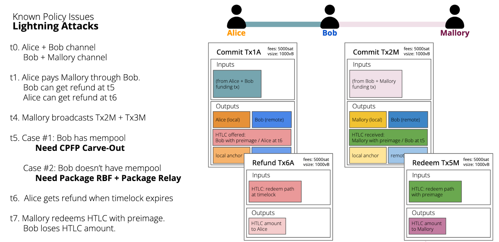
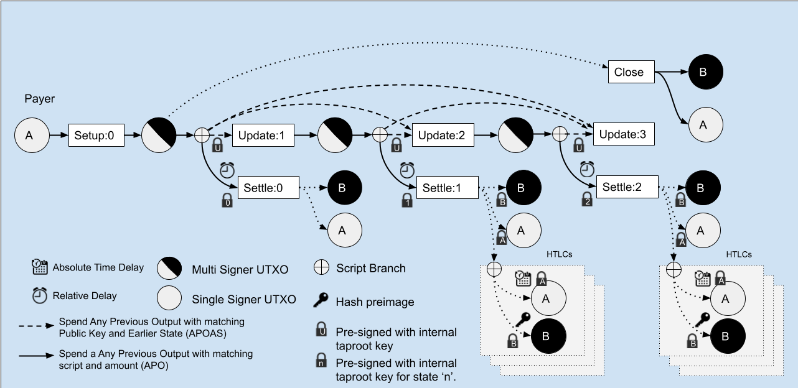

> *作者：Gloria Zhao*
> 
> *来源：<https://blog.okcoin.com/lightning-attacks-and-package-relay-explained/>*

## 摘要

- 比特币有一种 “绝不牺牲安全性” 的设计哲学，因为比特币的核心价值正在于其在敌意环境中的可操作性。
- L2 合约式协议（比如闪电通道）尝试引入更多功能、可扩展性以及隐私性，但交易转发中的一些审查攻击是其软肋。
- 交易包转发是一项 L1 的交易转发策略升级，可以关闭这些攻击界面，因此可以加强闪电通道的安全模型。

## 比特币的设计哲学

因为比特币的最有价值的特性是它不要求信任、它可以抵御腐败，比特币的开发者一般来说是决不牺牲安全性的。这种工程哲学迥异于硅谷式的 “迅速行动、颠覆过去” 信条。当关键的价值特性是便利性时，公开的失败是没问题的 —— 最坏的情况也不过是付钱了但外卖没送达，我还可以在信用卡中心提出异议。但如果我们希望的是普通用户的财产可以抵御国家级别的审查、而且无法依赖于法律来惩罚盗窃时，这样的失败就不可接受了。

将稳定性和安全性放在首位，并不意味着我们在[比特币](https://www.okcoin.com/prices/bitcoin-btc-price-chart)中永远无法拥有功能丰富的金融产品和每秒几千笔交易的处理能力。它只意味着，我们可能要花费更长时间，因为我们不走捷径、也不依靠诸如链回滚、停机切换、验证者真实身份登记处之类的拐棍。使用更弱的安全假设的项目并不是 “免信任的”，哪怕他们可能在别的方面提供了价值。但是，比特币的价值 *正是* 其安全模型。

许多开发者和组织正在开发一个丰富的比特币 “layer 2” 协议（简称 “L2”）生态系统。这些协议的目标是提供可扩展性、隐私性、智能合约，等等，同时保持比特币的免信任模式。这些 L2 协议通过让不受信任的对手方参与嵌入比特币交易的合约来实现这个目标；无论任何一方尝试欺诈，合约都指定了一种方式，让诚实的一方可以在一个特定的时间窗口内通过一个 “撤回” 花费路径取回自己的资金。

最好的例子是[闪电网络（LN）](https://blog.okcoin.com/how-to-use-bitcoin-lightning-network/)，它让用户可以更快地发送比特币交易，而且处理量也更高。当一笔支付还在处理的时候，如果其中一方一直没有响应，另一方可以在链上结算、将属于自己的资金拿回。当前，已经有价值几亿美元的比特币锁定在闪电通道中。已经有大量的交易成功处理，而且似乎没有曝出恶意活动和失盗活动。这样干净的记录显得非常有前景，但还没有理由为其中的安全假设自满。

## 针对闪电通道的攻击

我们将从一个具体的案例开始：在这个案例中，攻击者可以偷窃一笔尚未确认的闪电支付的输出（其形式叫做 “哈希时间锁合约（HTLC）”）。设想一个诚实用户 Bob，他有两条通道：一条是跟 Mallory 开启的，另一条是跟 Alice 开启的。假设 Alice 通过 Bob 给 Mallory 发送一笔支付。如果协议按意图运作，这笔交易应该是原子化的：要么 Bob 和 Mallory 都收到属于自己的支付，要么都收不到。而在这种攻击中，Bob 将给 Mallory 支付，但 Alice 不会给 Bob 支付。

在闪电网络的支付转发中，在每一跳，通道对手都使用两笔新的承诺交易（每个通道参与者提出一笔）来表示正在转发的支付。每一笔承诺交易都带有一个 HTLC 输出，这样的输出有两种花费路径：接收者使用 “支付原像（payment preimage）” 花费它，或者发送者在一段锁定时间之后花费它。也就是说，如果 Bob 无法在给定时间（下图的 “t6”）内领取这些资金，Alice 就可以收回这些资金。而一旦 Bob 给 Mallory 的支付正常进行，他理应可以（获得来自 Mallory 的支付原像）并立即从 Alice 处领取这些资金。

这两笔承诺交易都花费相同的 “未花费的交易输出（UTXO）”（这个输出来自于通道的注资交易）。也就是说，它们相互之间是 “重复花费” 的，因此不可能都进入区块，也不可能都被同一个节点的交易池（mempool）（节点保存未确认交易的专门数据库）接受。而且它们都支付了相同的手续费率，并且这个费率在签名之后就无法改变（改变费率需要双方共同签名一笔新的交易），这意味着，它们无法通过常规的 “[手续费替换](https://bitcoinops.org/en/topics/replace-by-fee/)（RBF）” 规则来取代对方。这意味着，如果 Mallory 广播了自己的承诺交易，任何已经接受这笔交易的交易池，都不会再接收 Bob 的那一笔承诺交易。

假设当前比特币网络中交易量较大，而且 Bob 和 Mallory 的承诺交易的手续费率低于矿工的交易池中的前面 40 MWu 的交易（即 10 个区块所能容纳的交易的体积）。Mallory 广播了自己的承诺交易，而 Bob 并没有注意到，因为这笔交易没有立即被挖出。

在时间点 t5 的时候，Mallory 失去响应，所以 Bob 广播了自己的承诺交易，试图取回自己的资金。然后他发现自己的交易无法确认。他无法请求 Mallory 签名带有更高的手续费率的新交易，因为她已经不再响应了（而且其实正在尝试窃取他的资金）。因为知道矿工会根据祖先交易的手续费率来为交易排序，他为自己的承诺交易附加了一笔高手续费的子交易，也就是使用 “[子为付偿](https://bitcoinops.org/en/topics/cpfp/)（CPFP）” 方法来提高自己的承诺交易的确认优先级。但交易还是无法确认！实际上，已经纳入了 Mallory 的承诺交易的交易池将拒绝 Bob 的承诺交易，不论他所追加的手续费有多么诱人。

到时间点 t6 的时候，Alice 和 Bob 的支付流程完结，结果是 Alice 拿回了资金。通过类似的交易广播竞赛，Mallory 使用原像从已经确认的 HTLC 输出中得到了支付。但现在 Bob 拿到原像也没有用了，因为 Alice 已经从承诺交易的 HTLC 中拿出了资金。所以，Bob 就损失了这个 HTLC 的价值。

如果承诺交易的手续费很高，高到足以立即确认，这种攻击是无法发生的：Mallory 无法通过提前广播交易来 “抢先起跑”。但是，手续费估计从来就不是个容易的事，而高估手续费也会让参与者损失金钱。攻击者也可以通过一次性对几千条闪电通道发起攻击来制造一个高交易量的网络环境 —— 让这么多承诺交易都进入一个区块是做不到的。叫做 “RBF” 的交易池规则（policies）有一些局限性，可能会给那些更早广播交易的人一些优势，而且可以在别的地方给矿工另外支付的人也能提高自己的交易确认优先级。

一种为闪电网络（以及其它类型的智能合约）提出的执行层提议 “[Eltoo](https://bitcoinops.org/en/topics/eltoo/)”，将极大地简化闪电通道协议以及安全要求，但也重度依赖于单体的低手续费交易有追加手续费的方法可用。举个例子，在每一笔状态更新交易中插入手续费需要从输入中减去一些价值，从而导致通道在更新时 “漏出” 一些资金。有一种简单的解决方案：通道的参与者构造和签名不包含任何手续费的状态更新交易，在广播时通过附加高手续费的后代交易来添加手续费（也就是 CPFP）。但是，今天的绝大部分节点都会拒绝 0 手续费的交易，不论其后代将支付多高的手续费。

- 图片来源：<a href="http://yakshaver.org/2021/07/26/first.html">Richard Myers, 2011</a> -

我们可以将这种攻击推广到所有的比特币的 “智能合约” 和 L2 协议 —— 给定它们依赖于时间敏感的、预签名的交易来缓解欺诈。试图在链上结算的诚实参与者必须能够在一段时间内确认交易，但预签名交易的手续费率无法在广播的时候调整。这些条件的结合，使得追加手续费的技术对安全性极为关键。当前，还没有可靠的方法能为预签名的交易追加手续费。

## 什么是 “交易包转发”？

我们希望创建一个公平的、基于手续费的区块空间市场，从而让我们依赖的安全假设缩减为唯一一条：“矿工是经济上理性的，希望收集尽可能多的手续费”。当前已有的激励兼容的交易池规则，可以帮助用户通过子交易或替代交易提高自己的交易的确认优先级。

但是，如上所述，在一笔交易提交至交易池时仅考虑它本身，是有局限的，它可能让节点无法发现拥有最高手续费率的交易，因为它必须在所有交易都到达交易池之后，才能考虑子交易的价值；类似地，在面对两笔相互冲突的交易、要决定保存哪一笔时，节点也将无法使用交易的后代。

“交易包转发” 是一种通过升级我们的交易池逻辑和交易广播机制来修复这些问题的[提议](https://github.com/bitcoin/bips/pull/1324)，它将多笔交易所形成的包裹作为一个衡量的单元，而不是单笔单笔地考量它们。这些规则的网络接受度将创建一个更纯粹基于手续费的区块空间市场，并让合约协议可以在广播的时候调整手续费（从而调整挖矿优先级）。

但是，尝试设计安全的交易验证逻辑也有自身的挑战。未确认的交易是容易创建的（不需要付出 PoW），而且，如果我们不够仔细的话，可能需要花费很多资源来验证。免准入的点对点网络中的恶意节点可以给我们发送数据，让我们的 CPU 高烧、用尽内存、宕机、忽视来自诚实节点的数据，甚至揭晓我们的节点的身份信息。我们也无法使用一种声誉系统来避免恶意节点，而且我们还要保证资源要求最小号（例如，一个树莓派节点也应该能参与交易包转发）。再说一遍，这些要求富有挑战性，而且是不可妥协的，因为比特币的目标是成为一个抗审查的网络。

