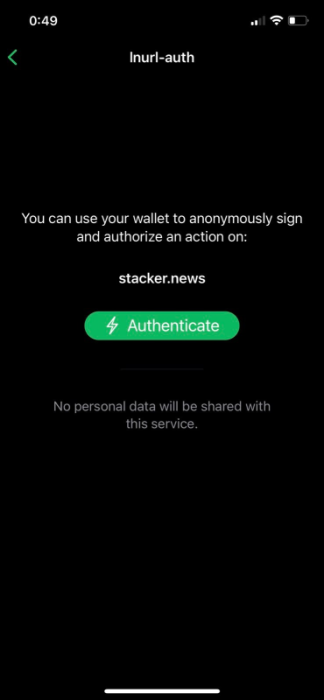

> *作者：heisenberg*
> 
> *来源：<https://stacker.news/items/98600>*


## 引言

大多数人认为闪电网络是一个实现快捷低成本比特币交易的支付网络。但是，你知道你可以使用闪电网络钱包轻松、安全且匿名地登录某些服务吗？

## 口令

如今，互联网上最常见的身份验证方式是**输入用户名和口令**（译者注：大家习惯称为 “密码”）。这个概念已有数十年历史，一直保持良好运作。但是，它有什么缺陷？

为了方便起见，用户通常会选择容易被猜到或暴力破解的**简单密码**。或者，用户会为多个服务设置**同一个密码**。在后一种情况下，一旦某个用户的密码泄露，攻击者可以同时入侵这个用户在多个平台上的账号。攻击者只需在其它平台上尝试相同的密码组合。

## 闪电网络如何用于身份验证？

但是，我们能不能使用**另一种**安全的登录方式来取代用户名和密码呢？这现实吗？

本文将介绍 **LNURL-auth 协议**。LNURL 是一组扩展了闪电网络功能的协议（我们已经在关于[闪电网络地址](https://stacker.news/items/65872)的文章中介绍了其中一个协议）。具体来说，LNURL-auth 负责的是登录部分。

这种登录方式实际是如何操作的？很简单，打开一个支持 LNURL-auth 技术的网站，用你的闪电网络钱包**扫描二维码**（就像过去支付发票那样），即可成功登录。就这么简单而已。这种登录方式背后的运作原理是什么？它安全吗？

## 原理

所有闪电网络钱包都有一个组成部分是私钥。就像在比特币网络中那样，私钥是一个绝对不能向任何人透露的**随机数**。谁知道你的私钥就证明谁拥有你的比特币。

在实际操作中，网站向你发送随机数据，你用自己的**私钥**签署该随机数据并返回签名和**公钥**。然后，网站验证你的签名，如果签名是正确的，则你的身份验证成功。这一切都依赖于你知道自己的私钥，而且你是它的唯一所有者。没有私钥就无法创建有效签名。

事实上，用于身份验证的私钥与用于证明比特币所有权的私钥不是同一个。身份验证私钥根据网站 URL 生成，因此不同网站使用的私钥不同。

有些初学者可能觉得这听起来很复杂，但实际上就是你的身份**与你的私钥绑定**而已。只要没有人偷走你的私钥，你只需扫描二维码即可登录各种服务。

你唯一要上心的就是**保管好自己的私钥**。通常情况下，你可以使用种子短语（用于找回主私钥的 12 至 24 个单词）。

## 优势和劣势

相比传统的用户名和密码登录方式，私钥登录有何**优势**？

- 你不需要创建、记住或存储任何密码。
- 你甚至不需要填写用户名，你只需要“扫码”。
- 你的密码（这里指私钥）永远不会经过网络传输，因此不会被拦截。
- 针对每个服务生成的私钥不同，因此你的身份不可能在多个服务之间形成关联（例如，你使用同一个电子邮件或用户名）。
- 快速、简单

有哪些**劣势**？

- 目前为止，鲜有服务支持这种登录方式。
- 你必须拥有一个支持 LNURL-auth 技术的闪电网络钱包。
- 拥有了你的钱包的完整访问权限，就等于拥有了你的身份。
- 你有责任保管好自己的种子词。

## 实践

上文已经说得很清楚，首先你需要一个闪电网络钱包。就本例而言，我强烈建议你选择非托管型钱包（**确保私钥的所有权在你自己手中**），例如，Phoenix 或 Breez。你也可以通过 Zeus 运行自己的节点。

BlueWallet 同样支持该功能，但它**默认**采用托管方式（即，由第三方代持私钥），因此我并不推荐。目前 Wallet of Satoshi 和 Muun wallets 都不支持 LNURL-auth 技术。

你必须正确**备份**你的钱包。一旦你丢失了钱包，你就会失去你的身份。当然了，你应该为访问钱包设置额外的身份验证方式（PIN、指纹、FaceID 等等）。

有人可能会觉得使用这种方式存储身份有些危险。但是，如果有攻击者入侵你的手机，绕过生物识别认证窃取你钱包中的身份，他也可以使用同样的方式窃取你存储在任意密码管理器里的密码。

就是这样 —— 你不需要使用钱包付款，你甚至不需要往这个钱包里存入比特币。

哪里可以尝试基于闪电网络钱包的登录方式？Stacker.News 就是其中一例。



## 结论

基于闪电网络的身份认证是一个**有趣的概念**，用户只需扫描二维码即可登录，具有很高的安全性、匿名性，而且非常人性化。

但是，LNURL-auth 技术本身仍处于**早期发展阶段**。因此，我们需要等待一段时间来获得更广泛的支持，无论是在服务端还是钱包端。

与此同时，我还要强调的一点是，这种登录方式不涉及“真人识别”，任何人都可以创建无数密钥/钱包（即，身份）。因此，这个问题必须单独处理。

不管怎么说，试一试又不要钱。勇敢上吧！

## 进阶

等等，就这么结束了吗？如果你是极客，又想深入了解这类概念的话，不妨跟我一起从技术角度来看 LNURL-auth 技术。

每个非托管型钱包都有一个**主私钥**（如果没有，我们也有[解决方案](https://github.com/lnurl/luds/blob/luds/13.md)）。派生路径 **m/138'/0** 包含所谓的 **hashingKey**。我们将 hashingKey 与服务 URL 一起放入 HMAC 函数：

```
1output = HMAC-SHA256(hashingKey, domain from URL string)
```

取输出开头 16 个字节，并将它们拆分成 4 个长度相等的部分，即可得到所谓 **linkingKey** 的派生路径。每个服务（URL）的 linkingKey 都是独一无二的。

```
1linkingKey = m/138'/<part1>/<part2>/<part3>/<part4>
```

扫描二维码后，钱包会按 bech32 格式解码，得到一个 HTTPS 链接。例如：

```
https://web.com?tag=login&k1=random_data&action=login
```

**tag** 参数告诉我们这是 LNURL-auth，**action** 参数注明行为是登录（也可以是注册等等）。此外，还有一个很重要的参数 **k1**，它包含了我们需要使用 **linkingPrivKey** 签署的长度为 32 个字节的随机数据。

同意登录对话框后，钱包会使用同一个 URL 进行响应，只增加了 **sig** 和 **key** 参数：

- **sig** = 在 **secp256k1** 曲线上使用私钥 **linkingPrivKey** 签署的随机数据 **k1**

- **key** = linkingKey 公钥

```
https://web.com?tag=login&k1=random_data&action=login&sig=signature&key=public_key
```

最后，服务验证签名是否正确。验证通过后，服务会基于我们使用的 linkingKey 为我们分配身份。如果是注册，服务会为我们创建新的身份。

如果你想了解更多细节并阅读规范：

- https://github.com/lnurl/luds/blob/luds/05.md

- https://github.com/lnurl/luds/blob/luds/13.md

- https://github.com/lnurl/luds/blob/luds/04.md

（完）