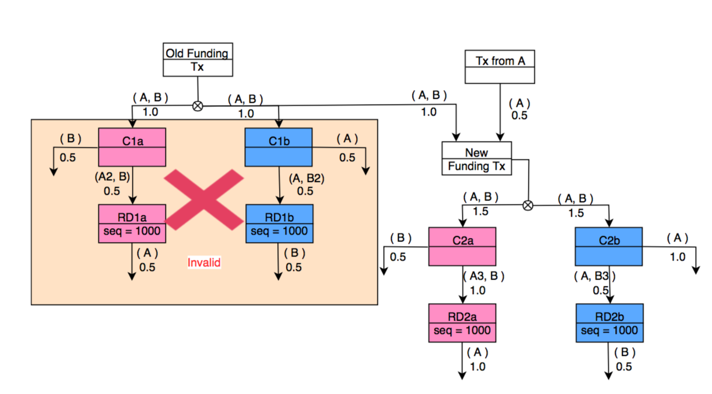

> *作者：Dusty Daemon*
> 
> *来源：<https://lightningsplice.com/splicing_explained.html>*

## 简单解释通道拼接

就其核心而言，“拼接（splicing）” 是一个简单的概念，就是指重设闪电通道大小的能力。但随着时间推移，越来越显而易见的是，这种重设闪电通道大小的能力，将给我们带来许多额外的好处，这些好处往往在意料之外，而且从根本上提高了闪电网络的可用性。

通道拼接带来了两个方面的提升：

- 面向用户的提升
- 后台的流动性提升

### 面向用户的提升

第一方面是相对容易解释的：现在有许多的比特币钱包 app —— 这当然很好。但在这些开发者开发自己的 app 时，就会遇上一个问题：这个 app 到底做成比特币钱包呢，还是闪电钱包呢？

大部分钱包会选择其中之一，但一些更有雄心的钱包会选择两者都做！从更加根本的视角来看，当然两者都做是最好的解决方案。

但这就带来了一个问题。这些钱包将拥有 “两套余额” —— 一套是（“链上的”）比特币余额，另一套是闪电通道中的比特币余额。我不知道你有没有引导过新人了解比特币，我可以告诉你：两套余额会让新用户很困惑。对于资深的、 “老炮儿” 比特币人来说，这不是什么问题，但是，我们希望每个人都能用上比特币。

这个 “两套余额” 问题并不是一个设计问题，而且因为这两种模式（链上资金 vs. 闪电通道）根本不同，所以无法变成 “一套”，不然就会产生新的用户问题：更长的支付时延 以及/或者  高不可攀的手续费。

而通道拼接，如果能在网络中实现，就会成为一个秘密武器，让 “一套余额” 的钱包成为可能。因为通道拼接让这两种余额可以低成本地互通（互相转换）。

### 后端流动性提升

第二方面，后端的流动性提升，可能更难理解，但（相比于 “一套余额” 的 app）对闪电网络有更加重大的影响。

闪电网络的运行靠的是分散在网络中的许多 “微型” 银行。这些银行只提供一种服务：往某个方向移动资金。

传统的银行业需要一个巨型的 “中心” 银行批准少量 “真正” 的银行进入一个受信任的网络。但闪电网络反其道而行之：我们为什么不让每个人都自己开银行呢？许许多多可以互通的小银行，能不能变成一个 “去中心化的银行”？只要足够多人这么做，我们最终就能创造跟中心银行一样可靠 —— 甚至更可靠的东西！

这在事实上已经发生了。闪电网络中的 “微型银行” 的数量一直在增长，而且很快我们将拥有 10 万个微型银行 —— 远远超过美国境内的 5000 家。

这些微型银行将为了路由你的交易而相互竞争，因此会提供最便宜的服务。这样的银行为了路由一笔支付，必须已经在比特币的某个 “闪电账户” 里面存储了一些资金。

再给你提供一些具体的数字：一个成功的闪电银行一般要维护 100 个闪电账户；TA 要在这些账户之间不断移动资金、预测下一个用户需要向哪个方向发起支付。如果他们恰巧在通往 “Sally 的三明治商店” 的路径上有 10 0000 聪的账户余额，那么，当你要跟 Sally 买一个三明治的时候，他们可能就被你选中来路由你的支付。

现在，想象其中一个管理着 100 个账户的微型银行，持续地在账户间转移资金，以猜测消费者的行为。这是相当难的事情！因为事实上，人们的行为都是非常难以预测的，而且你还有很多竞争者，想跟你做一样的事情。

那么，通道拼接跟这个有什么关系呢？嗯哼，在这些账户之间移动资金是很贵的 —— 现实中，这些闪电银行需要不停地**关闭**和**开启**账户。他们还需要保留一笔资金作为 “储备”，以备在意外需求出现的时候可以部署到闪电网络中。

通道拼接既消除了昂贵的关闭和开启账户的必要，也消除了保留闲置的 “储备” 资金的必要。这将极大地降低这些微型银行的运营成本、复杂性，以及闲置资本挑战。通道拼接是通过允许直接在 “闪电账户” 之间转移资金（同时是尽可能地成本的）来做到这一切的。更棒的事情是，通道拼接也通过让这些微型银行可以保持独立 —— 不再需要依赖于所谓的 “中心化的流动性提供者” —— 让整个网络更加强壮。

这个事情对于运行闪电微型银行的人来说是非常令人振奋的，当然，对你这样的闪电网络用户来说应该也一样。如果这些微型银行能够更加高效地运行，那么，节约的成本自然也能以惠及用户，其表现是更加**便宜**的手续费和更加可靠的支付。

## 通道拼接技术概述

通道拼接指的是将一条闪电通道中的资金（这个通道的注资 UTXO）移动到一个新的 “拼接后” 的 UTXO 中。具体的操作非常简单 —— 签名 2-of-2 的多签名交易，将资金移动到一个新的位置。但是，想要让这个过程保持免信任性，就不是那么简单了

在实际移动原注资 UTXO **以及**任何子 HTLC 交易**之前**，必须为新的 “拼接后” 的 UTXO 重新构造承诺交易。

但是，在我们为新通道重新创建一个复制的承诺状态之前，我们需要保证当前通道中的状态不会在工作中被改变。所以，我们引入了一种新的闪电状态，称为 “SomeThing Fundamental is Underway”，缩写为 “STFU”。

STFU 将在一段时间内禁止改变当前通道的承诺状态。

然后，参与通道的两个节点使用 interactive-tx 协议开始交易协商：每一方在轮到自己时都可以同时添加输入和输出。当前通道的注资 UTXO 会被添加作为被协商的交易的一个输入。

双方都可以任意为不相关的活动添加额外的输入和输出，比如开启另一条通道，甚至处理另一次通道拼接。所有这些活动都会被合并到一笔交易中。

完成交易协商和构造之后，双方都验证最终的交易，确认交易的余额符合预期，并为矿工支付了合理数量的手续费。然后，他们签名交易，并将自己的签名交给对方。

交易广播之后，双方都等待这笔交易获得 6 次区块确认，然后这次拼接就被认为 “完成” 了。这时候，他们就可以删掉原来那条通道的状态，只关心拼接之后的通道的状态了。这样可以节约许多的数据库空间。

（译者注：此处的描述还嫌太粗糙了一些。假定双方现有的通道 UTXO 为 UTXO A；而他们希望形成的拼接后的通道 UTXO 为 UTXO B。首先，双方要为 UTXO B 构造一笔承诺交易作为新通道内的第一个状态，这也是免信任性的保证；然后双方签名产生 UTXO B 的交易并广播出去。在 UTXO B 获得足够区块确认之前，原通道继续运行，双方每在原通道内更新一次状态，也要相应在新通道内更新一次状态。当 UTXO B 获得足够多区块确认之后，就可以不再为原通道更新状态，也可以删掉原通道相关的数据了。这就实现了在改变通道大小的同时不影响通道的正常运行。）

## 如何实现通道拼接

让一个闪电实现从不支持拼接到支持拼接，有许多步骤。

首先，你必须决定，你的通道状态是否支持其注资详情被覆写，或是将拼接后的通道的状态视作一个完全新的状态。两种办法都可以工作，至于哪一个更理想，则取决于你的实现是如何构造通道状态的。

两套复制通道状态的好处：

- 通道状态（基本上）不必理会拼接

两套复制通道状态的坏处：

- 你的承诺码（commitment code）必须在两套状态中复制，这就打破了一条通道在管理其状态时候的 “黑盒子” 特性

只有一个通道状态的好处：

- 承诺的结构保持不变，只有承诺状态需要少许调整
- 通道状态更接近于根本上发生的事情

只有一个通道状态的缺点：

- 所有预设或者缓存了一条通道的注资详情和余额信息的代码，都必须 “理解” 通道拼接

无论采取哪一种方法，都需要额外的工作来管理通道 id 以及短通道 id，尤其是把它们当作 key 的时候，需要在整个代码基础上处理。

对于给定的代码基础，你应该考虑每一种方法的优点和缺点 —— 既要考虑重构的难度，又要考虑引入 bug 的风险。

下一步，你将需要一个可以复用的交互式交易构造模块。这个模块要处理所有的 TX_ADD_INPUT/TX_ADD_OUTPUT 类型的消息。你也需要这个模块来支持双向注资（dual funding），也正因此，许多实现都是为双向注资而开发这样的模块的。

这个模块在未来的 “splice to close”  中也会很有用，可能也对其它的闪电网络规范附加项有帮助。

交互式交易协议非常类似于双向注资的变种，但也有一些区别。在开发的时候请记住这些区别，以便这样的模块可以运行在不同的场景中。

下一个自然而然的步骤是实现 “STFU” 逻辑。许多人都发现 STFU 协议比想象中更加复杂。这是因为 STFU 消息实际上是对 STFU 模式的一次**请求**。除非收到回传的 “STFU”，否则它就不会激活。

如果对方忙于别的事情，比如添加一个 HTLC 并更新承诺交易，它就不会回复 STFU，直至它做完手上的操作。

截至本文撰写之时，只有通道拼接使用 STFU 模式，但以后很有可能会发生变化。所以，在开发你的 STFU 模块时，想想未来有什么用途，是很好的注意。

关于 STFU 模式，还有一些特殊的考量。是一种罕见情形，就是双方同时都想初始化一次通道拼接。请记得正确地处理这些打结的情形。

在初始化中，一般来说，你需要处理一个由输入和输出组成的 PSBT（部分签名的比特币交易）。你的用户可能想要给这笔交易添加输入和输出，以及一个相对的通道大小变化数量。你将需要发送相对数量变更，以发送 splice 以及 splice_ack。请记住，双方都可以提供变化数量，所以，一定要为接收的一方开发一个插件程序、提示他们 PSBT 的变化。

## 更新信息

更多关于如何实现通道拼接的信息会在这里披露。同时，如果你想给自己的实现加入通道拼接功能，你可以在 [Twitter](https://twitter.com/dusty_daemon) 上联系 [Dusty Daemon](https://lightningsplice.com/dusty_daemon.html) 以获得帮助。

你也可以看看 [Dusty Daemon](https://lightningsplice.com/dusty_daemon.html) 的一些[视频讲解](https://lightningsplice.com/splicing_videos.html)。

（完）