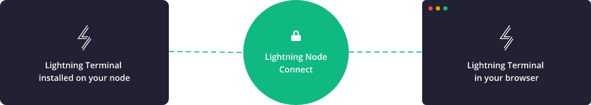

> *作者：Roy Sheinfeld*
> 
> *来源：<https://medium.com/breez-technology/lightning-for-life-how-lightning-can-and-will-integrate-with-the-web-af41860f9285>*

日常生活中，你会用 google 搜索东西、在 YouTube 或者 Instagram 上 <strike>逃避工作</strike> 搞研究、在 Uber 上打车、检查自己的投资组合、读新闻，这都是在用互联网（Web）。而且，你读这篇文章的时候也是在用互联网。Web 是一个工具，但这么说的意思就跟说你的肺和你的拇指是工具一样：它已经成了我们的一部分，我们会不假思索地使用它。

货币也类似，是我们日用而不察的东西。只要你的冰箱还开着、钱还在某处产生利息、债务的计息没有停止，你就卷入了金融活动。哪怕你已入睡，你的财产也还醒着，在全球的价值网络中占据着一个位置。

比特币用户往往对这类事情有敏锐的觉察。如果你在使用闪电网络，你可以把它视为你跟全球价值网络的一个通道。它不仅仅可以[在 Helsinki 上买一杯啤酒](https://www.facebook.com/taukobaariespoo/?ref=page_internal)，它还可以将你与比特币之海连接起来。

但奇怪的是，这两个重要的网络 —— Web 和闪电网络 —— 依然是各自运行的，很少有什么交集。两个网络对你的生活都不可或缺，但两者的裂缝竟如此明显，有时候令人尴尬。

根据我在 [bolt.fun 黑客松](https://bolt.fun/hackathons/shock-the-web/)（感谢 Johns！）上了解到的，许多 web 开发者都喜欢开发带有闪电网络功能的应用。整合两者的愿望是明显的，但许多人似乎没理解到整合的方式。实际上，有许多办法能把闪电网络带到 Web 中，而且每一种都在随着自己的长处和应用场景而进步。也许只是这个世界不知道或者没理解它们？

那么事不宜迟，我们来看看如何集成 web 和闪电网络、理出经纬、编织它们，形成一个更强大、整融洽、无缝的网络。

- 当我们追求自由时，我们会编织出何等美丽的网络呀（图片来源：<a href="https://www.flickr.com/photos/adamcohn/3076525070">Adam Cohn</a>） -

## LNURL：简洁之美

闪电网络的用户体验比起我[三年前第一次探讨这个话题](https://medium.com/breez-technology/lightning-at-the-end-of-the-tunnel-overcoming-bitcoins-ux-challenges-5738171c759e)时已经有了长足的进步，但鸿沟依旧存在。闪电网络发票（invoice）就是一个例子。技术上来说，只有收款方能初始化一次支付，这在许多场景中都是不合理的。许多用户可能会出于许多原因不想生成发票；而在打赏这样的场景中，发票可能显得粗鲁且尴尬。

LNURL 是一套非常简单的规范，可以弥合仍存有的一些用户体验的鸿沟，也包括发票。LNURL 的美丽之处在于其间接性。顾名思义，LNURL 是基于链接的，要么是可以点击的 URL（网址），要么是可以扫描的二维码（QR code）。URL 链接是我们互联网的技术背景的一部分。光看这篇文章，看到这里，就已经出现了四个链接，只不过你可能没注意到。二维码也是同样的，只不过视觉表现不同：

- 二维码很简洁，也深入人心。我看不到它们有被抛弃的趋势 -

现在有[多种 LNURL](https://github.com/fiatjaf/lnurl-rfc)规范，但下面这些跟闪电网络的 web 整合有密切的关联：

- [**LNURL-Withdraw**](https://github.com/fiatjaf/lnurl-rfc/blob/luds/03.md)：如果你想要给跟你的网站交互的用户支付，又想让他们省去生成发票的麻烦 ，那就看看 LNURL-Withdraw（直译为 “LNRUL-取款”）。它让用户可以通过扫描一个二维码或者点击一个链接来调用他们的钱包、生成合适的发票并发送给你的节点。
- [**LNURL-Pay**](https://github.com/fiatjaf/lnurl-rfc/blob/luds/06.md)：它的适用场景恰好相反：假设你在运营一个关于比特币的博客，你想要获得打赏，但又不想为没一次打赏生成和呈现一个发票，也不想为了每一次打赏而跟每一位读者交互。LNRUL-Pay 让你可以生成一个二维码，接收一定限额内的打赏（比如 2500 到 10000 聪）。用户可以直接扫描这个码，它会让用户输入具体的数额，然后展开支付。用户不会知道什么原像啦发票啦，就是扫一个码然后响应弹出的钱包操作而已。
- [**LNURL-Auth**](https://github.com/fiatjaf/lnurl-rfc/blob/luds/04.md)：是另一个很酷的 LNRUL 工具。它会基于用户钱包里的助记词生成一组公私钥，让用户以匿名的方式登录网站。它就像助记词一样隐私，而且比  *password123* 这样的口令和[刻意安排的口令](https://xkcd.com/936/)更容易抵抗暴力破解。而且它是呀了已经存储在用户的钱包内的数据，只需少许输入就能使用。

## 闪电网络地址

电子邮件可能大家都知道，因此对它的优点习以为常。电子邮件的地址是严格唯一的（不像[指纹](https://mathblog.com/are-fingerprints-unique/)），而电子邮件让信息转递给正确的人变得极其简单。[闪电网络地址](https://lightningaddress.com/)也跟电子邮件一样拥有相同的形式（xxx@yyy.zzz ），但它们让用户可以直接转移资金，不必处理二维码。

当前，LNURL-Pay 是最流行的实现闪电网络地址的方法，但是经典网络地址协议是开放的。举个例子，闪电网络地址拓展到使用静态发票或者 BOLT 12，只要这些技术得到接受了就可以。

哪怕是在当前的基于 LNURL 的格式中，闪电网络地址也非常流行而且易于集成。实际上，许多 app 都原生包含闪电网络地址，但是，对那些运行自己的节点、不介意作一些配置和[指令](https://github.com/andrerfneves/lightning-address/blob/master/DIY.md)、想用自己的域名来实现完全的自主托管服务的人来说，也有一些非托管的桥服务器可用。

为了让闪电网络地址成功，我们还需要辨明如何让非托管的钱包[能在离线时接收资金](https://lists.linuxfoundation.org/pipermail/lightning-dev/2021-October/003307.html)。

## WebLN

WebLN 从一个简单的前提开始：大部分时候，我们跟 web 交互式，我们都是通过 *web 浏览器* 来操作的。Web 浏览器实际上就是非常小型的操作系统，可以在自己专属的环境中运行各种各样的软件。

而给定闪电网络也就是一个软件，我们想把它集成到 web，将闪电网络添加到 web 浏览器中将具有重大意义。

这就是 [WebLN](https://webln.dev/#/) 背后的理念，它就是一个简单的 JavaScript 工具，用来搭建可以启用闪电网络的浏览器插件，而插件用的不过是 makePayment 和 sendInvoice 这样的方法（再提示一下，这就是所有类型的货币的两种核心功能：发账和收账）。换句话说，WebLN 让 web app 可以跟闪电网络钱包交互。

WebLN 还提供了一些好处。首先，JavaScript 语言非常流行，而且几乎有三十年的历史了。我们非常确定它是可用的。其次，WebLN 很简单。有多简单？来自 [Alby](https://getalby.com/) 的 [Michael Bumann](https://twitter.com/Bumi) 可以在 5 分钟又 38 秒内安装好并解释清楚它要怎么用。

见视频：https://youtu.be/3gGskYltqi4

第三，WebLN 推出了比二维码好得多的用户体验，首要的一点是你 *不需要用到第二个设备*。这感觉很自然，不会让你感觉是一种变通。你还可以访问浏览器事件，包括键盘的输入、鼠标的点击、[滚动的位置](https://webln.twentyuno.net/scroll)，等等，这些都可以触发支付。免去二维码的用户体验，在移动端上会非常方便，而 WebLN 也能在移动端的环境中工作。Breez 钱包的市场功能就是明证。

当然，WebLN 也不是普适的 web ↔ 闪电网络接口。它需要一个启用 WebLN 的环境。在一个桌面端浏览器中，一个简单的插件（比如 Alby）可以创建出这样的环境。在移动端，开发者既可以开发自己的 WebLN 解决方案，也可以在一个已经提供了内置的 WebLN 环境的应用（比如 [Breez](https://breez.technology/technology.html) 和 [BlueWallet](https://bluewallet.io/)）中找到归宿。也许，正是 WebLN 不原生于 web 浏览器的特定，阻止或者说延缓了其被广泛接受。我可以预见，未来 WebLN 的主程序会使用 [WebAssembly](https://webassembly.org/) 在网站中原生地实现，为终端用户打造更无缝的体验。

对许多基于浏览器的交易（比如打赏和一次性购买）来说，WebLN 已经足以整合我们[最喜爱的两大网络](https://medium.com/breez-technology/comparing-two-revolutionary-networks-lightning-and-the-internet-d6043768e217?source=collection_home---2------24-----------------------)。它的表现非常出色，许多顶级的闪电网络服务都成功应用它好几年了，包括 [Bitrefill](https://www.bitrefill.com/)、[LNMarkets](https://lnmarkets.com/) 和 [Kollider](https://kollider.xyz/) 。

## API

谈到要无缝地整合 web 服务和闪电网络服务，很难不提到专门设计来实现这一点的 API。API 集成给了开发者对用户体验和接口的最全面的控制。

虽然听起来不错，但 API 也有自己的牺牲。首先是，选择一个 API 是一个非常严肃的事情。现在还没有统一的集成标准，所以每个闪电网络服务商都按自己的需要定义自己的 API，而 web 服务业不得不未然这个 API 来开发用户体验。切换到另一个 API 的代价可能非常大，可能导致整体架构和用户体验的重大变化。

在选择要为哪种 web/移动端应用使用哪种闪电网络服务和 API 时，你主要需要考虑的是，是否要选择一种自主托管的解决方案，比如 [BTCPay Server](https://docs.btcpayserver.org/CustomIntegration/)、[LNPay](https://lnpay.co/wallet-api) 或是 [LNbits](https://github.com/lnbits/lnbits-legend#lnbits)，还是选择托管型方案，比如 [Zebedee](https://zebedee.io/) 或者 [Strike](https://developer.strike.me/en/)。当然，它们都各有所长。

- 自主托管的解决方案给了你对资金的完整控制权，但它需要运维，比如你要管理通道、余额、连接性、合规、服务器运行，等等。
- 托管方案免去了大部分运维的需要，但你将不得不信任保管你的资金的托管商（而且，如果你真的乐于这么做，那从一开始就不必要考虑闪电网络了）。而且，托管服务只在他们自己合规的部分司法辖区可用，这些地理上的限制自然会影响使用他们的下游厂商（包括你）。

但无论它们在中本聪主义哲学上的品德如何，这些办法都是能用的。[Fountain](https://explore.fountain.fm/_blog) 让我们可以一边听自己喜欢的博客一边给播主打钱，他们是用 LNPay 来搭建自己的节点的。同样地，[推特的打赏功能](https://blog.twitter.com/en_us/topics/product/2021/bringing-tips-to-everyone)的闪电网络是运行在 Stirke 的 API 上的，所以我猜，大型的著名公司（还是说这是 Elon Mask 的意思？）会喜欢用自己的托管服务。

按自己的需要来选择就好。

## LNC

自主托管方案所设计的节点管理听起来似乎很麻烦。但想象一下，如果你可以通过一个浏览器节点来方便地管理通道和余额，就像你可以在网上银行中管理你的支票和账户一样，那不就简单了。再想象一下，如果你能为自己的用户提供这样的功能呢？整个世界都会变成闪电网络赋能的金融牡蛎。而 [Lightning Node Connect](https://lightning.engineering/posts/2021-11-30-lightning-node-connect-deep-dive/) 就是那颗珍珠。

就像我上面说的，浏览器基本上是一个沙盒操作系统，而 LNC 利用 [WebAssembly](https://webassembly.org/)，使这种特性为闪电网络所用。LNC 基本上允许用户通过浏览器来远程控制节点，并且可以全方位地管理节点。让用户可以通过浏览器里访问和控制自己的节点，web 开发者可获得超乎想象的灵活性，让他们可以自由打造自己的网站的用户体验；并且，这也为许多利润丰厚的应用打开了大门。

LNC 让用户可以访问节点的 grpc 接口，所以运营者可以打开、关闭和再平衡通道，还可以使用其它高级功能。[Lightning Web Terminal](https://terminal.lightning.engineering/#/031015a7839468a3c266d662d5bb21ea4cea24226936e2864a7ca4f2c3939836e0) 就是它的实战表现的绝佳例子。这个控制台基本上就是一个用户可以随时随地访问自己远程节点的控制台。

- 你们都知道那个段子吧？“接下来就是见证奇迹的时刻。”LNC 就是这个奇迹（图片来源：<a href="https://lightning.engineering/posts/2021-11-30-lightning-node-connect-deep-dive/">Lightning Labs</a>） -

 那么，还有什么问题呢？还有两样。第一，LNC 是 Lightning Labs 的智力劳动成果，而且现在只能搭配 LND 节点来工作。第二，你能在外对你的节点做的远程控制越多，你要交给这个外部接口的许可就越多；而你给出的许可越多，你被攻击的界面也就越大。Lightning Labs 自己列出了许多[潜在威胁](https://docs.lightning.engineering/lightning-network-tools/lightning-terminal/privacy-and-security)，包括可以访问后台的人、钓鱼攻击、浏览器漏洞以及第三方插件。虽然 Lightning Labs 里面的技术人员都是正经的工程师，*任何* 获得了这么多许可的应用都可能成为攻击的对象。

## LSAT

[LSAT](https://lightning.engineering/posts/2020-03-30-lsat/) 是我要介绍的最后一种集成闪电网络和 web 的手段，而且这可不是什么[法学院入学资格考试](https://en.wikipedia.org/wiki/Law_School_Admission_Test)哦（缩写也是 “LSAT”）。LSAT 背后的理念是，使用小心定义的 [macaroons](https://research.google/pubs/pub41892/) 文件（闪电网络节点的信息文件）来证明用户的身份，并定义他们在网站上的支付能力。

显然，[LSAT 协议](https://lsat.tech/introduction)利用了 HTTP 的 402 代码，这是一种客户端报错码，意思是 “[请求支付](https://en.wikipedia.org/wiki/List_of_HTTP_status_codes#4xx_client_errors)” 或者 “[保留以备日后使用](https://lsat.tech/protocol-specification)”，这就看你问的是谁了（Lightning Labs LSAT 规范很棒，但矛盾的是，它也说 “这份文件假设未来已来”）。这个 402 代码被用来调用一个 “票据” —— 一个同时确定了用户身份以及定义用户可以如何与服务交互的 macaroon 文件。

LSAT 带来的第一大好处是，身份验证和支付许可都是在一步中完成的。服务将知道用户是谁、支付聪哪儿来、用户出现的时候已经准备好了。不需要用户名、不需要口令，也不需要在每次访问时设置数额。[有时候熟悉就是好事，对吧](https://youtu.be/7KtAgAMzaeg)。

- 所有闪电网络集成技术中最美味的（图片来源：<a href="https://pxhere.com/en/photo/858131">px_here</a>） -

其次，这些 API 可以指定带计量的支付，就像在 [Breez 播客播放器](https://medium.com/breez-technology/podcasts-on-breez-streaming-sats-for-streaming-ideas-d9361ae8a627?source=collection_home---2------12-----------------------)中你可以川流式支付那样（不过现在我们已经换用 [keysend](https://lightning.readthedocs.io/lightning-keysend.7.html) 了）。这是另一种可以[免去订阅](https://medium.com/breez-technology/its-time-to-short-subscriptions-and-go-long-on-lightning-a89c83820ef5?source=collection_home---2------10-----------------------)的办法。用户可以根据自己的使用量来付费 —— 无论是播客、流媒体视频、游戏、还是基于文本的媒介 —— 可以使用任意的单位，一直精确到秒。

LAST 有很大的潜能，甚至没准可以[在社交媒体中驱逐机器人](https://bitcoinke.io/2022/02/how-lsat-can-transform-payments-and-authentication-on-the-internet/)，因为它可以对微型交互收取微支付，这对普通用户来说不是什么问题，但对机器人来说，成本将高不可攀。

听起来很棒！革命性的技术，能整合闪电网络和 Web、干掉机器人！那么问题在哪儿？我也不知道，但我也不知道为什么 LAST 已经存在这么多年了，还是没听说哪个大型服务实现了它们。这是一个网络效应的问题（所有人都在等待其他人先下水），还是存在一个更深、更实质性的阻碍因素呢？也许屏幕前的人可以跟我讲讲你的看法。

## 未来是现在的延伸

有人说 web3 是未来，而且密码货币 …… 以及一个专门的网络 …… 将与此有关，也许还要加上某处运行的一些 DeFi 把戏。我不知道，而且我也不觉得有人知道。我知道的仅仅是，未来会属于比特币，闪电网络是能让比特币流动起来的技术，而且我们已经有了一个每个人都热爱并希望维护它的万维网（World Wide Web）。

闪电网络注定要嵌入到 web 中，而 web 注定要使用晒点网络作为一种现金的支付技术，这不是很显然吗？还是只有我这么认为？

集成闪电网络和 web，一度是遥不可及的前景，但现在不是这样了。我们已经有了许多适合不同的应用场景的技术、一个令人敬佩的开发者社区、有能力不断创新和完善技术；我们还有一个世界，其中人人都已经爱上了 web，并且日益喜爱比特币。

也许最好的是，我们不需要任何权威标准，来命令我们如何集成闪电网络和 web。每个人都可以选择最适合自己的技术、跟提升这项技术的开发者社区一起工作，而新的支持闪电网络的 web 将自下而上自然地生长起来，如我们期望的那样 。

（完）

