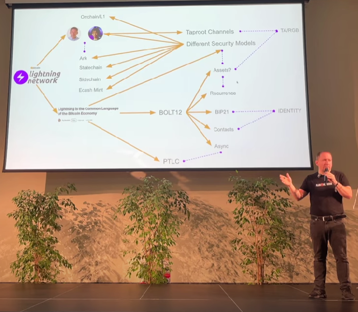

> *作者：Roy Sheinfeld*
>
> *来源：<https://blog.breez.technology/lightning-is-the-common-language-of-the-bitcoin-economy-eb8515341c11>*
>
> 在托斯卡纳闪电网络大会 2025 中，开幕演讲将本文列为重要的洞见。演讲视频可见：https://www.youtube.com/watch?v=GDYrGPb__cA
>
> 

创办 Breez 给我带来的最大收获之一是，我得以遇见许多不一样的人、跟他们一起做事。Breez 的合作伙伴分布在[牙买加](https://medium.com/breez-technology/building-on-lightning-flash-is-reinventing-caribbean-money-with-the-breez-sdk-d26ef8b81fb8)、[美国](https://medium.com/breez-technology/the-breez-sdk-is-helping-crowdhealth-help-bitcoiners-help-each-other-9dd0e19e2c58)、[瑞士](https://medium.com/breez-technology/its-a-relai-not-a-sprint-swiss-bitcoin-only-broker-opts-for-the-breez-sdk-9d05b7906715)、[德国](https://medium.com/breez-technology/building-on-lightning-how-satimoto-is-beating-fiat-with-the-breez-sdk-88aa8252a994)、[加拿大](https://blockstream.com/)和[爱沙尼亚](https://medium.com/breez-technology/bringin-bitcoin-to-retail-banking-with-the-breez-sdk-e4d5822dca5c)，甚至还有不知道在哪里的。我们在[芬兰](https://medium.com/breez-technology/lightning-in-the-wild-a-budding-ecosystem-in-finland-8b0f971ebe4f)、[威尔士](https://medium.com/breez-technology/lightning-in-the-wild-3-a-creative-family-innovates-with-breez-732368a01d7d)、[纳米比亚](https://medium.com/breez-technology/lightning-in-the-wild-fromthejump-podcast-fd90164b2146)、[印度](https://medium.com/breez-technology/the-breez-release-candidate-getting-lightning-ready-for-the-global-takeover-b5d1f9756229)都有用户，几乎世界各地都有。Breez 的员工分布在三个大陆，国别和民族背景非常多样。

有时候，仅仅是对沟通的平台（Telegram？Slack？Zoom？Discord？）达成一致，就已经要协调一番了。但是，唯一不需要花时间来协调的，就是我们用于沟通的 *语言*。总是所有人都自动使用英语。对我们中的一些人来说，英语只是第二（甚至第三、第四）语言，有时候会词不达意，但影响不大。所有的初次接触都使用英文，所有的沟通频道也都使用英文，所有的公开通信（比如这篇博客）也使用英文。连第二名竞争者都没有。

而且基本上没有办法改变这个惯例。没有人可以直接命令我们全都改说普通话、世界语或者因纽特语。无论是由于惯例、实际效用、历史影响还是纯粹比拼数量，反正英语胜出了。但它是有效的，那为什么要专门提一句呢？

这个例子说明了一些事情。首先，在由个体节点构成的网络 —— 人群、国家、社区 —— 中，节点间的接口都以语言的形式存在。其次，需要有一种通用的语言。实际上，语言的局限性就是网络的局限性。换句话说，语言的分布就 *定义了具体的网络*。最后，通用语言是非常顽固的。一旦每个人都接受了一种通用语言，基本上就锁定了。

现在，一个事实正不可逆转地塑造着未来：闪电支付正成为比特币经济体的通用语言。

- 闪电支付就是比特币世界的巴别塔，但没人希望它倒塌。（图片来源：<a href="https://commons.wikimedia.org/wiki/File:Tower_of_Babel_cropped_square.jpg">Wikimedia</a>） -

## 子网络之间的通用语言

[我们已经讨论过](https://medium.com/breez-technology/liquidity-on-lightning-moving-from-ux-to-economix-6e597d9e1abd)许多打造最后一公里的技术。它们就像本地的次级公路，将用户跟更高吞吐量的闪电网络连接起来（最终跟比特币主网连接起来）。基本上，它们的工作原理都是将用户和他们的交易绑定到一个子网络。

举个例子，[Ark](https://arkdev.info/) 和 [Liquid](https://docs.liquid.net/docs/welcome-to-liquid-developer-documentation-portal) 会将入账的比特币转入它们自己的机制（相应是 [VTXOs](https://arkdev.info/docs/learn/nomenclature) 和 [L-BTC](https://docs.liquid.net/docs/technical-overview)），然后用户就可以根据相应的协议彼此支付，不需要专门发一笔链上交易。此外，[Fedimint](https://fedimint.org/docs/GettingStarted/What-is-a-Fedimint) 的做法是成员将比特币汇集在一起，然后彼此交换借条（IOU），交易和财务的状况由一个受到信任的监护人联盟来监管。至于 [Cashu](https://cashu.space/)，人们用比特币支付换来 e-cash token，需要信任发行这些 token 的主体。

每一种子网络都有自己的语言。那么这些子网络中的节点如何跟另一个子网络中的节点沟通，就成了关键。有趣的地方是，这些子网络 *通过闪电支付来彼此沟通*，哪怕是都使用 Cashu 协议的两个铸币厂，或者一个 Fedimint 联盟跟一个 Ark 实例。闪电支付是所有这些正在兴起的、基于比特币的子网络的通用语言。

回到英语这个类比。你在家里或者在超市讲什么语言，都跟我没关系。你可以爱说什么方言就说什么，只要对方能懂就行。但如果你希望在 Telegram 或 Slack 上跟我或者别人聊天，那么英语就是唯一的选择。没有人可以改变这一点，哪怕他们想，而且看起来似乎没人想这样做。就像闪电支付一样。

闪电支付是正在兴起的自网络的通用语言。它就是比特币的语言！

## 为什么闪电支付是最适合比特币的语言

一种 *通用* 的语言并不必然是 *最好* 的语言。它只是一定要能够表达清楚，并且被广泛接受。就像比特币主链，它有特定的优势（例如，不可变更、开放性、无边界，等等），很适合特定用途，但闪电支付是最适合子网络协调的通用语言，至少有三个理由。

- 分层的网络通过一种通用的语言来交互。（图片来源：Adobe Firefly） -

### 闪电支付就是比特币，而比特币是免信任的不记名资产

闪电支付是最佳通用语言的第一个（可能也是最重要的）理由是，[它使用比特币](https://medium.com/breez-technology/lightning-btc-iou-62e3a712c913)。简单来说，这些子网可能并不信任彼此，而且确实也没有理由信任彼此。但因为比特币和闪电支付（比特币的插件）[规避了信任问题](https://medium.com/breez-technology/the-only-thing-better-than-minimal-trust-is-none-at-all-34456f650332)，这些子网络就可以免信任地交互。比特币是唯一一种可靠的不记名资产，闪电支付是比特币的语言，所以闪电支付就成了子网络彼此交互的最佳通用语言。

而且，闪电支付与比特币一样，规避了杠杆。部分准备金银行的整个商业模式都基于他们资产负债表上的黑洞。但是，闪电支付中的每个聪，在每个时刻，都是被统计了的。如果有一张资产负债表可以显式闪电网络中的自由资金的分布，那么它永远都是 *平衡的*。没有错漏，也没有超支。闪电支付抵制了因为傲慢、无能和邪恶而带来的不平衡，这是免信任环境的一个必然属性。

### 闪电支付天生是事务性的，而且可以互操作

其次，闪电支付是一种设计用于协调资金流动的事务性协议。常规的闪电支付没有交易池，也不需要等待下一个区块被挖出。就算要花点时间，也[不过就几秒钟](https://x.com/Breez_Tech/status/1632387594486009859)。而且交易 —— 资金的流动 —— 正是让闪电网络有价值的东西。[天经地义](https://medium.com/breez-technology/lightning-is-a-liquidity-network-550896ca27ea)（[中文译本](https://www.btcstudy.org/2022/04/02/lightning-is-a-liquidity-network/)）。网络中静止的聪不会带来任何回报。为了让闪电网络中的流动性增长，就必须先让资金流动起来。沉默中没有通用语言。它必须鼓励交易，这正是闪电网络的做法。

此外，在 [BOLT 规范](https://github.com/lightning/bolts)中得到详细说明的闪电支付技术天生是可以互操作的。其设计目的正是让多种闪电节点实现（携带不同设计目标、取舍和编程语言）得以出现。所有这些节点，都通过一个公共网络交互，因为他们都支持同一套 BOLT。在设计上保证了可以互操作，让其它技术可以更容易添加闪电支付作为接口。

### 闪电网络拥有临界质量

最后，成为通用语言需要先有一个广大的言说者社区。想象一下在养老院里说 “[skibidi rizz](https://youtu.be/q85IlAx95wA)”（译者注：这是一个通过混合来自不同语言的词语，产生无意义口头语的互联网笑话），甚至极端一点，在柬埔寨的养老院里。也许英语最大的优势就是使用它的人口数量：[英语是地球上最多人使用的语言](https://en.wikipedia.org/wiki/List_of_languages_by_total_number_of_speakers)。虽然在许多国家，只有 1/4 的居民会说英语，几乎在每一个酒吧和饭馆你都能在邻桌找到能说英语的人。把上面这句话中的 “英语” 换成 “加泰罗尼亚语”，还能成立吗？

闪电网络已经实现了临界质量。Cashu 子网络和 Fedimint 子网络要如何沟通，已经很显然了：闪电支付。这就是它们的设计方式，所以切换网络间的通用语言将要求它们推倒重来。就像英语 —— 无论一个子网络内部使用什么语言，闪电支付都是它们用来沟通的语言，这已经锁定了。

## 闪电网络的生命力

真正的闪电 —— 在雨云间涌动的那种 —— 是一种转瞬即逝的现象。一瞬间点亮天空，然后完全消失，就是闪电的全部。但闪电网络 —— 节点、子网成员乃至主网间的接口 —— 是不会消逝的。通用语言的地位会[保持几个世纪](https://en.wikipedia.org/wiki/Lingua_franca#Historical_lingua_francas)。

比特币是世界上最好的货币。闪电支付是比特币世界的通用语言，它会一直存在下去。对于已经建立闪电节点的用户，这是非常好的新闻。闪电支付已经就位，意味着我们的先发优势会非常有价值。

但对于那些正在加入闪电网络，或正在考虑这件事的人来说，这也是好消息。它消除了关于哪种技术会得到支持和投资的不确定性。闪电网络哪儿也不会去，所以不管什么时候开始都不晚。[昨日胜过今日](https://quoteinvestigator.com/2021/12/29/plant-tree/)，当下胜过明天，明天好过从未。

[加入闪电网络，最好的时间就是现在](https://breez.technology/sdk/)。永远不晚。

（完）