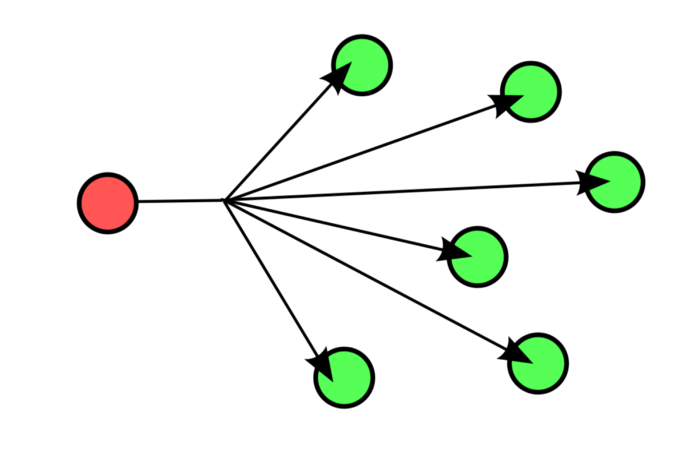

> *作者：Melik Manukyan*
> 
> *来源：<https://medium.com/@melik_87377/lightning-network-enables-unicast-transactions-in-bitcoin-lightning-is-bitcoins-tcp-ip-stack-8ec1d42c14f5>*

最近，有一个现象引起了我的注意：比特币和 BTC 社区，甚至更广泛的加密货币生态系统，都对闪电网络（Lightning Network）抱有诸多困惑。因此，我想要纯粹从网络的角度跟大家分享我对比特币、区块链以及闪电网络的看法。

为了更好地理解区块链与闪电网络是如何运作的，我们应该从充满戾气的 Twitter 与 Reddit “战场” 中抽离出来（*这种争论毫无益处）*，回顾互联网背后的网络协议与系统。在理解了如何利用计算机网络与互联网打破比特币自身的可扩展性限制后，我相信你会受益匪浅。在这篇文章中，我将聚焦以太网（Ethernet）、 IP 和 TCP 这三个网络协议。了解这些协议是如何运作的，我们就可以更好地解答比特币及类似区块链的可扩展性问题。 简单介绍完，我们马上进入正题。

如今，计算机网络中最常见的两种数据传输（data transmission）形式是广播（broadcast）和单播（unicast）。其他形式如任播（anycast）和组播（multicast）不在本文的讨论范围内。我们先定义并理解这些数据传输形式。

- 广播指信息从网络中的一个点传输到其它所有点（一对所有）。

- 广播数据传输 -

- 单播指信息从网络中的一个点传输到另一个点（一对一）。



- 单播数据传输 -

在了解了这两种数据传输形式后，我们立马就能发现区块链交易就类似于广播的通信形式。每当比特币网络上进行了一笔交易，该交易就会被发送或广播给网络中*所有* 相互连接的节点。也就是说，要想一笔交易在比特币网络上存在/发生，所有节点必须接收并记录该交易。区块链交易的运作方式与传统以太网集线器（[ethernet hubs](https://en.wikipedia.org/wiki/Ethernet_hub)）的数据传输方式非常相似。

很久以前，我们总是依赖于以太网集线器在计算机之间进行数据传输。我们发现以太网集线器自身的局限性导致它无法扩展。旧式以太网集线器 *仅* 支持广播传输，来自一个接口（interface）或端口（port）的数据需要被复制并广播到网络的其它接口或端口。形象一点就是，假设你想在一个包含 100 名参与者的网络中发送给我一张 1 MB 大小的图片，这张图片需要被复制 99 次并广播给网络中的其他 *所有* 用户。

在比特币网络中，我们也能观察到类似的现象，来自一个节点的数据（一笔交易或一个区块）被复制并广播给网络中的其它所有节点。区块链就如同传统的旧式以太网集线器，只是用来实现数据传输与通信的低效媒介。以我作为一名网络工程师的视角来看，通过基于广播的链上交易扩展像比特币这样的全球支付网络简直是痴人说梦。即使到了今天，我们这些网络工程师在跨越以太网和局域网 （LAN network）时都非常小心谨慎，更不用说扩展到全球范围了。

这么来看，如果我们重新将互联网设计成像区块链和以太网集线器那样仅依赖于广播数据传输，就等于是要把世界上的每一个人、主机和设备都集中在同一个局域网段（LAN segemnt）或广播域（[broadcast domain](https://en.wikipedia.org/wiki/Broadcast_domain)）中。这么一来，互联网就会变成一个巨大、扁平的局域网, *所有* 通信都将被复制并广播至每一台设备。当你打开本文阅读时，互联网上的其它设备都会被迫下载这篇文章。换句话说，整个互联网来了个 “急刹车”。

在计算机网络中，最常用的通信形式依赖于单播数据传输（又称点对点传输）。互联网上大部分通信都是从一台计算机发送到另一台计算机，我们不再需要依赖盲目的广播数据传输，盼望着我们的目标接收方能够接收或看到数据。我们能够准确地将信息发送，路由并传递给我们一个或多个接收方。如上文所述，在广播网络中发送 1 MB 大小的图片必须被复制并广播给网络中每一位用户。相反，在支持单播数据传输的网络中，我们能够精准地将图片文件从起点发送到终点。

在我看来，闪电网络是比特币的 IP 层（我知道这些数据传输形式同时存在于以太网和 IP 中）。但是，我真心觉得这样的类比有助于我们更好地理解比特币、闪电网络、通道 （channel）等复杂而又抽象的概念。

我们暂且忽略争论双方对于闪电网络的一切解释和过于简单的定义，客观地看待闪电闪络，想清楚我们对它有哪些了解。关于闪电网络，我们到底知道些什么？闪电网络可以让我们锁定自己的比特币并与其他人建立通道。还有呢？我们可以在构成通道的两点之间发送和接收交易。还有呢？我们还可以进一步将交易路由到正确的目的地。

掌握了这些关键知识点，我们就能发现闪电网络可以让原本只支持广播传输的系统 [比特币] 实现单播传输。我认为，比特币网络中的闪电网络节点等同于 IP 主机，可以让我们将交易一对一（点对点）路由至正确的接收方。在传统 IP 协议中，我们发送接收的是数据包（data packet）；在闪电网络中，我们发送接收的是比特币。正是 IP 协议使得我们能够从之前原始形态的小型网络扩展成如今覆盖全球的大型互联网。同样地，闪电网络也能扩展我们的全球比特币网络。

如果我们将闪电网络节点看作 IP 主机，闪电网络通道就可以看作已经建立的[*TCP*](https://en.wikipedia.org/wiki/Transmission_Control_Protocol) 连接。举个例子，在如今的互联网时代，我们在尝试连接一个网站时，会通过一个 TCP 连接从 web 服务器上下载该网站的 HTML 源代码。或者，当我们下载一个 torrent 文件时，我们将会通过 TCP 连接连接至互联网中其它计算机，以便传输 torrent 数据。

在闪电网络中，我们可以与对手方建立通道，像 TCP 那样直接[点对点]发送和接收数据（交易）。如果我们将区块链比作以太网，闪电网络节点（Lightning Node）就是我们的 IP，闪电网络通道（Lightning Channel）就是我们的 TCP 连接。 

总的来说，我从闪电网络身上看到了计算机网络背后那些存在已久的网络技术与协议的影子。我认为我们是在重新设计互联网。从技术的角度来看，我不认为在链上扩展比特币会有用，我担心未来会发生类似广播风暴（[broadcast storm](https://en.wikipedia.org/wiki/Broadcast_radiation)）的事件。我衷心希望能够通过闪电网络实现新的单播传输方式。 更重要的是，我对于比特币跨入互联网时代感到兴奋与期待。

当所有人的目光都锁定在区块链技术上的时候，我更期待闪电网络。闪电网络是比特币的 TCP/IP 协议栈。闪电网络将成为我们的交易和构建场所，为我们的应用、其他协议和层赋能。那么，作为主体的比特币区块链将变成什么？它仍将是（也理应是）一个去中心化、防篡改且不变的基础层，为我们提供比特币的密码学证明。

在我们社区和行业中，某些个人和组织危言耸听，抹黑 “闪电网络中心（lightning hub）” ，却没有意识到他们的链上交易可扩展性方案只会将比特币变成又一个（以太网）集线器。如果比特币在底层丧失了去中心化特性，我们将会失去它。过去 9 年的努力付诸东流，最终只剩下一个庞大的中心化广播中心，只有少数人有能力操控这只庞然大物。

*我写下这篇文章是希望能够帮助大家解开有关比特币、区块链以及闪电网络的困惑，通过类比我们更熟悉的概念来更好地解释区块链和闪电网络。*

（完）