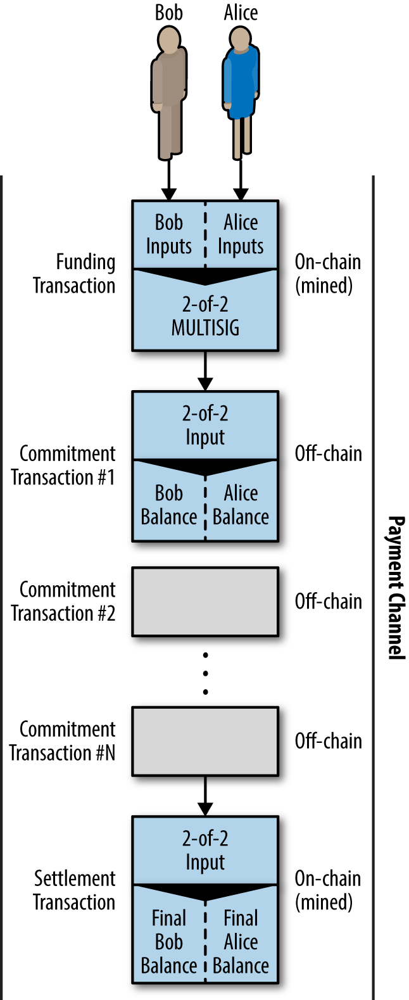
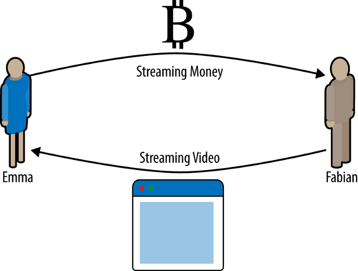
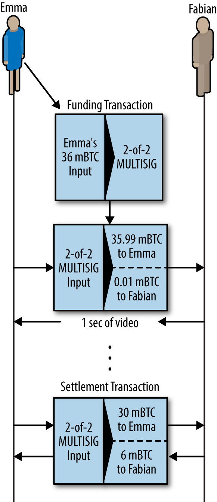
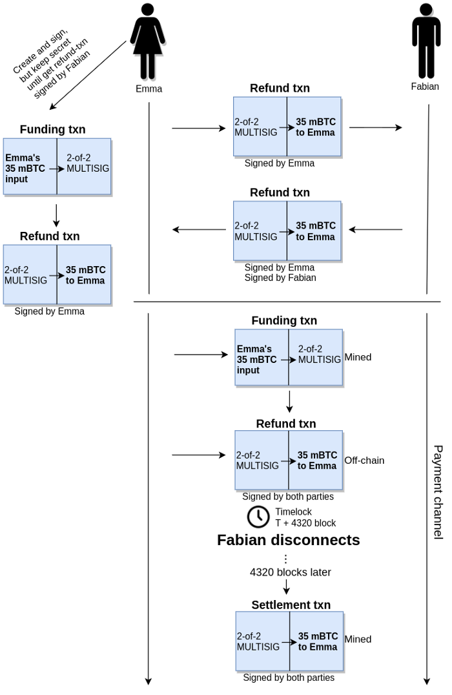
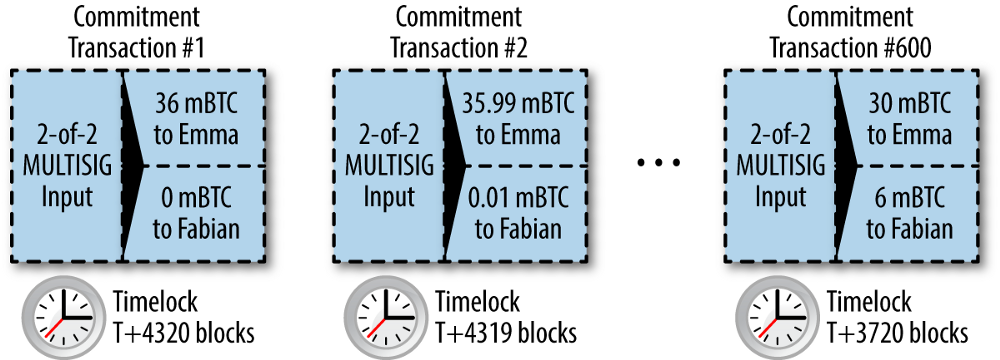
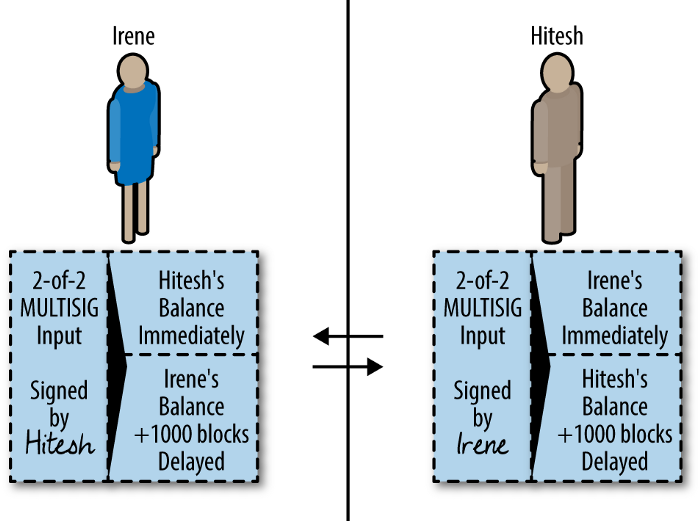

*作者：Magomed Aliev*

*来源：<https://medium.com/softblocks/lightning-network-in-depth-part-1-payment-channels-b943607950dd>*

*译者：阿剑*


闪电网络是一种去中心化的链下技术方案，可支持每秒上万笔交易并发，接近于 Visa 系统能做到的程度（举个例子）。而在当前的比特币（世界上最流行的密码学货币）区块链上，只能支持每秒处理约 7 笔事务，还要付出高昂的手续费，并等待很长时间来确认交易生效，这些因素都使得几乎不可能用比特币发送小额交易。**而闪电网络把这两个问题都解决了**。

## 引言

闪电网络是一种支付通道系统，与常见的多签名钱包没有任何区别。所谓开启通道，就是参与方创建一个多签名钱包，并向该钱包充入资金。这个钱包接收到的资金数量就成为这个通道的余额。再然后，参与方之间的后续交易就全部在**区块链以外的环境**中发生了。任一参与方都能随时关闭这个通道，这时候，最后一笔链下的交易（决定着该通道各参与方的余额）会被发送到区块链上，同时作废掉所有中间的交易，因为所有这些交易都使用同样的交易输出。结果是，我们只需一笔交易来开启通道、一笔交易来关闭通道，中间所有的中间交易都是即时收发的，无需记录在区块链上（因此无需等待）。

（译者注：比特币不是账户里面的余额，是一张张的支票；所有的支票都是由具体的某笔交易创造的；每一张支票都只用一次就会作废（也即只能用在一笔交易中）。交易可以任意分配所用支票的价值来生产任意数量的新支票。）

这样的通道所组成的网络使你可以向网络的另一个参与者发送资金，即使你们之间并无直接的通道。唯一的条件是你们之间要能形成一条 “路径”，即有通道能前后相接地把你和对方联系起来。此外，得益于特殊的智能合约（HTLC，哈希时间锁合约），你不需要信任网络中的任何人，合约会保证安全地交付你支付的资金。

要理解闪电网络是如何运行的，首先要理解的是支付通道的运行以及构成支付通道基础的 HTLC。这些话题都不小，所以我把文章分成了两部分，从解释支付通道的工作原理开始。

## 支付通道

如上所述，连接两个参与者的支付通道实质就是一个普通的多签名钱包。第一笔交易决定了一个通道的余额，我们称为 “充值事务” 或者 “锚点事务”。这笔交易需要广播到网络中并记录到区块链上，以表明通道开启。

做完了这一步之后，要更新通道双方的余额时，双方就需要手动交换签过名的 “承诺事务”。这些交易本身都是有效的，随时可以发送到比特币网络中，但双方都会暂时保存起来，不会广播出来，除非已准备关闭通道。如此一来，通道内双方的余额状态，一秒内变动几千次也没问题，更新的速度仅受限于双方创建、签名和向对方发送承诺事务的速度。

每次双方交换了一笔新的承诺事务，他们也就把通道的前一个状态作废掉；因此，只有最新的一笔承诺事务可以 “执行”。这样设计的目的是防止某一方欺诈对方，把一个过时的但对自己有利的状态发送到链上来关闭通道。下文我会讲解几种防止这种欺诈的机制。

最后，通道既可以双方一致同意关闭 —— 就是把一笔关闭事务（叫做 “结算事务”）发送到比特币网络中 —— 也可以单方决定关闭，就是把最后一笔承诺事务发送到网络中。这是为了防止某一方离线导致另一方在通道中的余额一直 “锁定” 的情形。

在通道存在的整个生命周期里，只有两笔事务被发到了比特币网络中并记录到了比特币区块链上（就是充值事务和结算事务）。在这两笔事务之间，双方可以交换无数次承诺事务，这些事务都不需要提交到区块链上。



## 一个简单的支付通道案例

在解释更加复杂的机制之前，我们先来考虑一个简单的、单向的通道的例子。为了简化这个解释，我们假设双方都是诚实的。后面我们会再考虑帮助我们阻止欺诈的机制。

假设一个通道有两个参与者，Emma 和 Fabian。Fabian 提供付费的视频流服务，而观看者通过通道来实现小额支付 —— 每观看一秒就要付出 0.00001 btc，相当于每小时 0.036 btc 。Emma 是一个想看视频的普通用户。



Emma 和 Fabian 使用一个特殊的程序来同步播放视频和运行支付通道。Emma 在自己的网络浏览器中启动这个程序，而 Fabian 在自己的服务器上使用同一个程序。这个程序具有一个普通的比特币钱包软件的所有功能，它可以创建和签名交易。支付通道的整个机制可以完全隐藏起来，用户看到的事实就是这个视频是按秒计价的。

现在我们来看看这个付费服务的具体工作流程。一开始，Emma 和 Fabian 要开启通道：建立一个 2-2 的多签名地址。从用户的视角来看，这个程序创建了一个 P2SH 地址（一个多签名钱包）并要求用户充入足以支付一个小时视频服务的资金。Emma 转了 0.036 btc 到这个地址，而这笔交易也就成了所谓的充值事务。

充值事务被打包到某个区块之后，这个通道就算开启了，视频也就开始播放。在第一秒钟，用户创建并签名了一条承诺事务，改变了通道内的余额：现在 Fabian 有了 0.00001 btc，Emma 还剩 0.03599 btc 。这笔事务使用了充值事务的输出，并创建了两个输出，含义就如我们这里所述。从服务商的角度看，程序收到了这笔事务，于是也签上名、连同第一秒的视频发回给 Emma。现在双方都有了一笔对方手动签过名的、反映通道最新状态的承诺事务；如有需要，任何一方都可以把这笔交易发送到比特币网络中。

到了第二秒，Emma 这边的程序又创建了一笔新的承诺事务，使用的同样是充值交易的输出（跟第一笔一样），这一次，承诺事务的第一个输出给了Fabian 0.00002 btc，把 0.03598 给了 Emma。这笔事务用来支付第二秒的视频下载。

我们假设，Emma 看了 10 分钟的视频，然后就退出了。在这段时间里，她签名并发送了 600 笔承诺事务（600 秒的视频）。最后的一笔有两个输出：0.03 btc 给 Emma，和 0.006 给 Fabian。Emma 关闭了通道，把最后一笔承诺事务广播到了比特币网络中作为 结算事务。如此，**这个通道只有一头一尾两笔事务记录到了区块链上**。



## 免信任的通道

当然，从这个例子来看，一切都好，但这是因为双方都是诚实的。不难想象某些时候，其中一方会欺骗对方，像上面这么简单的设计可能就不够用了。

- 虽然通道开启着，Emma 还是需要 Fabian 的签名来取出资金，因为这个通道是 2-2 的多签名地址。如果 Fabian 消失了，Emma 的资金可能会永远锁在这个通道里面。
- 虽然通道开启着，Emma 可以使用任何一笔双方都签过名的承诺事务。在观看视频 10 分钟之后，她可以拿第一笔承诺交易上链，完全不需要经过 Fabian 的再次同意。

### **时间锁**

这些问题的一种解决方案是在承诺事务中使用时间锁（事务层面的时间锁（nLocktime））。为了保证资金不会在通道中永远锁定，Emma 使用她的充值事务的输出创建了一个退款事务。她先给 Fabian 发送这笔事务，等 Fabian 签名并发回后，Emma 才把充值事务广播到比特币网络中，开启他们的通道。

这笔退款事务也成了第一笔承诺事务，而且它的时间锁为通道设置了一个存在时间的上限。假设 Emma 把时间锁设置为 30 天（4320 个比特币区块）（即 30 天之后这笔事务才能记录到区块链上）。接下来所有的承诺事务，所设置的时间锁会一个比一个短，这样更新的事务就能更早广播到网络中。

现在 Emma 不用再担心了，她知道即使 Fabian 玩失踪，她也可以在 30 天之后取回自己的资金（如果这是一条双向的支付通道，即 Fabian 也会存钱进去，那他也从自己的角度提出一笔退款事务）。



每一笔新的承诺事务的时间锁都比前一笔要短，因此，新一笔承诺事务总是能比旧的更早上链并使旧的事务作废（无法上链），这样就能防止任何一方恶意使用旧的承诺事务。如果一切顺利，Emma 和 Fabian 只需广播双方一致的普通结算事务，因此带时间锁的承诺事务只有一方下线时才会派上用场。

举个例子，如果第一笔承诺事务的时间锁是 4320 个区块，那么第二笔承诺事务可以设成 4319 个区块，以此类推。如此一来，第 600 笔承诺事务可以比第一笔承诺事务早 600个区块上链。



你可能也注意到了，这种方法虽然有助于防止某一方把更早的承诺事务上链（欺诈），但它有两个明显的缺点：

- 第一笔承诺事务的时间锁限制了这个通道的寿命。如果这个时间锁设置的时间太长（比如 1 年），通道可以存在很久，但如果某一方玩失踪，另一方就不得不等待很长时间才能广播最后一笔承诺事务、取回自己的资金。
- 第一笔承诺事务的时间锁也限制了可以在通道内发生的交易次数。在我们的例子中，这个数值是 4320，这个通道内只能发生 4320 笔事务，因为每一笔新事务都会把时间锁的时间减去 1 个区块。而且，以区块（10 分钟）为间隔，等于是强迫参与方要追踪比特币网络的区块，以免错过什么，以及在情形不对时尽早把最后一笔承诺事务上链。当然，这个间隔是可以延长的，但代价是通道内可以发送的交易数量会变得更少。

因此，时间锁让我们可以作废旧的承诺事务并保证通道双方都可以安全地关闭通道：如果他们都同意通道的最新状态，他们可以发送一笔不带时间锁的结算事务（与最后一笔承诺事务意思相同），关闭通道；如果某一方不在线，另一方也可等待最后一笔承诺的时间锁解锁，然后把该笔承诺事务广播到比特币网络中。

### **不对称的可撤销承诺**

另一种解决上述信任问题的办法是取消早前的承诺事务。实际上，“取消（cancellation）” 这个词是不准确的，因为在比特币网络中，一笔上链的事务（得到区块确认的事务）是永远不可取消的。不过，特殊的构造方式可以使得上链较早的承诺事务无利可图。只需给予各方一个 “撤销密钥（revocation key）” 即可。

假设 Hitesh 和 Irene 决定开启一个通道。双方都充值了 5 btc 到这个通道中，确定了通道的初始余额。现在，双方不是签署同一笔标准的承诺事务，而是各自创建两笔不同的、不对称的承诺事务。

Hitesh 拿到的由 Irene 签名的事务有两个输出，第一个输出不带时间锁，立即给 Irene 支付 5 btc，而第二个输出带有时间锁，支付 5 btc 给 Hitesh，但要等（这笔事务上链后的） 1000 个区块之后，这个输出才能花用。详情如下：

```javascript
Input: 2-of-2 funding output, signed by Irene
​
Output 0 <5 bitcoin>:
    <Irene’s Public Key> CHECKSIG
​
Output 1:
    <1000 blocks>
    CHECKSEQUENCEVERIFY
    DROP
    <Hitesh’s Public Key> CHECKSIG
```

与此同时，Irene 也可拿到由  Hitesh 签名的一个承诺事务，有两个输出：一个立即给 Hitesh 支付 5 btc，另一个输出则给 Irene 支付 5 btc，但要等 1000 个区块之后才能花。

```bash
Input: 2-of-2 funding output, signed by Hitesh
​
Output 0 <5 bitcoin>:
    <Hitesh’s Public Key> CHECKSIG
​
Output 1:
    <1000 blocks>
    CHECKSEQUENCEVERIFY
    DROP
     <Irene’s Public Key> CHECKSIG
```

因此，双方都拿到了一笔由对方签名的承诺事务。Hitesh 和 Irene 都可以随时把手上的承诺事务签名后广播出去，但是，一旦这么做了，另一方都会立即拿到钱，而自己只能等到 1000 个区块之后才能拿到，这可是大大的不利。不过，这还不足以让双方都诚实守信。



这就要讲到我们的最后一个功能了，可撤销的密钥，使得任一方如果试图欺诈，对方都可以惩罚 TA，使之血本无归。

如上所述，每一笔承诺事务都有一个 “延后” 的输出，我们把这个输出做得再复杂一点：这个输出既可以被等待了 1000 个区块的承诺事务发送者使用，也可以被通道的另一方使用，如果 TA 持有撤销密钥的话。当 Hitesh 创建承诺事务并交给 Irene 时，他的第二个输出既可以为自己所用（要等待 1000 的区块）也可以为 Irene 使用，如果后者掌握了撤销密钥的话。

Hitesh 会秘密地保管这个密钥，仅当他决定使用新的一笔承诺事务来更新通道内状态时才会发给 Irene。事务的详情如下：

```json
Input: 2-of-2 funding output, signed by Irene
​
Output 0 <5 bitcoin>:
    <Irene’s Public Key> CHECKSIG
​
Output 1 <5 bitcoin>:
    IF
         # Revocation penalty output
         <Revocation Public Key>
    ELSE
         <1000 blocks>
         CHECKSEQUENCEVERIFY
         DROP
        <Hitesh’s Public Key>
    ENDIF
    CHECKSIG
```

（译者注：看代码会更清晰一些：第一个输出是给立即 Irene 支付 5 btc；第二个输出则是带条件的，既可以使用撤销密钥，立即获得 5 btc，也可在 1000 个区块后，使用 Hitesh 的私钥来使用这个输出。注意这里的 “IF…ELSE…” 式条件，它跟我们在其它的计算机编程中的含义是一样的。）

附带一个例子可能会更容易理解。假设 Irene 希望给 Hitesh 发送 2 btc，这时候他们要更新通道的状态，也就是要创建一笔新的承诺事务。双方各自创建一个不对称的承诺事务，并且，在签名之前，先把上一笔承诺事务的撤销密钥交给对方，如此便 “撤销” 了上一笔承诺事务。如果 Hitesh 希望以通道最后的余额来结算，而 Irene 看着觉得更旧的状态对自己更有利，她可以尝试把自己手中的上一笔承诺事务签名后广播到网络中，但这笔承诺事务的撤销密钥已经暴露给了 Hitesh；如果他发现这笔承诺事务上链了，他有足足 1000 个区块的时间可以把通道内的所有钱都拿走（第一个输出当下就给了他，而第二个输出只需他提供撤销密钥就可以立即使用）（没错，这个 “取消” 的动作没法自动化，Hitesh 必须关注 Irene 是否发送了旧的承诺事务到网络中，然后使用撤销密钥）。

因此，这种使用不对称可撤销承诺的通道的效率要更高，因为它不限制通道的寿命，也不限制交易发送的次数。

## 结语

到这里，我们的第一篇文章就结束了，估计你也要一段时间来消化一下，你也可以在评论中提问。在下一篇文章，我们会解释 HTLC 的功能，最终解释闪电网络是如何工作的。

**链接**

- [“Mastering bitcoin” — Andreas M. Antonopoulos](https://bitcoinbook.info/)
- [Segregated witness for dummies](https://medium.com/softblocks/segregated-witness-for-dummies-d00606e8de63)
- [Lightning network whitepaper](https://lightning.network/lightning-network-paper.pdf)
- [Lightning network in depth, part 2: HTLC and payment routing](https://medium.com/softblocks/lightning-network-in-depth-part-2-htlc-and-payment-routing-db46aea445a8)

（完）
