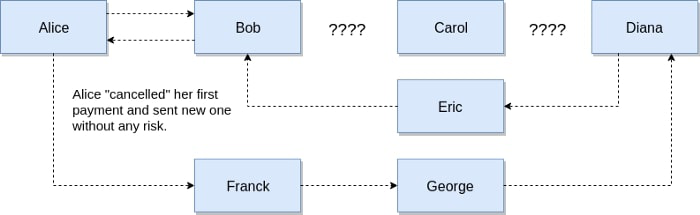

*作者：Magomed Aliev*

*来源：<https://medium.com/softblocks/lightning-network-in-depth-part-2-htlc-and-payment-routing-db46aea445a8>*

*译者：阿剑*

------

[闪电网络深入解读（上）：支付通道](./lightning-network-in-depth-part-1-payment-channels)


在[上一篇文章](https://medium.com/softblocks/lightning-network-in-depth-part-1-payment-channels-b943607950dd)里，我们详细解释了支付通道的运作，以及多种保证支付安全发生的方法。不过，这些功能，还不足以支撑一个可用的支付通道网络：即使我们很确定在每个通道内每个参与者都是诚实守信的，也没法保证通过多个通道来支付同样是安全的。这就是我们需要 “HTLC（哈希-时间锁-合约）” 这种智能合约的原因。在本文中，我们会讲解 HTLC 工作的方式，并使用一个例子来展示多跳支付是如何在闪电网络中实现的。

## 哈希时间锁合约（HTLC）

HTLC 的结构并不复杂，但非常高效。它使我们可以创建具有明确 “过期时间” 的支付。你可能也猜得到，HTLC 合约由两部分组成：哈希验证和过期验证。

我们先从哈希值（hash）开始。要创建一笔带有 HTLC 的支付事务，你先要生成一个 *秘密数值* R，然后计算出其哈希值。任何词语、任何数字都可以充当这个秘密值，因为，对哈希函数来说，它们都是一堆数据的组合，没有什么分别。

```
H = Hash(R)
```

这个哈希值 H 会放在事务输出的锁定脚本中。如此，只有知道 H 所对应的秘密值的人才能使用这个输出。而 R 就是所谓的 “原像（preimage）”。

HTLC 的第二部分是过期时间的验证。如果秘密值没有及时地公开，这笔支付就用不了了，发送者会收回所有的资金。

我们来考虑一个发给某人的 HLTC 支付事务：

```
# 检查所提供的 R 是否为 H 的原像
HASH160 <H> EQUAL
IF
    # 检查公开 R 的人是否为事务最初的接收者
    <Payee Public key> CHECKSIG
ELSE
    # 检查时间锁是否已终止
    <locktime> CHECKLOCKTIMEVERIFY
    # 检查请求返回资金的是不是事务最初的发送者
    <Payer Public Key> CHECKSIG
ENDIF
```

在正确的 R（哈希值 H 的原像）公开之后，我们进入 IF 流程，进一步验证提供 R 的是不是这笔支付事务一开始的支付对象。在花费这个输出时，接收方只需提供一个非常简单的解锁脚本：

```
<sig> <secret R>
```

如果解锁脚本所提供的 R 是错的，我们跳转入 ELSE 流程，首先验证时间锁解锁了没有。如果时间锁已然解锁，发送者就可以收回所有的资金。收回资金这个操作的解锁脚本也差不多，唯一的区别在于，为了进入 ELSE 流程，需要提供一个错误的秘密值：

```
<sig> <wrong secret>
```

当然，这只是 HTLC 的一个非常基础的实现，代表着一个普通的时间锁支付。你可以在脚本中加入任意多的其它条件，比如说，在 IF 流程中移除公钥验证，这样只要知道秘密值 R 的人都可以使用这个输出；也可以在其中加入多签名限制，要求提供多个预设私钥的签名才能解锁。

多说一句，在这个案例中，我们使用的操作码是 **CHECKLOCKTIMEVERIFY**，这个操作码使用绝对数值来定义时间锁，意思就像：“这个输出在区块 #546212 之前是无法动用的”。而在闪电网络中，还用上了另一种时间锁，更 “灵活” 的一种：**CHECKSEQUENCEVERIFY**，它用到的是相对数值，意思近于：“这个输出，在使用它的事务上链之后的 1000 个区块内，是无法使用的”（译者注：这里的数值都是例子，实践中当然可以使用别的数值）。

## 闪电网络案例

现在，我们终于讲解完所有元素了，可以尝试理解闪电网络运作的全景了。

我们假设现在闪电网络有 5 个参与者：Alice、Bob、Carol、Diana 和 Eric，他们各自有一个支付通道相连，而每个通道的每一边都有 2 btc 的余额可用。现在，我们尝试让 Alice 通过通道链条给 Eric 支付。


<p style="text-align:center">- 一系列相连的双向支付通道，组成了闪电网络，可以转介 Alice 对 Eric 的支付 -</p>

假设 Alice 现在要给 Eric 支付 1 btc。但是，如我们所见，他们并无直接的通道相连，而开设通道需要时间和金钱。幸运的是，Alice 连接着闪电网络，可以在一系列 HTLC 合约的帮助下完成间接支付。我们一步一步拆开来看。


<p style="text-align:center">- 逐步分解闪电网络中的支付路由 -</p>

1. Eric 生成了一个秘密值 R，并把其哈希值发给了 Alice（他不会把 R 展示给其他人）
2. Alice 使用这条哈希值创建了一个 HTLC，而时间锁设置成未来 10 个区块，输出的数额是 1.003 btc。这额外的 0.003 btc 是给支付通道链条中间方的手续费。那么，Alice 现在用 HTLC 锁住了 1.003 btc，而 HTCL 的具体条件以大白话表述如下：“Alice 会给 Bob 支付 1.003 btc，只要他能在 10 个区块内交出秘密值 R，否则这些钱会返回给 Alice”。他们之间的通道的余额也会因为这笔承诺事务而发生这般变化，现在 Bob 在通道内拥有 2 btc，Alice 有 0.997 btc，还有 1.003 btc 锁在 HTLC 里面
3. 到了 Bob 这里，他可以随意处置 Alice 的承诺事务（这笔 HTLC 事务是通过他们之间的通道来发送的）。他在自己跟 Carol 的通道中创建了一个 HTLC 输出，数额是 1.002，时间锁设定为 9 个区块，使用了跟 Alice 所提供的同样的哈希值。Bob 知道 Carol 如果想获得这笔钱，就不得不找出秘密数值 R 来解锁这个 HTLC，而一旦她这么做了，他就会知道这个 R，因此也能解锁 Alice 的 HTLC，拿到 1.003 btc。如果 Carol 没法找到这个秘密值 R，Bob 和 Alice 都能在时间锁解锁后拿回自己的钱。注意，Bob 发送的资金数额比自己能够得到的数额小 0.001 btc，这就是他收取的手续费数额。Bob 和 Carol 在通道内的余额变成：Carol 拥有 2btc， Bob 拥有 0.998 btc，还有 1.002 btc 锁在 HTLC 中
4. Carol 获得 Bob 发出的承诺事务之后，也如法炮制，在与 Diana 的通道中创建一个 HTLC，使用的哈希值与 Bob 提供的无二，时间锁设置为 8 个区块，数额为 1.001 btc。如果 Diana 能在 8 个区块以内揭示这个秘密数值 R，就能解锁这个 HTLC，获得 1.001 btc，相应地，Carol 也会知道这个秘密数值，解锁 Bob 给她的 HTLC，获得 1.002 btc，赚得 0.001 btc。Carol 和 Diana 通道内的余额变成：Diana 拥有 2btc、Carol 拥有 0.999 btc，还有1.001 btc 锁在 HTLC 里面
5. 最终，当 Diana 将一个 HTLC（使用同一个哈希值作为锁）通过通道发送给 Eric 时，她把数值设为 1 btc，时间锁设为 7 个区块。Diana 和 Eric 的通道内余额变成：Eric 拥有 2btc、Diana 拥有 1 btc，还有1 btc 锁在 HTLC 里面
6. 现在，我们来到了这个连锁支付的终点。Eric 拥有这个秘密值 R，这个 R 的哈希值用在了所有的 HTLC 承诺事务中。Eric 可以解锁 Diana 发给他的 HTLC，获得 1 btc；而 Eric 取回资金之后，Diana 也会知道这个 R。Diana 与 Eric 的通道内余额会变成：Eric 拥有 3 btc，Diana 拥有 1 btc。
7. Diana 收到这个秘密之后，也拿来解锁 Carol 发给她的 HTLC，获得 1.001 btc 的同时也向 Carol 公开了秘密值。他们通道内的余额变成了：Diana 拥有 3.001 btc，Carol 拥有 0.999 btc。
8. Carol 收到秘密值 R 之后，解锁了 Bob 发过来的 1.001 btc，因此 Bob 也知道了这个秘密值。他们通道内的余额变成了：Carol 拥有 3.002 btc 和 Bob 拥有 0.998 btc
9. 最后，Bob 使用秘密值 R 获得了和 Alice 通道中的 1.003 btc。于是通道内的余额变成了：Bob 拥有 3.003 btc，Alice 拥有 0.997。

这样一个流程下来，Alice 就给 Eric 支付了 1 btc，无需在彼此间另开一个直接相连的通道。整个支付链条中，也没有人需要信任另一个人，而且他们还因为中介服务赚到了 0.001 btc。即使支付在某个环节卡住了，也没有人会遭受损失，因为资金还锁在那里，时间过了就可以取回。

## 清除故障

在我们这个例子中，整个流程都是很平滑、没有阻碍的，但在现实生活就像所谓的 “墨菲定律”：如果某种坏事可能发生，那这种坏事就一定会发生。于是我们要考虑闪电网络的 “保护” 机制。

从实践来看，支付链条越长，最终无法交付资金的概率就越大：某些参与者可能会关闭通道，或者某些节点会掉线。我们来考虑两种可能的出错情形。

### **通道故障**

先考虑一种情形：我们假设资金已经达到了目的地，但在秘密数值一路返回到支付起点的过程中，某个参与者拒绝合作或者无法配合。假设是 Bob。


<p style="text-align:center">- 因为一个通道关闭，资金无法交付 -</p>

当 Diana 收到了秘密值时，就立即取回了资金，并把秘密值暴露给了 Carol。Carol 也想从 Bob 发出的 HTLC 里面拿回资金，但 Bob 没有响应，为了避免风险，她关闭了通道，将自己手上的最后一笔承诺事务（也即 Bob 之前发出的、带有 HTCL 输出的事务）广播到了比特币网络中，而且，因为她知道秘密值，所以能取回资金。此时，Bob 还有三天时间可以从 Alice 处拿回自己的钱（因为 Carol 的事务已经上链，Bob 可以很容易地知道 R 的数值）。否则，等时间锁一解锁，Alice 就可以收回资金。

可以看出，即使某个参与者因为某种原因离开了网络，TA 自己是唯一一个可能损失资金的人，而其他人的资金都是安全的。

### **重新路由**

在第二种情形中，我们假设资金无法到达目的地，也是因为某个参与者出了错。假设是 Carol。

第一种也是最明显的解决方法是，等待 HTLC 的时间锁过期，然后各参议者各自拿回自己的资金。


<p style="text-align:center">- 支付路径中的某个节点没有响应 -</p>

但如果 Alice 就是着急支付，该怎么办呢？当然，Alice 可以通过另一条路径发起新的支付，不需要死等资金返回，但要是 Carol 突然之间又回来了，跟 Bob 把链条续上了呢？那 Alice 不就发送了两倍资金了吗？


<p style="text-align:center">- Alice 如果使用另一条路径 -</p>

这是否意味着，但凡出现了支付失败的情形，都应该乖乖等时间锁超时，然后再发起新的一笔支付呢？

好在，要避免这种等待，我们可以 “取消” 这一次的支付。Diana（收款方）要发送等量的一笔资金给 Alice，也使用跟原来一样的哈希值，也可以使用另一条路径。现在，如果 Carol 重新上线并参与中介，那么资金会走完一个环路，这就意味着那笔原来失败的支付被抵消了，Alice 可以安全地使用另一个路径来支付了。



<p style="text-align:center">- Alice “取消” 了旧的支付，新的支付现在可以安全地发送了 -</p>

### **支付数额**

你可以也注意到了，当 Alice “取消” 其第一笔支付时，现在的确是可以安全地发起新的一次支付了，但这并没有改变一个事实：她的第一笔支付的资金现在仍然是锁定的，而她可能没有足够的钱来发起第二次支付了。这就是为什么在使用闪电网络时，用 HTLC 来支付时资金额度应该更小。因为承诺事务不会上链，数额可以分割成多个很小的额度。这样，无论什么时候一个路径不通了，都只有一小部分资金会被冻结（就是最后发送的那一笔）。

## **传输协议**

闪电网络的另一个非常重要的特点是：有关这个路径的所有信息都是完全匿名的。也就意味着对于任何一个参与者来说，TA 都只知道跟自己有关的这部分，比如，对于 Carol 来说，这笔支付就像是 Bob 在给 Diana 转账，她不知道 Bob 会从 Alice 处收到资金，也不知道 Diana 会继续转账给 Eric。

闪电网络使用 [Sphinx](https://cypherpunks.ca/~iang/pubs/Sphinx_Oakland09.pdf) 多重加密协议。在使用闪电网络时，Alice 会为网络的每一部分都做一层加密，从支付路径的末端开始。她使用 Eric 的公钥为 Eric 加密了消息。这条加密消息会被嵌套在给 Diana 的消息里，并用 Diana的公钥对整个消息再做一次加密。再然后，这条给 Diana 的消息又会嵌套在给 Carol 的消息里，也用 Carol 的公钥对整个消息再做一次加密。如此不断重复，得出可以交给下一个人的消息。这样一来，Bob 只能解密消息的最外一层，得到本意发给他的内容；然后把消息转给 Carol；Carol 也是如此。每经过一个人，都只会公开绝对必要的消息：支付的数额、佣金的数额、时间锁的内容，等等。

为了让人不能从消息的长度中推测链条的长度，消息的长度都是一样的，总是像有 20 个人参与这个链条一样。每个人，包括最后一个，得到的都是同样大小的图像，都以为除了自己以外还有 20 个伙伴。

## 闪电网络的好处和应用场景

当然，闪电网络的好处并不像很多人以为的那样，只有可扩展性一项。我们想想闪电网络到底带来了哪些可能。

- **即时交易**。使用闪电网络时，事务几乎是即时完成的。所以用比特币来买咖啡就变得可行了
- **交易所套利**。当前，从一个交易所转出资金并转入另一个交易所是很不方便的，需要等待 3 至 6 个区块来确认交易。如果交易所能使用闪电网络，那用户就能即时转入资金、参与套利。交易所也不再需要冷钱包来存储资金，极大地降低了盗窃风险。
- **小额支付**。比特币区块链的手续费对小额支付来说太高了。很难想象谁会愿意支付 0.001 btc 就为了转账同等数量乃至更少的金额。有了闪电网络，你就可以即时转移任意大小的金额，举个例子，你可以按 MB 来支付网费。
- **金融智能合约和交易**。金融合约对时延是极度敏感的，而且通常需要许多计算。把大多数负担移到了区块链外，我们就有机会能创建非常复杂的事务以及合约，而无需把这些都记录到区块链上。
- **跨链支付**。如果使用不同共识规则的区块链使用同一种哈希函数，就有可能使用闪电网络来跨链支付。参与者无需信任任何人，也无需使用中介。
- **隐私**。在闪电网络中，事务比起在比特币区块链上要更加隐秘，因为支付链条的参与者并不知道交易的发起方和目的地。

## 结论

我们已经讲完了闪电网络。在下一篇文章中，我会告诉你如何使用 HTLC 来执行一次跨链的原子互换，用 btc 交换 ltc。

**链接**

- [Lightning network in depth, part 1: Payment channels](https://medium.com/softblocks/lightning-network-in-depth-part-1-payment-channels-b943607950dd)
- [“Mastering bitcoin” — Andreas M. Antonopoulos](https://bitcoinbook.info/)
- [Lightning network whitepaper](https://lightning.network/lightning-network-paper.pdf)
- [Segregated witness for dummies](https://medium.com/softblocks/segregated-witness-for-dummies-d00606e8de63)

（完）
