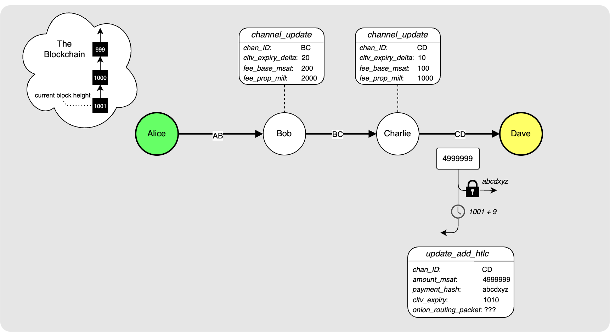

> *作者：Elle Mouton*
> 
> *来源：<https://ellemouton.com/posts/onion-routing-prelims/>*


## 概述

本文会介绍你在理解闪电网络中的转发支付流程时应该具备的背景知识，也会为[下一篇文章](https://ellemouton.com/posts/sphinx)所要介绍的  “Sphinx 消息包” 构造设定背景。具体来说，我们要回答一些基础问题，比如：“在一个节点要发起一笔支付时，它是如何找出到达目标节点的路径的？如何告诉这路径上的每一个节点他们要干什么？”

读完这篇文章，你应该能够理解：为了构造一条路径，发送者需要哪些信息；路径上的每一个节点必须要知道哪些信息，以及这些信息是如何传递给他们的。关于最后一点，本文会介绍一种初步的、粗糙的方法，为你理解 Sphinx 消息包构造的必要性打下基础。

跟往常一样，我会在整篇文章中使用同一个例子。

## 设定背景

这是 Alice 和 Dave，他们是闪电网络中的两个节点（别着急，Bob 在后面会出现的，但今天轮到 Dave 先出场）。


Alice 希望给 Dave 支付咖啡钱，所以 Dave 生成了一张发票，并使用一个 QR 码展示给 Alice 看。


如你所见，这张发票里面有一些有用的信息：

- `amount`（数额）：Dave 希望在冲泡咖啡之前从 Alice 处收到的款项的大小，以 “毫聪（千分之一聪）” 为单位。
- `payment_hash`（支付哈希值）：即将用来构造 HTLC（哈希时间锁）的哈希值。
- `memo`（备忘）：一个简短的、人眼可读的描述，关于这笔支付的目的。
- `payee_pub_key`（接收者公钥）：正是 Dave 曾经在自己的 `node_announcement`（节点宣告）消息中宣布的公钥。
- `min_final_cltv_expiry_delta`（CLTV 最终到期时间下限）：这个数值定义了 Dave 希望得到的能够安全申领 HTLC 资金的时间（也可以用区块数量来度量）。在下文中，该数值的意义会变得更加清楚。

## 找出一条路径

得到发票之后，Alice 离成功支付就只有一步之遥了。发票中的 `payee_pub_key` 告诉了 Alice 如何在网络中找到 Dave。[记住](https://ellemouton.com/posts/open_channel_pre_taproot)，Alice 需要收集一定数量的节点和通道的宣告，才能在本地构造出网络的图谱。（假设 Alice 已经有了这样的图谱，那么）现在，Alice 只需在网络中找出 Dave，然后找出通向 Dave 的（由通道连成的）路径。


上图展示了 Alice 所看到的网络，以及 Dave 在这个网络中的位置。Alice 除了会收到节点和通道的宣告，还会收到来自这些节点为自己所拥有的通道而发出的 `channel_update`（通道更新）信息。这种消息包含了相关节点将要使用的转发策略的信息，如果其它节点要使用它们的通道来转发支付，就必须遵循这些转发策略。每一条 `channel_update` 都包含了下列信息：

- `channel_ID`（通道标识符）：指出与本次更新相关的通道。
- `fee_base_msat`（基础手续费）：该节点要向过路的每一笔支付收取的手续费（单位是毫聪），不了支付额有多大。
- `fee_proportional_millionths`（比例手续费）：就是大家所说的 “手续费率”，要向通过该通道的每一笔支付按支付额收取的手续费，每 100 万聪收取 x 聪。
- `cltv_expiry_delta`（CLTV 到期时间差值）：该节点所要求的入账 HTLC 的 CLTV（绝对时间锁）与出账 HTLC 的 CLTV 的到期时间差值（详情见后文）。

这是 Alice 的视野的更新版本，展示了她所拥有的关于图上每一条通道的 `channel_update` 信息。


如果我们把当前的目标缩小到给 Dave 支付，我们可以将这个图稍微简化，简化到只展示相关的数据。我们只关心 Alice 和 Dave 之间可能路径上的通道，并且只关心可能要用到其出账方向通道的节点的 `channel_update` 信息。比如说，Bob 和 Charlie 都为通道 `BC` 广播了 `channel_update` 消息，但因为 Alice 只关心从 Bob 到 Charlie 这一个方向，所以只需要看 Bob 的 `channel_update` 信息就够了，因为这部分信息才跟出账方向有关。


上图展示了从 Alice 到 Dave 的两条路径：

```
1. Alice -> Bob -> Charlie -> Dave，经过通道 AB、BC 和 CD
2. Alice -> Eve -> Charlie -> Dave，经过通道 AE、EC 和 CD
```

如果 Alice 够聪明，她会选择尽可能少付手续费的路径。所以，我们作一些计算，来决定到底那条路径的成本效率更高。

### 路径 1

要计算一条路径的总手续费，我们需要从目标节点开始往后追溯。

- 我们知道，Dave 要收到 499 9999 毫聪（他在发票里就是这么说的），这就是我们要通过 Charlie 来转发的聪的数量。所以，支付给 Charlie 的手续费数额应该要这么计算：

  ```
  = Charlie 的基础手续费 + Charlie 的比例手续费，后面这部分是：费率数值/1000000 * (通过 Charlie 转发的数额)
  = 100 + 1000/1000000(4999999)  
  = 100 + 4999999000/1000000
  = 100 + 4999.999
  = 5099.99
  ~ 5100
  ```

  那么，应该发送给 Charlie 的数额应该是：

  ```
  = 4999999 + 5100 = 5005099 
  = 5005099 msats
  ```

- 5005099 是需要通过 Bob 来路由的数额，所以应该支付给 Bob 的手续费是：

  ```
  = 200 + 2000/1000000(5005099)
  = 200 + 2/1000(5005099)
  = 10211
  ```

  所以应该发送给 Bob 的数额是：

  ```
  = 5005099 + 10211
  = 5015310
  ```

  这意味着，在通过这条路径发送支付时，要付出的手续费是：

  ```
  = 5015310 - 4999999 
  = 15311 msats
  ```

### 路径 2

选择路径 2，也要运行相同的计算。

- Charlie 的部分是一样的：他要收到总计 500 5099 毫聪。

- 然后我们计算要给 Eve 支付多少钱：

  ```
  = 300 + 3000/1000000(5005099)
  = 300 + 3/1000(5005099)
  = 15316 msats
  ```

  所以，要支付给 Eve 的总额是：

  ```
  = 5005099 + 15316
  = 5020415 msats
  ```

  即，Alice 要支付的总手续费是：

  ```
  5020415-4999999 = 20416 msats
  ```

所以，胜出者是：路径 1 ！现在，我们只需要关心以下信息了：


## 逐跳载荷

现在，Alice 拥有了足够多的信息，知道自己要向路径上的每一 “跳（hop）” 告知哪些信息了。



Alice 希望 Dave 能在 `CD` 通道中收到来自 Charlie 的一条 `update_add_htlc` 消息。而且这条消息中的 `payment_hash` 应该跟 Dave 的发票中指定的一致；而且，消息中的 `amount_msat` 应该是 499 9999，也跟发票所指定的一致。然后，Alice 也要检查当前的区块高度（现在是 1001），并使用发票中的 `min_final_cltv_expiry_delta` 数值（9）来计算 Charlie 的出账 HTLC 的 CLTV 数值应该是 1010（1001 + 9）。

使用我们前面已经讲过的手续费计算器，Alice 便可以确定 Bob-Charlie 和 Alice-Bob 通道中的 `update_add_htlc` 消息应该是什么样。如果你看到下图中从右到左各个 HTLC 的 CLTV 数值是递增的，会感到困惑，那么请看[文末的这个注释](https://ellemouton.com/posts/onion-routing-prelims/#a-note-on-cltv-deltas)。


那么，剩下的谜团就只有一个了：如果 Alice 只跟 Bob 有联系，她怎么告诉 Charlie 如何给 Dave 路由呢？这就是 `update_add_htlc` 消息要用到 `onion_routing_packet`（洋葱路由消息包）的地方了。Alice 把她要告诉各个节点的信息打包在一起；并且，实际上，是用给上一跳的信息载荷来封装给下一跳的信息载荷。看下图会清楚一些：


所以，当 Bob 拿到来自 Alice 的消息时，同时也就拿到了应该转发给 Charlie 的包裹。Charlie 打开这个包裹、读到对自己有意义的数据时，也同时得到了应该转发给 Dave 的载荷。Dave 得到这个属于他的载荷，就会知道自己是这条路径的最后一个节点。这时候，Dave 会检查他是否拥有这个入账支付哈希值的原像。注意，这就是 “洋葱” 这个形象的由来：每一跳都会得到一个数据包，每一跳都只能剥开一层。

## 粗糙的洋葱包裹构造

我们再花一点时间来想象一下洋葱包裹实际长什么样。请注意，这 *并不是* 最终的形态。我在这里知识提出一种可能的构造，然后我会解释为什么这不是最终付诸实践的方式。最终形态会在我的[下一篇文章](https://ellemouton.com/posts/sphinx)中解释。

假设 Alice 已经知道了自己要告诉每一跳什么信息。这些信息叫做 “逐跳载荷”。她将这些信息全部打包在了一起、发给了 Bob：


这个包裹由这些部分组成：

- 长度为 1 字节的包裹版本号
- Alice 的公钥
- 给每一跳的载荷。注意，每一段载荷都有一个 HMAC（基于哈希函数的消息认证码），需要由收到它的一跳转发给下一跳（我们后面会看到它的作用）。
- 最后，是一个由 Alice 使用自己的公钥，对这个包裹的载荷生成的 HMAC。

（什么是 “基于哈希函数的信息认证码”？在下一篇文章中我会好好解释，但眼下，你只需要把它理解成一种用来验证一个载荷的完整性的数字签名。）

Bob 收到这个包裹后，会执行下列操作：

1. 检查 HMAC 是有效的（换句话来说，他要检查这个包裹没有被人篡改过）。
2. 他要阅读为他准备的载荷，以及 HMAC。
3. 然后，他重新构造一个包裹，并传给 Charlie。他会为这个包裹加上由 Alice交给他的 HMAC，因为他自己没法产生这个 HMAC。


Charlie 收到这个包裹之后，会执行下列操作：

1. 检查 HMAC 是有效的。
2. 他要阅读为他准备的载荷，以及 HMAC。
3. 然后，他重新构造一个包裹，并传给 Charlie。他会为这个包裹加上由 Alice交给他的 HMAC，因为他自己没法产生这个 HMAC。


Dave 收到这个包裹之后，会执行下列操作：

1. 他会检查这个 HMAC 是有效的。
2. 他会阅读为他准备的载荷，以及 HMAC。
3. 他所得到的 HMAC 会是一个空的字节数组。这向 Dave 表明，他就是最后一跳。

那么，这个构造有什么问题呢？

- 每一跳都可以读到给后续每一跳的载荷。这将泄露最终的接收者。
- 每一跳都被告知 Alice 的公钥，因此每一跳都知道谁是发送者。
- 即使每一段载荷都是加密的，包裹也会随着递送的次数增加而逐渐变小，让中间节点能够基于包裹的体积猜测自己离最终的接收者还有多远。

换句话说，这隐私性很糟。绝对不可以这样做！所以我们要使用 Sphinx 包裹构造！有了 Sphinx 包裹：

- 每一段载荷都是加密过的，所以只能被目标节点解密。
- 发送者不会分享自己的真实公钥，而是为每一跳使用一个不同的临时公钥。
- 每一跳收到的包裹都是相同的体积。

下一篇文章见！

## 一个关于 CLTV 到期时间差值的注释

要想理解为什么节点要宣告 CLTV 到期时间差值、支付的发送者如何使用这个数值来确定给每一跳的 CLTV 数值，我们要先回顾一下一个 HTLC 的构造：


上图展示了 Charlie 和 Dave 之间的 HTLC（根据本文的例子，这是整条路径上的最后一跳）。一个 HTLC 有两种可能的花费路径：原像路径，如果 Dave 能够提供对应于其中支付哈希值的原像，就能获得其中的资金；超时路径，让资金返回给 Charlie。超时路径要在 `CLTV A` 所定义的区块高度之后才能使用。假设当前的区块高度是 1001。如果 `CLTV A` 是 1002，那么有可能就在 Dave 要给出原像的时候，区块 1002 挖出，Charlie 抢先广播创建这个 HTLC 输出的交易并动用这个 HTLC 的超时路径，这样 Dave 就无法用原像路径来领取资金了。为了防止这种情形，Dave 需要一些时间，在超时路径能够动用之前好整以暇地使用原像路径。他在发送给 Alice 的发票中用 `min_final_cltv_expiry_delta` 字段表示自己要求的缓冲时间是 9 个区块。然后，Alice 就知道，如果她现在（正值区块高度 1001）就要给 Dave 发送支付，那么 Dave 会拒绝所有 `CLTV A` 数值小于 1010（1001 + 9）。

那么，再看看 Bob 和 Charlie 之间的 HTLC。现在我们希望搞清楚，Bob 与 Charlie 之间的 HTLC 的 CLTV 参数 `CLTV B` 应该设置成什么数值。


假设 Dave 一直拖到最后一刻，才向 Charlie 揭晓原像。也就是说，他一直拖到区块 1010 就要挖出的时候。Charlie 现在需要转过头来向 Bob 揭晓原像。如果 Bob 把这个 HTLC 提交上链，Charlie 也需要一些时间以使用原像分支，而不必担心 Bob 可以动用超时分支。Charlie 所要求的这个缓冲期（从 Dave 处收到原像，到向 Bob 揭晓原像）就是 Charlie 的 CLTV 到期时间差值。他会在自己的 `channel_update` 消息中公开，而且他预期 Alice 在构造支付路径时会使用这个数值。如果一笔支付来自 Bob，而 `CLTV B` 与 `CLTV A` 之间的差值小于 Charlie 所公开的差值，那么他会拒绝转发这笔支付。他要求 `CLTV B` 的数值大于等于 `CLTV A` 数值加上他公开过的 CLTV 差值。

## 奖励环节：逐跳提示

这篇文章可以快速向你展示关于逐跳提示及其对寻路过程的影响，你应该知道的事情。

如果我们回到 Alice 基于所收到的 `channel_announcement` 建构出来的网络图，有可能 Alice 实际上并不知道 Charlie 和 Dave 之间的通道（即 `CD`）。这是因为这可能是一条私人通道，Charlie 和 Dave 并未向网络公开。


这时候，Alice 就无法找出通往 Dave 的路径，除非 Dave 在发票中给 Alice 提供更多信息。Dave 可以提供的额外信息由一个或多个 “逐跳提示” 组成。这些提示需要弥补 Alice 已经从相关通道的 `channel_announcement` 和 `channel_update` 消息中知道的信息。包括 Charlie 的公钥、该通道的 SCID（短通道标识符），以及该通道的路由策略。


剩下的部分，就没有什么不同啦 : )

## 结论

完成啦！我希望这篇文章能让一些事情更加清晰，你能够理解一个发送者要如何找出通往一个目标节点的路径，以及要给沿路的每一跳什么信息。在[下一篇文章](https://ellemouton.com/posts/sphinx)中，我们会深入了解携带逐跳载荷、力求最大化隐私性的洋葱包裹是如何构造的。

（完）