> *作者：Elle Mouton*
> 
> *来源：<https://ellemouton.com/posts/sphinx/>*

在[上一篇文章](https://ellemouton.com/posts/onion-routing-prelims)（中文译本）中，我们介绍了支付的发送者节点要跟支付转发路径上的各个节点沟通 *什么* 数据。现在，我们要深入了解 *如何* 打包这些数据，使得沿路转发支付时泄露的信息尽可能少。这是使用 “[Sphinx](https://github.com/lightning/bolts/blob/master/04-onion-routing.md)” 包裹构造来完成的，它可以保证这几件事：

1. 路径上的每一跳（中间节点），都只知道路径上的前一跳和后一跳。
2. 每一跳都只能解密安排给 TA 的那部分消息载荷。

在这篇文章中，我们会确切地了解这是怎么做到的。不过，在了解这些好东西之前，我们先要了解一些基础。

## Diffie-Hellman 密钥交换

“[Diffie-Hellman 密钥交换](https://www.techtarget.com/searchsecurity/definition/Diffie-Hellman-key-exchange)” 是一个简单的办法，让两个私钥的拥有者可以派生出一对他们俩共享的密钥。只需要两人向对方交付自己的公钥即可。

上图就展示了这是怎么做到的。两人各自拥有密钥 `A` 和 `B`。对应的私钥 `a` 和 `b` 仍然保持私密，不影响双方能派生出一对共享的密钥。 如果你怀疑这密钥是否只有他们俩知道，你可以问问自己，一个拥有公私钥 `q` 和 `Q` 的第三方，如果知道了公钥 `A` 和 `B`，是否能够推导出 `A` 和 `B` 的共享密钥。答案显然是否定的。

在 Sphinx 包裹构造中，洋葱包裹的创建者 Alice，将使用自己拥有的一把公钥，与路径上的各节点的公钥生成共享密钥，以便加密给该节点的数据。 

一旦某一跳派生出了与 Alice 的共享密钥，TA 就可以使用这个共享密钥和其它常量（`rho`、`mu`、`pad`、`um` 和 `ammag`），派生出其它公钥或者字节流：

## 临时密钥

路径上的每一跳都需要被告知，发送者用来派生共享密钥的公钥是哪一个，以便 TA 能够派生出同一个密钥，来解密包裹。但是，如果向每一跳公开的都是发送者的节点公钥 `A`， 那就有点泄露隐私了。因为这样以来，路径上的每一个节点都会知道是 Alice 在发送支付。为此，Alice 将为每一跳使用一对单独的临时密钥。也就是说，她会给路径上的每一跳安排一对新的公私钥、用来跟该节点的公钥派生共享秘密值。在支付完成之后，Alice 可以直接抛弃这些临时密钥对。

直觉上，Alice 可以为沿路每一跳生成一对全新的、随机的密钥，但这就意味着，即使支付完成了，她也依然需要持久保存每一个私钥；*而且*，她将需要在给每一个跳的洋葱包裹中包含这个临时公钥，这会用掉很多洋葱包裹的空间。

相反，她要做的是生成仅仅一对临时密钥，其中的私钥叫做 `session_key`。Alice 会用这对密钥派生出沿路所需的所有其它临时密钥。酷炫的地方在于，她只需要把第一个临时公钥告诉第一跳。每一跳都能使用这个临时公钥，以及靠这个临时公钥派生出的（与 Alice 的）共享秘密值，派生出给下一跳的临时公钥，并传递给吓一跳。看下文的一个详尽的例子，你就清楚了。

## 基于哈希函数的消息认证码

“基于哈希函数的消息认证码（[HMAC](https://en.wikipedia.org/wiki/HMAC)）” 是一种消息认证技术。它以一条消息和一个私钥为一个密码学哈希函数的输入，产生出一个认证码。只有知道这个私钥的人，才能生成和验证这个认证码。

HMAC 的使用会贯穿洋葱包裹的构造，这样每一跳都能验证包裹的内容（消息）没有被篡改过。因为 HMAC 只有发送者 Alice 才能生成，所以给每一跳的 HMAC 都必须在一开始就放入洋葱中。在下文的例子中会更清楚。

## XOR

“异或（[XOR](https://en.wikipedia.org/wiki/XOR_gate)）” 操作是一种比特运算，*当且仅当* 两个比特中有一个是 1 的时候，才会产生 1。换句话说，XOR 操作的结果，仅在输入的两个比特不同之时，才会是 1。XOR 的真值表可在下图看到。这个表展示了两个比特值 `A` 和 `B` 在不同取值之时，执行异或运算的结果 `C`。

 

下图则展示了异或运算的一种有趣属性，也是我们会用在 Sphinx 包裹构造中的：取上图中 `C` 的结果，如果对它和 `A` 再次运行 XOR 运算，则会得到 `B`。   类似地，`C` 和 `B` 的异或运算会得到 `A`。

   

为了更好地理解这个想法，我们来看一些例子：在下图的案例 1 中，你可以看到，如果对两段相同的数据运行 XOR，则会得到全部为 0  的字节数组。所以，让一个东西与自身运行 XOR，将完全破环掉信息。而在案例 2 中，如果你对一个数据包和一个等长的 0 字节数组运行 XOR，则结果就是原来的数据包。

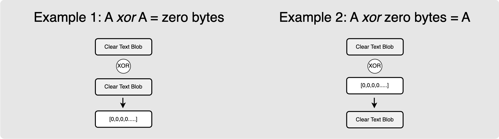

再来看更有用、更有趣的例子：

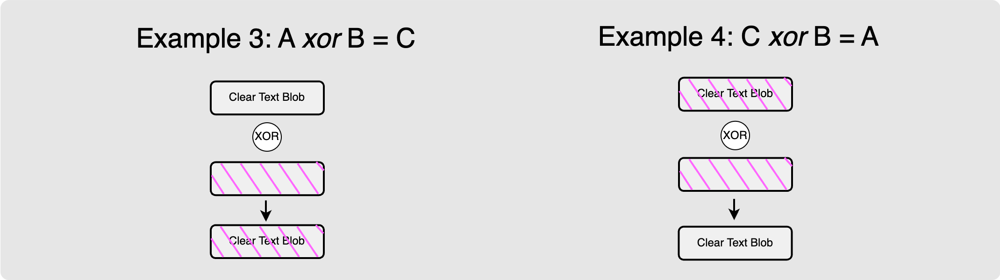

案例 3 表明，如果你对一个数据包用随机的字节流运行 XOR，你就会得到该数据包的加密形式。而案例 4 表明，取得这个加密包裹之后，如果你使用 *同一段* 字节流再次运行 XOR，你会得到原本的包裹（明文）。Sphinx 包裹构造重度使用 XOR 和伪随机的字节串来加密包裹明文。

## 发送者准备

本文所用的例子延续上一篇，从上一篇结尾的地方开始。大体上，我们有这样一条路径，Alice 是发送者，Dave 是接收者。Alice 只需要向每一跳交付一段消息载荷，不需要泄露太多关于路径的信息。

Alice 有一组载荷，包含了她想告知各跳的内容。在把载荷放进洋葱包裹的时候，会给它们加上标记长度的前缀和一个 32 比特的 HMAC 作为后缀。

然后，Alice 生成一个 `session_key`，并使用它推导出一串临时公钥。 注意，下图中的 “bf” 指的是 “盲化因子”，是用来微调私钥或者公钥的。 

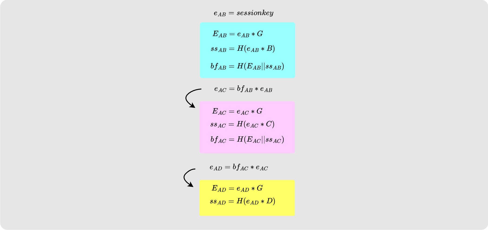

前面我已经提到，我们不希望路径上的中间节点知道他们在路径的什么位置。为此，给每一跳的洋葱包裹都是相同的长度（1300 字节），而且每一跳都只能读到安排给 TA 的载荷，剩余的部分对 Ta 来说就像随机的字节串。

## 封装洋葱的第一次尝试

我们会过两遍封装洋葱的流程。在第一次尝试中，我们会建立一个初步印象，然后我们会在第二次尝试中看到，为什么要添加某一些复杂性。

Alice 需要从后往前封装洋葱：先要加入给 Dave 的载荷，封装它；然后加入给 Charlie 的载荷，等等。最终得到的、完整封装的包裹会交给 Bob。每一跳都能剥开一层封装。

首先，Alice 使用会话密钥生成 1300 字节的伪随机字节流。这个过程叫做 “填充”。

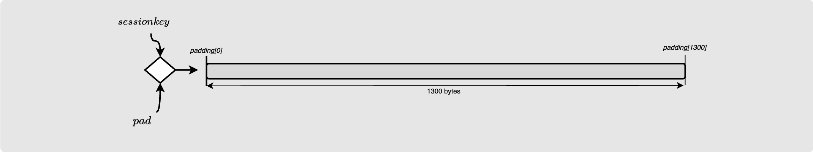

### 为 Dave 封装

然后，Alice 移动到填充数据的开头，为 Dave 的载荷提供空间。这时候加入 Dave 载荷的 HMAC 并不是真实的 HMAC。因为 Dave 是最后一跳，这个洋葱不需要再传递给下一个人了，因此这个 HMAC 被设为由 0 字节构成的空集，以此作为信号，告诉 Dave 他已经是这条路径的最后一跳。

包裹需要保持 1300 字节长，所以填充数据末尾的部分就会被切掉。

然后，Alice 使用她与 Dave 的共享密钥 $SS_{AD}$ ，使用常量 `rho`，派生出一个长达 1300 字节的伪随机字节流。这个字节流会跟上一步得到的洋葱包裹运行 XOR，产生一个加密的包裹，只有 Dave 才能解密它。然后，Alice 使用 $SS_{AD}$ 和常量 `mu` ，与这时候的洋葱包裹内容计算出一个 HMAC。Dave 会验证这个 HMAC 等于他独立为收到的包裹计算出的 HMAC。

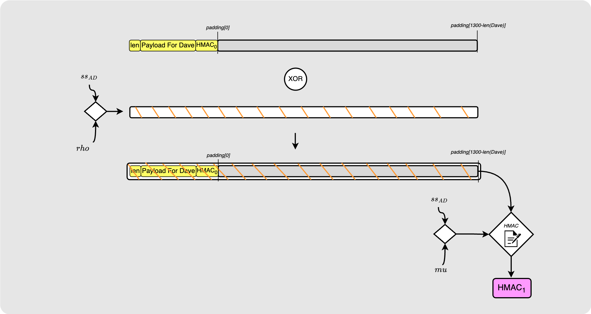

### 为 Charlie 封装

然后，Alice 加入 Charlie 的载荷。注意，他的载荷包含了上图中的 $HMAC_1$ 。再一次，包裹的长度会控制在 1300 字节。

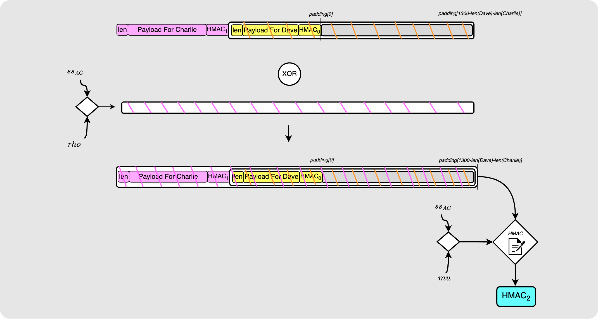

类似于为 Dave 使用的加密手段，Alice 也使用她与 Charlie 的共享秘密值 $ss_{AC}$，推导出一段伪随机的字节流，然后与洋葱包裹运行 XOR。这就形成了给 Charlie 安排的加密包裹。同样地，Alice 也会为当前的载荷计算出一个 HMAC。

### 为 Bob 封装

到最后一层了！最后，Alice 将 Bob 的负载放在包裹的开头、切掉末尾剩余的部分，使之依然是一个 1300 字节长的包裹。然后，Alice 用她与 Bob 的共享秘密值 $ss_{AB}$，推导出一段字节流，然后运行 XOR 运算。最终为这个包裹计算 HMAC：$HMAC_3$。

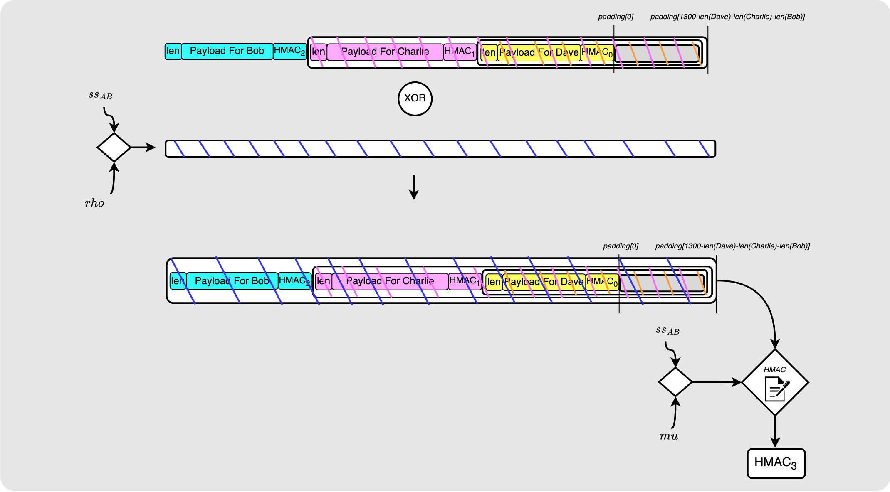

在将这个包裹发送给 Bob 之前，Alice 还要加入一些信息：包裹的版本字节、Alice 的第一个临时公钥 $E_{AB}$，最后是最终的洋葱包裹的 HMAC（$HMAC_3$）。

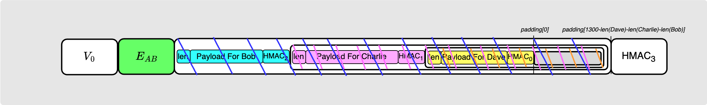

现在，Alice 可以把这个包裹交给 Bob 了。

## 剥洋葱

### Bob 剥开第一层

Bob 首先要做的事情是使用临时密钥 $E_{AB}$ 来派生他与 Alice 的共享密钥。他一边这样做的时候，也一边计算出了 *下一个* 临时公钥，需要交给 Charlie 的那个。

然后，Bob 需要验证 HMAC。他使用与 Alice 的共享秘密值 $ss_{AB}$ 和常量 `mu`，以及洋葱包裹的内容，来计算当前载荷的 HMAC。 如果计算出的 HMAC 等于从 Alice 处收到的消息的末尾那个，就说明载荷没有被篡改过。

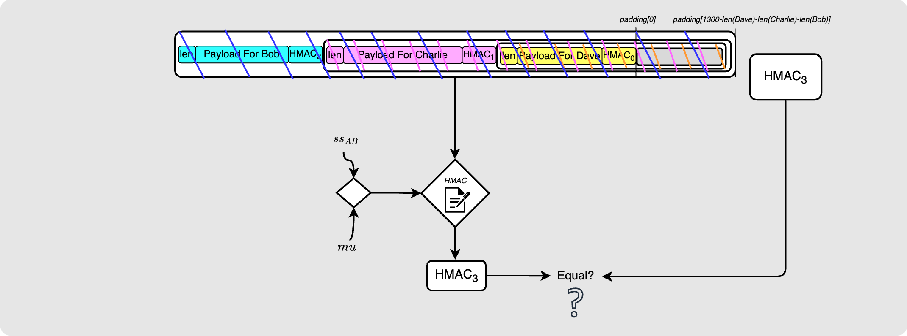

这个 HMAC 应该是有效的，因为你可以在上图中看到，包裹的内容就跟 Alice 在计算 HMAC 的时候一样。

很好！现在，Bob 已经准备好解密了。因为他可以派生出密钥 $ss_{AB}$，他可以推导出跟 Alice 相同的伪随机字节流，来解密他的载荷。他使用 XOR 运算来解密载荷。但是，且慢！Bob 要把剩余的载荷传递给 Charlie 时，肯定会把属于自己的部分删掉 …… 但包裹要保持 1300 字节的长度啊，而且他没法直接用 0 字节来填充，因为这就会让下一跳能够（从 0 字节的长度中）了解路径的长度，以及 Bob 的负载的长度。所以，反过来，在解密载荷之前，Bob 先给加密的载荷填充 1300 个 0 字节，然后生成长度为 2600 字节的伪随机字节流，再运行 XOR 解密。

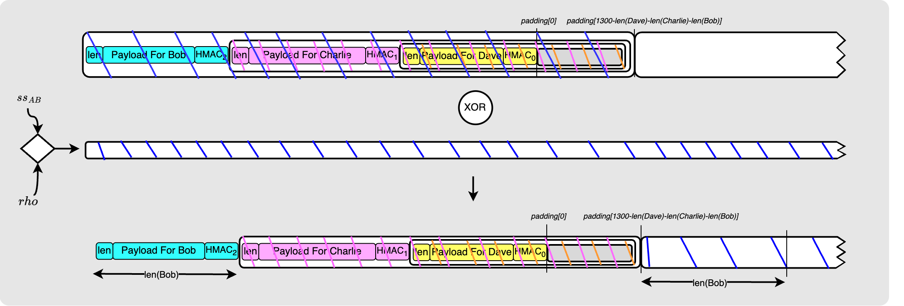

现在，解密完成，Bob 移除安排给自己的那部分载荷，然后截断末尾的部分，使包裹的长度回到 1300 字节：

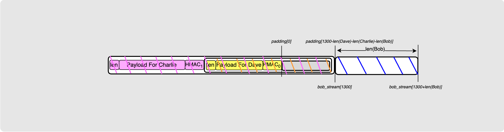

然后，就像 Alice 对 Bob 做的一样，Bob 通过添加 Charlie 需要的临时公钥以及 Alice 在载荷中提供给他的 $HMAC_2$，包裹好了给 Charlie 的洋葱。

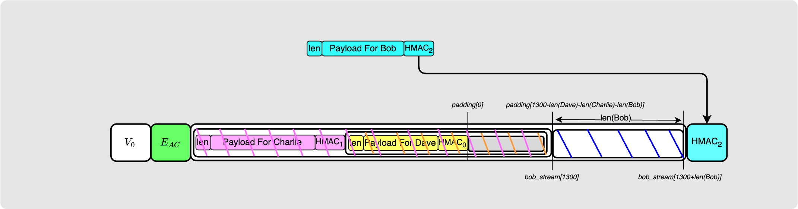

你可能已经发现了这里会出一个问题 …… 花点时间，看看你是否能自己找出来。在下一节我们深入 Charlie 的验证流程时，这问题会变得更加清楚。现在，我们假设 Bob 就把这样的包裹交给 Charlie。

### Charlie 剥开一层

Charlie 收到来自 Bob 的洋葱包裹。他首先要做的，是使用临时公钥 $E_{AC}$  和他自己的私钥 `c` 派生出他与 Alice 个共享秘密值。然后，他也使用这个共享秘密值派生出给 Dave 的临时公钥。

然后，他检查载荷中提供的 HMAC 是否有效。啊哈！这就是问题所在！如果你回去看展示 Alice 用来创建这个 HMAC 的图，你会发现那个包裹看起来不一样。不过现在，我们至少知道了，在 Alice 计算给 Charlie 的 HMAC 的时候，那个包裹 *应该* 长什么样。

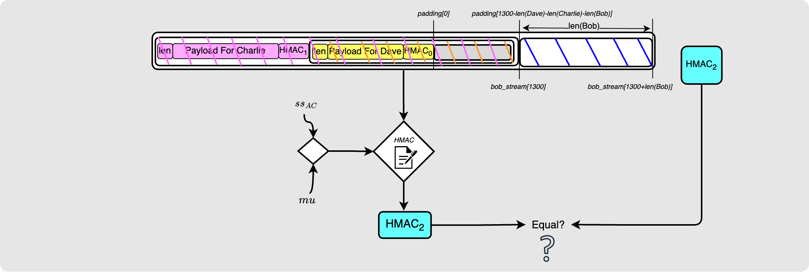

出于完整性考量，*并且* 为了能够发现其它可能出错的地方，我们假设 Charlie 可以继续这个流程。

Charlie 使用共享密钥来解密包裹，就像 Bob 做的那样。然后他阅读安排给他的载荷，并重新构建给 Dave 的包裹。

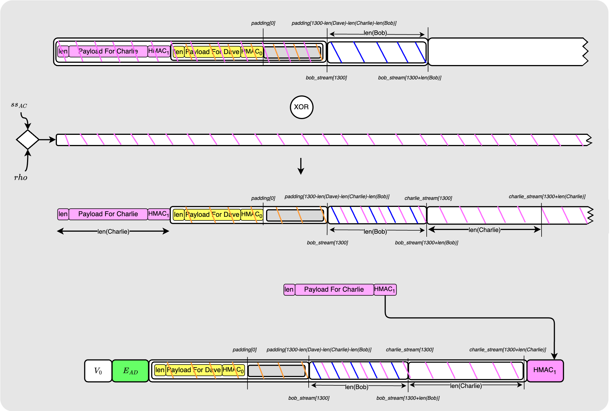

### Dave 剥开一层

Dave 收到包裹，派生出于 Alice 的共享密钥：

然后尝试验证 HMAC。再一次，这会失败，因为包裹的内容于 Alice 用来计算 HMAC 的内容并不一致。但还是一样，我们现在知道为了让 HMAC 能够通过，包裹应该是什么样的了，我们会把这些教训用在第二次尝试中。

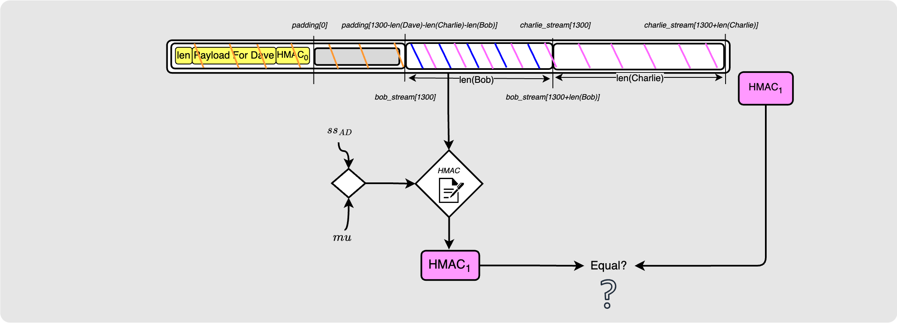

再次假设 Dave 可以继续，并使用共享秘密值来解密包裹。

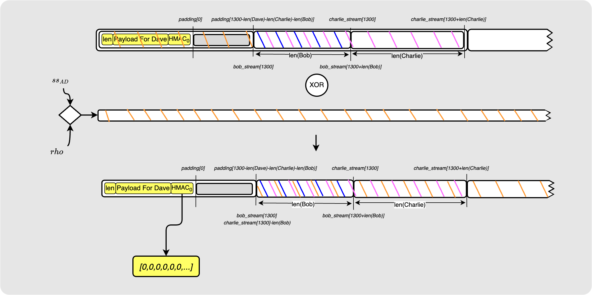

Dave 将看到发送给他的 HMAC 是 0 比特数组。他因此知道自己就是整条路径的最后一个节点了。

## 封装洋葱的第二次尝试

我们看来是犯了一些错误，但我们也学到了一些教训。现在，我们知道了在计算 HMAC 时，各包裹应该长什么样。我们可以重新把洋葱正确地包好。

我们先看看 Dave 收到的包裹（解密之前）的状态：

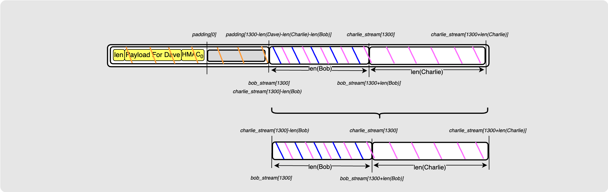

这个包裹与我们一开始用来计算 HMAC 的包裹的区别在于上图所示末尾的比特。幸运的是，我们追踪了这里涉及到哪些伪随机字节流，以及这些伪随机字节流都涉及哪些部分。所以 Alice 一开始需要做的，是构建出这一部分，叫做 “填充符”。下图展示了其构造过程：

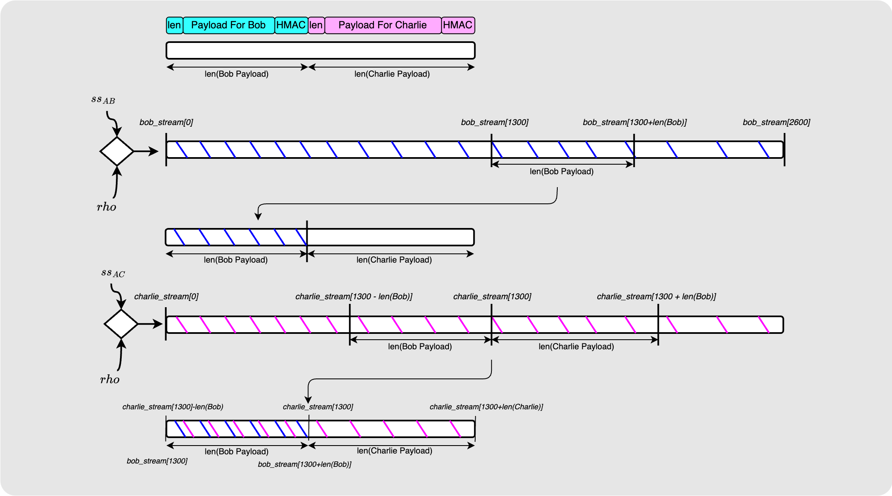

很棒！那我们再试一次？

### 为 Dave 封装

初始化填充流程保持不变：

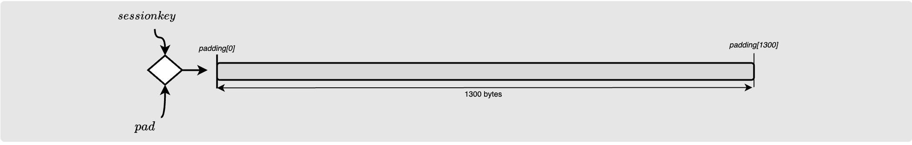

同样地，我们加入 Dave 的载荷，并加密它：

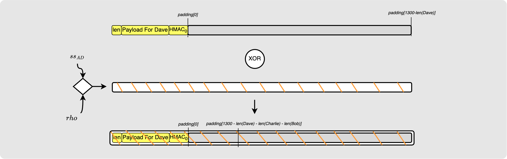

现在，就是需要改变的地方了！我们知道，在 Alice 计算相应的 HMAC 之前，必须先插入填充符：

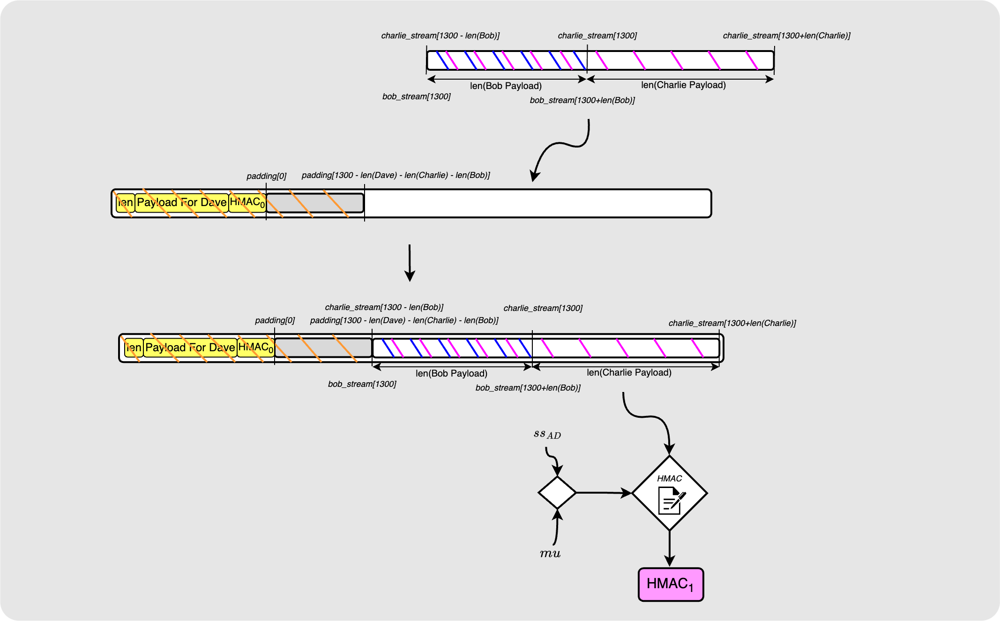

很棒！现在，Charlie 最终收到的 HMAC，就会在事实上对它收到的载荷有效了。

### 为 Charlie 封装

再一次，Alice 加入给 Charlie 的载荷，加密它，然后 …… 我们还需要再次去除一些字节，换成一个推导出的填充符码？似乎不用了！因为 XOR 的特性，对已经存在填充符内容的包裹使用 Charlie 用来解密载荷的字节流运行 XOR 操作，结果正好 *等于* Charlie 将会收到的包裹！因此，这时候就不需要特殊操作了。Alice 可以直接计算 HMAC。

 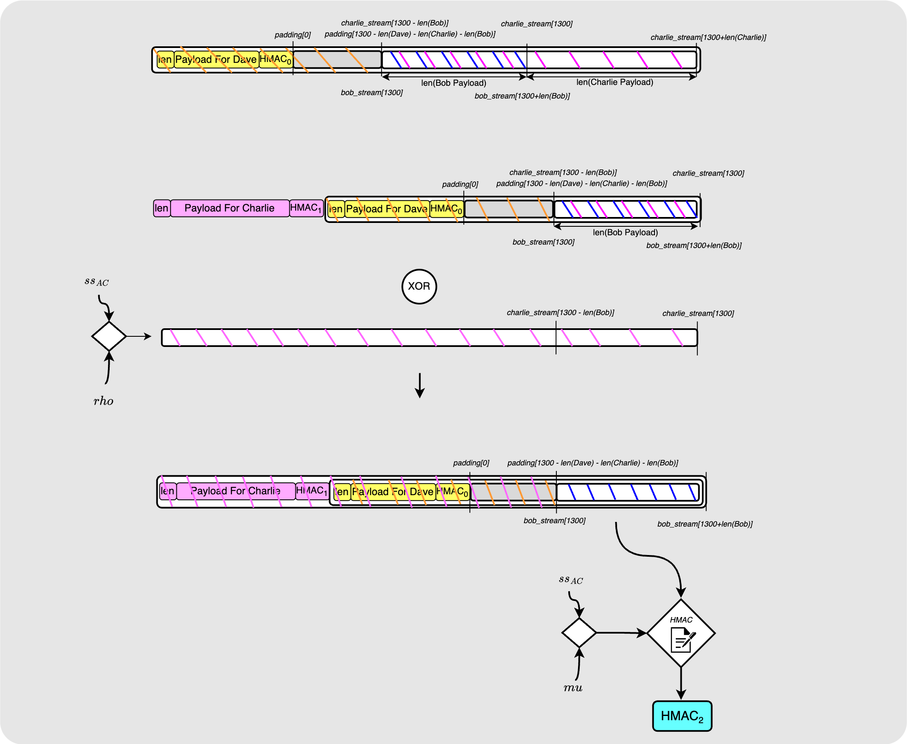

### 为 Bob 封装

最后，Alice 加入给 Bob 的载荷，加密包裹并计算最终的 HMAC。

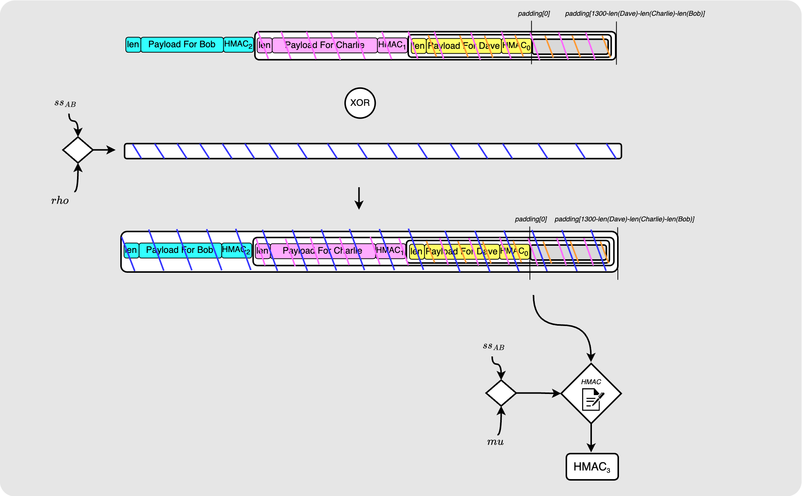

注意，最终的洋葱包裹，跟我们在第一次尝试的末尾得到的包裹完全相同（当然，现在的 HMAC 才是对的），所以，剥开它的过程将跟我们剥开第一次尝试所得到的包裹完全相同。

## 故障

跟我们已经了解到的东西相比，理解如何处理故障应该是轻而易举的 : )

假设 Charlie 解密了来自 Alice 的洋葱包裹中的载荷之后，他发现，满足 Alice 的转发数额要求将使他得不到他已经公开的手续费。那么，Charlie 希望这笔支付失败。所以，他不再转递洋葱给 Dave，而是构造一个失败消息包裹，并在其中包含一条他希望发回给 Alice 的包裹，来告诉她哪里出了问题。他可能也要填充这条信息。他先使用跟 Alice 的共享秘密值 $ss_{AC}$ 以及常量 `um`，产生对数据的一个 HMAC。然后，他使用 $ss_{AC}$ 与常量 `ammag` 产生伪随机字节流，与故障消息包裹运行 XOR。然后，他会将这条加密消息放在一个 `update_fail_htlc` 消息中，并发回给 Bob。

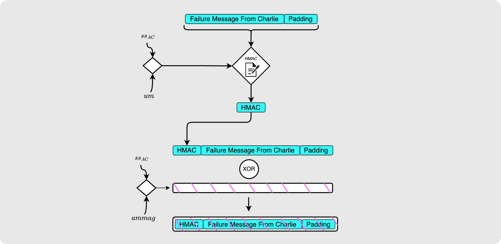

Bov 直接使用与 Alice 的共享秘密值 $ss_{AB}$ 产生另一个字节流，并重新加密这段负载。他也会将这段密文放在 `update_fail_htlc` 消息中发回给 Alice：

 当 Alice 收到这条消息时，她并不能马上知道是哪一跳生成了这段载荷，但她知道加密的顺序。所以她先解密（剥开）Bob 的加密层。解密之后，她先看载荷的前面 32 字节（将它当成一个 HMAC），然后用剩余的载荷计算 HMAC，看看两者是否相等。在这个案例里是不相等的，这就表明 Bob 不会产生故障的节点。

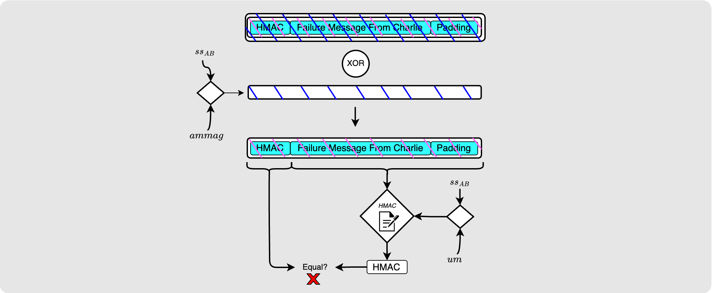

Alice 继续，剥开 Charlie 的加密层，然后重复检查 HMAC 的过程。这时候，HMAC 将匹配，那么 Alice 知道了 Charlie 就是故障的源头，现在她可以从故障消息中了解错误原因了。

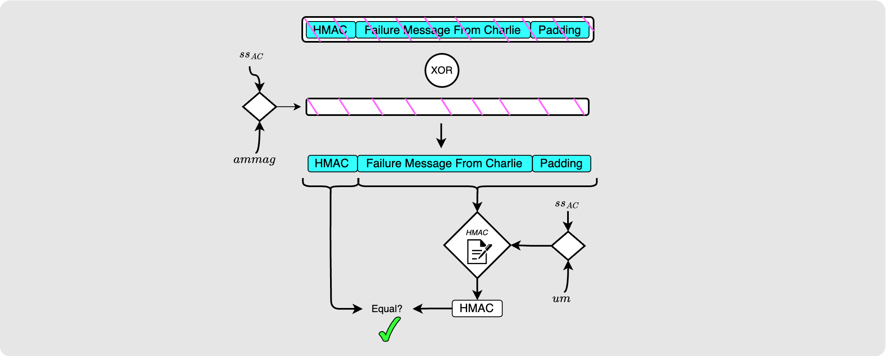

### 一个例外情形

需要注意的一个例外情形是，Charlie 从 Bob 处获得洋葱包裹之后无法解析它。如果 Charlie 无法解析，他就不知道用来派生共享秘密值的临时公钥。这意味着他也无法加密故障消息包裹。所以，在这种情况下，Charlie 会给 Bob 发送一条 `update_fail_malformed_htlc` 消息，并附带关于发生的故障的信息。 Bob 收到这消息之后，他知道自己必须为这个错误运行初始化加密轮次。他这样做，然后在一条 `update_fail_htlc` 消息中发回给 Alice。

## 结论

如果你读完了，恭喜！现在你知道怎么创建一个 Sphinx 洋葱包裹了！

像往常一样，如果你认为还需要补充什么，或者有任何问题，欢迎留下你的评论。如果你认为某个地方应该纠正，请让我知道，或者可以直接在[本网站的 GitHub 页面](https://github.com/ellemouton/website)开启 PR。

（完）

 