> *作者：Anony*
> 
> *[前篇见此处](https://www.btcstudy.org/2024/03/04/lightning-network-technology-improvement-and-users-experience-part-6/)*

在本系列的[第二篇文章](https://www.btcstudy.org/2024/03/04/lightning-network-technology-improvement-and-users-experience-part-2/)中，我们已经指出，闪电通道的构造方法和最终效果，可以随比特币协议的提升而提升。然而，实际上，在一个较少获得关注、但与通道的构造紧密相关的领域，闪电通道一直在比特币协议的共识规则未升级的前提下不断优化，那就是交易的手续费支付。

在闪电通道中，通道状态以承诺交易来表达，而每一笔承诺交易都有可能被发送上链，那就必须为这些交易考虑手续费问题。反过来，支付手续费的方法也会影响通道内可用的余额和批量处理交易的可能性，进而影响用户体验。

在本文中，我们会回顾闪电通道的手续费支付设计是如何得到逐步优化的，这些优化又如何改进用户体验。需要读者先理解闪电网络的工作原理和安全要求。

在开始之前，请想一个 “简单” 的问题：一条通道是由双方共同拥有的，双方都有可能在其中持有余额，那么，在需要将交易提交上链的时候，应该由谁来支付手续费呢？在比特币交易中，这该如何实现？

好了，我们先从比特币手续费支付的方法说起。

## 手续费的支付与追加

在一笔比特币交易得到区块确认时，其输入资金之和与输出资金之和的差值，可以被挖出这个区块的矿工收取，这个差值就被称为 “手续费”，也是矿工将这笔交易纳入区块的主要激励。

在构造交易时，用户为交易选定输入和输出，同时也就决定了手续费的大小。然而，手续费市场可能会剧烈变化，用户选定的手续费大小，可能在稍后被证明不足以让该交易在用户希望的时间内得到确认，因此，我们需要考虑 “追加” 手续费。这是改善用户体验的必需。

### RBF

其中一种方法称作 “手续费替换（Replace-by-fee）”，其原理是使用原交易的部分或全部输入来发起一笔新交易，并让新交易（替代交易）携带比原交易更高的手续费，从而吸引矿工打包替代交易。如下图所示（留意数额）：

你也可以认为，Tx #1 是在尝试重复花费 UTXO #0，两笔交易是在 “赛跑”。但因为 Tx #1 给出了更高的手续费，显然矿工会更喜欢这笔交易。这就起到了我们所说的 “追加手续费”、吸引矿工优先打包交易的效果。

### CPFP

另一种方法是，使用原交易的输出发起新交易，并让新交易携带较高的手续费，从而，矿工如果想要打包新交易，就必须打包原交易（换句话说，旧交易和新交易将作为一个整体 —— “交易包” —— 与交易池内的其它交易竞争）；这就叫 “子为父偿（CPFP）”。如下图所示

与 RBF 相比，CPFP 有个缺点：新交易需要占用额外的区块空间（也就意味着新交易所携带的部分手续费将用来让自身得到确认，而不是为原交易追加），而 RBF 则基本上不需要。这意味着在两种方法都能使用的场合，RBF 的效率更高、经济性更好。

有了这些基本概念，我们再来看看闪电通道的设计。

## 早期设计（Legacy Channels）

上图展示了对通道的一个参与者来说，与一个通道状态有关的交易：Offered HTLC 和 Received HTLC 分别代表着这个参与向对方提供的 HTLC 以及从对方收到的 HTLC，为一致地适用基于惩罚的闪电通道安全规则（LN-Penalty），这两类输出都必须得到预签名的交易（并在交易的输出中放置惩罚分支，在上图中没有画出） <a href="#note2" id="jump-2">[2]</a>。上图所概述的两类交易（承诺交易、HTLC 相关交易）都必须考虑手续费支付和追加的问题。

最初的闪电网络规范在手续费支付上作了这些设计：（1）总是由通道的发起方为承诺交易支付手续费（这跟本系列第五篇提到的 “[单向注资](https://www.btcstudy.org/2024/03/01/lightning-network-technology-improvement-and-users-experience-part-5)” 设计是高度绑定的）；（2）在 HTLC 交易中，让交易的得益者来支付手续费。除此之外，尽管承诺交易的特殊性使得 RBF 几乎不可用（设想在强制关闭场景中，一方希望让一笔承诺交易上链，但对方却不配合，他们无法形成新的交易来替代以往签名的承诺交易），承诺交易**没有**作出便于使用 CPFP 的设计 —— 尽管 To Local 输出是交给交易广播者自己的，但这个输出带有时间锁，无法立即动用，因此也就无法**即时**用于发起子交易；HTLC 交易自身同样需要对方的签名，而其输出同样带有时间锁分支。（这是一种粗心大意吗？我想再往下看，你会得出自己的答案。）

这样的设计在以下几个方面影响了用户体验：

1. 总是让一方支付手续费，有损于公平；
2. 承诺交易无法使用 RBF，又没有针对 CPFP 的设计，因此必须在构造阶段就保证其带有高得足以得到确认的手续费；但是，由于承诺交易在未来的上链时间是不确定的，这就成了一个几乎无解的问题 —— 实用的办法就只有非常保守地高估手续费 <a href="#note3" id="jump-3">[3]</a>；但这些手续费又会占用一部分通道资金，降低通道的有用性；
   - 此外，手续费市场也会波动，由此带来的预估手续费的波动，也会使通道参与者的可用余额产生波动，这会给用户带来困惑；而且，在链上手续费高涨的时期（也是人们最希望能够利用闪电网络来节约手续费的时期），这会大大压缩可用的通道容量、削弱闪电网络的效用 <a href="#note4" id="jump-4">[4]</a>。

那么，要如何优化呢？

## 锚点通道

“锚点通道（Anchor Channels）” 的思想是，在承诺交易中额外为每一方安排一个低价值但即刻可用的输出（同时为所有其它输出增加一个长达 1 区块的相对时间锁），以允许每一方都能在广播承诺交易之后，使用该锚点输出来发起 CPFP。当然，由于锚点输出自身的价值较低，用户必须为子交易注入额外的资金，才能成功追加手续费。

除此之外，锚点通道还对 HTLC 交易应用了一种大胆的技巧：当一方为对方的 HTCL 交易签名时，使用 “SIGHASH_SINGLE | ANYONECANPAY” 的哈希标签 <a href="#note5" id="jump-5">[5]</a>；这种标签使得签名仅覆盖**一对**输入（也即目标 HTLC）和输出，并使这对输入和输出可以组合到其它有效的交易中。这就使用户可以将自己得到的多个预签名 HTLC 交易组合成一笔。而且，闪电网络规范还特别规定：锚点通道的 HTLC 交易自身不应携带任何手续费；也即，用户就应该将自己应得得 HTLC 交易都组合（批处理）成一笔，然后通过为之添加输入和找零输出的方式支付手续费。

在这两项设计的结合之下，闪电通道的实现得到了简化，手续费占用余额的问题得到了优化：

1. 在承诺交易中，不必完全依赖于承诺交易自身来支付手续费，相反，可以设定一个较为稳定的手续费，并将手续费追加的问题留给依据锚点输出发起的子交易；这样，手续费占用通道可用余额的问题就得到了缓解；
   - 请注意，这并没有完全解决需要预估手续费的问题。因为手续费市场的波动，交易能够得到节点转发的费率门槛值也会波动，尽管承诺交易不必再保证自己随时都能得到确认，但依然需要保证自身的费率高得能够吸引节点传播；如果传播不出去，那 CPFP 方法也不会奏效。但这个难度已经降低了。
2. 在 HTLC 交易中，手续费不再由交易的输入（也即 HTLC）来支付，因此也不必再考虑费率水平如何影响 HTLC 交易的构造及其可欲性。

代价是，在使用锚点通道时，用户必须确保自己在钱包中放置了可用的链上资金，以备支付手续费的需要。这会降低闪电网络在降低比特币网络 UTXO 集规模上的扩容效果。

## 复杂的事实

你可能会认为，给定比特币交易的结构和追加手续费的方法，应用上述改进应该是自然而然并且简单的。然而，事实是，尽管可以说是顺理成章的，却并不那么容易。因为，多笔交易所能形成的顺序关系（拓扑），是多种多样的。而无论 RBF 还是 CPFP，允许这种行为，都等于是允许交易的发起者占用传播交易的节点的一部分资源。这种占用必须得到约束，否则攻击者就可以通过交易包的构造和交易的替换，对传播交易的节点发起 DoS 攻击。但另一方面，这些用来约束行为的规则也有可能被利用来发起攻击。

举个例子。为约束 CPFP 行为，Bitcoin Core 的交易池规则要求，一笔未确认的交易只有拥有 24 个后代交易。那么好了，在上述锚点通道的承诺交易中，由于两方都有锚点输出，因此，一方可以通过利用己方的锚点输出给承诺交易添加 24 个子交易，从而阻止对方发起 CPFP。由于这种攻击风险（它被称作 “交易钉死攻击”）的存在，上述 Bitcoin Core 规则允许一个例外：当一笔子交易自身重量低于 1000 vB、且仅有一个未确认的祖先交易时，则可成为该未确认祖先交易的第 25 个后代交易。这一例外规则（称为 “Carve Out”）使上述锚点通道得以安全运作（但依然无法排除被对手影响的风险） <a href="#note6" id="jump-6">[6]</a>。

最终来说，由比特币全节点组成的网络以及被各个节点适用的交易池规则，构成了闪电通道这样的合约式协议的安全依赖（它们往往都需要让交易即时得到确认，来保证用户的资金安全性；相应地，合约式协议的设计也将依赖于交易池规则的开发状况），但这些交易池规则却可能不够完美。设计出可靠又能抵御滥用的交易池规则，并不是容易的事。

自 2022 年以来，比特币的开发者们开始形成对交易池规则的新想法，其中著名的有 “v3 交易 <a href="#note7" id="jump-7">[7]</a>” 和 “族群交易池 <a href="#note8" id="jump-8">[8]</a>”；前者通过约束交易间的拓扑来支持设计更精妙的规则，后者则希望重新设计交易池的内部排序来支持更好的 RBF 规则。有趣的是，由于族群交易池不允许 CPFP-Carve Out，v3 交易（现已改称 “TRUC 交易”）将是我们走向族群交易池的桥梁。

下一节，我们就介绍这些想法在 Bitcoin Core 28.0 中的实现（详情可见这份指南 <a href="#note9" id="jump-9">[9]</a>），以及闪电通道可以如何利用它们来改善用户体验。

## 基于 1P1C 交易包的新范式

首先，Bitcoin Core 28.0 引入了一种新的交易池单元，称为 “1P1C 交易包”，故名思议，就是仅由两笔亲子交易组成的交易包，它们会作为一个整体跟其它交易池单元（比如交易单体或其它 1P1C 交易包）竞争区块确认。其中，父交易的手续费率只需满足 1 聪/vB 的费率下限，不再需要考虑节点随时波动的进入交易池的手续费率门槛。

其次，在 1P1C 交易包基础上，如果其中的交易都使用 “3” 的版本号，那么它们会适用 “TRUC 交易” 的规则：其中的交易单体体积不得超过10 kvB、子交易体积不得超过 1kvB；父交易的费率不再有任何要求（可以是零费率）；最重要的是，当另一笔子交易被添加到同一个父交易上时，不论它与原来的子交易是否使用了相同的输入，都会当成两者冲突，并适用 RBF 替代规则。

也就是说，虽然 28.0 允许了交易包的转发，但将交易包的形式限制成了仅有两笔交易的形式，并且，在子交易层级上的直接冲突和竞争，都不能破坏这样的形式。这种约束极大地降低了分析和设计替代规则的难度。

回到闪电通道：

- 当闪电通道的承诺交易采用 v3 交易，它自身就无需携带任何手续费，这就彻底解决了需要预估手续费以及手续费占用通道容量的问题！
  - 不再需要考虑变更手续费，也就不再需要协商手续费，也不会再有因为手续费意见分歧而关闭通道的恼人情形！
- 由于不再依赖 Carve-Out，我们也不必再为双方各设置一个锚点，只需设置一个双方都可以使用的锚点输出即可。这可以降低承诺交易的体积，略微改善经济性。甚至可以使用不需要密钥就能花费的锚点输出 <a href="#note10" id="jump-10">[10]</a>。

## 结语

回到文章开头的问题：应该由谁来为承诺交易支付手续费呢？理想情况下，当然是谁希望让一笔交易上链，就由谁来支付手续费。如今，在 1P1C 交易包和 TRUC 交易的支持下，我们终于能够实现这种理想。

闪电通道在手续费支付方法上的改进历程，与人们对比特币节点交易池规则的研究和开发是相伴相随的。这种共生关系，在另一个角度上体现了闪电网络的价值：为满足闪电通道运行需求而推动的改进，可以为其它合约式协议的进驻铺平道路。

## 脚注

1.https://github.com/lightning/bolts/blob/master/02-peer-protocol.md#channel-establishment-v1 <a href="#jump-1">↩</a>

2.https://ellemouton.com/posts/htlc-deep-dive/ <a href="#jump-2">↩</a>

3.有一种有趣的想法，来自 Peter Todd，就是在更新状态时，让通道参与者为同一个通道状态按照不同的手续费水平签名多套承诺交易，从而允许参与者依据上链时的具体情形广播合适费率的承诺交易，包括也可以在彼时发起 RBF。但可以想象，这种版本不一定适合所有类型的通道参与者。详见：https://www.btcstudy.org/2024/01/07/v3-transactions-review-by-peter-todd/#%E6%89%8B%E7%BB%AD%E8%B4%B9%E6%9B%BF%E6%8D%A2 <a href="#jump-3">↩</a>

4.https://www.btcstudy.org/2024/01/12/rethinking-lightning-by-benthecarman/ <a href="#jump-4">↩</a>

5.在为比特币交易的输入生成签名时，可以通过一种叫做 “sighash” 的标签来表明该签名所覆盖的交易部分（也即该资金的主人所同意的资金用法）；只有变更被签名覆盖了的部分才会使签名失效（无法通过比特币脚本的验证程序）。常见的标签是 “SIGHASH_ALL”，意味着该签名覆盖了所有的交易输入和输出 —— 增加、删除、改变交易输入和输出的任何部分都会使签名失效。详见：https://www.btcstudy.org/2021/11/09/bitcoin-signature-types-sighash/ <a href="#jump-5">↩</a>

6.https://www.btcstudy.org/2022/08/08/anchor-outputs/ <a href="#jump-6">↩</a>

7.https://bitcoinops.org/en/topics/version-3-transaction-relay/ <a href="#jump-7">↩</a>

8.https://www.btcstudy.org/2024/01/16/an-overview-of-the-cluster-mempool-proposal/ <a href="#jump-8">↩</a>

9.https://www.btcstudy.org/2025/01/07/bitcoin-core-28-wallet-integration-guide/ <a href="#jump-9">↩</a>

10.https://delvingbitcoin.org/t/which-ephemeral-anchor-script-should-lightning-use/1412 <a href="#jump-10">↩</a>