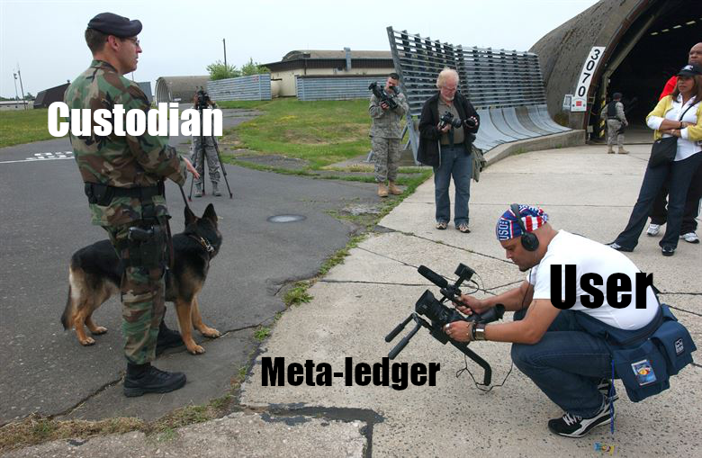

> *作者：Roy Sheinfeld*
>
> *来源：<https://medium.com/breez-technology/lightning-payment-channels-a-flavor-for-every-palette-53cb975907ea>*
>
> *原文出版于 2019 年。*

支付通道是闪电网络的基本组成部分。它们的发展直接影响到整个网络的形态和运作。如果你想要了解闪电网络的现状和未来发展趋势，关注支付通道就对了。

五花八门的支付通道设计层出不穷。不到 4 年前，支付通道还只是一众与比特币相关的白皮书里提到的诸多想法之一。但到了今日，闪电网络已经发展为最有可能帮助比特币[成为交换媒介](https://medium.com/breez-technology/why-bitcoin-needs-to-become-a-medium-of-exchange-80d5c9e1de65)的解决方案。目前，已上线的和尚在测试中的支付通道共分为三类。我们来看看它们各自是什么“风味”，能够解决什么问题，需要做出哪些权衡取舍。

- 就像闪电一样，支付通道最开始只有一种，现在出现了很多分支（来源：<a href="https://pixabay.com/photos/lightning-thunderstorm-storm-3644269/">rngvenro</a>） -

## 标准支付通道

最初的闪电网络白皮书说明了支付通道的基本设计，（部分）定义如下：

> 微支付通道可以让交易双方永续更新余额，并等到需要结算双方总余额时再通过单笔交易将数据广播上链。这样既能以免信任方式将双方之间的交易往来推迟到日后结算，又不存在交易对手违约的风险。微支付通道使用的是 *真正的比特币交易*，只是选择等到双方都确认链上余额后再将交易广播上链……

正如我[之前解释过](https://medium.com/breez-technology/understanding-lightning-network-using-an-abacus-daad8dc4cf4b)，交易双方往支付通道内充值后，就可以通过交易在通道两端转移资金。只有开启通道的初始交易和关闭通道的最终交易才需要广播上链。

如果有一方想要窃取通道内资金，唯一的办法就是从之前的通道状态中选择一个对自己有利的广播上链。但是，只要另一方在给定期限内发布较新的状态，不仅能拿回被窃取的资金，还能获得欺诈方的罚金。只要运用得当，这些通道就是免信任的。

这些微支付通道就像“香草味”。香草味听起来并不诱人，却是所有口味的冰激凌中最流行、最百搭的。香草味是衡量其它口味的标准 —— 就像标准支付通道那样。

- 香草味永远不会辜负你。另请注意，我们的可不只有美味的甜点（来源：<a href="https://www.maxpixel.net/Happiness-Raspberry-Vanilla-Fruit-Ice-Cream-Summer-1440836">Max Pixel</a>） -

### 代价

标准付款通道（通常）具有私密性、安全性和免信任性。然而，还有其它类型的支付通道正在开发中或已经上线。既然标准支付通道有用 ，为何还要改进？一言以蔽之，用户体验太差。

主要的代价是延迟。为了使用标准支付通道，用户必须等待初始状态广播上链。在最佳情况（同时也是成本最高的情况）下，延迟约为 10 分钟。

“我们随时为您服务”之类的宣传语并非最有效的新用户引导策略。另外，任何特定问题通常不只有一个解决方案，我们来看看其它支付通道。

## 零配置通道，又叫“涡轮通道”

标准支付通道开启后，通道内的资金还无法使用，要等到初始通道状态发布到公共账本上才行。[零配置通道](https://medium.com/@akumaigorodski/instant-channels-enable-safe-lightning-payments-with-unconfirmed-funding-8d640defa183)的目的就是解决用户体验不佳的问题。

假设 Alice 想与 Bob 开启可以立即使用且含有入站流动性的支付通道。零配置通道可以让 Alice 使用法币或密码学货币在链下购买 Bob 的通道开启服务凭证。等 Alice 将该凭证提交给 Bob 后，Bob 立即开启支付通道，并将一部分凭证金额转移到 Alice 那端。

由于 Alice 已经预付了支付通道的费用，Bob 可以让 Alice 在通道开启交易广播之前使用该支付通道。也就是说，Alice 可以在没有风险的情况下花费本地余额，因为在支付通道确认之前都是 Bob 在承担风险。这就是零配置通道克服的难题。到目前为止，一切都很顺利。

### 代价

付出代价之后往往会收获便利。为了获得便利，我们必须引入信任：

假设 Alice 购买了 Bob 的服务凭证，Bob 收了 Alice 的钱，Alice 就只能信任 Bob。有两种方法可以让这段关系摆脱信任依赖。其一，Alice 可以将自己账上的本地余额花光，避免 Bob 窃取或弄丢它们。

其二，将交易发布到链上并获得确认也可以彻底免去信任之需。一旦交易得到确认，就等于 Bob 和 Alice 开始共享一个标准支付通道，Alice 也像其他标准支付通道用户那样享受同等程度的保护。零配置支付通道的风险取决于间隔时长、Bob 的细心程度和可信度。

还要注意的一点是，在当前的零配置实现中，Alice 在通道得到确认之前无法收到任何付款，因为充值交易有可能被踢出交易池。这样一来，超出初始凭证金额的部分就成了 Bob 欠 Alice 的债务。

- 付出代价之后往往会收获便利。（来源：<a href="https://commons.m.wikimedia.org/wiki/File:Frozen_microwave_food_(TV_dinner)_Currywurst_with_French_fries.JPG"> 维基百科</a>） -

这就好比停车场会将泊车录像推送到你的手机上，但是你得放心将自己的车托付给泊车员。在你将钥匙交给泊车员到对方将你的车安全停好这段时间内，你得信任泊车员不会开你的车出去吃披萨，接网约车单，或踏上梦想中的自驾游。

尽管需要付出代价，但是一些初创项目仍具有很好的前景。Bitrefill 的 [Thor Turbo](https://www.bitrefill.com/thor-lightning-network-channels?hl=en) 通道就是其中一例，让用户可以使用手中的密码学货币立即开始体验闪电网络。Zap 钱包的[“Olympus”服务](https://medium.com/@JimmyMow/announcing-olympus-lightning-enabled-fiat-ramps-by-zap-1f5349a96ee9)就包含了零配置支付通道。这项服务可以让用户使用法币购买比特币，让用户即刻享受秒级比特币花费体验。

## 托管式支付通道

[Bitcoin Lightning Wallet](https://lightning-wallet.com/) 的 Anton Kumaigorodski 也有一个关于如何解决延迟问题的构想：托管式支付通道。他的想法是将用户的资金保存在托管方的服务器上，并使用一个[基于闪电网络的元账本](https://github.com/btcontract/hosted-channels-rfc)追踪这些资金。

现有的基于闪电网络的托管方案利用一个或少数节点管理用户的资金，不再为每位用户运行单独的支付通道。这类托管方案会维护一个内部私密账本，用来记录每位用户在何时拥有多少资金。因此，用户无需等待支付通道被广播上链。最终得到是一个由托管方组成的去中心化网络，每个网络都为其用户运行一个中心化子网络。

但是，Anton 写道：“当前这代闪电网络托管方史无前例地降低了隐私性，【引入了】信任假设，基本上毁了闪电网络的所有闪光点。”[我完全同意他的看法。](https://medium.com/breez-technology/bitcoin-is-peer-to-peer-or-it-is-nothing-3ec724c1c0e)

Anton 的创新之处在于，元账本如同[一个由闪电网络支付通道组成的网络](https://github.com/btcontract/hosted-channels-rfc)，具体来说：

> 该协议旨在使用一种创新方法代替现有的托管方案，既保留闪电网络特有的隐私性，又能对那些不完全受本地控制的资金进行远程问责。从技术上来说，创新方法引入的新型通道虽然不包含链上资金，却按照闪电网络的规则运作。新型通道能够与普通通道共存，无缝应用于 AIR 或 AMP 等高级支付功能。

Anton 的解决方案没有试图改进点对点网络，而是另辟蹊径解决用户体验问题：改进托管式钱包的运作方式。这个解决方案实际上是在托管中心及其用户之间建立一个可审计的债务系统。

- 正如 Lenin 所说：“信任虽好，犹不如控制。”（来源：<a href="https://www.spangdahlem.af.mil/News/Photos/igphoto/2000613903/">Alexander R. Ray</a>） -

这是个好消息。托管式支付通道非常重视托管方的作用，针对“[看守由谁监督（quis custodiet ipsos custodes）](https://en.m.wikipedia.org/wiki/Quis_custodiet_ipsos_custodes%3F)”这一关键问题给出了自己的答案，即，让用户可以通过元账本监督他们的托管方。元账本是现有托管模式基础上的一种改进吗？答案是肯定的。

### 代价

托管方本身是不是一种无法避免的恶？假如人人都有能力保护自己的人身和财产安全，我们还需要警察吗？如果我们可以建立一个集可扩展性、安全性、简易性、低成本等优点于一体的点对点闪电网络，还会有人需要或想要托管服务吗？

托管方是被控制下的实体，也就是被授权方。托管方会削弱[用户的主权](https://medium.com/breez-technology/the-only-thing-better-than-minimal-trust-is-none-at-all-34456f650332?source=collection_home---2------11-----------------------)。既然比特币是为了保护[用户的自由和主权](https://medium.com/breez-technology/bitcoin-is-peer-to-peer-or-it-is-nothing-3ec724c1c0e)而生，我们必须放弃托管模型。

监督也有其局限性。托管式支付通道确实可以让用户审计托管方，但是监督并不能让用户免于风险。如果托管方因一时大意泄露了用户的私钥，导致用户的资金被盗，用户能够采取什么措施找回资金？大多数国家会为商业银行持有的法币存款提供某种[存款保险](https://en.wikipedia.org/wiki/Deposit_insurance)。即使托管式钱包提供商为用户资金投了保，也还是需要信任保险公司。

对托管方的信任投入直接受托管方功能范围的影响。实现信任最小化的唯一办法是免去对托管方的需求。

任何用户资金的商业托管方实际上都是银行。作为“转账服务提供方或参与方”，[托管方从法律上来说是需要持有 FinCen 牌照的汇款商](https://www.fincen.gov/sites/default/files/2019-05/FinCEN%20Guidance%20CVC%20FINAL%20508.pdf)。许可、合规、保险和监管的成本都很高，这些成本只能以交易费的方式转嫁到用户头上。如果法币银行可以改造得好，我们也就不需要比特币或闪电网络了。鉴于我们已经有了低成本的点对点非托管式解决方案，托管方 *已经* 被淘汰了。

## 优化不如演化

闪电网络系统包含从终端用户设备及其操作系统到矿机等诸多复杂的活动部件。没人知道十年后的闪电网络会变成什么样子，因此自上而下的优化不起作用。唯一可行的策略是在不牺牲整体完整性的情况下进行局部改进。虽然我们无法定义怎样才算完美，但是很容易分辨出一个功能或应用是否优于其前身。

支付通道是非托管式闪电网络的重要组成部分，因此值得人们付出关注和努力。只有这些源源不断的创造力才有利于闪电网络的发展。我们只能学习借鉴彼此的创新，无论成功与否。

我们的未来目标是创建一个点对点的闪电网络经济体。其中，全节点、移动节点和闪电网络服务提供商（LSP）[默认以比特币作为交换媒介](https://medium.com/breez-technology/why-bitcoin-needs-to-become-a-medium-of-exchange-80d5c9e1de65?source=collection_home---2------4-----------------------)，[采用多种模型](https://medium.com/breez-technology/envisioning-lsps-in-the-lightning-economy-832b45871992)并提供不同类型的网络服务。[我们正在开发新技术](https://medium.com/breez-technology/introducing-lightning-rod-2e0a40d3e44a)来实现这一目标。

（完）