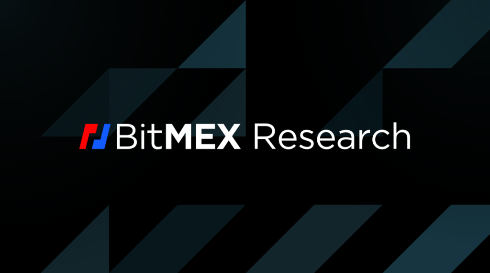
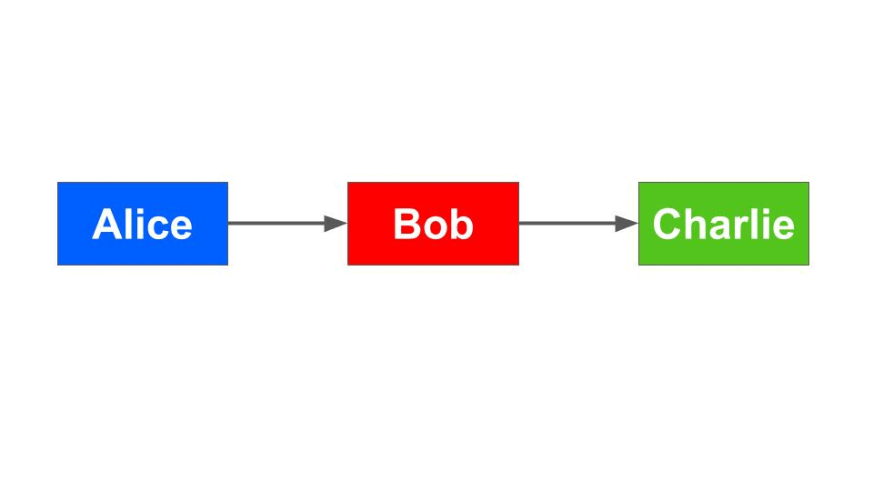

> *作者：BitMEX Research*
> 
> *来源：<https://blog.bitmex.com/lightning-payments-when-are-they-too-small-to-secure/>*

摘要：在闪电网络上发起小额支付时，尤其是在链上手续费 “较高” 的环境中，闪电网络的 HTLC 系统的安全性收益可能在一定程度上是有限的。这个问题可能仅在非常少数的场景中出现，也即当支付还在转发的时候，受影响的主要是支付路由者。量化这个问题的严重性是非常复杂的，因为它还取决于相关的通道的设置。虽然这个问题在理论上很有趣，但可能并不像并不像更简单的问题 —— 通道的一方通过昂贵的单方面关闭通道来为难对方，不论通道中有无正在转发的小额支付 —— 那么重要。

## 小额闪电支付的问题

最近，一些人在推特上声称小额的闪电支付可能不是免信任的。这是因为，在一条通道中，正在转发的支付是使用 “哈希时间锁合约（HTLC）” 来保护的，如果在链上取出这个 HTLC 中的资金所需花费的手续费，是大于这个 HTLC 的面额的，那么这个输出对于提供 HTLC 的一方来说，可能就不是免信任的了。这个问题不仅发生在 HTLC 的经济代价高于其所保护的资金时，也发生在链上手续费高涨的时候。举个例子，如果某个用户必须花费支付额的一半来保护这笔支付，那也不是理想的情况。这个问题可以称为 “不经济的 HTLC 问题”。

这个问题让人担心，是因为小额支付被人们认为是闪电网络的核心应用场景。实际上，闪电网络被认为是不适合大额支付的，因为你可能很难在网络中找到那么大的流动性。在比特币交易手续费 “高涨” 的环境中，比如一笔普通的交易就要花费 30000 聪才能得到区块确认，不经济的 HTLC 问题可能意味着，这时候发起小于 30000 聪的闪电支付是不安全的，那闪电网络的作用就大打折扣了。那闪电网络就只能用于 “中等” 价值的支付了。

一些推文是这么描述这个问题的：

- https://twitter.com/jamesob/status/1660343417900072965
- https://twitter.com/hampus_s/status/1653485031258574870

## 何时会发生这个问题

理解这个问题的第一种方法是尝试确定什么时候会出现这个问题。首先，这个问题仅仅出现在支付还在转发的时候。当一笔闪电支付已经结清、承诺交易更新之后，这笔支付就安全了，也不需要再用到 HTLC 了。即使支付额小到 1 聪，也可以认为是安全的，只要已经结算完成。同时，也只有多跳支付会长发生这个问题，因为只有多跳支付需要 HTLC 的安全性好处。技术上来说，HTLC 也被用在单跳支付中，以保证支付流系统尽可能相似、复杂性尽可能小，但仅在多条支付中，HTLC 才会提供额外的安全性。因此，不经济 HTLC 问题也仅会发生在支付转发者身上。发送者尝试花费资金，所以并不依赖于 HTLC 的保护。类似的，最终的接收者要么能收到支付，要么不能。而且，当然，大部分时候，即使发生了不经济的 HTLC 问题，支付依然能成功。只是转发者会处在风险之中，其通道对手可能会尝试攻击他们、浪费他们的资源。攻击者并不能从中获得好处，所以不会有重大的激励问题，它只是一个骚扰网络中的用户的机会。

请看下图，这是一笔从 Alice 到 Charlie 的，价值 4000 聪的支付，是经过 Bob 路由的。假设当前的市场手续费率 “太高”，比如是 50 聪/vB。如果 Alice 在支付尚未完成的时候离线了，那么保护 Bob 的 HTLC 可能会变成不经济的。举个例子，赎回一个 HTLC 输出中的资金需要耗费 100 vB 的区块空间，在 50 聪/vB 的手续费率下就是 5000 聪。但是这个输出本身只值 4000 聪。因此，如果现在就要拿回这个 UTXO 中的资金，Bob 反而会损失 1000 聪。当然，在现实中，Bob 可能不会清理这个 UTXO，然后它就会一直待在那里。容易看出，这时候 HTLC 并没有真正让 Bob 获得安全性，以及这时候路由 4000 聪是不安全的。

上面的描述是过度简化的。问题本身要更复杂，更难分析，需要一些关于 HTLC 和闪电通道构造的知识。实际上，这个 5000 聪的赎回成本可能（从技术上来说）并不是真正要考虑的成本。

- 使用 HTLC 的成功闪电支付图示 -

在上面这个案例中，当还在转发的支付变得不安全时，有三方卷入其中：

- Alice，攻击者
- Bob，受害者
- Charlie，无所谓的一方

在高手续费的环境中，如果支付失败，Bob 可能不得不支付一大笔手续费来关闭通道。花在 HTLC 上的额外资金与之相比是较低的。因此，这种攻击很大程度上只是理论上有可能，但在现实中并不重要。主要问题是，高手续费的环境可能让单方面关闭通道的操作非常昂贵；这种攻击可以认为是一个更大的问题的一个子集。

在上面这个例子中，我们假设 Alice 通过 Bob 给 Charlie 支付 4000 聪。如果 Alice 发动攻击，Alice 会为难 Bob，在支付的最后一步中拒绝为 Bob 更新通道状态（即 Bob 得到了 Charlie 的原像，但 Alice 拒绝更新状态）。现在，Bob 就不得不发起昂贵的单方关闭通道交易，这笔交易有一个价值 4000 聪的 HTLC 输出。Bob 已经给 Charlie 支付了 4000 聪，如果他无法得到 Alice 的支付，他就会损失资金。

## 谁支付链上手续费？

为了正确理解这个问题，我们还必须考虑所有相关的交易，以及为这些交易支付链上手续费的是谁。第一笔交易是单方关闭通道的交易。为这笔交易支付手续费的是开启通道的人，既可能是 Alice，也可能是 Bob。如果是 Alice 开启的通道，为确认这个 HTLC 而支付的手续费就不会产生不经济的 HTLC 问题，因为 Bob（受害者）不需要支付这部分手续费，因此这个 HTLC 也依然在保护他。Alice 也不太可能发起攻击，因为她自己才是开启通道的那个。

（译者注：这里的推理可能有点武断。在当前的闪电网络中，开启通道的一方是为通道注入资金的一方；但只要双方都使用过通道，则可能双方在通道中都有余额，并且可能都为交易承诺了一些手续费。不能断定因为关闭通道的交易花费的是注资交易的输出，就必然是由开启通道的一方支付手续费。）

如果 Bob 开启了通道，因此由他支付手续费，那就有必要将手续费分成两个部分。一部分是为标准的单方关闭通道的交易支付的手续费，另一部分则是为额外的 HTLC 输出支付的手续费。理论上来说，固有的那一部分并不属于不经济的 HTLC 问题，因为不管怎样都必须支付，不论是否有小额的闪电支付。Alice 可以逼迫 Bob 单方面关闭通道。不过，在设置这个 HTLC 时，双方同意了一笔新的承诺交易，一些资金会从开启通道的一方的余额中扣除，为这个额外的 HTLC 输出支付手续费。这个 HTLC 输出大约是 32 字节，因此额外的手续费可能是 3200 聪（假设手续费率是 100 聪/vB）。因此，如果 Bob 开启了这条通道，可以认为，低于 3200 聪的 HTLC 输出是没有保护的。我们认为，这就是不经济的 HTLC 问题的核心。在我们的例子中，Bob 依然可以从 HTLC 中获得净收益，因为支付额是 4000 聪，因此，他还可以 “赚到” 800 聪。因此，HTLC 还算是提供了一些安全性，但 Bob 不会为此感到高兴的。

|                                | 谁支付手续费？                                           | 不经济的 HTLC 问题                                           |
| ------------------------------ | -------------------------------------------------------- | ------------------------------------------------------------ |
| 基本的单方关闭通道的交易       | 由开启通道的一方支付手续费。可能是 Alice，也可能是 Bob。 | 虽然这笔交易可能本身要付出许多手续费，但这跟 HTLC 的额外成本无关，所以跟不经济的 HTLC 问题无关。这些手续费可以认为是沉没成本。 |
| 单方关闭通道交易中的 HTLC 输出 | 由开启通道的一方支付手续费。可能是 Alice，也可能是 Bob。 | 这部分手续费是不经济的 HTLC 问题的一部分，它是因为 HTLC 的存在而产生的额外成本。不过，仅当受害者自己支付这部分手续费时，它才会成为不经济的 HTLC 问题的一部分。 |
| 取出 HTLC 中的价值的交易       | 由不经济的 HTLC 攻击的 “受害者” （在这里是 Bob）支付。   | 这部分手续费可能让 HTLC 变得不经济，这取决于我们怎么分析这个问题（见下文） |

## 赎回 HTLC 输出

跟这个问题相关的还有第二笔交易。在未来的某个时间点，Bob 需要取回这个小额 HTLC 输出中的资金、跟自己的其它资金合并。这笔交易也需要支付手续费，而在我们这个例子中，加上这个手续费，Bob 就要完全亏损了。为了取出 HTLC 中的价值而支付的手续费，可能会比让这个 HTLC 得到确认而需支付的手续费大得多 —— 按照上文的假设，计算出来是 5000 聪。那么，考虑这部分手续费的话，Bob 所得的低于 8200 聪的 HTLC 就都得不到保护了。但是，这部分手续费，是否应该包含在不经济的 HTLC 问题中，是见仁见智的。

排除这部分赎回费用的一个理由是，链上的手续费未来可能会下载。那么 Bob 依然能从 HTLC 中受益，只要他足够耐心。他可以等到手续费回落之时再取出 HTLC 中的资金。又或者，他可以找到一位乐于助人的矿工，用一个较低的手续费将他的赎回交易打包到区块中。这个矿工的动机可能是减小 UTXO 集的体积，从而让比特币受益，之前也有矿工这么做过。又或者，在遥远的未来，比特币会升级共识协议，将粉尘 UTXO 转化为可以话费的资金。我们的观点是，即使在通道关闭之时一个 HTLC 可能是不经济的，但这种状况也可能在未来改变。因此，HTLC 也许依然能提供一些安全性收益，而 Bob 可以放宽心：那 4000 聪依然在那里。聊胜于无。

## 不经济的 HTLC 可能依然是有用的

在闪电网络中，Bob（或者说协议的设计者）有两种办法来处理这些低价值的支付：创建这种不经济的 HTLC ，或者，完全不设 HTLC。仅仅因为 HTLC 是不经济的、可能造成 Bob 的损失，并不能推导出 HTLC 就是无用的。在上面这个例子中，有人可能会说，Bob 的 HTLC 是又有的，至少在一定程度上，尽管他损失了一些钱。不经济的 HTLC 可能依然有助于阻止攻击者。

考虑这样一种情形：你在街上散步，一个歹徒靠近你，让你乖乖交出钱包，不然就要你好看。你的钱包里有 100 美元的现金，而你身上有一个警报装置，可以通知一支私人安保精英部队，他们可以乘直升飞机来救你。这个服务的单价是 1000 美元一次。你会使用这个服务吗？要是你按下警报，虽然你保住了手上的 100 美元，但总的来说你会失去 900 美元（因为你支付了 1000 元的服务费）。虽然你会损失一些钱，但这个安保系统依然是有用的，你可以吓阻未知的攻击者。你的 100 美元将总是安全的。当然，许多人会觉得这种类比是不恰当的。最大的区别在于，如果这个歹徒得手，TA 可以获得 100 美元；但在闪电网络中，攻击者（Alice）不能得到任何东西。因此，与其类比为一个街头混混，不如想象成那是一位虐待狂，抢你的钱是为了可以当着你的面把钱烧掉。在这种情况下，你还会按下那个警报装置吗？当然，我们接收读者认为这样的类比是愚蠢而不恰当的。在真实世界中，你不想被攻击；而在闪电网络中，你不想弄丢钱，不论是什么原因。

至少有一种情况是不经济的 HTLC 也提供了保护的准确例子。在 Alice（攻击者）也是一个大矿工的时候。如果完全没有 HTLC 输出，这 4000 聪就会变成矿工的手续费。这是额外的编辑收入，因为承诺交易的体积不会改变，只是手续费变得更高了。因此，这也是一个大矿工变成了一个闪电用户之后的可能攻击场景，只为了盗取 HTLC 。不经济的 HTCL 也可以帮助阻止这种攻击。另一方面，这种攻击依然是不太可能实现的，因为能够攻击的支付的价值必然较低。

在我们看来，在我们这个例子中，Bob 一点也没有因为使用了 HTLC 输出而变的更糟。唯一的不便是，Bob 添加了额外的 32 字节（HTLC 输出）到通道关闭交易中，并且只有在他自己开启通道时，才需要为止支付手续费。因此，即使不经济的 HTLC 问题为真，从协议设计者的角度看，使用 HTLC 也依然是值得的。如果不使用 HTLC，那情况会变得更糟。

## Bitcoin Core 的粉尘输出转发限制

在上文中，我们解释了为什么值得保留 HTLC，即使赎回这样的输出是不经济的。但是，如果你正在转发的支付的价值非常地低，比如只值 1 聪，那这不是触发了  `Bitcoin Core` 的粉尘输出转发限制了吗？（译者注：“粉尘限制” 是对输出面额下限的限制；产生这样的输出的交易将不会被使用默认交易池规则的  `Bitcoin Core` 节点转发 。）在这种情况下，你的闪电节点甚至不能为你创建一个 HTLC —— 创建了这样的输出的交易将不能在比特币网络中广播。虽然根据比特币的共识规则，这笔交易是有效的，但它不是一笔标准的交易，所以无法被广播。

 `Bitcoin Core` 还有一个对手续费率的交易转发限制： [3 聪/vB](https://github.com/bitcoin/bitcoin/blob/09351f51d279612973ecd76811dc075dff08209f/src/policy/policy.h#L55)。手续费率低于这个水平的交易将不会被转发，这是为了防止垃圾交易轰炸。这种针对交易的限制不一定会给 HTLC 带来问题，因为承诺交易本身可以拥有高于 3 聪/vB 的手续费率，即使其中的 HTLC 输出只值 1 聪。 `Bitcoin Core` 也有为输出面额的下限设置的转发规则。一个 P2WPKH 输出的体积是 31 字节，需要消耗 67 vB 才能花费，所以总计是 98 vB。因此，P2WPKH 输出的粉尘限额就是 294 聪（3 * 98）。对于闪电输出来说，这个限制可能还要高一点，因为它是一个 2-of-2 的多签名花费。

这就意味着，对于需要转发的低于 500 聪的支付，路由者应该考虑这笔支付是否可信。这是核心问题的一个更明确的表现，因为 HTLC 根本无法提供保护。在这里，市场手续费率也完全无关紧要。不论市场手续费率是 1000 聪/vB 还是 5 聪 /vB，粉尘转发限制都会给我们带来这个问题。闪电协议允许节点运营者指定 HTLC 的额度下限，这个数值也可以根据网络的手续费率而改变。

## 移除粉尘限制

一些人主张，应该移除粉尘输出限制。举个例子，开发者 Jeremy Rubin 就列举了移除粉尘限制的 5 个理由：

1. 无论人们想创建什么样的输出，都不关我们的事
2. 粉尘输出可以用在多种 身份验证/委托 智能合约中
3. 粉尘大小的 [HTLC](https://bitcoin.stackexchange.com/questions/46730/can-you-send-amounts-that-would-typically-be-considered-dust-through-the-light) 将迫使一条通道在 准-免信任 的模式下运行，它将影响通道在不同司法辖区中的监管定义（就我所知是如此）；对资金转移的无审核处理可以简化问题（就像在邮件中发送 0.01 美分的股息）
4. 不在意可分割性的染色币协议可能会在价值市场中使用聪
5. 只要我们实现了机密交易，就无法阻止人们生成这样的输出，除非牺牲隐私性，或让交易需要许可。

> 来源：https://lists.linuxfoundation.org/pipermail/bitcoin-dev/2021-August/019307.html

请注意其中两个理由。为闪电网络中的低价值支付提高安全性也被作为移除粉尘限制的一个理由。引出粉尘限制可以提高低价值闪电支付的安全性。但是，这种安全性收益在这里是有效的，至少在是吃货的手续费率高于 3 聪/vB 的时候，因为虽然低价值的 HTLC 可以被转发了，但它的价值还是太低，以至于不值得取出。

Jeremy 的这个提议在一些开发者中不受欢迎。争论趋同于 [2014 的 OP_Return 辩论](https://blog.bitmex.com/dapps-or-only-bitcoin-transactions-the-2014-debate/)（[中文译本](https://www.btcstudy.org/2022/07/17/dapps-or-only-bitcoin-transactions-the-2014-debate/)）和 2023 年的 Ordinals 争论：比特币究竟是一个专为 “金融交易” 而设的系统，还是一个也可以有别的用途的系统？这甚至导致一些人呼吁  `Bitcoin Core` 不仅要移除粉尘限制，还要[禁用所有的标准化规则](https://github.com/bitcoin/bitcoin/pull/27578)。开发者 [@theinstagibbs](https://twitter.com/theinstagibbs) 写了一篇[很漂亮的文章](https://docs.google.com/document/d/11mGT8sUEnAMGE5LGSB4NtR0NpyvpdhrgzImZfiflgg0/edit)作为回应：该文解释了标准化规则的所有可能的辩护理由，以及一系列的标准化规则。至于市场和挖矿行业最终能否命令 `Bitcoin Core` 尝试清除这些标准化规则，就是另一个话题了。

## 结论

总的来说，大部分时候，路由小额支付都可以认为是安全的。在手续费率高涨的时候，HTLC 提供了更少的保护，但是依然提供了一些好处，即使它们可能会变得不经济。确定什么时候一个 HTLC 的价值就变得 “太低了” ，是一个复杂的问题，取决于相关通道的具体设置。在我们看老，这个问题在很大程度上只是一个理论问题，并不比通道对手在手续费高涨的环境中发起昂贵的单方关闭通道操作更重要。比起前者（支付额太小而不安全），后者在量级上更大。

（完）